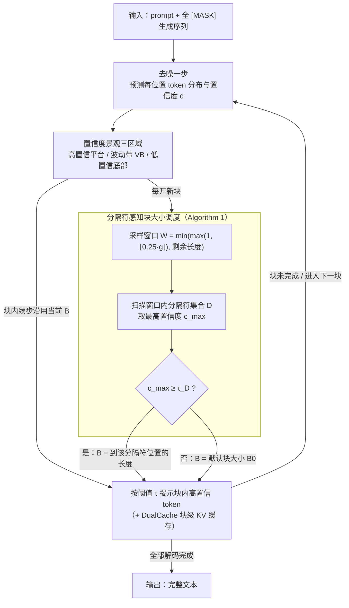

# AdaBlock-dLLM: Semantic-Aware Diffusion LLM Inference via Adaptive Block Size

**会议**: ICLR 2026  
**arXiv**: [2509.26432](https://arxiv.org/abs/2509.26432)  
**代码**: [https://github.com/lgxi24/AdaBlock-dLLM](https://github.com/lgxi24/AdaBlock-dLLM)  
**领域**: 图像复原  
**关键词**: 扩散语言模型, 半自回归解码, 自适应块大小, 语义感知调度, 推理加速

## 一句话总结

通过统计分析扩散语言模型（dLLM）去噪过程中 token 置信度的动态变化，发现"波动带"（Volatility Band）区域编码了文本的局部语义结构，进而提出 AdaBlock-dLLM——一个无训练、即插即用的自适应块大小调度器，让半自回归解码的块边界与语义步骤自然对齐，在相同吞吐量下最高提升 5.3% 准确率。

## 研究背景与动机

**领域现状**：扩散语言模型（dLLMs）如 LLaDA、Dream 通过迭代去噪将全 [MASK] 序列逐步揭示为完整文本，天然支持并行解码，已在数学推理和代码生成等任务上与同规模自回归 LLM 持平。在实际推理中，块级半自回归（semi-AR）解码是主流范式：将生成序列分成固定大小的块，块间按顺序处理（支持 KV 缓存），块内通过多步去噪并行揭示 token，兼顾速度与质量。Fast-dLLM 在此基础上引入基于置信度阈值 $\tau$ 的动态采样，只揭示置信度高于 $\tau$ 的 token，进一步优化了速度-质量折衷。

**现有痛点**：作者通过对 LLaDA-8B 在 GSM8K 上的统计分析，量化了固定块大小带来的两个系统性问题。实验表明，在块大小 $B=32$ 时，约 9.8% 的采样步骤受到延迟解码开销（Late Decoding Overhead）影响——当前块外已有高置信度 token 却无法被揭示，白白浪费额外去噪迭代；同时约 7.7% 的步骤出现过早解码错误（Premature Decoding Error）——当前块内的低置信度 token 被强制提交，产生错误 token 并通过块间自回归依赖传播到后续生成。当块大小增大到 $B=16$ 时，premature error 比例升至 15.2%（HumanEval）。这两个问题的根源一致：固定块边界与文本的自然语义边界不匹配。

**核心矛盾**：语义单元（短语、子句、推理步骤）的长度是可变的，但固定块大小把解码窗口"一刀切"。这导致了一个两难：块太小则已确定的 token 被延迟（损失吞吐量），块太大则不确定的 token 被强制提交（损失准确率）。

**切入角度**：作者对去噪过程中 token 置信度的空间-时间分布做了统计分析，发现置信度景观可以划分为三个明确区域——高置信度平台（已解码 token）、波动带（VB，正在被解码的活跃区域）和低置信度底部（尚未涉及的远端位置）。关键发现是 VB 区域的宽度和位置与文本的局部语义结构高度相关，而 VB 内部的解码顺序是局部随机的（与平台区域的全局自回归趋势不同）。这意味着 VB 可以作为语义结构的代理信号，指导块大小的动态调整。

**核心 idea**：在每个解码块的起始时刻，通过检测分隔符 token（如换行符 `\n`）的置信度来定位当前语义步骤的边界，自适应扩展或收缩块大小，使块边界与语义步骤对齐。

## 方法详解

### 整体框架

AdaBlock-dLLM 要解决的是 semi-AR 解码里固定块大小和文本语义边界对不齐的问题，做法是把一个轻量调度器嵌进现有解码流程，每开新块时临时算一个合适的块大小，其余一切照旧。输入是带 prompt 的全 [MASK] 生成序列，输出是解码出的完整文本。主循环和 Fast-dLLM 完全一致——交替做 denoise（模型预测每个位置的 token 分布与置信度）和 sample（按置信度阈值挑哪些 token 揭示）。关键改动有三处、各对应一个设计：先把 denoise 产出的置信度看成"高置信平台 / 波动带 VB / 低置信底部"三区域，VB 就是当前活跃解码区、编码着局部语义结构（设计 1）；在每个新块开始的那一刻插入一个块大小确定过程（Algorithm 1），根据 VB 里分隔符 token 的置信度动态定下这一块的 $B$，而不是一直用固定 $B_0$（设计 2）；最后块内按阈值 $\tau$ 揭示 token 并配合块级 KV 缓存，自适应的小块顺带压低了缓存的近似误差（设计 3）。整个方法不碰模型、不碰训练，只是在解码循环里加了一个决策点。

### 关键设计

**1. 置信度景观的三区域划分：找到指示语义结构的信号**

要做自适应块大小，先得有一个能反映语义结构的信号。作者对 LLaDA-8B-Base 在 GSM8K 上的 100 个样本做了统计，画出不同解码阶段（已解码 0/64/128/192/256 个 token 时）的位置-置信度分布，发现去噪过程中的置信度景观稳定地分成三块。最左边是**高置信度平台**：已解码位置附近，置信度稳定接近 1.0，随着解码推进单调向右扩展。紧贴平台右侧的是**波动带（Volatility Band, VB）**：置信度在 0.1–0.8 之间剧烈波动、宽度因样本而异，正是当前解码步骤的活跃区域。再往右是**低置信度底部**：远离已解码区域、置信度接近 0 的位置，模型在那里预测出来的多半是没内容的占位符。

VB 之所以关键，是因为它内部的预测 token 往往属于同一个语义单元（如同一推理步骤里的几个 token），所以 VB 的位置和宽度天然编码了文本的局部语义结构。但 VB 的宽度本身太粗——它能告诉你"活跃区域有多大"，却说不清"当前这个语义步骤到哪里截止"，直接拿 VB 宽度当块大小不够准。这就引出了第二个设计：需要一个更细的信号来定位语义步骤的终点。

**2. 基于分隔符检测的语义感知块大小调度：用分隔符的置信度切块**

更细的信号来自分隔符 token。像 `\n`、逗号、句号这类符号天然标记着语义单元的边界，而且它们在 VB 里会表现出明显的置信度骤降，因此用分隔符的置信度来判断块边界，比估计整个 VB 的宽度更精细也更可靠。具体做法是在每开新块前跑一遍 Algorithm 1：先以当前解码位置 $g$ 为起点定义一个采样窗口 $W$，窗口宽度取 $\min(\max(1, \lfloor 0.25 \cdot g \rfloor), \text{remaining})$——用 $g$ 的四分之一来限宽，是为了避免早期阶段窗口铺得太大、把远处的 EOS 误当成边界揭示出来。接着扫描窗口内所有位置，挑出预测 token 落在分隔符集合 $D$（默认 $D=\{\textbackslash n\}$）里的那些位置，在它们当中取置信度最高的 $\hat{y}_{\max}$。如果这个最高置信度 $c_{\max} \ge \tau_D$（分隔符阈值），就说明模型有可靠信号表明当前语义步骤在此结束，于是把块大小设为从 $g$ 到该分隔符位置的长度，让块边界正好压在语义步骤的终点；如果窗口里压根没有分隔符、或者所有分隔符的置信度都低于 $\tau_D$，就保守地退回默认块大小 $B_0$。这样块边界就随着语义步骤的长度伸缩，而不是被固定的 $B_0$ 一刀切。

**3. 与 KV 缓存策略的协同：自适应块大小顺带降低缓存近似误差**

semi-AR 解码的一大优势是能用块级 KV 缓存（如 DualCache），而 AdaBlock 和缓存放在一起时收益还会被放大。原因在于 dLLM 的块级缓存本质是近似的：不像自回归模型那样无损，dLLM 的 key/value 张量在不同去噪步骤之间会变化，块内的解码顺序也不是顺序的。块开得越大，块内语义一致性越差，缓存的近似误差就越大。AdaBlock 从两头压低这个误差——当默认 $B_0$ 偏大时它会把实际块缩小，同时让块边界对齐语义步骤、增强块内的语义局部性。两者叠加的效果是：实验里启用缓存时 AdaBlock 的提升反而更大（GSM8K 上从 +3.0% 涨到 +5.3%），说明自适应块大小和缓存优化是正交且互相增强的两件事。

### 损失函数 / 训练策略

无需任何训练或微调。AdaBlock-dLLM 是纯推理时的调度优化。两个关键超参数的选择策略：

- **动态采样阈值 $\tau$**：沿用 Fast-dLLM 的 0.9
- **分隔符阈值 $\tau_D$**：在 GSM8K 的小子集上调优。LLaDA 系列（从头训练，VB 内方差较低）适用 $\tau_D=0.3$；Dream 系列（从 AR 模型适配，VB 内方差较高）适用 $\tau_D=0.5$。差异源于训练方式对置信度分布的影响

## 实验关键数据

### 主实验

在 GSM8K（数学推理）、HumanEval（代码生成）、MATH（数学推理）、MBPP（代码生成）上评估三个模型。以下是 GSM8K 上的核心结果（准确率 %，$B_0=32$）：

| 方法 | LLaDA-Instruct | LLaDA-1.5 | Dream-Base |
|------|---------------|-----------|------------|
| Vanilla (top-1) | 76.7 | 82.3 | 76.4 |
| Dynamic | 77.6 | 82.2 | 75.5 |
| +Ada（本文） | **80.6** (+3.0) | **82.4** (+0.2) | **75.7** (+0.2) |
| +Cache (DualCache) | 74.5 | 80.2 | 74.5 |
| +Ada+Cache（本文） | **78.5** (+4.0) | **81.7** (+1.5) | **75.1** (+0.6) |

LLaDA-Instruct 在 $B_0=64$+Cache 设置下取得最大提升：从 75.4% 到 80.7%（+5.3%）。

跨任务汇总（LLaDA-Instruct, $B_0=16$, +Ada+Cache vs +Cache）：

| 基准 | +Cache 基线 | +Ada+Cache | 提升 |
|------|-----------|------------|------|
| GSM8K | 78.0 | 80.0 | +2.0 |
| HumanEval | 45.1 | 49.4 | +4.3 |
| MATH | 35.4 | 35.8 | +0.4 |
| MBPP | 35.6 | 39.4 | +3.8 |

### 消融实验

**分隔符阈值 $\tau_D$ 的选择**（GSM8K, $B_0=32$）：

| 模型 | $\tau_D=0.3$ | $\tau_D=0.5$ | $\tau_D=0.7$ |
|------|-------------|-------------|-------------|
| LLaDA-Instruct | **80.59** | 79.08 | 77.94 |
| Dream-Base | 75.66 | **75.74** | 75.74 |

**分隔符集合 $D$ 的选择**（GSM8K, $B_0=32$, LLaDA-Instruct+Cache）：

| 分隔符集合 | 准确率 (%) |
|-----------|-----------|
| 无（+Cache 基线） | 74.5 |
| {`\n`} | **78.5** |
| {`,`} | 75.1 |
| {`.`} | 74.5 |
| {`\n`, `,`, `.`} | **78.7** |

### 关键发现

- **LLaDA 比 Dream 受益更多**：LLaDA 从头训练，解码时局部随机性更强（VB 内方差低但位置偏好弱），自适应块大小的分组效果更显著。Dream 从 AR 模型适配后保留了较强的全局自回归顺序，局部调整的空间有限
- **与缓存结合时收益放大**：块级 KV 缓存本质是近似操作，固定大块导致缓存误差积累。AdaBlock 一方面减小实际平均块大小（$B_0=64$ 时平均 $\bar{B}=33.98$），另一方面增强块内语义一致性，从两端减轻缓存近似误差。GSM8K 上 $B_0=64$ 的 +Ada+Cache（80.7%）甚至超过 $B_0=32$ 的 +Cache（74.5%）6.2 个点
- **换行符 `\n` 是最有效的分隔符**：在所有分隔符组合中，仅用 `\n` 就能捕获绝大部分收益（78.5% vs 基线 74.5%），加入逗号和句号仅有微弱额外提升（78.7%）。这与推理任务中换行符标记推理步骤边界的特性一致
- **小默认块大小时吞吐量也提升**：$B_0 \in \{4, 8\}$ 时，AdaBlock 倾向于扩展块，减少了 Late Decoding Overhead，使 NFE 降低、吞吐量增加。$B_0 \ge 16$ 时则倾向缩小块以提升质量，吞吐量略降但准确率显著提升
- **跨生成预算稳定**：在 $L \in \{256, 512, 1024\}$ 三种生成预算下均有一致提升，方法不依赖特定序列长度

## 亮点与洞察

- **置信度景观的三区域划分**是一个有启发性的分析框架。将去噪过程中的 token 态势结构化为"高置信度平台-波动带-低置信度底部"，为理解 dLLM 的解码行为提供了直觉工具，有望推广到其他 dLLM 分析场景（如训练策略设计、去噪步数调度）
- **分隔符检测作为语义边界信号**的思路极其简洁——不需要任何额外模型或语义分析，仅通过观察 `\n` token 的置信度就能有效定位语义步骤边界。这种"从模型已有的预测中挖掘结构信号"的范式值得借鉴
- **LLaDA vs Dream 的对比分析**揭示了 dLLM 训练方式对推理行为的深层影响：从头训练的模型展现更强的局部随机性和更弱的全局自回归倾向，给了自适应调度更大的优化空间。这暗示未来 dLLM 的训练可以考虑主动引入语义步骤感知的目标

## 局限与展望

- **分隔符选择依赖先验**：当前 $D=\{\textbackslash n\}$ 适用于推理和代码任务，但在自由文本生成、对话、非英语语言中可能不适用。未来需要自动化的分隔符发现机制
- **$\tau_D$ 需要针对模型家族手动调优**：LLaDA 和 Dream 需要不同的阈值，且作者承认 $\tau_D$ 过高（如 0.9）会导致调度器退化为固定块大小。缺乏无需调参的自适应阈值策略
- **仅优化采样阶段**：AdaBlock 改善的是采样质量（选择哪些 token 揭示），但无法修复去噪器本身的预测错误。当模型的 token 分布预测不可靠时（如在困难推理问题上），自适应块大小的优势受限
- **未测试更大模型**：实验限于 7-8B 规模，未验证在 70B+ 模型上的表现。更大模型可能有更稳定的置信度分布，VB 特征和最优超参可能不同
- **生成预算较短时效果受限**：作者指出在多选题等短生成场景下，semi-AR 解码本身优势有限，AdaBlock 的收益也相应减小
- **未探索将 VB 洞察反馈到训练**：如果在训练时就引入语义步骤对齐的目标（如让 token 的去噪难度与语义边界对齐），可能获得比纯推理优化更大的收益

## 相关工作与启发

- **vs Fast-dLLM**：Fast-dLLM 提出了 semi-AR + 动态采样 + DualCache 的推理框架，但使用固定块大小。AdaBlock 作为正交的调度层叠加在 Fast-dLLM 之上，不修改其核心机制却在所有设置下改善准确率，说明块大小是一个被忽视但重要的优化维度
- **vs Block Diffusion**：Block Diffusion 首次提出 dLLM 的 semi-AR 解码范式，但在训练时就固定了块结构。AdaBlock 的思路提示了一种可能性——在训练时也使用自适应块大小，让模型学会更好的块边界感知
- **vs 自回归模型的 Early Exit**：AR 模型中的 early exit / adaptive computation 根据 token 难度调整计算量。AdaBlock 在 dLLM 中实现了类似的自适应计算分配，但维度不同——不是调整每个 token 的计算深度，而是调整每步解码的 token 数量

## 评分

- 新颖性: ⭐⭐⭐⭐ 首次系统分析 dLLM 固定块大小问题，VB 发现有洞察力，但方法本身（分隔符检测+阈值判断）不算复杂
- 实验充分度: ⭐⭐⭐⭐ 三个模型×四个基准×多种块大小的全面评估，消融充分，但缺少更大模型和非英语评估
- 写作质量: ⭐⭐⭐⭐⭐ 问题定义清晰（两种错误的量化分析），从观察到方法的推导逻辑流畅，图表设计精良
- 价值: ⭐⭐⭐⭐ 即插即用无训练的特性使其实用性强，但绝对收益有限（大多数场景 1-3%），在 dLLM 领域快速发展的当下时效性存疑

<!-- RELATED:START -->

## 相关论文

- [\[ICLR 2026\] Multi-LLM Adaptive Conformal Inference for Reliable LLM Responses](multi-llm_adaptive_conformal_inference_for_reliable_llm_responses.md)
- [\[ICLR 2026\] In-Context Learning of Temporal Point Processes with Foundation Inference Models](in-context_learning_of_temporal_point_processes_with_foundation_inference_models.md)
- [\[ICLR 2026\] GuidedSampling: Steering LLMs Towards Diverse Candidate Solutions at Inference-Time](guidedsampling_steering_llms_towards_diverse_candidate_solutions_at_inference-ti.md)
- [\[ICLR 2026\] vCache: Verified Semantic Prompt Caching](vcache_verified_semantic_prompt_caching.md)
- [\[ICML 2026\] Margin-Adaptive Confidence Ranking for Reliable LLM Judgement](../../ICML2026/llm_evaluation/margin-adaptive_confidence_ranking_for_reliable_llm_judgement.md)

<!-- RELATED:END -->
