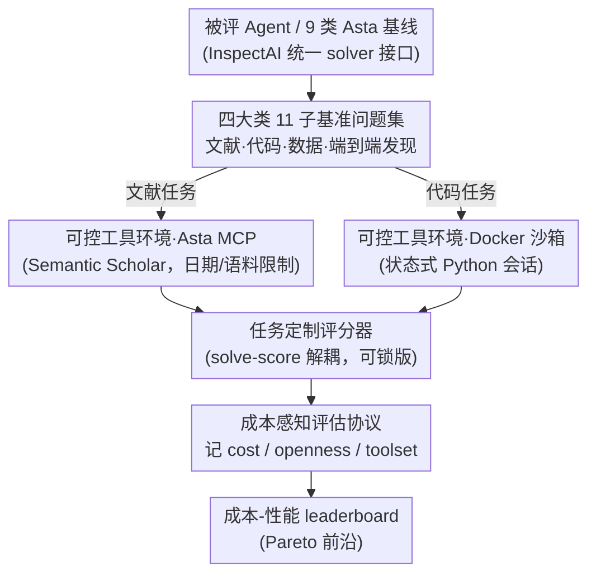

# AstaBench: Rigorous Benchmarking of AI Agents with a Scientific Research Suite

**会议**: ICLR 2026 Oral  
**arXiv**: [2510.21652](https://arxiv.org/abs/2510.21652)  
**代码**: [allenai/asta-bench](https://github.com/allenai/asta-bench)  
**领域**: LLM评测  
**关键词**: Agent 基准, 科学研究自动化, 可复现评估, AI for Science  

## 一句话总结

AI2 团队针对现有科研 Agent 基准的 5 大方法学缺陷，构建了首个覆盖科学研究全流程的 Agent 评估套件 AstaBench，包含 4 大类 11 个子基准共 2400+ 问题，配备基于 Semantic Scholar 的生产级可控搜索工具和 9 类科研优化 Asta Agent 基线，对 57 个 Agent（22 类）进行了迄今最大规模的系统评估，发现尽管在文献检索等单项任务上取得了进展，AI 在端到端科学研究辅助方面仍远未达标。

## 研究背景与动机

**领域现状**：AI Agent 在科学研究自动化领域展现出巨大潜力——自动化文献综述、实验复现、数据分析乃至提出新研究方向。市面已涌现大量相关系统：通用型如 Google / OpenAI 的 Deep Research，专用型如 AI Scientist、AIGS 等。然而，如何"严格评估"这些 Agent 是推动实质进步的前提。

**现有痛点**：作者系统梳理了现有基准的 5 大方法学缺陷。第一，**缺乏全流程度量**：多数基准只测某个子任务（如问答或检索），无法反映真实科研场景中对 Agent 的综合使用需求。第二，**工具不可复现**：不同 Agent 自带不同的搜索引擎和工具链，导致评估本质上比较的是"工具差异"而非"Agent 能力"。第三，**混淆变量失控**：模型成本、API 调用次数、工具访问权限等未标准化，无法区分"是模型强还是工具强"。第四，**缺乏标准化接口**：没有统一的 Agent 构建和评估框架，导致快速原型开发和公平对比都很困难。第五，**基线严重不足**：缺乏足够数量和类型的基线 Agent，社区难以判断所谓的"进步"到底有多真实。

**核心矛盾**：评估科研 Agent 需要同时测量"单点能力"（如检索、编程）和"全流程能力"（从文献调研到端到端科学发现），但后者的评估复杂度远高于前者，且需要可控的工具环境来消除混淆因素。

**切入角度**：作者团队背靠 Semantic Scholar / Asta 已部署系统（108M+ 摘要、12M+ 全文论文），具备独特优势：(1) 拥有生产级的文献搜索 API 可直接作为受控工具；(2) 已部署 Asta Agent 积累了大量真实用户请求，可用于构建贴近实际需求的问题集。

**核心 idea**：从方法论层面系统修复科研 Agent 评估的 5 大缺陷，构建覆盖全流程、工具可控、基线充分的标准化 Agent 评估平台。

## 方法详解

### 整体框架

AstaBench 要解决的是"怎样公平、可复现地评估一个科研 Agent"，它给出的答案是把评估拆成四块互相咬合的基础设施，再让被评 Agent 沿同一条流水线跑完。任意 Agent（包括论文自带的 9 类 Asta 基线）先通过 InspectAI 的统一 solver 接口接入，被分配到覆盖科研全生命周期的 2400+ 问题集（4 大类、11 个子基准）；求解时它只能调用受控的工具环境——文献检索统一走基于 Semantic Scholar 的 Asta MCP，代码执行统一在 Docker 沙箱里跑；答案交给每个子基准任务定制的评分器打分，而打分用的评分代码可以独立锁版，保证跨时间一致；最后由 agent-eval 工具包把成本、工具档位、开放度一并记账，汇成一张展示性能-成本权衡的 leaderboard。换句话说，问题集定义"考什么"、工具环境约束"怎么答"、评分器决定"答得对不对"、评估协议记下"花了多少代价、用的什么档位的工具"——四者合起来才让不同 Agent 之间的比较真正落在"能力"而非"工具或预算"上。

### 关键设计

**1. 四大类 11 子基准：覆盖从文献检索到端到端发现的完整科研链条**

现有基准的通病是只截取科研流程中的一个环节——要么只测检索、要么只测编程，而把子任务做好不等于把科研做好。AstaBench 因此把科研能力分解为四个递进层次、各配若干独立子基准：文献类（Literature）5 个，含 PaperFindingBench（论文检索）、ScholarQABench2（科学问答）、LitQA2-FT 及其搜索变体（文献问答）、ArxivDIGESTables-Clean（结构化摘要表格生成）；代码类（Code）3 个，含 CORE-Bench-Hard（仓库级代码问题）、DS-1000（数据科学编程）、SUPER-Expert（复杂编程任务并追踪轨迹）；数据分析类（Data）的 DiscoveryBench（数据驱动的科学发现）；以及端到端发现类（Discovery）的 E2E-Bench 及其困难版（完整科学发现工作流）。问题横跨计算机科学、生物医学等多个领域，且相当一部分直接取自已部署 Asta Agent 收到的真实用户请求，使问题分布反映"用户实际需要的能力"而非研究者臆测的能力——这也是它能同时考"单点能力"和"全流程能力"的关键。

**2. 基于 Asta MCP 的可控工具环境：把"工具差异"从"Agent 能力"中剥离**

如果每个 Agent 各自携带搜索引擎和工具链，结果比的往往是工具好坏而非智能高低，这正是上一层问题集想公平测能力时绕不开的混淆源。AstaBench 的做法是让所有文献类任务统一走 Asta MCP 接口，底层是覆盖 108M+ 摘要、12M+ 全文的 Semantic Scholar API，并对搜索施加日期与语料库限制——即便日后有新论文发表，旧问题的评估结果也不会漂移；代码类任务则统一在 Docker 沙箱里跑状态式 Python 会话（类似 Jupyter notebook，支持 `%%writefile`、`%matplotlib` 等 magic 命令），保证执行可复现。为了既约束又不一刀切，Agent 用工具的方式被分成三档并在 leaderboard 上明示——Standard（✓，只用评估环境预置的标准工具）、Custom interface（∼，自带工具但接口能力等价或更受限，仍受同样的日期限制）、Fully custom（×，超出标准约束、不走受控搜索）；由于后端是持续维护的生产级 API 而非一次性爬取的快照，这套环境能长期保持可复现。

**3. 任务定制评分器与 solve-score 解耦：保证跨版本打分一致**

工具受控之后还要回答"答得对不对"，而不同任务的"对"标准差异很大：文献检索类看检索准确率与召回率，问答类看答案正确性（结合自动评估与 LLM 评判），代码类看执行通过率与结果匹配度，端到端发现类则用多维度的研究报告质量评估。AstaBench 给每个子基准单独配了任务定制的评分器，并引入 **solve-score 解耦**——把"解题（solve）"和"打分（score）"拆成两个可独立锁版的阶段：评分代码的版本可以脱离解题过程被固定下来，因此同一份提交在不同时间、不同评分器版本下都能复现出一致的分数，避免了"评分逻辑悄悄改了导致历史结果不可比"的隐患。

**4. 九类基线 + 成本感知评估协议：用充分基线和成本记账戳破"虚假进步"**

基线种类不够时，任何新方法都会"看起来有进步"。AstaBench 一次性开源了 9 类面向科研任务优化的 Asta Agent 架构（含 ReAct、代码执行型、上下文压缩型等），从简到繁构成完整基线谱系，让社区有足够参照判断进步是否真实。协议层面，agent-eval 工具包记录每个 Agent 的模型调用次数与 token 消耗，并据此算出**时间不变成本（time-invariant cost）**——以某一时刻 litellm 成本表的快照把 token 折算成统一美元单价，即便日后 API 价格变动，也始终用同一份快照重算，使不同时期的评估成本可比；leaderboard 据此直接展示性能-成本的 Pareto 前沿，逼开发者在追性能之外也算效率账。除成本外，协议还按两个正交维度给 Agent 归类以消除混淆：**openness（开放度）**分四级（开源+开权重、开源+闭权重、闭源+API、闭源+仅 UI），以及上一设计里的 toolset 三档；数据则划分为 validation/test 两套，前者供开发调参、后者只作最终评估，杜绝过拟合榜单。

## 实验关键数据

### 主实验：AstaBench 任务组成

| 任务类别 | 子基准名称 | 评估能力 | 问题规模 |
|---------|-----------|---------|---------|
| 文献类 (lit) | PaperFindingBench | 论文检索 | 数百 |
| 文献类 (lit) | ScholarQABench2 | 科学文献问答 | 数百 |
| 文献类 (lit) | LitQA2-FT / FT-Search | 文献问答+搜索 | 数百 |
| 文献类 (lit) | ArxivDIGESTables-Clean | 结构化表格生成 | 数百 |
| 代码类 (code) | CORE-Bench-Hard | 仓库级代码问题 | 数百 |
| 代码类 (code) | DS-1000 | 数据科学编程 | 数百 |
| 代码类 (code) | SUPER-Expert | 复杂编程+轨迹追踪 | 数百 |
| 数据分析 (data) | DiscoveryBench | 数据驱动发现 | 数百 |
| 发现类 (discovery) | E2E-Bench / E2E-Hard | 端到端科学发现 | 数百 |
| **总计** | **11 个子基准** | **全流程覆盖** | **2400+** |

### 方法学缺陷修复对比

| 评估维度 | 先前基准的问题 | AstaBench 的解决方案 |
|---------|--------------|-------------------|
| 度量全面性 | 仅测单一子任务（如只测检索或只测编程），碎片化 | 4 大类 11 子基准覆盖从文献检索到端到端科学发现的全流程 |
| 工具可复现性 | Agent 自带搜索工具，不同工具性能差异大 | 统一 Asta MCP 工具（Semantic Scholar API），持续维护可长期复现 |
| 混淆变量控制 | 模型成本、工具权限未标准化，无法公平比较 | 记录 token/API 成本，标注工具类别（Standard/Custom/Custom Interface） |
| 标准化接口 | 无通用 Agent 构建框架，每个系统自成体系 | 基于 InspectAI 的统一 solver 接口 + ToolsetConfig 工具管理 |
| 基线充分度 | 基线 Agent 种类和数量不足 | 9 类 Asta Agent 基线 + 57 Agent / 22 类的全面对比 |
| 开放性分类 | 未区分开源/闭源/API-only 等模型特征 | 4 级 openness 分类 + 3 级 toolset 分类，leaderboard 可按类筛选 |

### 关键发现

- **单项任务有进展但全流程差距巨大**：AI Agent 在文献检索、简单问答等单项任务上已能取得较好表现，但在需要多步推理、跨模态协作的端到端科学发现任务（E2E-Bench）上距离人类研究者差距显著。这说明"把子任务做好"不等于"做好科研"。
- **工具差异是主要混淆因素**：当控制工具变量后（所有 Agent 使用同一套 Asta MCP 工具），不同 Agent 之间的性能差异主要来自推理策略和上下文管理，而非工具优劣。这验证了可控工具环境的必要性。
- **成本-性能 trade-off 差异大**：不同 Agent 类别在相似性能水平下的 token 消耗差异可达数倍，说明评估 Agent 不能只看准确率，成本效率是重要维度。
- **任务间能力不一致**：擅长文献检索的 Agent 未必擅长代码编写，擅长数据分析的 Agent 在端到端发现任务上可能表现平平。科研 Agent 需要更均衡的多维能力。

## 亮点与洞察

- **方法论贡献大于技术贡献**：AstaBench 最核心的价值不是"又一个 benchmark"，而是从方法论层面系统定义了"如何正确评估科研 Agent"——5 条评估原则（全面性、工具可控、混淆控制、标准化接口、充分基线）可推广到其他 Agent 评估场景。
- **真实用户需求驱动的问题集**：许多问题直接来源于已部署到生产环境的 Asta Agent 收到的用户请求，这确保了 benchmark 测的不是"研究者认为重要的能力"，而是"用户实际需要的能力"。这种 product-informed 的 benchmark 设计思路值得借鉴。
- **工具环境设计巧妙**：使用持续维护的 Semantic Scholar API（而非一次性数据快照）作为搜索后端，配合日期/语料库限制来保证评估有效性，兼顾了可复现性和现实感。搜索工具带日期限制的设计尤其精妙——即使新论文发表，旧问题的评估结果也不会受影响。
- **成本可见的评估范式**：在 leaderboard 上展示性能-成本 trade-off，而非只展示准确率排名。这迫使 Agent 开发者不仅追求性能，还要关注效率——一个更贵的 Agent 只有性能显著更好才值得。

## 局限性

- **科研领域偏向 CS**：虽然声称覆盖多个科学领域，但由于依赖 Semantic Scholar 作为文献后端，对计算机科学和生物医学以外的领域（物理、化学、社会科学等）覆盖可能不足。针对需要专利库、临床试验数据库的领域更是缺乏工具支持。
- **实验能力难以评估**：当前基准偏向信息检索和文本推理，对实际实验的设计、执行、仪器操作等"动手类"科研能力基本无法评估。E2E-Bench 虽然测试端到端发现，但仍局限于计算实验。
- **创造性难以度量**：科研的核心是"提出新颖假设"和"发现出人意料的关系"，但这类"创造性"维度极难用自动指标衡量。目前的评估仍以"是否达到预设答案"为主，可能低估了 Agent 的创造性产出。
- **硬件门槛高**：运行完整评估套件需要 128GB+ 内存和强力 CPU（作者用 128GB/8 核机器，N=8 并行），单次完整评估的 API 费用也相当可观，这限制了中小团队参与。

## 相关工作与启发

- **vs AI Scientist / AIGS**：这些是被评估的对象（科研 Agent 系统），AstaBench 提供了公平评估它们的标准化平台。AI Scientist 专注于"写论文"，AstaBench 的评估范围更广。
- **vs SWE-bench / HumanEval / DS-1000**：这些专注于代码生成和修复的基准被 AstaBench 作为子任务集成（Code 类包含 DS-1000、CORE-Bench 等），但 AstaBench 覆盖了更广泛的科研任务链。
- **vs GAIA / AgentBench**：通用 Agent 评估基准测试的是通用工具使用能力，AstaBench 针对科研这一垂直领域做了深度定制（自带文献搜索工具、科研特定评估指标）。
- **vs Deep Research 系统**：通用研究 Agent 可直接在 AstaBench 上评估，与科研专用 Agent 公平对比——这是 AstaBench 的一大优势。

## 评分

- 新颖性: ⭐⭐⭐⭐ 首个系统修复科研 Agent 评估方法学缺陷的 benchmark，方法论贡献突出
- 实验充分度: ⭐⭐⭐⭐⭐ 57 Agent / 22 类 / 11 子基准 / 2400+ 问题，规模前所未有
- 写作质量: ⭐⭐⭐⭐ 问题定义清晰、5 大缺陷的梳理逻辑性强、贡献陈述有条理
- 价值: ⭐⭐⭐⭐⭐ 为 AI-for-Science Agent 研究建立了标准化评估基础设施，影响力已开始显现

<!-- RELATED:START -->

## 相关论文

- [\[ICML 2025\] AAAR-1.0: Assessing AI's Potential to Assist Research](../../ICML2025/llm_evaluation/aaar-10_assessing_ais_potential_to_assist_research.md)
- [\[ICLR 2026\] AnesSuite: A Comprehensive Benchmark and Dataset Suite for Anesthesiology Reasoning](anessuite_a_comprehensive_benchmark_and_dataset_suite_for_anesthesiology_reasoni.md)
- [\[ICLR 2026\] SimuHome: A Temporal- and Environment-Aware Benchmark for Smart Home Agents](simuhome_a_temporal-_and_environment-aware_benchmark_for_smart_home_agents.md)
- [\[ACL 2026\] ResearchBench: Benchmarking LLMs in Scientific Discovery via Inspiration-Based Task Decomposition](../../ACL2026/llm_evaluation/researchbench_benchmarking_llms_in_scientific_discovery_via_inspiration-based_ta.md)
- [\[ACL 2025\] AndroidLab: Training and Systematic Benchmarking of Android Autonomous Agents](../../ACL2025/llm_evaluation/androidlab_autonomous_agent.md)

<!-- RELATED:END -->
