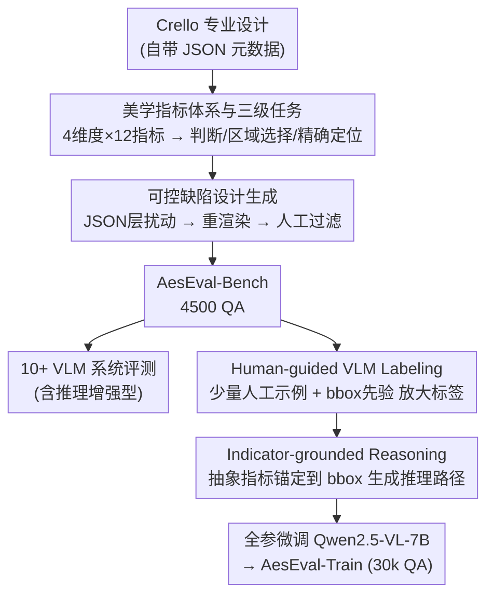

# Can Vision–Language Models Assess Graphic Design Aesthetics? A Benchmark, Evaluation, and Dataset Perspective

**会议**: ICLR2026  
**arXiv**: [2603.01083](https://arxiv.org/abs/2603.01083)  
**代码**: [https://github.com/arctanxarc/AesEval-Bench](https://github.com/arctanxarc/AesEval-Bench)  
**领域**: LLM评测  
**关键词**: design aesthetics, VLM evaluation, benchmark, indicator-grounded reasoning, graphic design

## 一句话总结
提出 AesEval-Bench，首个系统性评估 VLM 图形设计美学评估能力的 benchmark（4维度×12指标×3任务），发现现有 VLM（含推理增强型）在设计美学上表现有限，并通过 human-guided VLM labeling + indicator-grounded reasoning 构建训练数据，微调 7B 模型在精确定位任务上超过 GPT-5。

## 研究背景与动机

**领域现状**：VLM 在图像描述、VQA 等任务上取得显著进展，但在图形设计美学评估（评价海报、广告、UI的视觉吸引力）方面几乎未被探索。

**现有痛点**：(a) **基准不完善**——现有设计美学 benchmark 只覆盖少数维度（如忽略图形质量或字体），评估协议要么是粗粒度打分（无法定位问题区域）要么是开放式描述（难以量化）；(b) **缺乏系统对比**——没有对开源/闭源/推理增强 VLM 的全面比较；(c) **训练数据匮乏**——如何提升 VLM 在这个领域的表现尚未研究。

**核心矛盾**：设计美学是多维度、主观性强的任务（涉及排版、布局、配色、图形），现有 VLM 的通用推理能力不足以处理这种需要领域知识的细粒度评估。

**本文目标** (a) 建立覆盖完整设计维度的量化 benchmark；(b) 系统评估各类 VLM 的能力边界；(c) 构建能有效提升 VLM 的训练数据。

**切入角度**：将设计美学分解为 4 维度（字体、布局、配色、图形）× 12 指标，设计 3 个任务（判断、区域选择、精确定位）从粗到细评估，再用"indicator-grounded reasoning"让 VLM 学会把抽象美学指标关联到具体设计区域。

**核心 idea**：建立首个系统性的设计美学 benchmark + 发现推理增强 VLM 无优势 + 用指标锚定推理训练数据大幅提升 VLM 美学评估能力。

## 方法详解

### 整体框架

这篇论文要回答一个此前没被系统研究过的问题：VLM 到底能不能评判图形设计的美学，又能不能被教会做这件事。作者把工作拆成相互衔接的三段。第一步先确立一套**美学指标体系与三级任务**，把"好不好看"这种主观判断拆成 4 维度 12 指标，以及由粗到细的三个任务，作为后续评测和标注共用的坐标系。第二步围绕这套坐标系造数据：从 Crello 的专业设计出发，在其结构化元数据上施加**可控缺陷设计生成**再重渲染、人工过滤，得到带精确 ground truth 的 **AesEval-Bench**（4500 个 QA）；拿它系统评测 10+ 个 VLM（含推理增强型），量出它们在设计美学上的能力边界。第三步为了把 VLM 教得更好，用 **Human-guided VLM Labeling** 把少量人工标准放大成大规模训练标签，再用 **Indicator-grounded Reasoning** 给每条样本生成锚定到具体 bbox 的推理路径，组成 AesEval-Train（30k QA）去全参微调 Qwen2.5-VL-7B。

### 关键设计

**1. 美学指标体系与三级任务：把"好不好看"拆成可量化的维度和任务**

现有设计美学 benchmark 往往只覆盖少数维度、评估又停在粗粒度打分或开放式描述，既难量化也无法定位问题区域。这套指标体系把设计美学拆成 4 个维度共 12 个指标：字体（legibility、hierarchy）、布局（balance、layering、whitespace、alignment）、配色（harmony、contrast、appeal、psychology）、图形（quality、relevance）。在此之上设计 3 个由粗到细递进的任务——美学判断（整图 yes/no）、区域选择（4 选 1 找出有问题的区域）、精确定位（直接输出问题区域的 bbox 坐标）。三个任务从全局感知一路收敛到细粒度空间定位，逐级加难，因此能把 VLM 的美学理解深度逐层量出来，而不是只给一个笼统的分数；这套维度-指标-任务的坐标系也成为后面造数据和标注时共用的标准。

**2. 可控缺陷设计生成：从专业设计反向制造缺陷，以拿到精确 ground truth**

直接收集"有缺陷的设计"既难找又难标注缺陷的类型和位置。AesEval-Bench 反过来从 Crello 数据集里的专业设计出发：这些设计自带 JSON 元数据（每个元素的坐标、字体、颜色等），于是在 JSON 层面施加可控扰动——重新定位元素、更改字体、调整配色——再把改后的 JSON 重新渲染成设计图。因为扰动发生在结构化元数据上，缺陷出在哪个元素、属于哪类问题都是已知的，天然给出了精确的 ground truth；而底图来自真实专业设计，又保证了视觉真实感。最后由人工标注员判断每次扰动是否真的造成了可感知的美学问题，过滤掉无效扰动，最终构造出 4500 个 QA 对。

**3. Human-guided VLM Labeling：用少量人工示例放大出大规模训练标签**

训练集需要远多于 4500 的标签，但全量人工标注成本高、不可扩展。这里用少量人工标注当 in-context examples，再把扰动区域的 bbox 坐标作为先验一并喂给强 VLM（如 GPT），让它生成"该设计是否存在美学问题"的二分类标签。给定扰动区域坐标这个先验在真实推理场景里是拿不到的，但在标注阶段它能显著提升标签可靠性——相当于让标注模型"知道答案大概在哪"，从而把人工的判断标准批量复制到大规模数据上。

**4. Indicator-grounded Reasoning：把抽象美学指标强行锚定到具体 bbox 上**

作者观察到通用推理增强 VLM（GPT-o1/o3）在美学评估上并没有优势，原因是它们的推理是泛泛而谈的整体分析，没有落到具体区域。Indicator-grounded reasoning 针对这点：给 GPT 提供目标区域的 bbox 坐标和对应的设计图层，要求它输出既带坐标、又解释该区域与哪个美学指标相关的推理路径，强制把"层次感""对齐"这类抽象概念关联到设计中的某个具体 bbox。不同任务采用不同的锚定策略——美学判断用扰动区域的 bbox，区域选择同时提供扰动和非扰动区域以形成对比，精确定位还额外强调该区域与整体设计的关系。这样生成的推理路径不再是空泛的美学评论，而是带空间锚点的监督信号，成为后续微调能涨点的关键来源。

### 训练策略
基于 Qwen2.5-VL-7B-Instruct 做全参数微调，冻结视觉编码器只调语言模型参数。学习率 1e-6，cosine scheduler，3% warmup，bfloat16 + FlashAttention-2。训练数据 30k QA 对，输入为任务描述+设计图+JSON元数据，监督信号为推理路径+任务标签。

## 实验关键数据

### 主实验（VLM 基准评估）

| 模型 | 美学判断 Acc | 区域选择 Acc | 精确定位(choice) Acc | 精确定位(bbox) IoU |
|------|------------|------------|-------------------|------------------|
| GPT-5 | **0.7252** | **0.6989** | **0.6090** | **0.1993** |
| GPT-4o | 0.7031 | 0.6745 | 0.5680 | 0.1712 |
| GPT-o3 | 0.7105 | 0.6581 | 0.5800 | 0.1418 |
| GPT-o1 | 0.6705 | 0.6347 | 0.5295 | 0.1286 |
| Gemini-2.5-Pro | 0.6368 | 0.6100 | 0.6047 | 0.0977 |
| Qwen-VL-72B | 0.6724 | 0.6626 | - | - |
| InternVL3-14B | 0.6883 | 0.6378 | - | - |
| AesExpert-7B | 0.4056 | 0.2883 | 0.3377 | 0.0327 |

### 消融实验（微调效果）

| 配置 | 美学判断 Acc | 区域选择 Acc | 精确定位(bbox) IoU |
|------|------------|------------|------------------|
| Qwen-VL-7B (Base) | 0.6390 | 0.5795 | 0.0514 |
| + AesEval-Train | **0.6987 (+5.97%)** | **0.6065 (+2.70%)** | **0.2105 (+17.17%)** |
| - Reasoning Path | 0.6576 | 0.5795 | 0.1634 |
| - Positive Samples | 0.2072 | 0.2437 | 0.0012 |

### 关键发现
- **推理增强型 VLM 无优势**：GPT-o1/o3 在美学判断和区域选择上并不优于 GPT-4o/GPT-5，说明通用推理能力无法直接迁移到设计美学领域
- **图像美学专家模型表现差**：AesExpert 和 UNIAA-LLAVA 分数远低于通用 VLM，说明自然图像美学与设计美学有本质差异
- **bbox 定位是硬骨头**：最好的 GPT-5 在精确定位上 IoU 仅 0.1993，说明 VLM 距离精确理解设计元素空间位置还有很大差距
- **indicator-grounded reasoning 是关键**：去掉推理路径后精确定位 IoU 从 0.2105 降到 0.1634，去掉正样本后几乎归零，说明领域特定的锚定推理是提升的主要来源
- **微调 7B 可超 GPT-5**：在精确定位任务上，微调后的 Qwen-VL-7B（IoU 0.2105）超过 GPT-5（0.1993），证明领域特定训练数据的价值

## 亮点与洞察
- **三级任务设计精巧**：从判断→选择→定位逐级加难，像"考试"一样全面测试 VLM 的美学理解深度，这种 benchmark 设计思路可迁移到其他主观评估任务（如代码质量评估、写作质量评估）
- **indicator-grounded reasoning 的通用性**：将抽象概念锚定到具体空间区域的思路，不仅适用于美学评估，还可用于任何需要将高层概念与低层视觉特征关联的任务（如医学图像异常定位、建筑设计评审）
- **推理≠领域知识**：推理增强型 VLM 在通用任务上很强，但在专业领域不一定有优势——这个发现对 VLM 应用选型很有指导意义

## 局限与展望
- **数据源单一**：仅基于 Crello 数据集，主要是平面设计。UI设计、网页设计、包装设计等未覆盖
- **扰动方式有限**：通过 JSON 层面施加扰动，未涉及更复杂的设计缺陷（如语义不匹配、文化不合适等）
- **评估指标简单**：IoU 对于美学问题定位可能不是最优指标，因为美学问题区域的边界本身就是模糊的
- **缺少真实设计师反馈**：训练数据中的推理路径来自 GPT 生成，缺少与专业设计师推理过程的对比验证
- **仅微调了一个模型**：只在 Qwen-VL-7B 上验证了训练策略，未验证在更大模型上的效果

## 相关工作与启发
- **vs AesBench/UNIAA-Bench（图像美学）**：它们针对自然照片，关注曝光、构图等因素。本文专注图形设计，新增字体、布局维度。设计美学专家模型在本文 benchmark 上表现差，验证了二者的差异
- **vs DesignProbe/GPT-Eval Bench（设计美学）**：它们覆盖维度少且评估格式单一。AesEval-Bench 首次同时覆盖 4 维度 12 指标 + 3 种量化任务
- **vs 通用 grounded reasoning（如 SoM）**：通用视觉推理锚定的是语义实体（车、人），本文锚定的是美学指标（层次感、对齐），抽象层级更高

## 评分
- 新颖性: ⭐⭐⭐⭐ 首个系统性设计美学 VLM benchmark + indicator-grounded reasoning 训练方法
- 实验充分度: ⭐⭐⭐⭐⭐ 10+ VLM 全面对比，消融实验充分，包含输入成分分析
- 写作质量: ⭐⭐⭐⭐⭐ 逻辑结构清晰，问题定义明确，对比表格丰富
- 价值: ⭐⭐⭐⭐ 为 VLM 在设计领域的应用奠定评估基础，训练策略有实用价值

<!-- RELATED:START -->

## 相关论文

- [\[ACL 2025\] AbGen: Evaluating Large Language Models in Ablation Study Design and Evaluation for Scientific Research](../../ACL2025/llm_evaluation/abgen_evaluating_large_language_models_in.md)
- [\[ACL 2025\] CoV-Eval: Can You Really Trust Code Copilots? Evaluating Large Language Models from a Code Security Perspective](../../ACL2025/llm_evaluation/cov_eval_evaluating_llms_from_code_security_perspective.md)
- [\[ACL 2026\] When Vision-Language Models Judge Without Seeing: Exposing Informativeness Bias](../../ACL2026/llm_evaluation/when_vision-language_models_judge_without_seeing_exposing_informativeness_bias.md)
- [\[ACL 2025\] MARS: Benchmarking the Metaphysical Reasoning Abilities of Language Models with a Multi-task Evaluation Dataset](../../ACL2025/llm_evaluation/mars_benchmarking_the_metaphysical_reasoning_abilities_of_language_models_with_a.md)
- [\[ICLR 2026\] AnesSuite: A Comprehensive Benchmark and Dataset Suite for Anesthesiology Reasoning](anessuite_a_comprehensive_benchmark_and_dataset_suite_for_anesthesiology_reasoni.md)

<!-- RELATED:END -->
