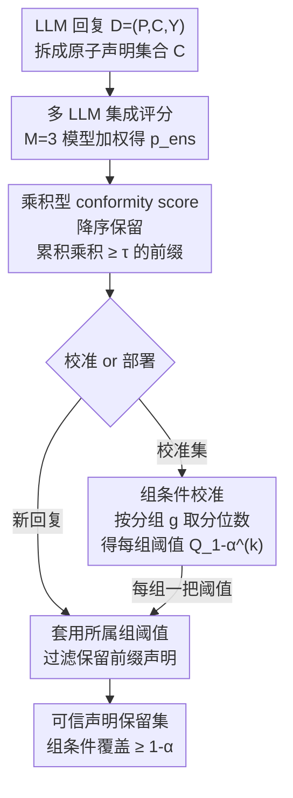

# Multi-LLM Adaptive Conformal Inference for Reliable LLM Responses

**会议**: ICLR2026  
**arXiv**: [2602.01285](https://arxiv.org/abs/2602.01285)  
**代码**: [GitHub](https://github.com/MLAI-Yonsei/MACI)  
**领域**: LLM评测  
**关键词**: Conformal Inference, LLM Factuality, Multi-LLM Ensemble, False-Claim Filtering, Distribution-Free Guarantee  
**作者**: Kangjun Noh, Seongchan Lee, Ilmun Kim, Kyungwoo Song（延世大学 & KAIST）

## 一句话总结

提出 MACI（Multi-LLM Adaptive Conformal Inference），通过**累积乘积型 conformity score** + **多 LLM 集成**的 factuality 评分 + **组条件校准**，在严格保证用户指定错误率的同时，显著提升 LLM 回复中事实性声明的保留率。

## 研究背景与动机

**LLM 幻觉问题**：LLM 在医疗、法律等高风险领域被广泛使用，但回复中可能包含虚假信息（hallucination），亟需提供统计保证。

**Conformal Inference (CI) 的引入**：CI 提供无分布假设的有限样本保证，已有工作（BCI, Mohri & Hashimoto 2024）将其用于 LLM 回复的虚假声明过滤——将回复分解为原子声明，基于 factuality score 设阈值过滤。

**BCI 过于保守**：BCI 使用单一全局阈值，仅提供边际覆盖（marginal coverage），在子群体间可能出现严重的过覆盖/欠覆盖；其 conformity score 仅依赖单个最差声明的分数，对估计误差极其敏感，导致大量真实声明被误删。

**CCI 保证松弛**：CCI（Cherian et al., 2024）引入自适应阈值函数以实现条件保证，但依赖自适应错误率 $\alpha$，在高风险场景中不适用；其线性特征空间难以捕捉 LLM 回复的复杂语义分组结构。

**Conformity score 设计缺陷**：既有方法均基于单个极端声明分数构造 conformity score，忽视了其余声明的集体置信信息。

**核心目标**：在严格控制组条件覆盖率（group-conditional coverage）的前提下，最大化真实声明的保留率（retention ratio）。

## 方法详解

### 整体框架

MACI 要解决的问题是：在严格保证用户指定错误率 $\alpha$ 的前提下，尽可能多地保留 LLM 回复里真实的事实性声明。它把每条回复 $D=(P,C,Y)$ 拆成原子声明集合 $C=\{c_1,\dots,c_{|C|}\}$，整条流水线是任意生成器之后的纯后处理过滤器，只依赖 per-claim 标量分数。

具体怎么转：先用多个黑盒 LLM 给每个 (prompt, claim) 对打 factuality 分、加权集成成单一可信度 $p_{\text{ens}}$；再把声明按分数从高到低排序，保留"累积乘积仍不低于阈值"的最长前缀，这一前缀的最小可接受阈值就是该样本的 conformity score。校准阶段在每个语义分组上独立对这些分数取分位数，得到一组组各自的阈值；部署阶段对新回复算出集成分数、套用其所属组的阈值做前缀过滤，输出的保留集就以 $1-\alpha$ 的概率全是事实。

### 关键设计

**1. 多 LLM 集成优化：用更准的 factuality 分逼近 oracle 保留率**

Theorem 3 把保留率差距 $\Delta$ 界定为估计误差的多项式速率 $\Delta \le \mathfrak{C}' \big(\mathbb{E}[(\hat{p} - p^*)^2]\big)^{\frac{\beta}{\beta+2}}$，意味着 factuality score 的 MSE 越小，保留率就越接近 oracle——这正是要把多个模型集成起来降方差的理论动机。由于 oracle $p^*$ 不可观测、MSE 无法直接优化，MACI 改用一个可观测的代理目标：在保持真阳率 $\text{TPR}\ge 1-\delta$ 的约束下最小化假阳率，即 $p^\star = \arg\min_{p} \mathbb{E}[\text{FPR}(p, \tau_{p,\delta})]$。实现上对 $M=3$ 个模型（Llama-3.3-70B-Instruct、Qwen-2.5-72B-Instruct、DeepSeek-V3）的 verbalized 分数 $p_m(P,c)\in[0,1]$ 做加权集成 $p_{\text{ens}}(P,c;w)=\sum_{m=1}^{M} w_m p_m(P,c)$，优化权重 $w$ 使代理 FPR 最低。实验中 FPR 的下降与 MSE 的下降一致，说明这个代理确实在拉近与 oracle 的距离，为后面两步提供了更可靠的输入分数。

**2. 乘积型 conformity score：把"整段是否全对"写进单个分数**

BCI/CCI 的 conformity score 只取一条声明的极端分数，因此对单个声明的估计误差极其敏感，一旦最差分数被低估就会误删大量真实声明。MACI 改用整段保留集的联合可信度来度量"过滤是否安全"。给定使分数降序的排列 $\pi_i$（即 $p_i^*(c_{i,\pi_i(1)}) \ge \cdots \ge p_i^*(c_{i,\pi_i(N_i)})$），oracle 在阈值 $\tau$ 下保留累积乘积不低于 $\tau$ 的最长前缀

$$K_i^*(\tau) = \max\Big\{k \in [N_i] : \prod_{j=1}^{k} p_i^*(c_{i,\pi_i(j)}) \ge \tau\Big\}.$$

对应的 conformity score 取使保留集仍落在可接受集 $A_i$ 内的最小阈值 $E_i = \inf\{\tau \in [0,1] : F(\hat{p}, \tau, U_i; P_i, C_i) \subseteq A_i\}$。由于乘积把所有保留声明的置信度聚合在一起，而非押注单个最差声明，这个分数对个别声明的估计噪声更鲁棒，直接反映"这个保留前缀整体为事实"的联合可信度，也正是下一步组校准要取分位数的那个标量。

**3. 组条件校准：给每个语义分组各发一把阈值，把边际覆盖升级为组条件覆盖**

BCI 只用一个全局阈值，只保证边际覆盖，在子群体间会同时出现严重过覆盖和欠覆盖。MACI 套用 Mondrian 框架，先用分组函数 $g:\mathcal{P}\times\mathcal{C}\to\{1,\dots,K\}$ 把样本切成 $K$ 组，再在每组校准子集 $\mathcal{I}_k=\{i:g(P_i,C_i)=k\}$ 上独立取上一步算出的 conformity score 的分位数 $\hat{Q}_{1-\alpha}^{(k)}=\text{Quantile}(\{E_i:i\in\mathcal{I}_k\},1-\alpha)$ 作为该组阈值。Theorem 2 证明在可交换性假设下，每组都满足 $\mathbb{P}(F_{n,\alpha}^{(k)}(P_{n+1},C_{n+1})\subseteq A_{n+1}\mid g(P_{n+1},C_{n+1})=k)\ge 1-\alpha$，从而把保证从"平均达标"收紧到"逐组达标"，且阈值固定为用户指定的 $\alpha$、不像 CCI 那样依赖自适应错误率，因此能直接用于高风险场景。

## 实验

### 实验设置

- **数据集**：MedLFQA（医疗 QA）、WikiBio（维基百科传记）、ExpertQA（专家级 QA）
- **基线**：BCI（Basic CI, Mohri & Hashimoto 2024）、CCI（Conditional CI, Cherian et al. 2024）
- **分组标准**：每个数据集定义语义分组（如医疗内容类型、浏览量、问题领域）+ False-Claim Risk 通用分组
- **目标覆盖率**：$1-\alpha \in \{0.80, 0.90, 0.95\}$，30 次重复实验取均值

### 主实验：覆盖率 & 保留率（Table 1 精选）

| 数据集 | 方法 | $1{-}\alpha{=}0.80$ Cov. | Ret. | $1{-}\alpha{=}0.90$ Cov. | Ret. | $1{-}\alpha{=}0.95$ Cov. | Ret. |
|--------|------|:---:|:---:|:---:|:---:|:---:|:---:|
| MedLFQA | BCI | 0.80 ✅ | 0.06 | 0.90 ✅ | 0.02 | 0.95 ✅ | 0.01 |
| | CCI | 0.81 ✅ | 0.56 | 0.90 ✅ | 0.31 | 0.95 ✅ | 0.18 |
| | **MACI** | **0.80 ✅** | **0.71** | **0.90 ✅** | **0.50** | **0.95 ✅** | **0.30** |
| WikiBio | BCI | 0.81 ✅ | 0.02 | 0.90 ✅ | 0.01 | 0.95 ✅ | 0.01 |
| | CCI | 0.79 ✅ | 0.19 | 0.89 ✅ | 0.11 | 0.93 ❌ | 0.06 |
| | **MACI** | **0.81 ✅** | **0.43** | **0.90 ✅** | **0.25** | **0.95 ✅** | **0.13** |
| ExpertQA | BCI | 0.91 ❌ | 0.13 | 0.91 ✅ | 0.13 | 0.91 ❌ | 0.13 |
| | CCI | 0.85 ❌ | 0.18 | 0.85 ❌ | 0.17 | 0.85 ❌ | 0.17 |
| | **MACI** | **0.80 ✅** | **0.45** | **0.90 ✅** | **0.15** | **0.95 ✅** | **0.10** |

**核心发现**：
- MACI 在几乎所有组上达到目标覆盖率，同时保留率远超基线
- BCI 保留率极低（MedLFQA 仅 1%~6%），过于保守
- CCI 在 WikiBio ($\alpha$=0.05) 和 ExpertQA 上出现欠覆盖，组条件保证失效

### 消融与分析

#### 多 LLM 集成效果（Figure 3）

| 配置 | FPR ↓ | MSE ↓ | 保留率 ↑ |
|------|:-----:|:-----:|:--------:|
| 单 LLM | 高 | 高 | 低 |
| 算术均值集成 | 中 | 中 | 中 |
| **MACI（优化集成）** | **最低** | **最低** | **最高** |

- 不同 LLM 在虚假声明检测上的 Jaccard 距离很大（模式互补），验证了集成的合理性
- FPR 的改善与 MSE 的改善一致，证明代理目标与 oracle 目标对齐

#### 时间成本（Table 3，WikiBio 500 样本）

| 阶段 | SelfCheck | FSC-KG | CCI | **MACI** |
|------|:---------:|:------:|:---:|:--------:|
| 评分（s/样本） | 3.25 | 19.30 | 3.25 | **1.20** |
| 校准（s） | — | — | 10.33 | **3.24** |
| 总时间（s） | — | — | 1643.91 | **598.98** |

MACI 单次评分 + 轻量校准，总时间仅为 CCI 的 **36%**。

#### 协变量偏移（Table 2，MACI-DRE）

在 MedLFQA 上构造校准/测试分布不一致的 covariate shift 场景，MACI-DRE 通过密度比估计重采样校准集，有效缓解偏移带来的组覆盖率偏差，同时保持相近的保留率。

## 亮点

- **乘积型 conformity score**：首次将文档级过滤建模为声明分数的累积乘积，比极端值方法更鲁棒，是本文最核心的设计贡献
- **首个保留率理论分析**：Theorem 3 建立了 oracle-estimator 偏差与真实声明保留之间的定量关系，为集成设计提供理论动机
- **即插即用**：MACI 仅需要 per-claim 标量分数，可作为任意 LLM 生成器的后处理过滤器
- **实际效率**：总时间成本最低，适合实时部署

## 局限性

- **组定义依赖先验知识**：分组函数 $g$ 需要手动定义（如医疗内容类型），对于未知领域可能不容易设计
- **校准集规模要求**：组条件校准要求每个组有足够的校准样本（$n_k$），小组样本不足时阈值偏保守
- **ExpertQA 上保留率偏低**：当数据集噪声大、假声明比例高时（如 ExpertQA），保留率仍然有限（$\alpha=0.05$ 时仅 10%）
- **Covariate shift 处理是可选后处理**：MACI-DRE 需要额外的密度比估计步骤，增加了系统复杂度
- **对 factuality scorer 质量的依赖**：理论上保留率受限于 $\hat{p}$ 与 $p^*$ 的 MSE，若所有 base LLM 在同方向出错则集成增益有限

## 相关工作

- **BCI**（Mohri & Hashimoto, 2024）：首个将 CI 用于 LLM 事实性过滤的工作，但仅提供边际覆盖且保留率极低
- **CCI**（Cherian et al., 2024）：引入条件 CI + 自适应 $\alpha$ 提升保留率，但线性阈值函数难以捕捉复杂语义分组，自适应 $\alpha$ 不适用于高风险场景
- **多校准/多有效 CP**（Jung et al., 2023; Liu & Wu, 2025）：提供多组/多有效覆盖保证，但往往倾向保守，保留率低
- **RAG 增强 CI**（Feng et al., 2025）：将 CI 转移到外部检索组件，本质改变了保证对象
- **采样一致性方法**（SelfCheck, FSC-KG）：无严格统计保证，且时间成本高

## 评分

- **新颖性**: ⭐⭐⭐⭐ — 累积乘积 conformity score + 保留率理论分析 + 多 LLM 集成优化的组合具有原创性
- **实验充分度**: ⭐⭐⭐⭐ — 3 个数据集、多种分组标准、消融、时间成本、协变量偏移，实验全面扎实
- **写作质量**: ⭐⭐⭐⭐ — 理论推导清晰，动机充足，结构完整
- **价值**: ⭐⭐⭐⭐ — 为 LLM 在高风险领域的可靠部署提供了实用且有理论保证的方案

<!-- RELATED:START -->

## 相关论文

- [\[ICML 2026\] Margin-Adaptive Confidence Ranking for Reliable LLM Judgement](../../ICML2026/llm_evaluation/margin-adaptive_confidence_ranking_for_reliable_llm_judgement.md)
- [\[ICLR 2026\] AdaBlock-dLLM: Semantic-Aware Diffusion LLM Inference via Adaptive Block Size](adablock-dllm_semantic-aware_diffusion_llm_inference_via_adaptive_block_size.md)
- [\[ACL 2026\] Statistically Reliable LLM-Based Ranking Evaluation via Prediction-Powered Inference](../../ACL2026/llm_evaluation/statistically_reliable_llm-based_ranking_evaluation_via_prediction-powered_infer.md)
- [\[ICLR 2026\] How Reliable is Language Model Micro-Benchmarking?](how_reliable_is_language_model_micro-benchmarking.md)
- [\[ICLR 2026\] Preference Leakage: A Contamination Problem in LLM-as-a-judge](preference_leakage_a_contamination_problem_in_llm-as-a-judge.md)

<!-- RELATED:END -->
