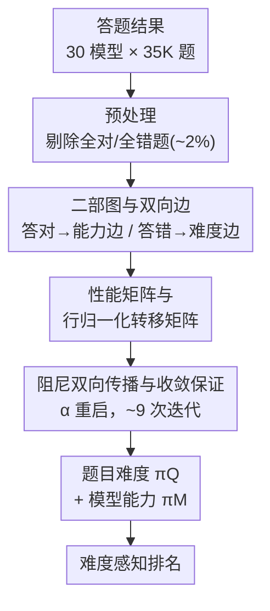

# RankLLM: Weighted Ranking of LLMs by Quantifying Question Difficulty

**会议**: ICLR 2026  
**arXiv**: [2602.12424](https://arxiv.org/abs/2602.12424)  
**代码**: 未公开（已建立 HuggingFace 排行榜平台）  
**领域**: LLM评测  
**关键词**: LLM evaluation, question difficulty, model competency, bipartite graph, score propagation, benchmark

## 一句话总结

提出 RankLLM，一个基于有向二部图双向分数传播的非参数化框架，联合估计题目难度和模型能力，实现难度感知的 LLM 排名，与人类判断达到 90% 一致性。

## 研究背景与动机

现有主流 LLM 评测基准（如 MMLU-Pro、MATH、GSM8K 等）通常将性能压缩为各主题类别下的准确率，隐式地将所有题目视为同等重要。这种做法存在几个关键问题：

**难度差异被忽略**：将一道简单算术题和一道多步微积分推导题等同看待，无法区分模式匹配和高级推理能力

**排名不稳定**：当简单题和难题的比例变化时，模型排名可能会翻转

**无法捕捉细粒度差异**：整体准确率接近的模型之间的能力差异被掩盖

已有的 Item Response Theory (IRT) 方法虽然尝试建模题目难度，但需要对每道题进行参数化的 logistic 拟合，计算开销大，在样本量小和数据集大的场景下不够实用。

## 方法详解

### 整体框架

RankLLM 想解决的痛点是：把一道简单算术题和一道多步推导题等权相加，准确率丢掉了"这题难不难"的信息，导致排名既不稳定又掩盖了细粒度能力差异。它的核心想法是让题目难度和模型能力互相定义——一道能难倒强模型的题才算真难题，一个能搞定难题的模型才算真强。

为此 RankLLM 把所有模型和题目放进一张有向二部图 $\mathcal{G}=(\mathcal{V}, \mathcal{E})$，让两类节点互相打分：模型答对一道题，这道题就把"能力分"投给模型；模型答错一道题，模型就把"难度分"投给这道题。整条流水线是：先做预处理剔除没有区分度的题，再把答题结果建成带双向边的二部图，把答题矩阵行归一化成两个转移矩阵，然后跑带阻尼的双向分数传播迭代到收敛，最后同时读出每道题的难度 $\pi_Q$ 和每个模型的能力 $\pi_M$，据此给出难度感知的排名。整个过程不需要训练，只有一个阻尼超参数。

### 关键设计

**1. 二部图与双向边：把"谁答对了难题"编码成图结构**

传统准确率把每道题等权相加，丢掉了"这题难不难"的信息。RankLLM 的做法是构造顶点集 $\mathcal{V}=\mathcal{M}\cup\mathcal{Q}$（$M$ 个模型加 $Q$ 道题），再用两类有向边分别承载两个方向的信号：能力边 $\mathcal{E}_{\text{Comp}}$ 是 $q_i \to m_j$，表示模型 $m_j$ 答对了题 $q_i$；难度边 $\mathcal{E}_{\text{Fail}}$ 是 $m_j \to q_i$，表示 $m_j$ 答错了 $q_i$。这样"答对难题"会顺着能力边给模型加分，"难倒强模型"会顺着难度边给题目加分，难度与能力的耦合直接写进了拓扑结构里，避免了 IRT 那种逐题参数拟合。建图前的预处理会剔除所有模型都答对或都答错的题目（约占 2%），因为这些题没有区分度，留着反而会破坏图的连通性。

**2. 性能矩阵与行归一化转移矩阵：让分数传播变成马尔可夫游走**

把答题结果搬上图之后，需要让"打分"有概率意义才能稳定传播。答题结果先汇成能力矩阵 $A \in \{0,1\}^{Q \times M}$（$A_{ij}=1$ 即模型 $m_j$ 答对题 $q_i$），难度矩阵则取其互补转置 $\hat{A} = (\mathbf{1}^{Q \times M} - A)^\top$。为了让传播有概率意义，两个矩阵都按出度做行归一化，得到能力转移 $P_{Q \to M} = \text{diag}(A\mathbf{1}_M)^{-1} A$ 和难度转移 $P_{M \to Q} = \text{diag}(\hat{A}\mathbf{1}_Q)^{-1} \hat{A}$。归一化是"难度感知"的真正来源：一道被很多模型答对的简单题，分到每个模型头上的能力分会被稀释；反过来只有少数强模型答对的难题，单次传播就能给它们更集中的加权。

**3. 阻尼双向传播与收敛保证：用 PageRank 式的 teleportation 破掉二部图的周期性**

有了转移矩阵，最后一步是把分数迭代到自洽。纯二部图上的来回传播是 2-周期的，直接迭代不会收敛到唯一分布。RankLLM 借鉴 PageRank，引入阻尼因子 $\alpha \in (0,1)$，每一步都按 $1-\alpha$ 的概率均匀重启：

$$\pi_Q^{(t+1)} = \alpha P_{M \to Q}^\top \pi_M^{(t)} + (1-\alpha)\frac{\mathbf{1}_Q}{Q}$$

$$\pi_M^{(t+1)} = \alpha P_{Q \to M}^\top \pi_Q^{(t+1)} + (1-\alpha)\frac{\mathbf{1}_M}{M}$$

加入均匀项后整条链变成遍历马尔可夫链，由 Perron-Frobenius 定理保证收敛到唯一平稳分布，实测 9 次迭代内即可收敛。两式交替更新——先用最新的模型能力刷新题目难度，再用刷新后的难度回头更新模型能力——这就是"双向"传播：强模型在难题上的表现持续抬高题目难度，而难题上的成功又持续抬高模型能力，二者在迭代中达到自洽。值得一提的是，整个框架是纯非参数化的，没有可学习参数、不需要梯度下降或损失函数，全流程唯一要设定的就是 $\alpha$，这正是它相对 IRT（逐题做 logistic 拟合）在效率上的根本优势。

**4. 连续分数扩展：无缝支持部分给分的基准**

很多基准并非非黑即白，而是给出 $[0,1]$ 区间的部分分。RankLLM 只需把二值能力矩阵 $A$ 换成连续矩阵 $A_c \in [0,1]^{Q \times M}$，转移矩阵和传播公式的形式完全不变，前面三步原样跑，框架就能直接处理带部分分的评测，无需任何额外改动。

## 实验关键数据

### 主实验

在 6 个基准、35,550 道题、30 个模型上评测：

| 数据集 | 题目数 |
|---------|--------|
| BBH | 6,511 |
| GPQA | 448 |
| GSM8K | 1,320 |
| HellaSwag | 10,000 |
| MATH | 5,000 |
| MMLU-Pro | 12,102 |

**人类对齐**：RankLLM 与人类共识达到 **90%** 一致，显著优于 Simple Rank (62.9%)、1PL-IRT (50.0%)、2PL-IRT (51.4%)、Multi-IRT (52.9%)。

**关键排名发现**：RankLLM 分数与准确率的 Kendall's Tau = 0.8492，表明总体趋势一致但在相邻模型间存在显著重排。例如 Qwen2-0.5B（准确率 20.2%）排名高于 DeepSeek-Chat-Lite（准确率 30.49%），原因是前者在难题上答对率为 5.5% vs 2.4%。

### 消融实验 / 效率分析

| 方法 | 收敛时间 (s) |
|------|-------------|
| **RankLLM** | **0.00597** |
| 1PL-IRT | 1,782.75 |
| 2PL-IRT | 3,787.03 |
| Multi-IRT (3D) | 18.76 |

RankLLM 比最快的 IRT 基线快 3,100 倍以上。

**鲁棒性**：随机移除 $k$ 个模型（$k$ = 1~15），题目难度 Spearman 相关性保持在 0.938 以上，模型能力相关性保持在 0.993 以上。

**可扩展性**：测试规模扩展至 $Q=1{,}000{,}000$，$M=2{,}000$，始终在 9 次迭代内收敛，复杂度线性于 $Q \times M$。

### 关键发现

1. **数据集难度分布**：MATH 和 MMLU-Pro 具有更宽的难度分布，适合评测高级推理；GSM8K 和 HellaSwag 偏简单
2. **模型族一致性**：同一家族模型在不同参数量下保持稳定的难度分布模式（Llama、Qwen、Yi 均如此），缩放主要影响绝对准确率
3. **开放权重模型的可靠性**：仅用开放权重模型估计的难度与使用全模型池的结果高度相关（Spearman 0.96, Pearson 0.94）
4. **多样性收益**：混合规模模型池将极端误估减少 83%，与人类判断最一致（90% 共识）

## 亮点与洞察

1. **优雅的非参数设计**：整个方法仅依赖一个阻尼超参数，无需每题参数拟合，远比 IRT 简单
2. **极高的计算效率**：0.006 秒在消费级硬件上完成 30 模型 × 35K 题的评估
3. **人类对齐度优异**：90% 的共识一致性为该领域最高水平之一
4. **理论保证**：基于 Perron-Frobenius 定理的收敛证明确保了方法的可靠性
5. **实际洞察丰富**：揭示了 Qwen2-0.5B 在难题上优于 DeepSeek-Chat-Lite 等反直觉现象

## 局限性

1. 难度定义基于模型群体的成败模式，当模型池同质化时可能产生偏差
2. 只考虑答案的对错，未能捕捉推理过程的质量差异
3. 阻尼因子 $\alpha$ 的选择缺乏理论最优指导
4. 人类评测规模有限（20 名评估者，70 个题对），统计功效可进一步提升

## 相关工作与启发

- **与 IRT 的关系**：IRT（1PL/2PL）需要参数化拟合，计算成本高且在小样本下不稳定；RankLLM 是纯图算法，线性复杂度
- **与 PageRank 的关系**：RankLLM 的阻尼传播本质上是 bipartite 版本的 PageRank，但针对评测场景设计了能力-难度双向传播
- **对评测实践的启发**：混合规模模型池是最佳评测配置；单一类型模型池会导致难度估计的系统性偏差

## 评分

- **创新性**: ⭐⭐⭐⭐ — 非参数化的难度-能力联合估计，简洁优雅
- **实用性**: ⭐⭐⭐⭐⭐ — 极低计算成本，已有 HuggingFace 排行榜
- **实验完整度**: ⭐⭐⭐⭐⭐ — 6 个基准、30 个模型、人类评测、鲁棒性分析齐全
- **写作质量**: ⭐⭐⭐⭐ — 思路清晰，公式推导完整
- **综合评分**: ⭐⭐⭐⭐ — 方法简单有效，但理论贡献相对有限

<!-- RELATED:START -->

## 相关论文

- [\[ACL 2026\] Question Difficulty Estimation for Large Language Models via Answer Plausibility Scoring](../../ACL2026/llm_evaluation/question_difficulty_estimation_for_large_language_models_via_answer_plausibility.md)
- [\[NeurIPS 2025\] EvaLearn: Quantifying the Learning Capability and Efficiency of LLMs via Sequential Problem Solving](../../NeurIPS2025/llm_evaluation/evalearn_quantifying_the_learning_capability_and_efficiency_of_llms_via_sequenti.md)
- [\[ICLR 2026\] Benchmarking Overton Pluralism in LLMs](benchmarking_overton_pluralism_in_llms.md)
- [\[ICML 2026\] Margin-Adaptive Confidence Ranking for Reliable LLM Judgement](../../ICML2026/llm_evaluation/margin-adaptive_confidence_ranking_for_reliable_llm_judgement.md)
- [\[ACL 2026\] Statistically Reliable LLM-Based Ranking Evaluation via Prediction-Powered Inference](../../ACL2026/llm_evaluation/statistically_reliable_llm-based_ranking_evaluation_via_prediction-powered_infer.md)

<!-- RELATED:END -->
