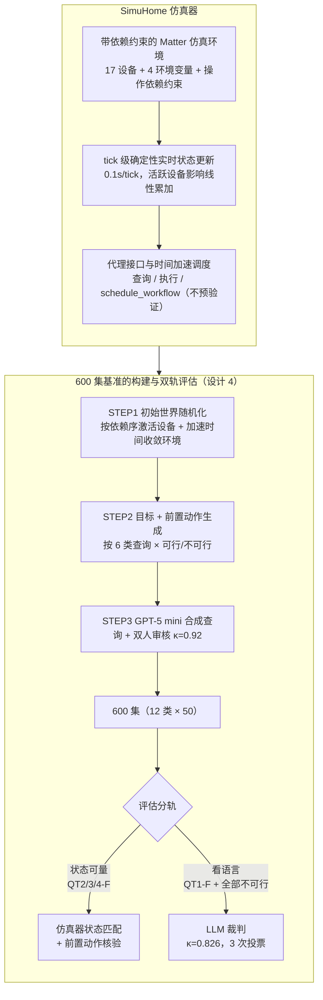

# SimuHome: A Temporal- and Environment-Aware Benchmark for Smart Home Agents

**会议**: ICLR 2026 Oral  
**arXiv**: [2509.24282](https://arxiv.org/abs/2509.24282)  
**代码**: [holi-lab/SimuHome](https://github.com/holi-lab/SimuHome)  
**领域**: LLM评测  
**关键词**: smart_home, LLM_agent, benchmark, temporal_reasoning, workflow_scheduling  

## 一句话总结

SimuHome 是一个基于 Matter 协议的高保真智能家居仿真器和 600 集评估基准，支持环境变量动态变化和时间加速调度评估，揭示了工作流调度是当前 LLM 代理最持久的挑战。

## 研究背景与动机

**智能家居代理的发展困境**：
- Amazon Alexa、Google Home 已商业化部署，但许多日常请求仍无法处理
- 用户请求的复杂度远超简单命令："天太闷了"（需推理隐含意图 → 启动除湿机）
- 设备操作存在依赖关系：扫地机器人需先开机才能切换拖地模式
- 时间协调类请求："洗碗机洗完后开厨房灯"需要计算预计完成时间并调度

**现有基准的不足**：
- **HomeBench**：通过对比 API 调用序列评估，但不模拟环境变化
- **Sasha**：关注创意目标解读（"让氛围温馨"），通过人工评判
- **SAGE**：支持顺序工具调用，但不模拟设备对环境变量的影响
- **共同问题**：不模拟设备操作对温度/湿度/光照等环境变量的连续影响；不支持操作依赖约束；不支持时间调度评估

## 方法详解

### 整体框架

SimuHome 想解决一件事：智能家居代理的真正难点——设备操作彼此牵制、操作会连续改变环境、还要把命令调度到未来某个时刻——在过去的静态基准里全都没法考。它的做法是把一个**仿真器**和一套**基准**耦合起来。仿真器是引擎，基于工业标准 Matter 协议建模设备，把每次操作的影响连续地写回温度、湿度、光照、空气质量这四个环境变量，于是"开除湿机半小时后湿度降到多少""洗碗机洗完是什么时刻"这类问题第一次有了确定可验证的答案。基准则跑在这台引擎上：用三步流水线生成 600 集、覆盖从状态查询到多设备协调调度的 6 类查询（每类都有可行/不可行变体），再按"状态可量就量、要看语言才交给裁判"分两轨打分，把代理的能力谱系切成可单独诊断的格子。

仿真器内部按论文提出的三条核心需求拆成三块——带依赖约束的环境（设计 1）、tick 级确定性的状态更新（设计 2）、代理接口与时间加速调度（设计 3）；基准侧则是一条"初始世界随机化 → 目标生成 → 查询合成审核 → 双轨评估"的构建流水线（设计 4）。

### 关键设计

**1. 带依赖约束的 Matter 仿真环境：把"设备不是孤立按钮"建进规则里**

真实家居里设备操作彼此牵制——空调没开机就调不了温度、扫地机器人得先启动才能切拖地模式——而过去的基准把每个 API 当成独立可调用的开关，于是代理学不到操作顺序。SimuHome 用 Matter 协议定义 17 种设备类型，每种设备声明若干 Matter cluster（一组相关功能），并显式编码操作依赖约束；其中既有直接影响环境变量的设备（如空调影响温度），也有多阶段运行周期的设备（如洗衣机）。每个房间是一个设备集合加上温度、湿度、光照、空气质量这 4 个环境变量的容器，代理任何越过依赖的调用都会被仿真器拒绝，从而逼出对前置条件的推理。

**2. tick 级确定性的实时状态更新：让环境真正"活"起来又完全可复现**

既要模拟连续的物理变化又要保证可复现，本文把时间离散成 tick（0.1 秒一个 tick），每个 tick 遍历所有活跃设备、把它们对环境变量的影响**线性累加**回环境（影响随活跃设备数量和挡位叠加）。这样两台高风速空调就比一台降温更快，且结果只取决于初始状态与动作序列、与真实时钟无关，因此给定相同条件任何一集都能精确重放。设备上的传感器属性也每 tick 同步刷新——空调内置温度传感器读到的就是当前房间温度——代理因此能通过查询传感器闭环感知自己操作的后果。仿真默认与真实时间同步，但可加速到任意未来时刻（设计 3 的调度评估正依赖这一点）。

**3. 代理接口与时间加速调度：把"未来才发生的事"也变得可评估**

时间协调类请求（"洗碗机洗完后开厨房灯"）的难点在于结果发生在未来、无法当场验证。代理拿不到完整环境状态，只能通过接口的三类工具交互：查询设备状态与环境变量、执行 Matter 命令、以及调用 `schedule_workflow` 注册一段带绝对起始时间、有序命令列表、在未来触发的工作流。关键设计是 `schedule_workflow` **只返回登记确认、不做任何预验证**——正如真实平台上设备状态会在注册到执行之间不可预测地变化，仿真器不替代理检查"这样排会不会在执行时失败"，命令真到点失败了也不报错。与之配套，仿真器支持时间加速：注册完即可把时钟快进到执行时刻、直接比对最终状态。这一"冷接口 + 热加速"的组合既逼代理自己把调度规划对，又让评估不必等真实时间流逝。

**4. 600 集基准：6 类查询 × 可行/不可行 + 三步生成 + 双轨评估**

有了仿真器还要把能力谱系切成可诊断的题。基准按认知难度递增设计 6 类查询，每类都配一个不可行变体（设备不存在、超出物理极限、时间相互矛盾），用来检验代理会不会盲目执行无法满足的请求：

| 查询类型 | 说明 | 示例 |
|---------|------|------|
| QT1 状态查询 | 检索环境变量/设备状态 | "厨房湿度多少？" |
| QT2 隐含意图推理 | 从间接表述推断需求 | "这里太闷了" → 启动除湿机 |
| QT3 显式设备控制 | 执行具体命令 | "把客厅空气净化器风速调满" |
| QT4-1 定时调度 | 在未来某时操控设备 | "十分钟后关灯和加湿器" |
| QT4-2 事件驱动调度 | 基于设备完成事件触发 | "洗碗机洗完后关厨房灯" |
| QT4-3 协调调度 | 同步多设备完成时间 | "让洗碗机和洗衣机同时洗完" |

每类可行/不可行各 50 集、共 12 类 600 集，于是成功率能落到具体能力点而非笼统一个总分。每集由三步流水线生成，保证既随机多样又有确定可判的标准答案：STEP1 先随机化房间布局，再从全关状态出发、按操作依赖顺序逐轮采样并执行每个设备一条命令（空调先开机再调风速），最后加速时间让环境变量收敛到稳定值，得到初始世界；STEP2 按查询类型生成结构化目标（QT3 给目标属性值、QT2 给环境变量应变方向、QT4 额外带目标时刻），并设定必须出现在代理工具调用历史里的**前置动作**（如先 `get_room_devices()` 确认设备存在，杜绝靠猜蒙对）；STEP3 由 GPT-5 mini 把目标改写成自然语言查询，再由两名研究生独立审核全集、修正与目标不符的措辞，标注一致性 Cohen's κ = 0.92（κ 衡量去除随机一致后的标注者吻合度，越接近 1 越一致）。

评估则按"正确性的形态"分两轨。凡是落到设备最终状态或环境变量上的请求（QT2/3/4 可行集），由仿真器把实际状态与结构化目标逐项比对——QT3 查属性是否精确匹配、QT2 查环境变量是否朝目标方向变化、QT4 先加速到目标时刻再查设备状态，且要求全部前置动作出现在工具调用历史里，目标满足且前置动作齐备才算成功，是完全确定的二元判定；而 QT1 可行集（需报出正确数值）以及所有不可行集（需判断代理有没有正确识别并解释"做不到"）要评判的是自然语言回复，改用 LLM-as-Judge，每集查询 3 次取多数投票，裁判与人工标注一致性 Cohen's κ = 0.826。这样既保住状态匹配的客观性，又覆盖了"该拒绝时是否拒绝"这类只能从文字判断的情形。

## 实验关键数据

### 主实验：18 个 LLM 代理的成功率 (%)

| 模型 | QT1-F | QT2-F | QT3-F | QT4-1-F | QT4-2-F | QT4-3-F |
|------|-------|-------|-------|---------|---------|---------|
| GPT-5.1 (reasoning) | **100** | **80** | **86** | **60** | **72** | **56** |
| Gemini-2.5-Pro (reasoning) | 96 | 60 | 76 | 44 | 60 | 46 |
| GPT-4.1 | 98 | 44 | 84 | 50 | 46 | 34 |
| GPT-4.1-mini | 96 | 62 | 64 | 26 | 40 | 10 |
| Llama4-Maverick | 96 | 52 | 88 | 22 | 18 | 32 |
| Qwen3-32B | 82 | 62 | 52 | 18 | 14 | 16 |
| Qwen3-235B-A22B | 86 | 32 | 84 | 26 | 38 | 28 |
| Gemma3-27B-it | 80 | 54 | 48 | 24 | 4 | 6 |
| Llama3.2-1B-it | 0 | 0 | 0 | 0 | 0 | 0 |

核心发现：**工作流调度（QT4）是所有模型最薄弱的环节**。即使最强的 GPT-5.1 在 QT4-3 也仅达 56%。

### 不可行请求检测

| 模型 | QT1-IF | QT2-IF | QT3-IF | QT4-1-IF | QT4-2-IF | QT4-3-IF |
|------|--------|--------|--------|----------|----------|----------|
| GPT-5.1 | **94** | **50** | **92** | **100** | **92** | 44 |
| Gemini-2.5-Pro | 78 | 56 | 72 | **94** | 76 | **50** |
| GPT-4.1 | 82 | 44 | 88 | 12 | 34 | 32 |
| Qwen3-32B (SFT) | 88 | 32 | 74 | 32 | 10 | 14 |

推理模型在不可行请求检测（特别是 QT4-IF）上大幅领先非推理模型。但 GPT-5.1 的延迟达 100+ 秒，不适合实时部署。

### 消融实验：错误分析（GPT-4.1）

**可行 episode 错误类型分布**：

| 错误类型 | QT2 占比 | QT4 占比 |
|---------|---------|---------|
| Device Control (DC) | **71%** | **40%** |
| Temporal Reasoning (TR) | 0% | **25%** |
| Action Planning (AP) | 7% | **19%** |
| Intent Inference (II) | 11% | 0% |
| Environment Perception (EP) | 11% | 16% |

**不可行 episode 错误类型分布**：

| 错误类型 | QT2 占比 | QT4 占比 |
|---------|---------|---------|
| Contradiction Mishandling (CM) | **主导** | 次要 |
| Contradiction Blindness (CB) | 次要 | **主导** |

关键发现：QT2 的错误集中在设备控制（操作错误的设备），QT4 的错误更多样化，时间推理和动作规划各占重要份额。不可行检测中，QT2 模型能发现矛盾但处理不当，QT4 模型根本发现不了矛盾。

### 工具反馈的关键作用

| 查询类型 | 首次成功率 | 错误后恢复成功率 |
|---------|----------|---------------|
| QT3 | ~60% | >40%（通过错误消息恢复） |
| QT4 | 几乎只能首次成功 | 接近 0%（schedule_workflow 无反馈） |

这解释了 QT3 和 QT4 的性能差距：QT3 有即时反馈可以纠错，QT4 只能一次成功。

### SFT 实验

在 GPT-5.1 成功轨迹上微调 Gemma3-4B-it 和 Qwen3-32B：
- 不可行检测显著改善（最多 +26 个百分点）
- QT4-3 几乎无改善——因为调度需要动态环境交互，模仿成功轨迹不够

### 关键发现

1. **工作流调度是最持久的挑战**：所有模型在 QT4（特别是 QT4-3 协调调度）上表现最差
2. **推理模型有显著优势但延迟过高**：GPT-5.1 是最佳模型但需要 100+ 秒/episode，实际部署不可行
3. **即时反馈是 QT3 成功的关键**：40%+ 的成功来自错误恢复。QT4 缺乏反馈成为瓶颈
4. **时间矛盾检测是盲区**：非推理模型几乎无法识别时间约束的不可满足性
5. **SFT 帮助有限**：模仿学习可改善不可行检测但无法解决动态调度问题
6. **瓶颈在模型而非框架**：替换 ReAct 为 HiAgent、多轮交互、自我修正都未根本解决问题

## 亮点与洞察

- **仿真器设计严谨**：基于工业标准 Matter 协议，tick-based 确定性仿真保证可复现性
- **评估分类细致**：6 种查询类型 × 可行/不可行 = 12 类，每类 50 集，覆盖从简单到复杂的全谱
- **错误分析深入**：不只报告成功率，还做了详细的错误分类和工具反馈分析
- **时间加速是关键创新**：使得调度任务可以立即验证结果，无需等待真实时间
- **实际部署导向**：明确指出推理模型的延迟问题，不仅追求准确率

## 局限性

1. 仅模拟 17 种设备类型，真实智能家居可能有更复杂的设备交互
2. 环境影响模型为线性叠加，真实物理过程更复杂（如开窗通风、阳光照射）
3. 不支持跨房间设备效果（如客厅空调影响的卧室温度）
4. 自然语言查询由 GPT-5 mini 生成后人工审核，可能不完全覆盖真实用户的多样化表述
5. LLM-as-Judge 虽经人工验证（κ = 0.826），但在边界情况下仍可能不准确
6. 仅使用 ReAct 框架为主（虽测试了 HiAgent），其他代理框架（如 Plan-and-Execute）未充分探索

## 相关工作与启发

- **AI2-THOR / ALFRED / VirtualHome**：3D 具身代理基准，关注物理导航和物体操作，与智能家居 API 调用是不同问题
- **HomeBench (Li et al., 2025)**：大规模指令跟随评估，但静态比较 API 序列
- **SAGE (Rivkin et al., 2024)**：顺序工具使用，但不模拟环境变量
- **Matter 协议**：全球智能家居标准，使仿真结果可迁移到真实设备
- 启示：有效的代理评估需要交互式环境而非静态数据集；延迟调度反馈是一个重要且未解决的问题

## 评分

- **创新性**: ⭐⭐⭐⭐ — 时间加速 + 环境感知仿真是新颖贡献
- **实验设计**: ⭐⭐⭐⭐⭐ — 18 模型 × 12 类别 × 600 集，分析细致
- **实用性**: ⭐⭐⭐⭐⭐ — 开源仿真器对智能家居代理研究有直接价值
- **写作质量**: ⭐⭐⭐⭐ — 结构清晰，表格丰富
- **综合评分**: ⭐⭐⭐⭐ (4/5)

<!-- RELATED:START -->

## 相关论文

- [\[ACL 2026\] AJ-Bench: Benchmarking Agent-as-a-Judge for Environment-Aware Evaluation](../../ACL2026/llm_evaluation/aj-bench_benchmarking_agent-as-a-judge_for_environment-aware_evaluation.md)
- [\[ICLR 2026\] AstaBench: Rigorous Benchmarking of AI Agents with a Scientific Research Suite](astabench_benchmarking_ai_agents.md)
- [\[ICLR 2026\] In-Context Learning of Temporal Point Processes with Foundation Inference Models](in-context_learning_of_temporal_point_processes_with_foundation_inference_models.md)
- [\[ACL 2025\] Access Denied Inc: The First Benchmark Environment for Sensitivity Awareness](../../ACL2025/llm_evaluation/access_denied_inc_the_first_benchmark_environment_for_sensitivity_awareness.md)
- [\[ACL 2026\] Rethinking Meeting Effectiveness: A Benchmark and Framework for Temporal Fine-grained Automatic Meeting Effectiveness Evaluation](../../ACL2026/llm_evaluation/rethinking_meeting_effectiveness_a_benchmark_and_framework_for_temporal_fine-gra.md)

<!-- RELATED:END -->
