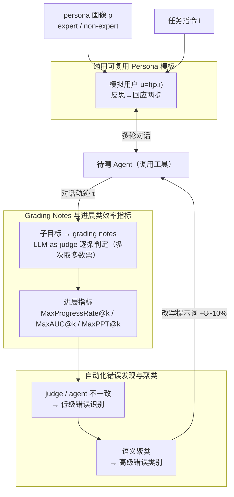

# Talk, Evaluate, Diagnose: User-aware Agent Evaluation with Automated Error Analysis

**会议**: ICLR 2026  
**arXiv**: [2603.15483](https://arxiv.org/abs/2603.15483)  
**代码**: [GitHub](https://github.com/SAP-samples/agent-quality-inspect)  
**领域**: LLM评测  
**关键词**: Agent评估, 用户感知, LLM-as-judge, 错误分析, 效率指标  

## 一句话总结

提出TED(Talk, Evaluate, Diagnose)框架，通过通用可复用的expert/non-expert persona模板实现用户感知的动态Agent评估、grading notes+LLM-as-judge+MaxProgressRate@k等新指标进行细粒度效率评估、自动化错误发现和聚类提供可操作的改进反馈，在τ²-bench和ToolSandbox上揭示新的Agent性能洞察。

## 研究背景与动机

- **领域现状**：LLM Agent日益用于自动化各种工作流，但评估框架碎片化——每个领域用独立方法（数据库查询、正则匹配等）判定成功。
- **现有痛点**：(1) 缺乏跨领域统一评估方法；(2) 不系统考虑用户角色对Agent表现的影响；(3) 评估止步于metrics报告，缺乏诊断和可操作的改进建议。
- **核心矛盾**：Agent行为受用户交互影响巨大 vs 评估时用户角色不被控制。
- **本文目标**：构建统一的、用户感知的、可诊断的Agent评估框架。
- **切入角度**：Talk(用户模拟)+Evaluate(评估)+Diagnose(诊断)三阶段统一。
- **核心 idea**：有效的Agent评估不仅需要正确性，还需要对话质量、效率和系统性的错误诊断。

## 方法详解

### 整体框架

TED 把 Agent 评估拆成 Talk、Evaluate、Diagnose 三个串起来的阶段，整体在做一件事：在受控的用户条件下让 Agent 跑完多轮对话，再把"做到几成"和"错在哪"都量化出来。先用一套与任务解耦的 persona 模板模拟 expert / non-expert 用户去和 Agent 多轮对话，产出对话轨迹；再把任务的各个子目标统一改写成自然语言 grading notes 交给 LLM-as-judge 逐条判定，并据此算出一组刻画"部分进展 + 对话效率"的指标；最后从 judge 与 Agent 的不一致里自动提取出具体错误、语义聚类成少数高级错误类别，把这些类别反写进 Agent 提示词，形成"评分→诊断→改进"的闭环。整个框架不依赖任何领域专用的成功判定逻辑（数据库查询、正则匹配等），因此换基准只需把子目标重写成 grading notes 即可复用。

### 关键设计

**1. 通用可复用 Persona 模板：把"谁在用"从"用来干什么"里拆出来**

以往的用户模拟把 persona 和具体任务指令焊死在一个 prompt 里，导致换一个任务就要重写一遍用户，更糟的是无法判断"Agent 表现差"到底是任务难还是用户难缠。TED 把模拟用户写成 $u = f(p, i)$ 的组合形式：persona prompt $p$ 只描述用户画像（是熟悉系统的 expert 还是会含糊提问、提供信息不全的 non-expert），task instruction $i$ 只描述这一轮要办的事，两者正交。于是同一个任务固定 $i$、只切换 $p$，就能干净地隔离出"用户专业度"这一个变量对 Agent 的独立影响。模拟用户每轮采用"先反思再回应"两步：先根据对话历史判断自己的目标是否已被满足、Agent 上一步是否答到点上，再据此生成回复，避免一问一答式的机械配合而更接近真实用户的迟疑和追问。

**2. Grading Notes 与进展类效率指标：把成败的 0/1 拆成可量化的部分进展**

τ²-bench 这类基准只看最终 success rate，把"做完九成卡在最后一步"和"一开始就跑偏"判成同样的失败，信息损失严重。TED 先把一个任务的全部子目标——某次工具调用、某段必须包含的回复内容等——统一改写成自然语言的检查项 grading notes，让 LLM-as-judge 逐条判定是否达成。在此基础上定义单次对话的进展 $\text{progress}(i)$ 为已达成 grading notes 的占比，再用 $k$ 次独立试验的最高进展期望构成 $\text{MaxProgressRate@}k$，刻画"Agent 在 $k$ 次里最好能做到几成"。配套的 $\text{MaxAUC@}k$ 按对话轮次对进展曲线积分，衡量是否在早期轮次就快速逼近目标；$\text{MaxPPT@}k$（per-turn progress）衡量平均每轮带来多少进展。这样既能区分"几乎成功"与"完全失败"，又把对话效率（用了多少轮）一并纳入评估。

**3. 自动化错误发现与聚类：让评估止于诊断而非分数**

光报告指标说明不了 Agent 究竟错在哪、该怎么改。TED 做两步错误分析：第一步针对 judge 判为未达成、或多次运行结果不一致的子目标，让 LLM 读对话上下文提取一条具体的低级（low-level）错误描述，例如"调用了正确工具但漏传必填参数"；第二步把所有低级错误送去做语义聚类，归并成少数几个高级错误类别，得到可操作的改进清单。同时框架分别统计 judge 方差与 agent 方差：judge 方差大的子目标往往对应描述模糊的 grading notes，提示评测项本身需要改写；agent 方差大则反映 Agent 自身行为不稳定。把聚类出的高频错误反写进 Agent 的提示词后，实测带来约 8–10% 的 MaxProgressRate 提升，验证了闭环的有效性。

### 损失函数 / 训练策略

TED 不涉及任何模型训练，是纯推理期的评估框架。为抑制单次评判的随机性，LLM-as-judge 对每个 grading note 多次运行后取 majority vote；实验中统一以 gpt-4.1 同时充当 judge 与 user proxy，保证跨 Agent 对比时评判侧条件一致。

## 实验关键数据

### 主实验

**τ²-bench Airline Easy（Expert | Non-expert）**

| Agent模型 | MeanProg@k | MaxProg@k | pass@k |
|-----------|-----------|-----------|--------|
| gpt-4.1 | 0.95 \| 0.82 | 1.00 \| 1.00 | 1.00 \| 1.00 |
| gpt-4o | 0.79 \| 0.86 | 1.00 \| 1.00 | 1.00 \| 1.00 |
| gpt-4o-mini | 0.70 \| 0.61 | 0.90 \| 0.90 | 0.80 \| 0.80 |
| gpt-5 | 0.92 \| 0.92 | 1.00 \| 1.00 | 1.00 \| 1.00 |

### 消融实验

| 发现 | 说明 |
|------|------|
| Expert vs Non-expert | Non-expert用户系统性降低Agent的MeanProg(多数模型) |
| 错误修复后性能提升 | 8-10%的MaxProgressRate提升 |
| Judge方差分析 | 高方差子目标多为模糊描述的grading notes |

### 关键发现

1. 用户专业度系统性地影响Agent性能——Non-expert用户导致更多轮次和更低平均进展。
2. MaxProgressRate@k比pass@k提供更细粒度的评估，区分"几乎成功"和"完全失败"。
3. 自动错误分析发现的常见错误模式可直接用于改进Agent提示词，带来8-10%提升。
4. gpt-5在某些baseline上反而不如gpt-4o(ToolSandbox)，说明模型升级不等于Agent能力提升。

## 亮点与洞察

1. Talk-Evaluate-Diagnose三阶段闭环设计完整且实用。
2. Persona解耦的idea简洁但影响深远——隔离用户因素是公平评估的前提。
3. 从评估到诊断到改进的完整闭环，不止于"报告分数"。

## 局限与展望

1. Grading notes的构建仍需人工，自动化程度有限。
2. 仅两种persona(expert/non-expert)，更细粒度的用户建模未探索。
3. Judge本身的可靠性是系统性风险，需要更多验证。

## 相关工作与启发

- AgentBoard首次引入进度率但在环境交互设定中，TED扩展到多轮对话。
- τ²-bench有domain-specific persona但不通用，TED实现了通用化。
- 启发：Agent评估应成为工程闭环的一部分，而非独立的学术练习。

## 评分

| 维度 | 评分 |
|------|------|
| 创新性 | ★★★★☆ |
| 实用性 | ★★★★★ |
| 实验充分性 | ★★★★☆ |
| 写作清晰度 | ★★★★★ |

<!-- RELATED:START -->

## 相关论文

- [\[ACL 2026\] AJ-Bench: Benchmarking Agent-as-a-Judge for Environment-Aware Evaluation](../../ACL2026/llm_evaluation/aj-bench_benchmarking_agent-as-a-judge_for_environment-aware_evaluation.md)
- [\[ICLR 2026\] BiasScope: Towards Automated Detection of Bias in LLM-as-a-Judge Evaluation](biasscope_towards_automated_detection_of_bias_in_llm-as-a-judge_evaluation.md)
- [\[ACL 2026\] AgentEval: DAG-Structured Step-Level Evaluation for Agentic Workflows with Error Propagation Tracking](../../ACL2026/llm_evaluation/agenteval_dag-structured_step-level_evaluation_for_agentic_workflows_with_error_.md)
- [\[ICLR 2026\] Unpacking Human Preference for LLMs: Demographically Aware Evaluation with the HUMAINE Framework](unpacking_human_preference_for_llms_demographically_aware_evaluation_of_long-fo.md)
- [\[ACL 2026\] VC-Inspector: Advancing Reference-free Evaluation of Video Captions with Factual Analysis](../../ACL2026/llm_evaluation/vc-inspector_advancing_reference-free_evaluation_of_video_captions_with_factual_.md)

<!-- RELATED:END -->
