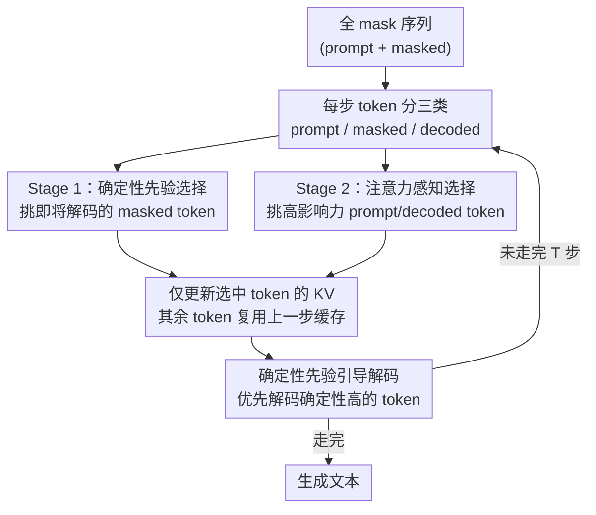

# d²Cache: Accelerating Diffusion-Based LLMs via Dual Adaptive Caching

**会议**: ICLR 2026  
**arXiv**: [2509.23094](https://arxiv.org/abs/2509.23094)  
**代码**: [https://github.com/Kamichanw/d2Cache](https://github.com/Kamichanw/d2Cache)  
**领域**: LLM/NLP  
**关键词**: Diffusion LLM, KV Cache, 推理加速, dLLM, 注意力剪枝

## 一句话总结
提出 d²Cache，一种面向 Diffusion-based LLM（dLLM）的无训练近似 KV 缓存框架，通过确定性先验引导的 masked token 选择 + 注意力感知的非 mask token 选择两阶段策略，实现 4.1× 推理加速同时提升生成质量。

## 研究背景与动机

**领域现状**：基于扩散的 LLM（dLLM，如 LLaDA、Dream）通过迭代去噪生成文本，使用双向注意力，在推理和指令遵循任务上与自回归模型（ARM）竞争。

**现有痛点**：dLLM 使用双向注意力，每步更新任何一个 masked token 都会改变所有 token 的上下文，导致**标准 KV cache 完全不可用**——每步都需重算整个序列的 KV 状态。现有近似 KV cache 方法（dLLM-Cache、Fast-dLLM）是粗粒度的，将序列分为静态/动态两段，用固定更新窗口，灵活性不足或调参复杂。

**核心矛盾**：dLLM 的双向注意力机制带来了上下文建模优势，但也牺牲了 ARM 的天然 KV cache 加速能力。如何在不破坏生成质量的前提下恢复缓存加速？

**本文目标** 设计细粒度的、自适应的 KV cache 策略，精确识别每步真正需要更新 KV 的 token。

**切入角度**：精细分析发现 masked token 的 KV 状态经历三个阶段（缓变→剧变→稳定），只需在剧变阶段更新；prompt/decoded token 的注意力高度集中，只需更新高注意力 token。

**核心 idea**：双阶段细粒度 token 选择——Stage 1 按确定性先验选 masked token，Stage 2 按注意力分数选剩余 token——每步只更新少量关键 token 的 KV，其余缓存复用。

## 方法详解

### 整体框架
dLLM 从全 mask 序列出发，经 $T$ 步迭代去噪生成文本，双向注意力让每步都得重算整段 KV、标准缓存彻底失效。d²Cache 的思路是：先看清 masked token 的 KV 到底什么时候才真正变化（三阶段分析），再据此在**每一步**只挑出少量真正需要更新 KV 的 token。具体地，每步把 token 分为三类（prompt / masked / decoded），用两条互补的选择通道筛选——Stage 1 用确定性先验从 masked token 里挑"即将被解码"的那批，Stage 2 用注意力分数从 prompt/decoded token 里挑"高影响力"的那批；被选中的 token 重算 KV，其余全部复用上一步缓存，每步计算量因此大幅压缩。更巧的是，Stage 1 用来选 KV 的那套确定性先验还能顺手决定下一个该解码哪个 token，让生成呈现准从左到右的顺序，既省时间又提升质量。

> KV 三阶段分析（缓变→剧变→稳定）是支撑整套策略的底层观察，它解释了"为什么只更新少量 token 就够"，因此不单列为流程节点，而是 Stage 1 选择逻辑的依据。

### 关键设计

**1. KV 状态三阶段分析：先看清 masked token 的 KV 到底什么时候才变**

要做细粒度缓存，前提是知道哪些 token 的 KV 真的在变。作者用 PCA 把 masked token 的 KV 轨迹画出来，发现它并不是一路平滑漂移，而是经历三个明显不同的相位：一是**早期缓变**，当一个 masked token 离当前被解码的位置还很远时，它的 KV 状态几乎不动；二是**临近剧变**，当它即将被解码时，KV 在一两步内急剧变化；三是**解码后稳定**，一旦被解码确定下来，它的 KV 又几乎冻结不变。这个观察直接决定了整套策略的逻辑——只有处在剧变相位的 token 才必须重算 KV，处在缓变和稳定相位的 token 可以放心复用上一步缓存，于是问题就归结为"每步如何精准圈出正处于剧变相位的那一小撮 token"。

**2. Stage 1（确定性先验引导选择）：在 masked token 里挑出即将被解码的那批**

针对剧变相位往往集中在"即将被解码"的 masked token 上这一点，Stage 1 要从所有 masked token 中选出最可能马上被解码的子集来更新 KV。作者定义了一个位置感知的确定性密度

$$D(i) = \sum_{j \notin M} \exp\!\left(-|i-j|^2 / 2\sigma^2\right)$$

它用高斯核衡量第 $i$ 个 masked token 周围已知（非 mask）token 的密集程度：周围已确定的邻居越多，$D(i)$ 越大。之所以用它当"即将被解码"的指标，是因为 dLLM 实践中倾向于从已解码位置附近继续往外解码，密度高意味着这个位置很快会轮到。最终的选择分数把这个空间先验和模型自身的预测置信度相乘，取 $D(i) \cdot s^i$ 最大的 top-$k$ 个 masked token 更新 KV。支撑这一设计的实证是：约 90% 的 token 在距上一个解码位置 10 步以内就被解码，说明确定性密度确实是个可靠的"即将被解码"预测器。

**3. Stage 2（注意力感知选择）：在 prompt 和已解码 token 里只更新真正重要的那些**

masked token 之外，prompt 和已解码（decoded）token 的 KV 也并非每步都要重算。Stage 2 借鉴 ARM 上"注意力高度集中于少数 salient token"的现象——作者验证 dLLM 的双向注意力同样如此——只挑高注意力的 token 更新。具体用 Attention Rollout 递归聚合各层注意力矩阵

$$C^{(l)} = W^{(l)} \cdot C^{(l-1)}$$

得到每个 token 的全局影响力分数 $c_j = \sum_i C_{ij}^{(N)}$，再按影响力从大到小排序，选出累积概率刚好超过阈值 $p$ 的最小 token 集合。这样低注意力 token 的 KV 即便不更新，对最终输出的影响也微乎其微，进一步压缩了每步的计算量。

**4. 确定性先验引导的解码：把缓存用的先验顺手变成更好的解码顺序**

Stage 1 里那个确定性密度本是为选 KV 而生，作者发现它还能直接拿来决定解码顺序——这是个几乎零成本的副产品。不再单纯按预测置信度挑下一个要解码的 token，而是优先解码确定性高（靠近已解码区域）的 token，使生成过程呈现准从左到右、更有结构的顺序。这恰好缓解了 dLLM 一个老毛病：序列末尾的 token 容易过早地过度自信。也正因如此，这个解码策略不只省时间，还反过来提升了生成质量。

### 损失函数 / 训练策略
d²Cache 是**完全无训练**的推理加速框架，不修改模型参数。所有优化在推理时在线完成。

## 实验关键数据

### 主实验

**LLaDA-8B-Instruct (GSM8K, 4-shot)**:

| 方法 | 吞吐量 | 延迟 | 准确率 |
|------|--------|------|--------|
| Vanilla | 2.77 (1.0×) | 110.26s | 77.6 |
| dLLM-Cache | 8.29 (3.0×) | 30.34s | 76.8 |
| Fast-dLLM | 9.64 (3.5×) | 26.15s | 77.0 |
| **d²Cache** | **11.39 (4.1×)** | **22.41s** | **79.2** |

加速 4.1× 的同时准确率反而提升 1.6%！

### 消融实验

| 配置 | 加速比 | 质量 | 说明 |
|------|--------|------|------|
| Full d²Cache | 4.1× | ↑ | 两阶段完整 |
| 仅 Stage 1 | ~3× | ↑ | 缺少 prompt/decoded token 选择 |
| 仅 Stage 2 | ~2.5× | ≈ | 缺少 masked token 的高效选择 |
| 确定性先验解码 | - | ↑↑ | 使用确定性先验替代置信度解码，质量提升更大 |

### 关键发现
- d²Cache 在两个 dLLM（LLaDA、Dream）上一致有效，且**同时提升速度和质量**——这在加速方法中非常罕见
- 确定性先验解码比默认置信度解码生成质量更高，因为它实现了准从左到右的、更结构化的生成顺序
- 90% token 在距前一个解码位置 10 步内被解码的发现，揭示了 dLLM 虽然理论上支持任意顺序解码，但实践中呈现强局部性
- 注意力在 prompt 和已解码 token 上高度集中的发现可直接迁移到其他 dLLM 加速研究

## 亮点与洞察
- **加速+质量双赢**：通过确定性先验引导解码顺序，不仅加速推理，还缓解了 dLLM 的过早过度自信问题，使得生成质量提升。"好的缓存策略 = 好的解码策略"是一个深刻洞见。
- **精细粒度分析价值**：三阶段 KV 动态分析为整个 dLLM 推理优化领域提供了基础性认知，后续工作可基于此设计更多优化策略。
- **无训练即插即用**：不需要重新训练模型，直接在推理时应用。适配新的 dLLM 只需运行 Attention Rollout 分析。

## 局限与展望
- Attention Rollout 本身有 $O(NL^2)$ 计算开销，虽然比全量前向传播便宜但不可忽略
- 确定性先验的高斯核宽度 $\sigma$ 和阈值 $p$ 是超参数，不同任务可能需要调整
- 仅在 LLaDA 和 Dream 上验证，dLLM 生态仍在早期，方法是否对未来更大的 dLLM 有效尚需验证
- 未探索与量化/稀疏等其他推理加速技术的组合

## 相关工作与启发
- **vs dLLM-Cache**: 粗粒度的 prompt/response 分段策略 + 固定频率更新，d²Cache 的细粒度 token 级自适应策略更灵活高效
- **vs Fast-dLLM**: 块级半自回归解码 + 缓存整块 KV，灵活性不如 d²Cache 的 per-token 策略
- **vs ARM KV Cache 剪枝**: d²Cache 将 ARM 中的注意力集中性观察成功推广到 dLLM 的双向注意力场景

## 评分
- 新颖性: ⭐⭐⭐⭐ dLLM KV cache 方向还很新，细粒度分析和双阶段策略设计扎实
- 实验充分度: ⭐⭐⭐⭐ 两个 dLLM + 多数据集 + 消融，但缺少更大规模验证
- 写作质量: ⭐⭐⭐⭐⭐ 分析驱动的方法设计逻辑清晰，可视化优秀
- 价值: ⭐⭐⭐⭐ dLLM 推理加速是当前热点，4.1× 加速+质量提升很有实用价值

<!-- RELATED:START -->

## 相关论文

- [\[ICML 2026\] SPA-Cache: Singular Proxies for Adaptive Caching in Diffusion Language Models](../../ICML2026/llm_nlp/spa-cache_singular_proxies_for_adaptive_caching_in_diffusion_language_models.md)
- [\[ICLR 2026\] Stopping Computation for Converged Tokens in Masked Diffusion-LM Decoding](stopping_computation_for_converged_tokens_in_masked_diffusion-lm_decoding.md)
- [\[ICLR 2026\] Toward Safer Diffusion Language Models: Discovery and Mitigation of Priming Vulnerabilities](toward_safer_diffusion_language_models_discovery_and_mitigation_of_priming_vulne.md)
- [\[ICLR 2026\] DreamOn: Diffusion Language Models For Code Infilling Beyond Fixed-size Canvas](dreamon_diffusion_language_models_for_code_infilling_beyond_fixed-size_canvas.md)
- [\[ICLR 2026\] WebDevJudge: Evaluating (M)LLMs as Critiques for Web Development Quality](webdevjudge_mllm_web_development.md)

<!-- RELATED:END -->
