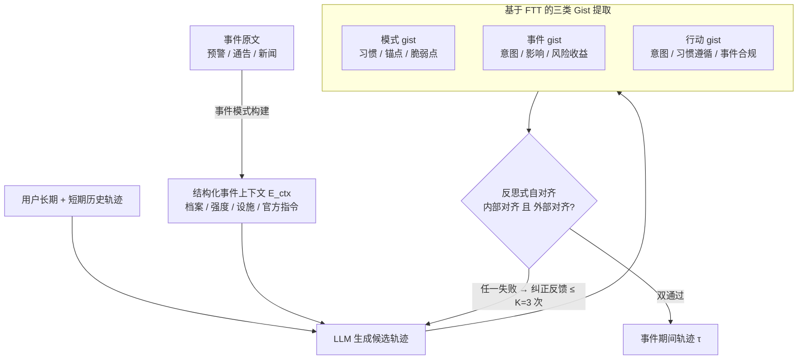

# ELLMob: Event-Driven Human Mobility Generation with Self-Aligned LLM Framework

**会议**: ICLR 2026  
**arXiv**: [2603.07946](https://arxiv.org/abs/2603.07946)  
**代码**: [GitHub](https://github.com/deepkashiwa20/ELLMob)  
**领域**: LLM/NLP  
**关键词**: 人类移动性生成, 事件驱动轨迹, LLM自对齐, 模糊痕迹理论, 认知决策  

## 一句话总结

提出 ELLMob 框架，基于认知心理学的模糊痕迹理论（FTT），通过提取并迭代对齐"习惯 gist"和"事件 gist"来调和用户日常模式与社会事件约束之间的竞争，实现事件驱动的可解释轨迹生成。

## 研究背景与动机

人类移动性生成旨在合成合理的时空轨迹数据，广泛应用于城市规划、交通管理和公共卫生。LLM 在常规轨迹生成方面取得了成功，但面临两个关键问题：

1. **数据稀缺导致评估偏差**：现有方法主要在非事件日（稳定期）数据上开发和评估，在突发社会事件（自然灾害、公共卫生紧急事件）下的可靠性存疑
2. **缺乏竞争决策调和机制**：事件期间的真实移动性兼具习惯规律性和冲击诱导的偏离——用户仍会保留关键锚点（如工作地点）的日常活动，但会调整其他行为。现有方法要么默认跟随习惯模式，要么被事件约束主导

具体表现：
- 台风期间：远离海岸地区、取消非必要通勤
- COVID-19 期间：自我约束活动范围
- 奥运期间：受限区域和交通拥堵

## 方法详解

### 整体框架

ELLMob 把事件驱动轨迹生成形式化为映射 $F: (D_{\text{long-term}}^{(u)}, D_{\text{short-term}}^{(u)}, E_{ctx}) \mapsto \tau$，输入用户事件前的长期历史轨迹 $D_{\text{long-term}}^{(u)}$、近期短期轨迹 $D_{\text{short-term}}^{(u)}$ 和结构化事件上下文 $E_{ctx}$，输出事件期间的轨迹 $\tau$。核心难点是：事件期间的真实移动既保留习惯（仍回家、仍上班），又被事件改写（避开危险区、取消非必要出行），现有方法只会偏向其中一方。ELLMob 的思路是先把杂乱的事件原文结构化成可推理的约束，再借认知心理学的"gist（要旨）"把"习惯"和"事件"两股力量各自语言化、摆到台面上，最后用一个反思-纠正回环逼着模型同时满足两边。具体由三个模块串联：先做**事件模式构建**把自由文本事件压成四维结构化上下文；再让 LLM 一边生成候选轨迹、一边抽取**三类 Gist**（习惯侧、事件侧、当前决策侧）；最后**反思式自对齐**沿内部/外部两个维度审计候选，不达标就把失败原因喂回去重生成，循环至多 $K=3$ 次。

### 关键设计

**1. 事件模式构建：把自由文本事件压成 LLM 可推理的结构化约束**

台风预警、防疫通告这类原始事件描述是冗长的非结构化文本，LLM 在生成轨迹时容易漏掉其中真正影响移动的关键信息。事件模式构建这一步先用 LLM 把事件叙述拆解到四个固定维度——事件档案（类型、名称、发生时间、影响区域，提供时空对齐的锚点）、强度与规模（风速、降水量等量化指标，用来评估出行风险）、基础设施影响（交通与公共场所运营状态，界定移动的物理约束）、官方指令（政府命令及其适用人群与地理范围，约束轨迹要遵守政策）。这样每个事件都被映射到同一套字段、变成结构化的事件上下文 $E_{ctx}$，后续推理可以直接引用"哪条铁路停运""哪个区域被封锁"这类离散事实，而不必反复解析原始长文，既降低了幻觉风险也让约束可追溯。

**2. 基于模糊痕迹理论（FTT）的三类 Gist：用语言化的"要点"把习惯与事件的竞争摊到台面上**

模糊痕迹理论认为人在不确定下做决策依赖的是对信息提炼后的"gist"（底线要旨，如"台风风险很高"而非"命中概率 15%"）而非逐字细节，而关键是 gist 可以用自然语言表达——这正是把 FTT 嫁接到 LLM 上、让决策依据变得透明的切入点。ELLMob 据此把两股竞争力量和当前决策各自抽成一层 gist：**模式 gist** 从历史轨迹归纳用户的核心行为（每日通勤至办公室）、惯性锚点（夜间必回的家）和脆弱点（依赖单一可能停运的铁路线）；**事件 gist** 从事件上下文提炼首要意图（户外高风险、强留家激励）、行为影响（从沿海撤离寻找室内庇护）和风险-收益评估（受伤风险超过非必要外出收益）；**行动 gist** 则从候选轨迹本身反抽出它的首要意图、习惯遵循度（低：偏离通常通勤）和事件合规度（高：短途且避开危险区）。三类 gist 被映射进同一套"底线属性"空间，让习惯诉求与事件约束变得可比、可对齐，模型不再默认偏向某一方，决策依据也从此可被审计。

**3. 反思式自对齐：双维审计 + 纠正反馈把竞争决策迭代收敛到合理解**

单次解码出的候选轨迹常出现两类失败——要么完全跟随习惯而无视事件约束，要么被事件主导以致连工作锚点也被压制。ELLMob 用一个反思-精炼回环来纠偏，取代单次解码。第一阶段是对齐审计，沿两个二元维度检查候选并各给一个带理由的判断：内部对齐问"轨迹是否连贯地反映用户内在习惯模式与当前行为倾向"，外部对齐问"轨迹是否是对事件约束的合理合规响应"，只有两项同时通过候选才被接受。一旦某维度判否，进入第二阶段纠正精炼，把精确的失败原因（违反了哪条标准、为什么）作为反馈喂回轨迹生成器，引导它针对性地重生成。回环最多迭代 $K=3$ 次；极少数超时情况下走兜底策略——取缓冲区中最近一次通过校验的轨迹并显式报告未满足的约束，既避免死循环也保持透明。与通用自对齐主要纠正幻觉不同，这里的对齐专门服务于"习惯 vs 事件"的决策两难；消融显示它相对无对齐变体平均带来 69.5% 的性能提升，是框架收益的主要来源。

### 训练策略

ELLMob 不微调模型，主干直接用 GPT-4o-mini（2025-01-01-preview），生成时温度设为 0.1、Top-p 为 1 以保证决策稳定。轨迹按 10 分钟时间分辨率建模，空间网格参数取 $S=10$，自对齐最大迭代次数 $K=3$（基于参数研究确定）。

## 实验关键数据

### 主实验

**三大事件下的方法对比（JSD↓，越低越好）：**

| 模型 | 台风 SI | 台风 SD | 台风 CD | 台风 SGD |
|------|--------|--------|--------|---------|
| LSTM | 0.1336 | 0.1039 | 0.0555 | 0.1111 |
| DeepMove | 0.1697 | 0.0826 | 0.0266 | 0.0759 |
| LLM-MOB | 0.1214 | 0.0468 | 0.0285 | 0.0344 |
| LLM-Move | 0.1267 | 0.0392 | 0.0136 | 0.0303 |
| LLMOB | 0.0949 | 0.1195 | 0.0123 | 0.0256 |
| **ELLMob** | **0.0642** | **0.0200** | **0.0041** | **0.0173** |

| 模型 | COVID SI | COVID SD | COVID CD | COVID SGD |
|------|---------|---------|---------|----------|
| LLM-MOB | 0.1166 | 0.0532 | 0.0234 | 0.0353 |
| LLM-Move | 0.1408 | 0.0567 | 0.0127 | 0.0503 |
| LLMOB | 0.1013 | 0.1051 | 0.0186 | 0.0286 |
| **ELLMob** | **0.1003** | **0.0444** | **0.0080** | **0.0268** |

| 模型 | 奥运 SI | 奥运 SD | 奥运 CD | 奥运 SGD |
|------|--------|--------|--------|---------|
| LLMOB | 0.0973 | 0.0274 | 0.0110 | 0.0051 |
| LLM-Move | 0.1967 | 0.0298 | 0.0101 | 0.0057 |
| **ELLMob** | **0.0617** | **0.0061** | **0.0022** | **0.0035** |

**关键数字：** ELLMob 在台风场景 SI 指标比最强基线提升 32.3%，COVID-19 场景 SD 指标提升 16.5%，平均超越最强基线 46.9%。

### 消融实验

| 变体 | 台风 SI | 台风 SD | COVID SI | COVID SD |
|------|--------|--------|---------|---------|
| 完整 ELLMob | 0.0642 | 0.0200 | 0.1003 | 0.0444 |
| w/o I.A.&E.A. | 0.1304 | 0.1270 | 0.2331 | 0.1077 |
| w/o I.A.（仅外部对齐） | 0.0835 | 0.0720 | 0.1235 | 0.0950 |
| w/o E.A.（仅内部对齐） | 0.0680 | 0.0258 | 0.2237 | 0.0860 |
| w/o Eve. Ext. | 0.0736 | 0.0273 | 0.2037 | 0.0741 |

关键消融发现：
- 移除外部对齐在 COVID-19 场景下导致 SI 退化 132.4%——外部对齐对处理重大行为偏离至关重要
- 移除内部对齐导致模型过度纠正（如不合理地增加健康医疗相关出行）
- 认知自对齐平均提升非对齐变体 69.5% 的性能

### 关键发现

1. **LLM 方法整体优于深度学习方法**：尤其在空间一致性指标（SD、SGD）上，得益于事件上下文整合能力
2. **现有 LLM 基线在事件场景下严重失效**：要么默认跟随习惯模式（低估健康出行），要么过度响应事件约束（完全压制社交活动）
3. **灾害基本决策任务**：ELLMob 在台风期间活跃用户识别（二分类）中取得最高 F1-Score，召回率达 59.3%
4. **内部和外部对齐承担不同角色**：内部对齐提供基础合理性，外部对齐提供场景特定修正

## 亮点与洞察

1. **认知理论驱动的 AI 框架设计**：将模糊痕迹理论（FTT）引入 LLM 轨迹生成，不是简单的 prompt engineering 而是有认知科学基础的架构设计
2. **首个事件标注移动性数据集**：覆盖三类不同事件（自然灾害 / 公共卫生 / 大型体育赛事），填补了重要的数据空白
3. **竞争决策的显式调和**：将轨迹生成从"最大化统计似然"转变为"认知合理性"，通过 gist 对齐使决策过程可追溯
4. **实验覆盖面广**：12 个基线方法（6 个深度学习 + 4 个 LLM + 消融变体），4 个评估指标，4 个场景
5. **平均 46.9% 的提升幅度确实显著**，且在所有三个事件类型上均保持最优

## 局限性 / 可改进方向

1. **数据地域限制**：仅使用东京都市圈的 Twitter/Foursquare 签到数据，泛化性有待验证（虽然附录有大阪补充实验）
2. **LLM API 成本**：迭代对齐过程需要多次 API 调用，推理成本较高
3. **事件模式的手动设计**：四维度事件模式的定义依赖领域专知，自动化程度有限
4. **签到数据的稀疏性和偏差**：社交媒体签到不能完整反映真实移动性
5. **时间分辨率粗糙**：10 分钟分辨率可能无法捕捉精细的行为变化

## 相关工作与启发

- **LLM-MOB**（Wang et al., 2023）、**LLM-Move**（Feng et al., 2024）、**LLMOB**（Wang et al., 2024）是主要的 LLM 基线
- **Fuzzy-Trace Theory**（Reyna & Brainerd, 1995）为框架提供了认知理论基础——gist 可以用语言表达这一特性使得将 FTT 与 LLM 结合成为可能
- **自对齐/自反思**：区别于纠正幻觉的通用自对齐，本文的自对齐专注于竞争决策的调和
- 启发：认知科学理论可以为 LLM 应用的架构设计提供原理性指导，而非仅依赖大规模 prompt engineering

## 评分

- **新颖性**: ⭐⭐⭐⭐⭐ — 首个事件驱动移动性生成框架，FTT-gist 对齐是独特的设计理念
- **技术深度**: ⭐⭐⭐⭐ — 认知理论与 LLM 的结合严谨，问题形式化清晰
- **实验充分度**: ⭐⭐⭐⭐ — 12 个基线、4 个场景、多维评估，消融全面
- **实用性**: ⭐⭐⭐⭐ — 对应急管理和城市规划有直接应用价值
- **写作质量**: ⭐⭐⭐⭐ — 框架图清晰，认知理论介绍到位

**总评**: ⭐⭐⭐⭐ (4.5/5) — 非常有创意的跨学科工作，将认知心理学与 LLM 轨迹生成有机结合，问题定义新颖，实验表现出色，是 LLM-for-Science 方向的优秀代表。

<!-- RELATED:START -->

## 相关论文

- [\[AAAI 2026\] Whispering Agents: An Event-Driven Covert Communication Protocol for the Internet of Agents](../../AAAI2026/llm_nlp/whispering_agents_an_event-driven_covert_communication_protocol_for_the_internet.md)
- [\[ICLR 2026\] BOTS: A Unified Framework for Bayesian Online Task Selection in LLM Reinforcement Finetuning](bots_a_unified_framework_for_bayesian_online_task_selection_in_llm_reinforcement.md)
- [\[ICLR 2026\] Optimas: Optimizing Compound AI Systems with Globally Aligned Local Rewards](optimas_optimizing_compound_ai_systems_with_globally_aligned_local_rewards.md)
- [\[ACL 2025\] HyGenar: An LLM-Driven Hybrid Genetic Algorithm for Few-Shot Grammar Generation](../../ACL2025/llm_nlp/hygenar_an_llm-driven_hybrid_genetic_algorithm_for_few-shot_grammar_generation.md)
- [\[ICLR 2026\] GASP: Guided Asymmetric Self-Play For Coding LLMs](gasp_guided_asymmetric_self-play_for_coding_llms.md)

<!-- RELATED:END -->
