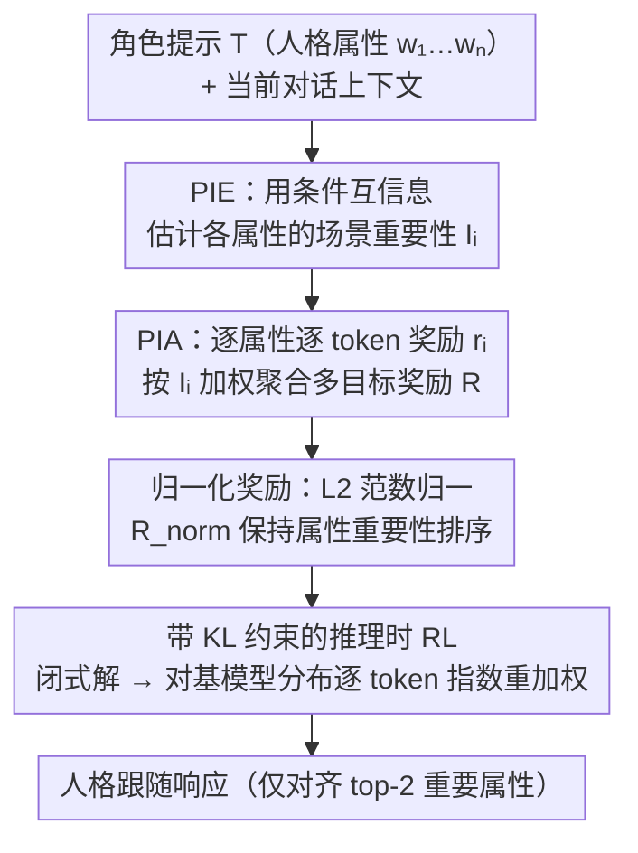

# Enhancing Persona Following at Decoding Time via Dynamic Importance-Guided Token Estimation for Role-Playing Agents

**会议**: ICLR 2026  
**arXiv**: [2603.01438](https://arxiv.org/abs/2603.01438)  
**代码**: 未公开  
**领域**: LLM/NLP  
**关键词**: 角色扮演智能体, 人格跟随, 推理时对齐, 条件互信息, 多目标奖励解码  

## 一句话总结

提出 Persona Dynamic Decoding (PDD) 框架，通过条件互信息动态估计人格属性的场景依赖重要性，并将重要性分数整合到多目标奖励引导解码中，实现无需微调的推理时人格跟随。

## 研究背景与动机

角色扮演语言智能体（RPLAs）在社会学研究中日益重要（如投票行为分析、谣言传播动力学），但现有方法面临两个核心限制：

1. **动态适应性不足**：心理学研究（如 CAPS 认知-情感人格系统理论）表明，人格对行为的影响是场景依赖的——不同情境下不同人格属性的影响力不同。但现有方法（提示工程/微调）对所有属性一视同仁，无法动态识别场景相关的人格属性
2. **数据依赖严重**：参数化方法（SFT/LoRA）需要大规模行为数据，而社会模拟中角色多样、人格复杂，数据收集极其昂贵

现有方法分类及局限：
- **非参数方法**（Direct Prompting、ICL、RAG）：依赖语义识别，无法深度理解人格属性
- **参数化方法**（SFT、LoRA）：需要大量计算资源和标注数据
- 两类方法都无法实现上下文感知的动态人格跟随

## 方法详解

### 整体框架

PDD（Persona Dynamic Decoding）把"人格跟随"拆成两件事、都放到推理时完成，全程不改一个参数，只靠模型自身的 log 概率差异工作。给定一段塞满人格属性的角色提示和当前对话上下文，框架先用 **PIE** 自监督地估计"在眼下这个场景里，每个人格属性到底有多重要"，得到一组重要性分数；再用 **PIA** 把这组分数变成加权的多目标奖励，逐 token 调制基模型的生成概率。但加权求和会被数值大的属性带偏，所以中间还插了一步**归一化奖励**来保住 PIE 估出的重要性排序，最后这套奖励被套进一个带 KL 约束的推理时 RL 目标里，得到对基模型分布逐 token 重加权的闭式解，生成人格跟随的响应。

### 关键设计

**1. PIE：用条件互信息量化属性的场景重要性**

角色提示里往往堆了一长串人格属性，但同一句对话真正起作用的只有少数几个，传统方法对所有属性一视同仁正是动态适应性不足的根源。PDD 的做法是衡量"去掉某个属性后模型还会不会这么说"——形式化为模型输出 $Y$ 关于属性 $w_i$ 的条件互信息 $I(Y; w_i \mid T_i) = H(Y\mid T_i) - H(Y\mid w_i, T_i)$，其中 $T_i = T \setminus \{w_i\}$ 是移除属性 $w_i$ 后的提示。由于真实输出分布不可得，PIE 直接用基模型自己生成的响应 $G = \pi_\theta(T)$ 作代理，把重要性近似为一对 log 似然之差 $I_i \triangleq \log \frac{\Pr(G \mid T)}{\Pr(G \mid T_i)}$。直觉很清晰：删掉某属性后若生成概率骤降，说明它对当前场景举足轻重；理论上只要模型生成 $G$ 与 ground-truth $GT$ 的概率正相关，$I^{\text{model}}$ 就是真实互信息 $I^{\text{true}}$ 的可靠代理。这一步完全 zero-shot，不需要任何标注的行为数据，绕开了参数化方法的数据依赖。

**2. PIA：把重要性分数注入多目标奖励解码**

拿到重要性后还需要让生成真正偏向重要属性。PIA 先为每个属性定义一个逐步奖励 $r_i(T, y_{<t}) = \sum_{t'=t-1}^{t} \log \frac{\pi_\theta(y_{t'} \mid T, y_{<t'})}{\pi_\theta(y_{t'} \mid T_i, y_{<t'})}$，本质是当前 token 在"有属性"与"无属性"两种条件下的对数概率比；再用重要性 $I_i$ 作权重聚合成多目标奖励 $R(T, y) = \sum_{i=1}^{n} I_i \cdot r_i(T, y)$。这样越重要的属性在解码时的话语权越大，实现了上下文感知而非一刀切的人格调制。实践中只对齐 top-2 最高重要性的属性，在保真度与计算开销间取平衡。

**3. 归一化奖励：保持属性的重要性排序**

单纯加权求和有个隐患——某个属性奖励 $r_i$ 数值偏大就能主导整体，破坏掉 PIE 辛苦估出的重要性层次。PDD 用奖励向量的 L2 范数归一化解决：$R_{\text{norm}} = \frac{\sum_{i=1}^{n} I_i \cdot r_i(T, y)}{\|\mathbf{r}\|_2}$。由 Cauchy-Schwarz 不等式有 $R_{\text{norm}} \leq \|\mathbf{I}\|_2$，且等号当且仅当 $\mathbf{r} \propto \mathbf{I}$ 时成立。于是最大化 $R_{\text{norm}}$ 不再奖励某个维度的绝对大小，而是激励奖励向量 $\mathbf{r}$ 的方向去对齐重要性向量 $\mathbf{I}$，从而让各属性的奖励排序与其场景重要性保持一致——这正是消融里被验证为"至关重要"的设计点。

### 损失函数 / 训练策略

PDD 不做任何训练，上述奖励是套进一个带 KL 约束的推理时 RL 目标里求解的：$\max_{p_r} \mathbb{E}_{p_r}\!\left[\frac{\sum_{i=1}^{n} I_i r_i(T, y)}{\|\mathbf{r}\|_2} - \beta D_{\text{KL}}(p_r \| \pi_\theta)\right]$，即在向归一化奖励靠拢的同时用 KL 项约束不偏离基模型 $\pi_\theta$ 太远。该目标有逐 token 闭式最优解 $p_r(y_t \mid T, y_{<t}) = \frac{1}{Z(T, y_{<t})} \pi_\theta(y_t \mid T, y_{<t}) \exp\!\left(\frac{1}{\beta} R_{\text{norm}}(T, y_{<t})\right)$，可直接理解为在基模型分布上乘一个由归一化奖励决定的指数重加权因子。整套计算只用到推理时的 log 概率，温度系数取 $\beta = 1.0$，配合 greedy 解码生成最终响应。

## 实验关键数据

### 主实验

**通用角色任务——GPT-4o 配对评估（Win%）：**

| PDD vs. | CharacterEval (Qwen) | CharacterEval (LLaMA) | BEYOND DIALOGUE (Qwen) | BEYOND DIALOGUE (LLaMA) |
|---------|---------------------|---------------------|----------------------|----------------------|
| SP | 51.2% win | 52.5% win | 63.9% win | 56.2% win |
| PP | 48.7% win | 39.1% win | 43.0% win | 46.8% win |
| ICL | 65.3% win | 63.1% win | 60.9% win | 64.2% win |
| OPAD | 52.8% win | 48.2% win | 49.0% win | 47.6% win |

**CharacterEval 自动评估（CharacterRM 指标）：**

| 模型 | 方法 | KE | KA | KH | PB | PU | Average |
|------|------|-----|-----|-----|-----|-----|---------|
| GPT-4o | PP | 2.58 | 3.02 | 2.99 | 2.83 | 2.91 | 2.87 |
| Qwen-7B | PDD | 2.25 | 2.93 | 2.99 | **3.08** | **3.01** | **2.85** |
| LLaMA-8B | PDD | 2.39 | 2.68 | **3.03** | 3.00 | 2.96 | **2.81** |

PDD 在小型开源模型上的表现与 GPT-4o 商业模型竞争。

**PERSONALITYBENCH 大五人格特质评估（Qwen2.5-7B）：**

| 人格特质 | SP | PP | ICL | OPAD | PAS | NPTI | **PDD** |
|---------|------|------|------|------|------|------|---------|
| Agreeableness | 4.81 | 4.90 | 4.81 | 4.53 | 4.83 | 4.73 | **4.92** |
| Conscientiousness | 4.47 | 4.98 | 4.19 | 4.66 | 4.61 | 4.74 | **4.97** |
| Extroversion | 4.68 | 4.59 | 4.32 | 4.26 | 4.65 | 4.71 | **4.66** |
| Neuroticism | 3.02 | 3.45 | 3.12 | 3.79 | 3.74 | 3.39 | **3.54** |
| Openness | 4.56 | 4.75 | 4.67 | 4.44 | 4.61 | 4.83 | 4.75 |
| **Average** | 4.31 | 4.53 | 4.22 | 4.34 | 4.49 | 4.48 | **4.57±0.22** |

PDD 在 Average 上最高且方差最低（0.22 vs 其他方法 0.32-0.53），表明鲁棒性更强。

### 消融实验

**PIE 重要性估计的可靠性验证：**

通过 5 个维度（Context Relevance、Attribute Utility、Context Coverage、Attribute Independence、Ranking Consistency）进行评估，使用 3 个 LLM 裁判（DeepSeek-R1、GPT-4o、GPT-5）和人类专家评分：
- 所有维度上 PDD 获得一致的强分数（Likert 1-5 量表）
- 跨不同 base 模型（Qwen/LLaMA）重要性分布一致应用，确认跨模型稳定性

**场景感知可视化案例：**
- 场景 1（郭芙蓉与吕秀才讨论武术）：高权重 → 性格特征、独特技能
- 场景 2（郭芙蓉指导佟湘玉）：高权重 → 人生观、教育观点
- 证实了 PIE 能根据上下文动态调整属性权重

### 关键发现

1. **推理时对齐有效**：PDD 无需微调即在多个基准上超越或匹配需要训练的方法（NPTI、PAS）
2. **小模型竞争力强**：7-8B 参数的开源模型通过 PDD 可达到 GPT-4o 级别的角色扮演能力
3. **多目标归一化奖励的设计至关重要**：Cauchy-Schwarz 激励的排序保持确保了人格属性的层次结构
4. **Top-2 属性对齐是效率-效果的最佳平衡点**：更多属性增加计算但边际收益递减
5. **p-value < 0.05** 的统计显著性在大五人格各维度上均满足

## 亮点与洞察

1. **理论驱动的设计**：从 CAPS 心理学理论到 CMI 信息论量化再到 Cauchy-Schwarz 归一化，每一步都有理论依据
2. **zero-shot 人格重要性估计**：不需要 ground-truth 监督，仅利用模型自身的 log 概率差异即可量化属性重要性——这是最优雅的设计点
3. **多目标对齐的归一化技巧**：通过除以 $\|\mathbf{r}\|_2$ 确保奖励向量的方向与重要性向量对齐，而非简单加权
4. **实验设计全面**：中英文角色扮演 + 大五人格 + 人类评估 + LLM-as-Judge + RewardModel
5. **训练无关**：完全在推理时进行，可迁移到任何角色，无需为每个角色准备数据

## 局限性 / 可改进方向

1. **推理开销较大**：每个 token 需要对每个属性计算有/无条件概率（n+1 次前向传播），实际应用中 latency 可能成为瓶颈
2. **仅对齐 top-2 属性**是工程妥协，复杂角色可能需要更多属性同时对齐
3. **CMI 近似的理论假设**：正相关假设在所有场景下不一定成立
4. **评估局限**：LLM-as-Judge 自身可能对不同人格表达有偏好
5. **未探索长对话中人格一致性的维持**：实验多为单轮或短对话场景

## 相关工作与启发

- **CAPS 理论**（Sherman et al., 2015）：认知-情感人格系统为动态人格建模提供心理学基础
- **OPAD**（Zhu et al., 2025a）：单目标推理时偏好对齐，PDD 扩展为多目标
- **NPTI**（Deng et al., 2025）：神经元级人格特质诱导，需要训练探针
- **CharacterEval**（Tu et al., 2024）：中文角色扮演评估基准
- 启发：条件互信息可以作为通用的属性重要性度量，扩展到其他需要动态属性权重的场景（如风格化写作、多约束生成）

## 评分

- **新颖性**: ⭐⭐⭐⭐ — CMI 重要性估计 + 归一化多目标奖励的组合是原创性贡献
- **技术深度**: ⭐⭐⭐⭐⭐ — 从理论推导到实现细节都很扎实，信息论和优化理论运用得当
- **实验充分度**: ⭐⭐⭐⭐ — 三个数据集 + 多基线 + 人类+自动评估 + 消融
- **实用性**: ⭐⭐⭐⭐ — 无需训练的推理时方案对实际部署非常友好
- **写作质量**: ⭐⭐⭐⭐ — 数学推导清晰，框架图信息量大

**总评**: ⭐⭐⭐⭐ (4/5) — 理论严谨、设计优雅的推理时人格对齐框架，CMI 重要性估计和归一化多目标奖励是亮点，在多个基准上展现了无训练方法的竞争力。

<!-- RELATED:START -->

## 相关论文

- [\[ACL 2026\] PersonaArena: Dynamic Simulation for Evaluating and Enhancing Persona-Level Role-Playing in Large Language Models](../../ACL2026/llm_nlp/personaarena_dynamic_simulation_for_evaluating_and_enhancing_persona-level_role-.md)
- [\[ACL 2025\] Nudging: Inference-time Alignment of LLMs via Guided Decoding](../../ACL2025/llm_nlp/nudging_inference_time_alignment.md)
- [\[ICLR 2026\] Stopping Computation for Converged Tokens in Masked Diffusion-LM Decoding](stopping_computation_for_converged_tokens_in_masked_diffusion-lm_decoding.md)
- [\[ICLR 2026\] GASP: Guided Asymmetric Self-Play For Coding LLMs](gasp_guided_asymmetric_self-play_for_coding_llms.md)
- [\[ICLR 2026\] First is Not Really Better Than Last: Evaluating Layer Choice and Aggregation Strategies in Language Model Data Influence Estimation](first_is_not_really_better_than_last_evaluating_layer_choice_and_aggregation_str.md)

<!-- RELATED:END -->
