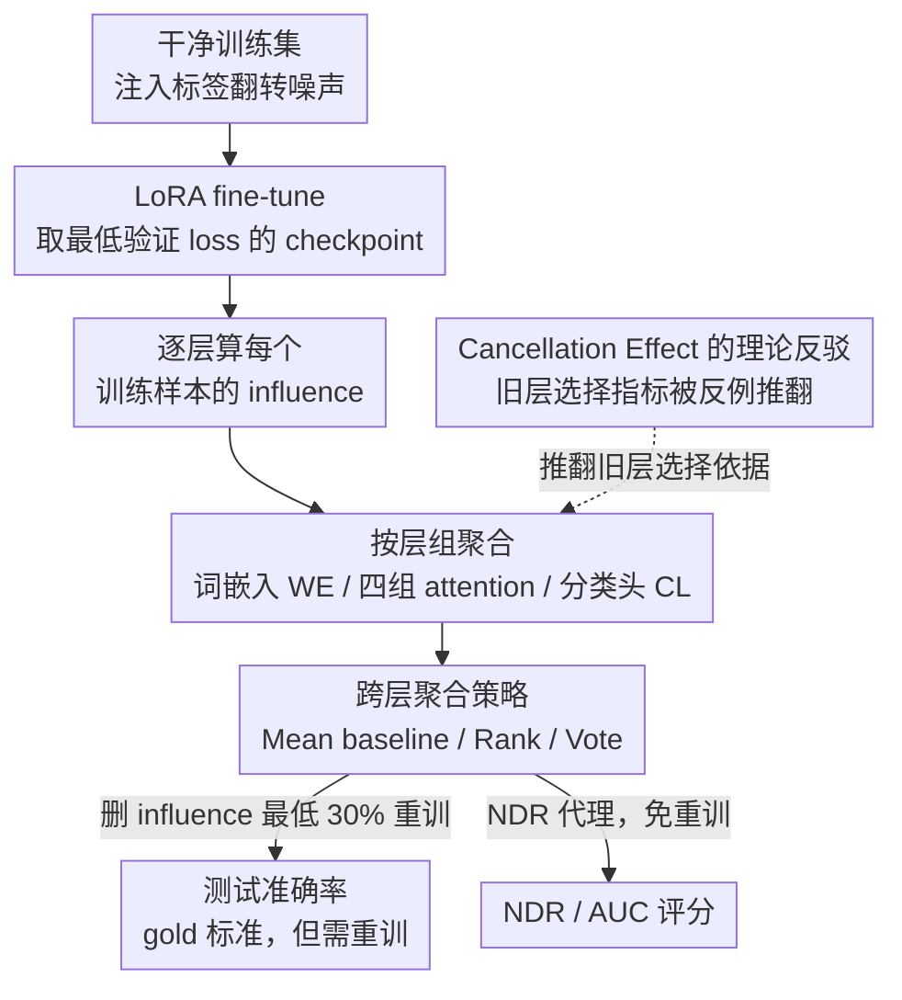

# First is Not Really Better Than Last: Evaluating Layer Choice and Aggregation Strategies in Language Model Data Influence Estimation

**会议**: ICLR 2026  
**arXiv**: [2511.04715](https://arxiv.org/abs/2511.04715)  
**代码**: 有  
**领域**: LLM/NLP (其他)  
**关键词**: Influence Functions, Data Attribution, Layer Analysis, LLM Interpretability, Training Data Quality

## 一句话总结
通过理论和实验证明先前工作所推崇的"第一层（embedding）最适合做 influence estimation"的结论是不可靠的，发现中间 attention 层才是更好的估计层，并提出 Rank 和 Vote 两种新的跨层聚合策略以及 Noise Detection Rate (NDR) proxy 指标，显著改善了 LLM 中有害训练样本的检测效果。

## 研究背景与动机

**领域现状**：Influence function 是评估训练数据对模型决策影响的重要工具（TracIn、DataInf、Cosine 等）。由于现代 LLM 参数量巨大，通常只在部分层上计算 influence 以保证可行性。

**现有痛点**：Yeh et al. (2022) 基于"cancellation effect"假设得出结论认为第一层（word embedding）最适合做 influence estimation。然而这一结论只在小规模模型（RoBERTa）和单一方法（TracIn）上验证过，且 cancellation effect 本身的可靠性从未被严格检验。

**核心矛盾**：cancellation effect 指标 $C(W)$ 通过参数子集的 norm 聚合来衡量梯度抵消，但这种聚合会掩盖个别参数上的极端抵消，导致指标无法可靠预测层的实际 influence 性能。同时，标准的均值聚合策略也可能因对冲效应而降低判别能力。

**本文目标** (RQ1) cancellation effect 是否可靠；(RQ2) 哪些层最适合 influence estimation；(RQ3) 如何更好地跨层聚合 influence 分数；(RQ4) 是否存在不需要重训练就能评估 influence 方法效果的 proxy 指标。

**切入角度**：从理论证明 cancellation effect 的反例出发，然后在多模型多数据集上做大规模实验，系统评估层选择和聚合策略。

**核心 idea**：中间 attention 层比 embedding 层更适合影响力估计，Vote 聚合比均值聚合显著更好，NDR 可作为无需重训练的可靠 proxy 指标。

## 方法详解

### 整体框架

这篇论文不提新的 influence 算法，而是搭一套受控实验来回答"该用哪一层、该怎么聚合"。整条流水线围绕一个可验证的信号展开：先往训练集里注入已知的合成噪声（标签翻转），那么一个好的 influence 方法理应把这些被污染的样本排到最末尾。具体地，分五步走——先在带噪数据上做 LoRA fine-tune 并在验证 loss 最低处取 checkpoint，再对所有可调层逐层算出每个训练样本的 influence；模型被切成三类层组——词嵌入层 WE、四组 attention 层、分类头 CL——在层组内聚合出每个训练样本的总 influence；最后删掉 influence 最低的 30% 样本重训，用测试准确率回过头来评判"这层 + 这种聚合"到底好不好。本文的贡献就挂在这条流水线的不同环节上：理论上先拆掉旧结论赖以成立的层选择指标（作用于"选哪层"这一步），再在聚合环节给出 Rank / Vote 两种比均值更稳的策略，并用 NDR 代理把末尾"删样本→重训→看准确率"这条昂贵回路短路掉。

### 关键设计

**1. Cancellation Effect 的理论反驳：先证明旧的层选择指标根本不可靠**

Yeh et al. (2022) 之所以推崇 embedding 层，靠的是 cancellation effect 指标 $C(W)$——它用参数子集梯度的 norm 聚合来衡量"梯度互相抵消"的程度，并默认抵消越少的层越适合估计 influence。本文用 Theorem 5.1 直接构造反例：存在一个验证点 $\bar{x}_3$，使得保留了高 cancellation 权重 $\omega$ 的 influence 分数 $\Delta I_{\theta,\omega}$ 反而比只用低 cancellation 权重 $\theta$ 的 $\Delta I_{\theta}$ 更能区分噪声样本和干净样本。换句话说，高抵消的参数并非没用，norm 聚合却把个别参数上的极端抵消给平均掉了。配合 Spearman 相关性分析——$C$ 与真实下游性能的 $\rho$ 接近 0——理论和数据一起说明：cancellation effect 既不能解释为什么 embedding 层好，也无法预测哪层真正好，这就为重新评估层选择腾出了空间。

**2. Rank 聚合：用排名消掉跨层量纲差异**

标准做法是把各层的 influence 分数直接取均值，但不同层的分数量纲差异极大，少数极端值会主导整个均值，让聚合结果失真。Rank 把原始分数换成排名再聚合：对每个验证样本、每一层，先按 influence 给训练样本排序，然后把排名累加起来

$$\operatorname{Rank}(I') = \sum_{x',l} \sum_{y} \mathbb{I}(I'(y,\cdot) < I'(\cdot,\cdot))$$

并且只统计那些被模型正确预测的验证样本（避免错判的验证点带来误导信号）。排名是序数量，天然不受量纲影响，一个分数再极端，也只占一个名次，从而压住了极端值的支配效应。

**3. Vote（位置投票）聚合：只盯排名最末尾的样本**

Rank 虽然消了量纲，但全程的排名（包括中间那一大批无关样本）仍会进入求和，极低和极高的名次都还有影响。Vote 干脆做截断——每个验证样本/层只给排名最末的 $k$ 个训练样本投票，且投票权重随名次递减：

$$\operatorname{Vote}_k(I') = -\sum_{x',l} \max(k - \operatorname{rank}, 0)$$

$k$ 直接取成"想过滤掉的训练样本数"，于是只有真正排在底部、最像有害样本的那些才会被记票，中段排名的噪声被完全忽略。这种"只关心最坏的一撮"的设计让原本不可用的配置也能翻身，实验里 $k \in [10, 50]$ 区间效果最好。

**4. Noise Detection Rate (NDR) 代理指标：不重训也能评估一个 influence 方法好不好**

前面三点都依赖"删样本→重训→看准确率"这条昂贵的回路，每评估一种新方法都要重训一遍。NDR 把这条回路短路掉：它直接量在 influence 排名末尾 $k\%$ 的样本里，注入噪声样本占了多少比例（占比越高，说明这套方法越能把坏样本沉到底）；配套的 AUC 则衡量噪声在整条排名上的分布偏斜度。和 cancellation effect 那种与下游性能几乎零相关的情况相反，NDR 与真实下游性能的 Spearman 相关性能到 0.5–0.9，因此可以当作免重训的可靠代理，大幅压低评估成本。

### 损失函数 / 训练策略

使用标准 cross-entropy fine-tuning（LoRA），在最低验证 loss 处选择 checkpoint。每个配置 10 个 seed 重复。成对比较配置优劣，用 win rate 和 Pareto front 分析。

## 实验关键数据

### 主实验

| 模型 | 最佳层 | 最差层 | 最佳方法+层 | Win Rate |
|------|--------|--------|------------|----------|
| RoBERTa-Large | Attn 18-23 | CL | DataInf + Attn 18-23 | 0.70 |
| Qwen-2.5 1.5B | Attn 07-13 | CL | Cosine + Attn 07-13 | Top-1 |
| Mistral 7B | Attn 08-15 | CL | DataInf + Attn 08-15 | 0.71 |
| Llama-3.2 1B | Attn 04-07 | CL | DataInf + Attn 04-07 | 0.64 |

最佳层比最差层（CL）在过滤后准确率上高 10-15%。

### 消融实验

| 聚合策略 | 效果 | 说明 |
|---------|------|------|
| Mean (baseline) | 基准 | 标准跨层均值 |
| Rank | 中等提升 | 消除量纲差异，某些场景优于 Vote |
| Vote (k=10-50) | 显著提升 | TracIn CL win rate 从 0.10 提升到 top-1；DataInf 00-07 win rate 达 0.84 |

| Proxy 指标 | 与下游性能相关性 (Spearman ρ) |
|-----------|---------------------------|
| Cancellation Effect C | -0.3 到 0.2（弱/无） |
| NDR@30% (Mean) | 0.4 到 0.7（中等到强） |
| NDR@30% (Vote) | 0.8 到 0.9（强） |

### 关键发现
- **中间 attention 层一致性地优于 embedding 层和分类头**，跨模型跨方法成立，推翻了 Yeh et al. 的结论
- **分类头（CL）在所有模型上都是最差的选择**，可能因为 CL 对噪声过于敏感
- **Vote 聚合能将原本表现差的配置提升到 top-1**（如 TracIn CL 在 Mistral 上从排名 12 提升到 1）
- **DataInf 和 Cosine 通常优于 TracIn**，尤其在更大模型的中间层
- **Llama-3.2 1B 是最难的模型**——所有 influence 方法都没超过随机过滤，可能与该模型的训练特性有关

## 亮点与洞察
- **理论反例+大规模实验双重证据**推翻领域经典假设，方法论值得学习：先用定理构造反例证明"可以错"，再用实验证明"确实错"。
- **Vote 聚合极其简单但效果显著**：只需要选择一个 $k$ 参数，就能把原本不可用的层（如 CL）变得可用，说明 influence estimation 的瓶颈可能不在方法本身而在聚合策略。
- **NDR 作为 proxy 指标有很大实用价值**：研究者可以不做重训练就快速评估 influence 方法的效果，大幅降低实验成本。
- 层间 influence 分数的相关性分析揭示了三个层组（early/middle/late），这个结构与知识编辑（ROME/MEMIT）的发现一致。

## 局限与展望
- 实验仅在 GLUE benchmark 上测试，未涉及生成任务或 in-context learning 场景
- Llama-3.2 1B 上 influence function 全面失效，文章未给出令人信服的解释
- Vote 的超参 $k$ 需要搜索，且在 Cosine 方法上会降低性能
- 噪声注入方式（标签翻转）较为简单，未测试更复杂的数据质量问题（如 backdoor attack）
- 只测试了 LoRA fine-tuning，全参数 fine-tuning 的行为可能不同

## 相关工作与启发
- **vs Yeh et al. (2022)**: 直接挑战其核心结论。Yeh et al. 用小模型 + 单方法得出 embedding 最好的结论，本文在 4 个模型 + 5 种方法 + 8 个数据集上证明中间层更好。
- **vs ROME/MEMIT**: 知识编辑方法也发现中间 MLP 层编码最多事实信息，与本文发现中间层 influence 最强一致，从不同角度验证了"中间层最信息丰富"的假设。
- **vs Li et al. (2025)**: 他们发现 influence function 在 LLM 上表现差，但用默认设置（均值聚合 + 所有层）。本文表明选对层 + 换 Vote 聚合可以显著改善结果。

## 评分
- 新颖性: ⭐⭐⭐⭐ 推翻经典假设 + Rank/Vote 聚合 + NDR proxy 指标，多点创新
- 实验充分度: ⭐⭐⭐⭐⭐ 4 模型 × 5 方法 × 8 数据集 × 10 seeds，极其充分
- 写作质量: ⭐⭐⭐⭐ RQ 驱动的结构清晰，但篇幅较长
- 价值: ⭐⭐⭐⭐ 对 influence function 研究有直接指导意义，尤其是层选择和聚合策略

<!-- RELATED:START -->

## 相关论文

- [\[ICLR 2026\] Evaluating Text Creativity across Diverse Domains: A Dataset and Large Language Model Evaluator](evaluating_text_creativity_across_diverse_domains_a_dataset_and_large_language_m.md)
- [\[NeurIPS 2025\] The Last Vote: A Multi-Stakeholder Framework for Language Model Governance](../../NeurIPS2025/llm_nlp/the_last_vote_a_multi-stakeholder_framework_for_language_model_governance.md)
- [\[ACL 2025\] Evaluating Language Models as Synthetic Data Generators](../../ACL2025/llm_nlp/evaluating_lms_synthetic_data_gen.md)
- [\[ACL 2025\] Wait, that's not an option: LLMs Robustness with Incorrect Multiple-Choice Options](../../ACL2025/llm_nlp/llm_robustness_incorrect_mcq.md)
- [\[ICLR 2026\] Weight Decay may matter more than μP for Learning Rate Transfer in Practice](weight_decay_may_matter_more_than_mup_for_learning_rate_transfer_in_practice.md)

<!-- RELATED:END -->
