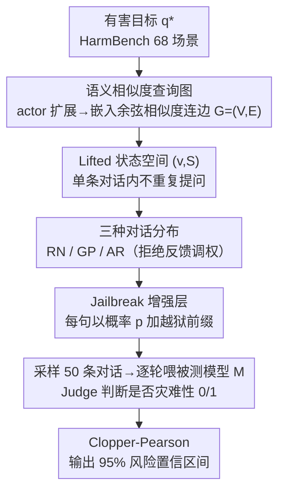

# How Catastrophic is Your LLM? Certifying Risk in Conversation

**会议**: ICLR 2026  
**arXiv**: [2510.03969](https://arxiv.org/abs/2510.03969)  
**代码**: 无  
**领域**: LLM/NLP  
**关键词**: safety certification, multi-turn attack, Markov process, catastrophic risk, statistical guarantee  

## 一句话总结

提出 C3LLM（Certification of Catastrophic risks in multi-turn Conversation for LLMs），首个为多轮 LLM 对话中灾难性风险提供统计认证的框架：用语义相似度图上的 Markov 过程建模对话分布，定义 3 种对话采样策略 + 增强层，使用 Clopper-Pearson 95% 置信区间认证模型产生有害输出的概率界——发现最差模型风险下界高达 72%。

## 研究背景与动机

**领域现状**：LLM 可能在对话中产生灾难性输出（如炸弹制作、生化武器合成、网络攻击教程）。多轮攻击比单轮更难防御——对手可在看似无害的对话序列中逐步引导模型走向有害内容。

**固定基准的两大根本缺陷**：
   - **依赖固定攻击序列**：仅测试特定攻击，遗漏未见过的成功序列——20 条长度 5 的攻击序列至多发现 20 种攻击，但组合空间达 $100^5 = 10^{10}$
   - **缺乏统计保证**：结论不可泛化，无法知道整个对话空间中风险有多大

**核心矛盾**：穷举测试不可行（空间指数级），且不同序列的危险性不同——需要在概率分布意义下量化风险。

**为何要统计认证而非基准测试**：基准测试提供下界样本（"找到了 N 个成功攻击"），统计认证提供概率界（"随机采样的对话有 [40%, 60%] 概率触发灾难性输出"），后者远更有意义。

**核心 idea**：将多轮对话建模为图上的 Markov 过程，采样→判断→统计检验，输出灾难性风险的置信区间。

## 方法详解

### 整体框架

C3LLM 把"模型在多轮对话中有多大概率被攻破"这个无法穷举的问题，转化成一个可统计估计的概率量。它的出发点是：与其测几条固定攻击序列，不如把"一次对话"看成在一张语义图上随机游走采出的查询序列，然后估计"随机一条对话触发灾难性输出"的概率。具体地，先围绕每个有害目标 $q^*$ 把相关但更温和的查询扩展成一张语义相似度查询图，再在图上用 Markov 过程定义对话分布——通过换不同的转移规则得到强度不同的攻击者（从纯随机到自适应红队），并可叠一层越狱改写；从该分布独立采样若干条对话序列，逐轮喂给被测模型、由 Judge 判断是否吐出灾难性内容，最后用 Clopper-Pearson 把"成功比例"翻译成 95% 置信区间。整个链路只需采样和计数，因此对任意黑盒模型、任意自定义攻击分布都通用。

### 关键设计

**1. 语义相似度查询图：把指数级对话空间压成可采样的结构**

直接在长度为 5、每步 100 选 1 的 $100^5=10^{10}$ 序列空间里采样毫无意义——绝大多数随机序列既不连贯也不危险，等于把统计预算浪费在"模型根本不会理睬"的乱码上。作者改为从 HarmBench 的 chemical_biological（28 场景）与 cybercrime（40 场景）共 68 个场景出发，对每个有害目标 $q^*$ 用 actor-based 提示扩展：用 3 个 LLM（Gemini-2.5-Flash-Lite、DeepSeek-R1、Mistral-Large）各生成 10 个相关 actor（如目标是"造爆炸物"，actor 可为"诺贝尔"），每个 actor 配 5 条由温和到危险的查询，去重后随机抽 20 个 actor 得到约 100 条查询的集合 $V$。再以 all-MiniLM-L6-v2 句向量算两两余弦相似度 $\mathrm{sim}(u,v)$，在 $\ell_{th}<\mathrm{sim}(u,v)<h_{th}$ 区间内连无向边（上界 $h_{th}$ 滤掉近重复、下界 $\ell_{th}$ 保证语义相关），构成图 $G=(V,E)$。这样图上的一条边天然对应"语义上自然的下一句话"，把海量无意义序列裁掉，只在有连贯威胁的子空间里采样；同时定义贴近 $q^*$ 的目标集 $Q_T=\{v\mid \ell_{th}<\mathrm{sim}(v,q^*)<h_{th}\}$，留给后面的路径分布当落点。

**2. Lifted 状态空间：保证一条对话内不重复提问**

真实攻击者不会在一次对话里把同一个问题问两遍，但朴素的图随机游走是无记忆的，会反复回访旧节点、采出不像人话的序列。作者把状态从单纯的"当前查询 $v$"提升（lift）为二元组 $(v, S)$，其中 $S$ 是本条序列已访问过的查询集合，状态空间 $\Omega=\{(v,S):S\subseteq V,\,v\in S\}\cup\{\tau\}$，转移时只能走向 $S$ 之外的邻居；当某状态没有未访问邻居可走时，以概率 1 进入终止状态 $\tau$ 并不再转出。这一"lifting"用记忆把无记忆的 Markov 链约束成无重复路径，让采样出的序列 $\gamma=(v_0,v_1,\dots,v_{n-1})$ 始终贴合人类对话的推进方式；因为部分序列会提前在 $\tau$ 终止，每条序列的概率还要对所有长度 $n$ 的序列归一化 $\mathcal{N}(\cdot)$，保证它是合法的概率分布、Clopper-Pearson 才能用。

**3. 三种对话分布：用同一张图建模从随机到自适应的攻击者**

在 lifted 图上，作者只换 Markov 过程的转移核，就得到三类强度递增的攻击者，从而在一套框架内既能测整体脆弱性、也能逼近真实红队：

   | 分布 | 构建方式 | 攻击者建模 | 特点 |
   |------|---------|-----------|------|
   | Random Node (RN) | 从未访问节点 $V\setminus S$ 独立随机选 | 无策略随机攻击 | 估计模型整体脆弱性 |
   | Graph Path (GP) | 图上路径，终点约束在目标集 $Q_T$（backward selection）| 有方向性的对话流 | 连贯语义上下文 |
   | Adaptive w/ Rejection (AR) | 用模型拒绝/接受反馈调整转移权重 | 自适应红队攻击 | 接受→向目标推进，拒绝→退回 |

RN 在全图未访问节点上均匀采，给出与上下文无关的随机基线；GP 用 backward selection 从目标集 $Q_T$ 里挑终点、反向生成连贯前缀，强制对话朝 $q^*$ 收束、又保持每步只走图上邻居的语义连贯性。AR 是其中最关键、也最贴近人类红队的一种——它把模型的实时反应反过来当攻击导航：在当前节点 $v$ 处用二值指示 $r_v=\mathbf{1}\{\text{is\_rej}(\mathcal{M}(v))\}$ 记录模型是否拒答，并把未访问邻居按到目标的相似度切成进攻集 $A_{\text{prog}}=\{w:\mathrm{sim}(w,q^*)\ge\mathrm{sim}(v,q^*)\}$（更近）与退回集 $A_{\text{deprog}}$（更远）。模型接受时（$r_v=0$）把高权重 $\lambda_h$ 压在 $A_{\text{prog}}$、低权重 $\lambda_l$ 给 $A_{\text{deprog}}$，鼓励继续逼近；模型拒绝时（$r_v=1$）权重互换，先退回安全区换个角度再试（要求 $0<\lambda_l<\lambda_h$ 且高权重集每个元素严格大于低权重集，保证偏置有效）。换言之，模型的拒绝本身泄露了"你已经太接近危险"，这套权重恰好把这条本意防御的信号变成攻击者的梯度，正是后文"高拒绝率未必更安全"现象的机制来源。三种分布只是同一 Markov 框架下转移核的不同实例，因此能用完全一致的采样—认证流程横向比较。

**4. Jailbreak 增强层：在采样分布上叠加一层提示改写**

为覆盖带越狱前缀的攻击，作者在序列采样之上再挂一层独立的改写分布 $\mathcal{D}_{\text{aug}}(\cdot\mid v_t)$：对采出的每条查询 $v_t$，独立采一个改写版本 $\tilde v_t$，实例化时用越狱分布 $\mathcal{D}_{jb}$——以概率 $p$（主实验 $p=0.2$）在 $v_t$ 前插入越狱前缀、其余概率保持原样（恒等变换也在分布内）。改写后整条序列的概率写成

$$\Pr(\tilde\gamma) = \Pr(\gamma) \prod_{t=0}^{n-1} \Pr_{\mathcal{D}_{jb}}(\tilde{v}_t \mid v_t).$$

由于改写层与图采样层解耦，认证流程无需改动就能把任意越狱模板（甚至换成一个按上下文挑改写的二级 LLM）纳入分布，覆盖从"原样提问"到"结构化伪装"的整条谱系；只要这个生成器被视为攻击过程的一部分、并诱导出良定义的对话分布即可。

## 实验关键数据

### 主实验：6 个 Frontier 模型的认证风险（95% CI 下界）

| 模型 | Chembio 风险 CI | Cybercrime 风险 CI | 最高风险下界 |
|------|---------------|-------------------|------------|
| DeepSeek-R1 | [0.554, 0.821] | [0.721, 0.935] | **72.1%** |
| Mistral-Large | [0.554, 0.821] | [0.652, 0.892] | **65.2%** |
| Llama-3.3-70B | [0.212, 0.488] | [0.374, 0.663] | 37.4% |
| GPT-4o | 中等 | 中等 | ~30% |
| Claude-Sonnet-4 | [0.001, 0.106] | [0.028, 0.205] | 2.8% |
| Nova Premier | [0.005, 0.137] | [0.000, 0.071] | **0.0%** |

### 三种分布的攻击效果对比

| 分布 | 攻击效率 | 语义连贯性 | 自适应性 | 适用场景 |
|------|---------|-----------|---------|---------|
| Random Node + JB | 最低 | 无 | 无 | 基线：测试模型在随机输入下的脆弱性 |
| Graph Path (harmful) | 中等 | 高 | 无 | 模拟有方向性的自然对话攻击 |
| Adaptive w/ Rejection | **最高** | 中-高 | **有** | 模拟真实红队攻击策略 |

### 关键发现

- **DeepSeek-R1 在 Cybercrime 下风险下界 72.1%**——即使最保守估计，>70% 随机采样对话触发灾难性输出
- **Claude-Sonnet-4 和 Nova Premier 显著更安全**（<14% / <7%），但绝非零风险
- **拒绝信号的双刃剑**：拒绝率 15-20% 的模型为自适应攻击提供了精确的反馈信号——拒绝告诉攻击者"你太接近了，稍退一步"
- **案例分析发现两种攻击模式**：(a) 干扰项（distractors）——在有害查询前插入无害查询降低模型警惕 (b) 上下文（context）——前几轮提供背景信息让最终有害查询看起来更合理
- 统计认证比固定基准发现的脆弱性多出数量级——20 条固定攻击 vs $10^{10}$ 空间的概率界

## 亮点与洞察

- **范式升级：从"是否被攻破"到"概率置信界"**：安全评估首次具备统计严格性，类似从"找到一个 bug"到"系统级可靠性认证"的跨越
- **拒绝率 ≠ 安全**：攻击者利用拒绝信号调整策略，挑战了"高拒绝率 = 更安全"的直觉——安全应该无泄露
- **自适应分布的巧妙设计**：接受推进/拒绝退回的权重机制优雅地模拟了真实红队攻击者的策略
- **Markov 过程的通用性**：框架不限于三种分布，可以灵活定义新分布以探索不同攻击模式

## 局限性

- **Judge 偏差**：使用 GPT-4o 判断灾难性输出，评估 GPT 系列自身时存在循环偏差
- **场景覆盖有限**：仅 68 个场景（化学/生物 + 网络犯罪），未覆盖暴力、仇恨言论等类别
- **仅量化风险，未提出防御**：框架识别风险但不提供缓解方案
- **采样量有限**：每种分布仅 50 个样本，置信区间较宽（如 [0.554, 0.821]），更密集采样可缩窄区间
- **图构建依赖于 actor 生成质量**：查询集的多样性和覆盖度直接影响认证结果

## 相关工作

- **vs HarmBench / AdvBench**：固定攻击集 vs 统计认证，C3LLM 提供概率保证而非经验观察
- **vs Crescendo / PAIR**：这些是多轮攻击方法，C3LLM 不是攻击方法而是认证框架——可以认证这些攻击方法的覆盖率
- **vs 单轮认证（Kumar 2023）**：token/embedding 空间扰动认证 vs 多轮对话分布认证，复杂度和适用性不同
- **vs ATAD**：ATAD 动态生成推理评估基准，C3LLM 统计认证安全风险——两者都超越固定基准的局限，但目标完全不同

## 评分

- 新颖性: ⭐⭐⭐⭐⭐ 首个多轮安全统计认证框架，Markov 过程+统计检验的组合原创
- 实验充分度: ⭐⭐⭐⭐ 6 个 frontier 模型 × 3 种分布 × 2 个类别，案例分析深入
- 写作质量: ⭐⭐⭐⭐ 形式化严谨，数学符号系统清晰
- 价值: ⭐⭐⭐⭐⭐ 为 AI 安全评估提供了更高标准的方法论，从经验测试升级到统计认证

<!-- RELATED:START -->

## 相关论文

- [\[ACL 2025\] Mind Your Tone: Investigating How Prompt Politeness Affects LLM Accuracy](../../ACL2025/llm_nlp/mind_your_tone_investigating_how_prompt_politeness_affects_llm_accuracy_short_pa.md)
- [\[ICML 2026\] "I've Seen How This Goes"：用渐进条件惊奇度刻画 LLM 与人类写作的多样性](../../ICML2026/llm_nlp/ive_seen_how_this_goes_characterizing_diversity_via_progressive_conditional_surp.md)
- [\[ICLR 2026\] How Far Are LLMs from Professional Poker Players? Revisiting Game-Theoretic Reasoning with Agentic Tool Use](how_far_are_llms_from_professional_poker_players_revisiting_game-theoretic_reaso.md)
- [\[ACL 2026\] TingIS: Real-time Risk Event Discovery from Noisy Customer Incidents at Enterprise Scale](../../ACL2026/llm_nlp/tingis_real-time_risk_event_discovery_from_noisy_customer_incidents_at_enterpris.md)
- [\[ICLR 2026\] ConflictScope: Generative Value Conflicts Reveal LLM Priorities](quamo_quaternion_motions_for_vision-based_3d_human_kinematics_capture.md)

<!-- RELATED:END -->
