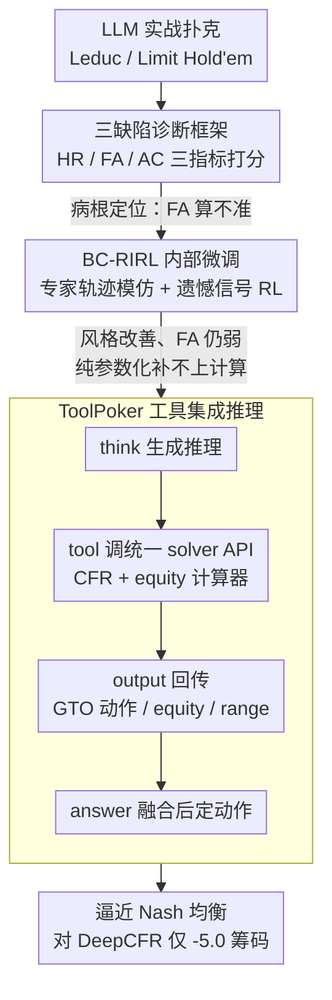

# How Far Are LLMs from Professional Poker Players? Revisiting Game-Theoretic Reasoning with Agentic Tool Use

**会议**: ICLR 2026  
**arXiv**: [2602.00528](https://arxiv.org/abs/2602.00528)  
**代码**: 待确认  
**领域**: LLM/NLP  
**关键词**: LLM poker, game-theoretic reasoning, tool-augmented LLM, CFR solver, incomplete information game  

## 一句话总结
系统分析了 LLM 在扑克中的三大推理缺陷（启发式推理、事实误解、知行差距），提出 ToolPoker 框架——首个面向不完全信息博弈的工具集成 LLM 推理系统，通过外部 CFR solver 提供博弈论最优的行动指导，使 7B 模型在 Limit Hold'em 中逼近 Nash 均衡。

## 研究背景与动机
**领域现状**：LLM 在数学推理、编程等任务上取得突破，但在不完全信息博弈中表现远不如传统方法。扑克需要贝叶斯信念更新、博弈论推理和策略执行的紧密结合。

**现有痛点**：LLM 存在三大推理缺陷——① Heuristic Reasoning：依赖浅层启发式而非博弈论原则；② Factual Misunderstanding：误判手牌强度、底池赔率等客观量；③ Knowing-Doing Gap：推理正确但行动偏离。

**核心矛盾**：LLM 能生成"听起来正确"的博弈论分析文本，但无法精确执行计算。

**本文要解决**：如何让 LLM 在不完全信息博弈中进行符合博弈论的推理和决策？

**切入角度**：将 CFR solver 作为外部工具集成到 LLM 推理流程中。

**核心idea**：ToolPoker = LLM 的语言理解能力 + CFR solver 的精确博弈论计算。

## 方法详解

### 整体框架
全文沿三个阶段递进：先让原始 LLM 在 Leduc / Limit Hold'em 中实战，用一套细粒度诊断框架解剖它到底输在哪；再尝试纯参数化的 BC-RIRL 微调，看"模仿专家 + 强化学习"能否把缺陷练掉；最后落到把外部 CFR solver 接进推理回路的 ToolPoker。前两步是诊断与反例，它们一起坐实了"为什么必须引入工具"——诊断指出最致命的短板是算不准客观量（FA），BC-RIRL 则证明纯调参补不上这块计算缺口；第三步 ToolPoker 才是真正起效的方案。下面三个关键设计正好对应这三个阶段。

### 关键设计

**1. 三缺陷诊断框架：把"LLM 打不好牌"拆成三类可度量的病因**

直接看胜负只知道 LLM 输了，看不出输在哪个环节。本文先建一套细粒度诊断框架，用 LLM-as-Judge（裁判为 GPT-4.1-mini）对模型生成的推理文本按 0–2 分制打三个分，把模糊的"推理质量"变成可对比、可定位的数值：

- 启发式推理（Heuristic Reasoning, HR）：推理是套"大牌就 raise"之类的浅层规则，还是真做了对手范围（range）、均衡层面的分析——分越高越贴近博弈论原则。
- 事实对齐（Factual Alignment, FA）：模型对胜率（equity）、底池赔率、对手范围这些**本可精确计算**的客观量判断得准不准——这是后文被反复证明最致命的一项。
- 行动一致性（Action–reasoning Consistency, AC）：最终动作和推理文字是否吻合，专门捕捉"推理得出 fold、却去 raise"的知行差距。

实测下来三类缺陷在所有模型上普遍存在，而且**规模也救不了**：连最强的 o4-mini 也只有约 HR 1.80 / FA 1.56 / AC 1.85，远未到满分 2.0，其中 FA 普遍最低。这把核心瓶颈点了出来——"算不准客观量"才是 LLM 打不好牌的根子，也成了后续两个方法改进的统一标尺。

**2. BC-RIRL 内部微调：作为反例，证明模仿 + RL 补不上计算缺口**

既然诊断指向计算能力，一个自然的想法是用专家数据把这三种病"练"掉。BC-RIRL 分两步：行为克隆（BC）阶段拿约 5k 条专家推理轨迹做监督模仿——其中专家动作由 CFR+ solver 给出以对齐 Nash 均衡，推理文字用领域模板生成；RIRL 阶段再用 PPO 做强化学习，奖励不是稀疏的最终胜负，而是从预训练 CFR solver 读出的**步级遗憾（regret）信号**：把动作 $a^t_i$ 的累积遗憾相对当前混合策略做标准化，

$$R(a^t_i)=\frac{R_t(a^t_i)-\text{mean}(\{r_t(a_j)\})}{F_{\text{norm}}(\{r_t(a_j)\})},$$

让每个动作的相对优劣都得到细粒度反馈。

结果耐人寻味：模型确实变得更"像"专家——HR、AC 明显上升（Leduc 上 HR 由 0.95 升到 1.93、AC 由 1.68 升到 1.86），但最关键的 FA 几乎没动（0.86→1.06，Limit 上也只到 1.12，仍是三项里最弱、离 2.0 很远），战绩照样打不过 CFR+ 等传统方法。根因在于 BC 只复制了专家"怎么说"的表层风格，没复制"怎么算"的底层能力——模型学会用专家话术包装错误判断，自信地犯错反而更危险。这一步把问题钉死：缺陷的根子是精确计算，靠模仿和 RL 这类**纯参数化**手段补不上，必须引入能精确计算的外部工具。

**3. ToolPoker 工具集成推理：让 CFR solver 接管计算、LLM 只管理解与解释**

ToolPoker 是首个面向不完全信息博弈的工具集成推理（Tool-Integrated Reasoning, TIR）框架，把精确计算外包给 solver，正好补齐 FA 暴露的全部短板。它先解决"工具太碎"的问题：把 CFR solver 与 equity 计算器**合并成单一 API**，一次查询就同时返回 GTO（博弈论最优）动作、equity、底池赔率和对手范围，把多轮多工具调用压成单轮、稳住训练。推理回路是一个 think→act 交替：模型在 `<think>` 里生成推理，用 `<tool>` 发起 solver 查询，结果包进 `<output>` 回填进推理，最后在 `<answer>` 给出动作。

训练同样两步：BC 阶段用程序化生成的**代码增强数据集**（在前述专家轨迹上自动套上 `<tool>`/`<output>` 模板），教模型在什么时机、以什么格式调用 solver；RL 阶段用 PPO 配一个复合奖励 $R = R_{\text{answer}} + \alpha_f R_{\text{format}} + \alpha_t R_{\text{tool}}$ 联合优化。其中 $R_{\text{tool}}$ 不止奖励"调用了工具"，更奖励"用上了 solver 返回的结果"，专门压制只调用却忽略输出的惰性；$R_{\text{format}}$ 保证调用串可解析、不因格式错让工具失效。消融印证两步缺一不可：去掉 BC，模型会调 solver 却内化不了博弈论推理模式（HR 掉、战绩弱）；去掉 RL，推理风格像样但动作对不齐 GTO（FA/AC 与战绩都差）。solver 接管计算、LLM 保留语言理解，二者互补正是把 7B 模型推到逼近 Nash 均衡的关键。

## 实验关键数据

### 主实验——对战传统方法（Limit Texas Hold'em，净筹码，正=赢）

| 方法 | vs NFSP | vs DQN | vs DMC | vs DeepCFR |
|------|---------|--------|--------|------------|
| Vanilla Qwen2.5-7B | -53.5 | -188 | -144 | -101.0 |
| BC-RIRL | -77.5 | -82.5 | -80.5 | -70.2 |
| **ToolPoker** | **+60.5** | **+63.0** | **+61.5** | **-5.0** |

### 推理质量评估（Leduc Hold'em，0-2 分）

| 方法 | HR | FA | AC |
|------|-------|-------|------|
| Vanilla Qwen2.5-7B | 0.95 | 0.86 | 1.68 |
| BC-RIRL | 1.93 | 1.06 | 1.86 |
| o4-mini | 1.80 | 1.56 | 1.85 |
| **ToolPoker** | **近满分** | **近满分** | **近满分** |

> ToolPoker 三项分数取自原文 Fig. 2（柱状图），三轴均逼近 2.0 的专业水平，无逐项数值表。

### 关键发现
- 所有 vanilla LLM（含 GPT-4o、o4-mini）都打不过 Nash 均衡求解器 CFR+
- BC-RIRL 把推理风格练得更像专家（HR/AC 上升），但 FA 几乎没动、整体仍打不过传统方法——纯模仿+RL 补不上计算缺陷
- ToolPoker 接入 solver 后 FA 大幅跃升、三项推理分逼近满分——事实误解被工具彻底解决
- ToolPoker 对 CFR+/DeepCFR 仅差 -3.0 / -5.0 筹码，接近 Nash 均衡

## 亮点与洞察
- **HR/FA/AC 诊断框架**把"推理质量"拆成可度量的三轴，可迁移到其他精确推理任务
- **"知行差距"（AC）**是被低估的 LLM 问题——推理对了动作却错
- **Tool + LLM 互补性**在博弈论场景中效果显著：solver 管精确计算、LLM 管理解与解释
- BC-RIRL 只学会专家"话术"（HR/AC 提升）却没学会精确计算（FA 几乎不动）——模仿"像专家一样说话"不等于"像专家一样思考"

## 局限与展望
- 依赖外部 CFR solver 增加延迟和部署复杂度
- 仅验证两人扑克，未扩展到多人博弈
- 工具调用偶有格式错误
- 仅用 Qwen2.5-7B 微调

## 相关工作与启发
- **vs Pluribus/Libratus**: 传统 AI 扑克用纯 CFR；ToolPoker 让 LLM 作为 CFR 的"用户界面"
- **vs ReAct**: 类似 tool-use 范式但专为博弈论设计
- 启发：需要精确计算的 LLM 应用都应考虑 tool augmentation

## 补充技术细节

### CFR (Counterfactual Regret Minimization) 简介
CFR 是求解不完全信息博弈 Nash 均衡的标准算法，通过迭代最小化每个信息集的反事实遗憾来收敛到均衡策略。在扑克中，CFR 可以计算出每个决策点的 GTO（Game Theory Optimal）策略，包括每个动作的精确概率。

### 复合奖励设计的细节
$R_{tool}$ 的设计特别重要：不仅奖励“调用了工具”，还奖励“正确使用了工具返回结果”——防止模型学会调用但忽略 solver 输出的惰性行为。$R_{format}$ 确保输出可解析，避免因格式错误导致工具调用失败。

### 为什么 BC-RIRL 改不动事实准确性（FA）？
可能的解释：BC 阶段模仿了专家的推理“风格”但没有模仿精确计算能力，导致模型“自信地犯错”——用专家话术包装了错误的事实判断，比老实承认不知道更危险。所以 BC-RIRL 能把 HR/AC 练上去、却几乎补不动 FA，整体仍打不过传统方法。这个发现对所有基于行为克隆的 LLM 微调方法都有警示：模仿“像专家一样说话”和“像专家一样思考”是完全不同的。

### 扑克的独特挑战
扑克与国际象棋/围棋的关键区别在于信息不完全性：玩家无法看到对手的牌。这要求策略不仅要考虑当前手牌强度，还要维护对手手牌范围的信念分布，并在每次行动后更新。LLM 在这种贝叶斯推理上的能力远不如在确定性推理上。ToolPoker 正是通过 CFR solver 弥补了这一计算瓶颈。

## 评分
- 新颖性: ⭐⭐⭐⭐ 首个 CFR+LLM 集成系统，缺陷分析有价值
- 实验充分度: ⭐⭐⭐⭐ 多种传统方法对战+推理质量评估
- 写作质量: ⭐⭐⭐⭐ 三阶段递进明晰
- 价值: ⭐⭐⭐⭐ Tool-augmented LLM 在博弈论场景的典范

<!-- RELATED:START -->

## 相关论文

- [\[ACL 2025\] A Survey of LLM-based Agents in Medicine: How Far Are We from Baymax?](../../ACL2025/llm_nlp/a_survey_of_llm-based_agents_in_medicine_how_far_are_we_from_baymax.md)
- [\[ACL 2025\] Large Language Models for Predictive Analysis: How Far Are They?](../../ACL2025/llm_nlp/large_language_models_for_predictive_analysis_how_far_are_they.md)
- [\[ACL 2025\] How Numerical Precision Affects Arithmetical Reasoning Capabilities of LLMs](../../ACL2025/llm_nlp/how_numerical_precision_affects_arithmetical_reasoning_capabilities_of_llms.md)
- [\[ACL 2026\] How Do Answer Tokens Read Reasoning Traces? Self-Reading Patterns in Thinking LLMs](../../ACL2026/llm_nlp/how_do_answer_tokens_read_reasoning_traces_self-reading_patterns_in_thinking_llm.md)
- [\[ICLR 2026\] How Catastrophic is Your LLM? Certifying Risk in Conversation](how_catastrophic_is_your_llm_certifying_risk_in_conversation.md)

<!-- RELATED:END -->
