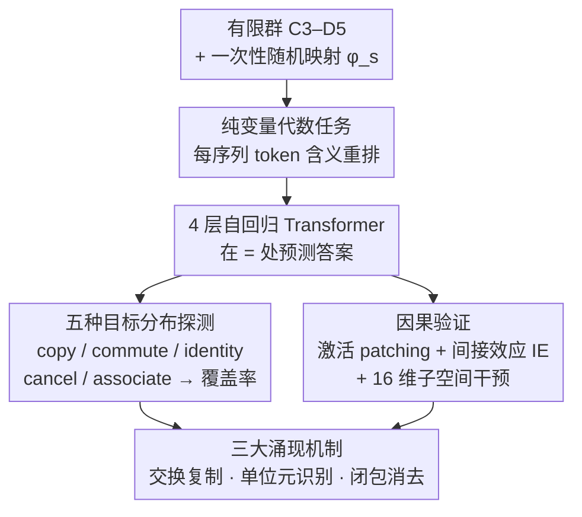

# In-Context Algebra

**会议**: ICLR2026  
**arXiv**: [2512.16902](https://arxiv.org/abs/2512.16902)  
**代码**: [algebra.baulab.info](https://algebra.baulab.info)  
**领域**: 其他  
**关键词**: in-context learning, mechanistic interpretability, symbolic reasoning, finite groups, transformer mechanisms

## 一句话总结

本文设计了一个 **in-context 代数任务**——令 token 成为纯变量、每条序列重新随机分配含义——发现 Transformer 在此设定下不再学习经典的傅里叶/几何表示，而是涌现出三种 **符号推理机制**（交换复制、单位元识别、闭包消去），并揭示了训练过程中这些能力按阶段性相变依次出现的规律。

## 研究背景与动机

**固定嵌入的局限**：先前大量模型可解释性研究(grokking, 模算术)表明 Transformer 在 token 嵌入中预编码了任务信息（如"108"编码了"能被2整除"），学到的是周期性/傅里叶基的几何策略。

**真正的抽象推理**：抽象推理的标志是能处理 **含义事先未知的符号**。若 token 不携带任何固定语义，模型会学什么策略？

**纯变量设定**：作者提出让每条序列中的 token 只是占位变量，通过一个随机映射 $\varphi_s$ 将有限群元素映射到词表符号（且每条序列映射不同），迫使模型仅从上下文关系推理。

**与 ICL 的关联**：这是对 in-context learning 内在机制的深入探索——模型需在上下文中观察"事实"并推断代数结构，而非依赖参数记忆。

**可解释性方法论**：作者设计了 5 种目标数据分布 + 因果干预实验，为机制验证提供了严格的方法范式。

**阶段性学习**：训练过程中不同能力以相变的形式依次涌现，揭示了 Transformer 学习抽象运算的内在课程。

## 方法详解

### 整体框架

这篇论文想回答一个问题：当 token 不再携带任何固定语义、模型无法靠嵌入里的几何先验抄近路时，Transformer 会怎样在上下文里"推理"出代数结构？为此作者把有限群乘法搬进一个**纯变量设定**——每条序列用一次性随机映射把群元素打散成无固定含义的占位 token，再让一个 4 层自回归 Transformer 在每条乘法事实的 "=" 处预测答案。光看准确率无法区分模型到底用了哪种算法，所以作者再用**五种目标数据分布**把每种假想机制单独逼出来、做覆盖率分析，并用**因果干预**把执行这些算法的注意力头逐一定位，最终解剖出模型反复学到的三种符号机制。

### 关键设计

**1. 纯变量代数任务：把语义先验从 token 里彻底剥离**

以往可解释性研究里 token 含义是固定的（比如数字"108"天然编码"能被 2 整除"），模型于是学到傅里叶基这类几何捷径，看不出它是否真在"推理"。本文给定有限群集合 $\mathcal{G}=\{C_3,\ldots,C_{10},D_3,D_4,D_5\}$，每条序列 $s$ 先采子集 $\mathcal{G}_s$ 使并集 $H_s=\bigcup\mathcal{G}_s$ 满足 $|H_s|\le N=16$，再造一一映射 $\varphi_s:H_s\to V$ 把群元素随机分配到 16 个变量 token——关键在于每条序列的 $\varphi_s$ 都不同，同一个 token 在不同序列里含义完全不同。序列由 $k=200$ 条乘法事实拼成，形如

$$s = v_{x_1} v_{y_1} = v_{z_1},\; \cdots,\; v_{x_k} v_{y_k} = v_{z_k}$$

每条事实占 4 个位置（左槽 $v_{x_i}$、右槽 $v_{y_i}$、预测点 "="、答案槽 $v_{z_i}$），模型须在 "=" 处预测答案。这样模型唯一能依赖的就是上下文里事实之间的关系，强迫它做符号推理而非套用几何模板。

**2. 五种目标分布：把"模型到底用了哪种算法"变成可控实验**

模型答对一道题可能来自好几种不同算法，光看准确率无法区分。作者为每种假想机制构造一个目标数据分布，在该分布上只有对应算法才可解、其它捷径被堵死：$\mathcal{D}_{\text{copy}}$ 在上下文里直接放最终事实的逐字副本（测逐字复制）；$\mathcal{D}_{\text{commute}}$ 只放交换事实 $yx=z$ 而无逐字副本（测交换复制）；$\mathcal{D}_{\text{identity}}$ 让最终事实含单位元、且上下文有一条暴露该单位元的事实（测单位元识别）；$\mathcal{D}_{\text{cancel}}$ 放齐与查询共享左槽 $x$ 或右槽 $y$ 的事实、逼模型用消去律排除候选（测闭包消去）；$\mathcal{D}_{\text{associate}}$ 只给一组能经结合律 $(xg)d=fd\Rightarrow x(gd)=z$ 串接推出答案的最小事实集（测结合律组合）。再把这五种算法按"逐字复制→交换复制→单位元识别→闭包消去→结合律"的顺序逐条套用、每条只解前面没解掉的序列，累加出"算法覆盖率"——它能解释多少模型准确率，就说明模型掌握了多少对应机制。

**3. 因果验证：用间接效应与激活 patching 定位执行机制的注意力头**

知道模型会某种算法，还要知道是哪些组件在执行它。作者在一对干净/损坏序列之间做激活 patching，用间接效应 (Indirect Effect) 量化某个头 $(l,h)$ 的贡献：

$$\text{IE}(l,h) = P(v_{\text{target}} \mid a_{s_{\text{clean}}}^{(l,h)} \to s_{\text{corrupt}}) - P(v_{\text{target}} \mid s_{\text{corrupt}})$$

即把干净序列里该头的激活移植到损坏序列后，正确 token 概率回升多少——回升越大，说明这个头越是执行该算法的关键组件。对涉及集合状态的机制（如闭包），作者进一步训练一个 16 维子空间 $W$ 做子空间级干预，用以验证模型是否真的在内部显式维护了某个代数集合，而非碰巧答对。

**4. 三大涌现机制：交换复制、单位元识别、闭包消去**

上述方法最终解剖出模型实际依赖的三种符号机制。**交换复制**由单个头 (Layer 3, Head 6) 承担：有逐字副本时它注意答案槽、直接抬高对应 token 的 logit；只剩交换事实 $yx=z$ 时它转而注意交换事实的答案槽——同一个头自适应地处理两种情况。**单位元识别**靠"查询提升 + 单位元抑制"两个子机制配合：Head 3.1 抬高查询中两个变量的 logit，Head 3.6 压低已识别出的单位元 token，剩下的非单位元变量便是答案；最终层注意力输出的 PCA 第一主成分能干净地分开含/不含单位元的事实。**闭包消去**则分两步：闭包子机制追踪与查询变量同群的全部元素，消去子机制再用消去律剔除已出现在相同左/右槽里的候选；对前述 16 维子空间 $W$ 做因果干预可达 99.8% 的干预准确率，证明这个闭包集合确实被显式表征。

## 实验关键数据

### 主要结果：算法覆盖率与模型性能

| 机制 | 训练数据覆盖率 (AUC) | Hold-out 覆盖率 (AUC) |
|------|---------------------|----------------------|
| 逐字复制 | 67.9% | — |
| 交换复制 | +12.1% | — |
| 单位元识别 | +4.2% | 28.7% |
| 闭包消去 | +2.7% | +39.1% |
| 结合律组合 | +3.6% | +16.9% |
| **总覆盖** | **90.4%** | **84.7%** |
| **模型实际准确率** | **92.4%** | **87.3%** |

### 各目标分布上的模型准确率

| 数据分布 | $k=50$ | $k=100$ |
|---------|--------|---------|
| 逐字复制 $\mathcal{D}_{\text{copy}}$ | ~100% | 100.0% |
| 交换复制 $\mathcal{D}_{\text{commute}}$ | ~97% | 99.0% |
| 单位元识别 $\mathcal{D}_{\text{identity}}$ | ~98% | 100.0% |
| 闭包消去 $\mathcal{D}_{\text{cancel}}$ | ~95% | 97.0% |
| 结合律组合 $\mathcal{D}_{\text{associate}}$ | ~55% | 60.2% |

### 泛化能力

- **未见群泛化**：对训练中未见的所有 8 阶群达到近乎完美的准确率
- **半群泛化**：在非群结构如半群上仍有非平凡准确率
- **拟群/岩浆**：拟群表现下降，岩浆(magma)几乎失败，表明模型依赖群的结构性质

### 消融分析：阶段性相变

训练过程中的技能习得呈现清晰的 **五阶段相变**：

| 阶段 | 习得技能 | 训练步 |
|------|---------|--------|
| ➀ | 结构 token 预测 ("=", ",") | 最早出现 |
| ➁➂ | 群闭包 + 查询提升（单位元50%准确率） | 第二阶段 |
| ➃➄ | 逐字复制 + 交换复制 | 急剧下降 |
| ➅➆ | 闭包消去 + 完整单位元识别 | 联合渐进提升 |
| ➇ | 结合律组合 | 最后出现 |

关键发现：
- **复制是基础**：消去和单位元识别建立在复制能力之上
- **联合涌现**：单位元抑制和消去子空间执行类似的"抑制"功能，因此同步学习
- **结合律最难**：是最后习得的能力，且准确率仅 60%

### 因果干预结果

| 实验 | 关键头 | AIE |
|-----|--------|-----|
| 逐字复制 | Head 3.6 | **0.91** |
| 交换复制 | Head 3.6 | **0.48** |
| 其他头最高 | — | < 0.08 |
| 闭包子空间干预准确率 | 16-dim $W$ | **99.8%** |

## 亮点

- **极简而深刻的实验设计**：纯变量代数设定巧妙隔离了"嵌入先验"与"上下文推理"，是 ICL 机制研究的优质范式
- **完整的机制解剖**：从假设→目标分布设计→覆盖率分析→因果干预→子空间探测，形成闭环验证
- **相变与课程学习的自然对应**：揭示了 Transformer 自发的分阶段技能习得，具有理论启发性
- **符号 vs 几何策略的依赖性**：论证了推理策略取决于任务结构——固定 token 导致几何策略，纯变量导致符号策略
- **代码与数据开源**，实验可复现

## 局限与展望

1. **模型规模受限**：仅在 4 层小 Transformer 上验证，未知是否适用于大规模预训练 LLM
2. **结合律学习不足**：模型仅学到 60% 的结合律准确率，说明多步推理仍是挑战
3. **任务偏理想化**：有限群代数距离自然语言推理仍有距离，结论是否迁移到更复杂场景需验证
4. **词表规模限制**：仅 16 个变量 token，扩展到更大词表时机制是否保持一致尚未研究
5. **未探索 CoT**：结合链式思维提示可能提升结合律等复杂推理的表现

## 与相关工作的对比

| 对比维度 | 本文 | 先前工作 (Nanda et al., Zhong et al.) |
|---------|------|--------------------------------------|
| Token 含义 | 每序列随机变化的纯变量 | 固定语义（如数字） |
| 习得策略 | 符号推理（复制、消去） | 傅里叶基 / 几何表示 |
| 是否涌现 grokking | 阶段性相变但非传统 grokking | 典型 grokking |
| 泛化能力 | 泛化到未见群 | 泛化到同分布数据 |
| 分析方法 | 因果干预 + 子空间探测 | 权重/嵌入分析 |

与 Akyürek et al. (2024) 的 induction head / n-gram head 分析互补——本文的 copying head (3.6) 具有类似的 n-gram 匹配行为，但进一步展示了交换复制和单位元抑制等更高级功能。

## 评分

- 新颖性: ⭐⭐⭐⭐⭐ — 纯变量代数设定首次提出，揭示了与传统固定 token 完全不同的推理机制
- 实验充分度: ⭐⭐⭐⭐⭐ — 5种目标分布 + 因果干预 + 子空间探测 + 阶段分析，验证极为充分
- 写作质量: ⭐⭐⭐⭐⭐ — 图表精美，逻辑清晰，Figure 4/5/6 的可视化尤其出色
- 价值: ⭐⭐⭐⭐ — 对 ICL 机制研究有重要启示，但与实际 LLM 应用的桥接尚待验证

<!-- RELATED:START -->

## 相关论文

- [\[ACL 2025\] Mixtures of In-Context Learners](../../ACL2025/llm_nlp/mixtures_of_in-context_learners.md)
- [\[ACL 2026\] UCS: Estimating Unseen Coverage for Improved In-Context Learning](../../ACL2026/llm_nlp/ucs_estimating_unseen_coverage_for_improved_in-context_learning.md)
- [\[ICML 2026\] Position: The Turing-Completeness of Autoregressive Transformers Relies Heavily on Context Management](../../ICML2026/llm_nlp/position_the_turing-completeness_of_autoregressive_transformers_relies_heavily_o.md)
- [\[NeurIPS 2025\] In-Context Learning of Linear Dynamical Systems with Transformers: Approximation Bounds and Depth-Separation](../../NeurIPS2025/llm_nlp/in-context_learning_of_linear_dynamical_systems_with_transformers_approximation_.md)
- [\[ICML 2026\] In-Context Routing (ICR): 一次训练、处处可用的 attention-level 隐式 ICL](../../ICML2026/llm_nlp/train_once_reuse_everywhere_generalizable_implicit_in-context_learning_by_routin.md)

<!-- RELATED:END -->
