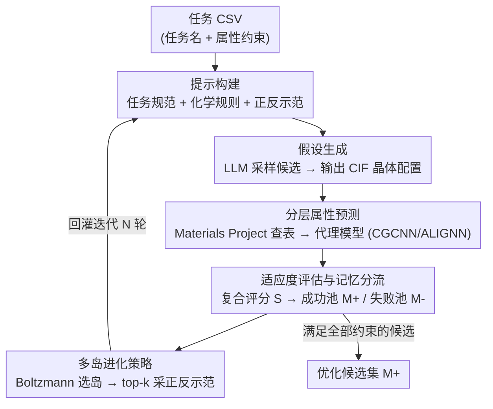

# LLEMA: Evolutionary Search with LLMs for Multi-Objective Materials Discovery

**会议**: ICLR 2026  
**arXiv**: [2510.22503](https://arxiv.org/abs/2510.22503)  
**代码**: [github.com/scientific-discovery/LLEMA](https://github.com/scientific-discovery/LLEMA)  
**领域**: LLM NLP  
**关键词**: 材料发现, LLM进化搜索, 多目标优化, 晶体结构生成, 代理模型  

## 一句话总结

提出 LLEMA 框架，将 LLM 的科学知识与化学规则引导的进化搜索和记忆驱动的迭代优化相结合，在 14 个多目标材料发现任务上实现了更高的命中率、稳定性和 Pareto 前沿质量。

## 研究背景与动机

材料发现需要在化学和结构的巨大组合空间中搜索，同时满足多个（通常相互冲突的）目标。传统发现过程资源密集且缓慢，而现有方法面临以下困境：

1. **传统生成模型**（CDVAE、G-SchNet、DiffCSP、MatterGen）需要针对特定任务重新训练，缺乏泛化能力，且缺少 LLM 中嵌入的广泛先验知识
2. **现有 LLM 方法**（如 LLMatDesign）依赖提示工程或无引导的材料生成，生成的候选材料虽理论上可行但常常不稳定或不可合成
3. **单目标局限**：多数方法将材料发现简化为单目标任务，而实际场景本质上是多目标的（如热电材料需同时优化电导率和热阻）

LLEMA 是首个同时具备**领域知识整合、多目标优化、规则引导生成、进化优化改进**四大特性的框架。

## 方法详解

### 整体框架

LLEMA 把材料发现写成一个约束多目标优化问题：在候选空间 $\mathcal{M}$ 中找到加权目标最大的材料 $m^* = \arg\max_{m \in \mathcal{M}} \sum_i w_i f_i(m)$，其中每个约束 $c_i$ 可以是区间约束 $f_i(m) \in [l_i, u_i]$、下界约束 $f_i(m) \geq l_i$ 或上界约束 $f_i(m) \leq u_i$。整条流水线是一个闭环：用户只提供一份写明任务名和属性约束的 CSV，框架就自动构建提示，让 LLM 按提示采样候选并直接输出 CIF 晶体配置；候选送进分层属性预测得到属性向量，再用复合评分判断它满足约束的程度、按成功/失败分流进两个记忆池；下一轮从多个独立"岛"里采样正反示范回灌提示，让 LLM 在化学合法的子空间里一边纠错一边演化。这样就把"LLM 的科学先验"和"进化搜索的迭代纠偏"绑成一个整体，迭代 $N$ 轮后返回成功池 $\mathbb{M}^+$ 作为优化候选集。

### 关键设计

**1. 假设生成：用化学规则把提示变成进化算子**

纯靠提示工程的 LLM 生成往往给出"理论可行但不可合成"的候选，根因是没有把领域约束写进生成过程。LLEMA 在每次迭代 $n$ 让 LLM $\pi_\theta$ 从提示 $\mathbf{p}_n$ 采样一批候选 $\mathcal{M}^b$，提示由四块拼成：任务规范（自然语言目标加属性约束，如"宽带隙半导体，带隙 ≥ 2.5 eV"）、化学信息设计原则 $\mathcal{R}$（同族元素替换、化学计量保持、氧化态一致性等规则，充当变异/交叉算子）、来自成功池 $\mathbb{M}^+$ 和失败池 $\mathbb{M}^-$ 的正反示范样本，以及要求 LLM 直接输出晶体配置（化学式、晶格参数、原子坐标，落地为 CIF 文件）。把替换规则、化学计量守恒、氧化态一致性当成显式算子注入，等于让 LLM 在化学合法的子空间里做进化，而不是在整个组合空间里盲撞——这也是它与依赖学习先验的 MatterGen、无约束 LLM 生成的 LLMatDesign 的根本区别。

**2. 分层属性预测：查表加代理模型守住可靠性**

候选材料的真实属性既要准又不能每个都跑昂贵的 DFT。LLEMA 用分层的 oracle 预测：先查 Materials Project 数据库做精确或相似匹配，命中就用库里的真值；对落在数据库覆盖外的分布外候选改用代理模型（在 JARVIS-DFT 上预训练的 CGCNN、ALIGNN）预测，最终产出属性向量 $f(m) \in \mathbb{R}^d$，每一维对应一个目标属性。消融显示这一层不可或缺——移除代理模型、只靠 Materials Project 查表后命中率和稳定性都崩到 <5%，因为没有可靠属性信号就无法给分布外候选打有意义的分，搜索只能漂回对已知材料的平凡重复。

**3. 适应度评估与记忆分流：一个复合评分决定正反池归属**

多目标场景下需要把多个约束的满足程度压成一个可比较的标量。LLEMA 用复合评分把候选 $\mathcal{M}_j$ 的预测属性按约束加权汇总：

$$S(\mathcal{T}, \mathcal{C}; \mathcal{M}_j) = \sum_{i=1}^k w_i \cdot \Phi_i(f_i(\mathcal{M}_j), c_i)$$

其中 $w_i$ 是第 $i$ 个属性的相对权重，$\Phi_i$ 是归一化奖励函数、衡量预测值 $f_i(\mathcal{M}_j)$ 对约束 $c_i$ 的满足度。满足全部硬约束（$S \geq 0$，即所有 $\Phi_i \geq 0$）的候选进成功池 $\mathbb{M}^+$，违反任一约束的进失败池 $\mathbb{M}^-$。两个池都被当作下一轮的示范语料，让模型既学会"什么对"也学会"避开什么错"——光加记忆缓存就能把命中率从 4.4 拉到 15.1、把 Materials Project 记忆化重复率从 95.3% 压到 58.3%。

**4. 多岛进化策略：并行岛平衡探索与利用**

光有一个记忆池仍会过早收敛、反复召回训练语料里的已知材料。借鉴 island-model（FunSearch 等）的思路，LLEMA 把种群分成 $m=5$ 个各自带 $\mathbb{M}^+$、$\mathbb{M}^-$ 的独立岛，让不同子群朝不同方向并行演化。每轮先按岛均分做 Boltzmann 采样选一个岛：

$$P_i = \frac{\exp(s_i/\tau_c)}{\sum_j \exp(s_j/\tau_c)}$$

$s_i$ 是第 $i$ 个岛的平均得分，温度 $\tau_c$ 控制选优强度；选中岛内再用 top-k 从 $\mathbb{M}^+$ 和 $\mathbb{M}^-$ 各采高分/违例样本，连同化学规则 $\mathcal{R}$ 拼成下一轮提示 $\mathbf{p}_{n+1}$。多岛叠加变异/交叉算子把命中率从仅加记忆的 15.1 进一步升到 29.8、记忆化重复率降到 25.3%，再补上化学规则约束达到完整版的命中率 30.2、稳定性 27.6、记忆化 16.6。

### 训练策略

LLEMA 不需要重训练任何模型：代理模型直接用公开预训练权重，LLM 也只做推理。用户只需提供一个包含任务名称和属性约束的 CSV，框架就自动从 CSV 构建提示、迭代生成候选；违反硬约束的候选直接赋低分被高效剪枝，从而把算力集中在合法子空间内的搜索上。

## 实验关键数据

### 主实验：14 个材料发现任务

在电子、能源、涂层、光学、航空航天五大领域的 14 个任务上评估命中率（H.R.）和稳定性（Stab.）：

| 方法 | Wide-Bandgap H.R/Stab | SAW/BAW H.R/Stab | Solid-State H.R/Stab | Piezo H.R/Stab | Transparent H.R/Stab |
|------|:-:|:-:|:-:|:-:|:-:|
| CDVAE | 0.04/0.04 | 0.29/0.00 | 0.04/0.04 | 42.19/0.00 | 0.00/0.00 |
| MatterGen | 6.56/4.15 | 26.27/0.00 | 5.33/3.11 | 21.64/0.00 | 9.38/0.00 |
| LLMatDesign | 4.19/1.13 | 47.59/0.13 | 2.51/2.44 | 32.16/1.38 | 0.04/0.04 |
| LLEMA (Mistral) | 17.08/10.71 | 31.58/6.80 | 31.79/20.78 | 67.11/4.84 | 43.87/18.48 |
| **LLEMA (GPT)** | **33.62/22.42** | **59.88/10.74** | **46.17/25.37** | 63.46/3.22 | 39.11/14.85 |

LLEMA 在几乎所有任务上均大幅超越基线，尤其在稳定性方面优势明显——基线方法生成的候选虽可能满足属性约束但热力学不稳定。

### 消融实验：各组件贡献

| 方法 | 命中率↑ | 稳定性↑ | 记忆率↓ |
|------|:-:|:-:|:-:|
| LLM（直接生成） | 4.4 | 1.8 | 95.3 |
| +记忆反馈 | 15.1 | 20.1 | 58.3 |
| +变异&交叉 | 29.8 | 21.5 | 25.3 |
| **LLEMA（完整）** | **30.2** | **27.6** | **16.6** |

### 关键发现

1. **进化优化显著降低记忆化**：纯 LLM 的 Materials Project 重复率高达 95.3%，LLEMA 降至 16.6%
2. **代理模型不可或缺**：移除代理模型后，命中率和稳定性均崩溃至 <5%，搜索退化为平凡重复
3. **收敛动态**：有效候选比例从第 250 次迭代的 ~27% 增至第 1000 次的 ~33%
4. **Pareto 前沿优势**：宽带隙半导体和硬/刚性陶瓷任务中，所有 Pareto 最优解均来自 LLEMA
5. **发现的候选与领域专家研究一致**：如 ZrAl₂O₅ 和 Hf₀.₅Zr₀.₅O₂ 对应已知的高 k 介电材料家族

## 亮点与洞察

- **化学知识编码到进化算子**：将替换规则、化学计量守恒、氧化态一致性等领域知识转化为指导 LLM 生成的算子，而非简单的提示工程
- **多岛进化策略**：受 FunSearch 等工作启发，通过并行岛结构平衡探索与利用
- **实用性强**：用户仅需一个 CSV 文件即可启动新任务，代理模型使用预训练权重无需重训
- **基准贡献**：提供了 14 个工业相关的多目标材料发现任务基准，每个任务都有明确的物理约束

## 局限性 / 可改进方向

1. 依赖代理模型（CGCNN、ALIGNN）进行属性预测，预测误差会累积影响搜索方向
2. 缺乏实验验证——新发现的材料仅经过计算验证，未经实验室合成验证
3. 迭代 LLM 查询成本较高，250 次迭代需要大量 API 调用
4. 化学规则目前由领域科学家手动设计，自动化规则发现是自然的扩展方向
5. 当前仅在 GPT-4o-mini 和 Mistral-Small 上验证，更强的 LLM 可能进一步提升性能

## 相关工作与启发

- **与 FunSearch (Romera-Paredes et al., 2024) 的关系**：LLEMA 的多岛进化策略直接受 FunSearch 启发，将其从程序搜索扩展到材料发现
- **与 MatterGen 的互补**：MatterGen 用扩散模型的条件采样做逆向设计，LLEMA 则用 LLM 推理+进化搜索，两者可互补
- **对 AI4Science 的启发**：展示了如何将 LLM 的广泛知识与领域特定约束结合，范式可推广到药物设计、催化剂发现等

## 评分

- **新颖性**: ⭐⭐⭐⭐ — 首个将 LLM 进化搜索+化学规则+多目标优化统一的材料发现框架
- **技术深度**: ⭐⭐⭐⭐ — 多层次的框架设计包含代理模型、多岛进化、记忆管理等
- **实验充分度**: ⭐⭐⭐⭐⭐ — 14 个任务、多基线对比、充分的消融和定性分析
- **写作质量**: ⭐⭐⭐⭐ — 结构清晰，问题建模规范
- **实用性**: ⭐⭐⭐⭐ — 低门槛启动（仅需 CSV）但依赖代理模型质量
- **综合评分**: ⭐⭐⭐⭐ (8/10)

<!-- RELATED:START -->

## 相关论文

- [\[ICLR 2026\] Unsupervised Evaluation of Multi-Turn Objective-Driven Interactions](unsupervised_evaluation_of_multi-turn_objective-driven_interactions.md)
- [\[ICLR 2026\] Toward Safer Diffusion Language Models: Discovery and Mitigation of Priming Vulnerabilities](toward_safer_diffusion_language_models_discovery_and_mitigation_of_priming_vulne.md)
- [\[ACL 2025\] Gradient-Adaptive Policy Optimization: Towards Multi-Objective Alignment of Large Language Models](../../ACL2025/llm_nlp/gapo_multi_objective_alignment.md)
- [\[ACL 2026\] AlphaContext: An Evolutionary Tree-based Psychometric Context Generator for Creativity Assessment](../../ACL2026/llm_nlp/alphacontext_an_evolutionary_tree-based_psychometric_context_generator_for_creat.md)
- [\[NeurIPS 2025\] AceSearcher: Bootstrapping Reasoning and Search for LLMs via Reinforced Self-Play](../../NeurIPS2025/llm_nlp/acesearcher_bootstrapping_reasoning_and_search_for_llms_via_reinforced_self-play.md)

<!-- RELATED:END -->
