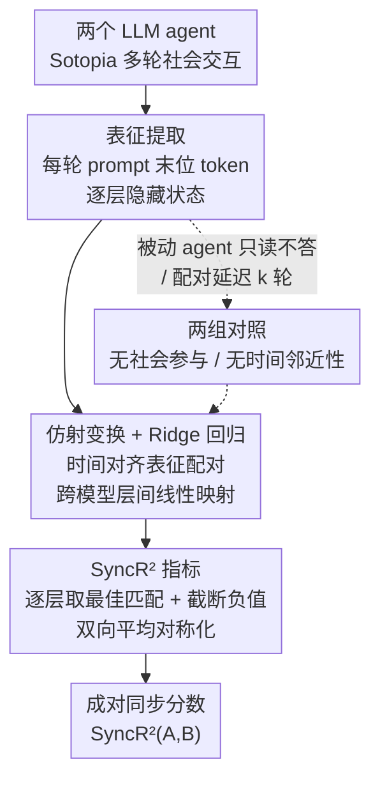

# Neural Synchrony Between Socially Interacting Language Models

**会议**: ICLR 2026  
**arXiv**: [2602.17815](https://arxiv.org/abs/2602.17815)  
**代码**: [zzn-nzz/LM_neural_synchrony](https://github.com/zzn-nzz/LM_neural_synchrony)  
**领域**: LLM/NLP  
**关键词**: 神经同步, 社会交互, LLM表征分析, 多Agent系统, 脑间同步类比, 可预测性

## 一句话总结

首次研究社会交互中 LLM 间的神经同步现象：通过训练仿射变换预测交互伙伴的未来表征，定义 $SyncR^2$ 指标量化同步强度，发现该同步依赖于社会参与和时间邻近性，且与 LLM 的社会行为表现高度相关（Pearson $r$ = 0.88-0.99），呼应了人类脑间同步（IBS）的神经科学发现。

## 研究背景与动机

### 人类脑间同步（IBS）

神经科学发现：当人类社交互动时（对话、合作、共同注意），脑活动会产生同步。这种**脑间同步**（Inter-Brain Synchrony）不仅是共享感觉输入的副产品，更是预测和促进社会协调、合作和相互理解的功能性机制。更强的 IBS 关联着更高的合作率、更好的学习效果和更佳的团队表现。

### 研究动机

LLM 在行为层面展现出惊人的社会交互能力，但在**表征层面**是否存在类似人类社会脑的内部机制，尚属未知。已有工作主要从行为评估（如 Theory of Mind 测试）或单模型内部分析（如特定注意力头）入手，但缺乏对**多模型交互过程中表征动态**的研究。

### 核心假设

如果 LLM 在社会交互中不仅基于自身角色行事，还推理伙伴的情感、意图和交互走向，那么一个 LLM 的内部表征应该包含可预测另一个 LLM 表征的信息。

## 方法详解

### 整体框架

这篇论文要回答的问题是：两个 LLM 在社会交互中，一方的内部表征里到底有没有编码对方的信息？整套分析像一条流水线：先让两个 LLM agent 在 Sotopia 环境里进行多轮社会交互，每轮从各自 prompt 末位 token 抽取逐层隐藏状态，当作该模型这一刻的"神经活动"；再把两个模型时间对齐的表征配成对，训练一个跨模型的仿射变换去预测伙伴的表征——若一方的内部状态真编码了对方的信息，这个线性映射就该预测得准；最后把逐层、双向的预测精度聚合成一个对称分数 $SyncR^2$，作为这一对模型的同步强度。为了证明这个分数测的是真同步而非"两个模型表征本就相似"，作者还设计了两组对照（去掉社会参与、去掉时间邻近性），把交互产生的动态同步从静态相似中剥离出来。

### 关键设计

**1. 表征提取：把每轮对话压成一个可比较的向量**

测同步的前提是把"模型这一刻的状态"变成一个能跨模型对齐、可回归的向量。对于 $T$ 轮对话，每个 backbone $M \in \{A, B\}$ 在第 $t$ 轮产生逐层隐藏状态 $\boldsymbol{h}_t^{(M)} \in \mathbb{R}^{L_M \times D_M}$（$t = 1, \dots, T$）。作者只取 prompt 输入最后一个 token 位置的各层表征——因为自回归注意力让这个位置整合了之前所有 token 的信息，是该轮语境最浓缩的载体。这样每个模型每轮、每层都得到一个固定维度的向量，按轮次天然时间对齐，为后续跨模型回归提供了成对样本。

**2. 仿射变换 + Ridge 回归：用最简单的线性映射检验可预测性**

有了对齐的表征，怎么判断一方"编码了"另一方？作者把同一交互里两模型时间对齐的表征配成训练对，构成数据集 $\mathcal{D}^{A \to B}_{l_A \to l_B} = \{(\boldsymbol{h}^{(A)}_{t, l_A}, \boldsymbol{h}^{(B)}_{t, l_B}) \mid t = 1, \dots, T\}$，再用带截距的 Ridge 回归求解从 source 层 $l_A$ 到 target 层 $l_B$ 的映射：

$$\hat{\boldsymbol{W}}, \hat{\boldsymbol{b}} = \arg\min_{\boldsymbol{W}, \boldsymbol{b}} \|\boldsymbol{Y} - \boldsymbol{X}\boldsymbol{W} - \mathbf{1}\boldsymbol{b}\|_F^2 + \lambda \|\boldsymbol{W}\|_F^2$$

正则化系数 $\lambda = 0.1$，截距项不参与正则化。刻意选线性而非更强的非线性预测器，是为了让结论保守可信：如果连一个仿射变换都能跨模型预测对方表征，说明同步信息以近乎线性的方式真实存在于表征中，而不是靠预测器的拟合能力硬凑出来。

**3. $SyncR^2$ 指标：把逐层、双向的预测精度聚合成一个对称分数**

单个层对层的 $R^2$ 还不是一个能比较模型对的标量，而且同步未必绑死在固定层上。于是对 source 模型 $A$ 的每一层 $l_A$，先在 target 模型 $B$ 的所有层里取最佳匹配 $r_A^{\star}(l_A) = \max_{l_B} R^2_{\text{test}}(l_A \to l_B)$，再把负值截断为零 $\tilde{r}_A(l_A) = \max\{0, r_A^{\star}(l_A)\}$——$R^2$ 为负意味着还不如直接预测均值，等价于没有同步。把所有层的 $\tilde{r}_A$ 平均得到 $SyncR^2(A \to B)$，最后双向对称化：

$$SyncR^2(A, B) = \tfrac{1}{2}\big(SyncR^2(A \to B) + SyncR^2(B \to A)\big)$$

这样指标不依赖谁当 source 谁当 target，得到一个干净、可在不同模型对之间横比的成对同步标量。

**4. 两组对照：把"同步"和"静态表征相似"剥离开**

预测得准还不够，必须排除"两个模型本来表征就像"这种平凡解释——否则测到的可能只是共享背景或相似结构，而非交互产生的动态同步。作者据此设计两组对照，都复用前面同一套仿射回归 + $SyncR^2$ 机制，只改变配对方式。对照组 1（无社会参与）引入一个"被动" agent，它只读对话历史、不接收生成指令、不角色扮演也不回复，数据集变为 $\mathcal{D}^{\text{passive}, A \to B}_{l_A \to l_B} = \{(\boldsymbol{h}^{(A,\text{read})}_{t, l_A}, \boldsymbol{h}^{(B)}_{t, l_B}) \mid t = 1, \dots, T\}$；若同步源于真实社会参与，被动 agent 的同步就该明显减弱。对照组 2（无时间邻近性）把 source 表征与 $k$ 轮之后的 target 表征配对，$\mathcal{D}^{\text{lag-}k, A \to B}_{l_A \to l_B} = \{(\boldsymbol{h}^{(A)}_{t, l_A}, \boldsymbol{h}^{(B)}_{t+k, l_B}) \mid t = 1, \dots, T-k\}$（$k \geq 1$）；若同步只是静态相似性，它不该随延迟衰减，反之若随 $k$ 增大迅速崩塌，就证明同步是逐轮实时对齐的产物。

## 实验关键数据

### 实验设置

- **6 个开源模型**：Mistral-7B-v0.1/v0.2/v0.3, Llama-2-7B-Chat, Llama-3-8B, Llama-3.2-3B
- **21 个模型对**：涵盖 intra-family 和 cross-family 配对
- **450 个交互场景**，每个场景最多 8 轮，3 个随机种子
- 每个模型对固定 6,500 个样本

### 主实验：对照组验证

| 条件 | $SyncR^2$ 水平 |
|------|---------------|
| 实验组（真实交互） | 显著高（0.1-0.3+） |
| 对照组1（无社会参与） | 大幅下降 |
| 对照组2（时间延迟 $k \geq 1$） | 迅速崩塌至 ≈0 |

结果确认：神经同步确实依赖于**真实社会参与**和**时间邻近性**。

### 核心发现：同步与社会表现的相关性

| 模型家族类型 | Pearson $r$ | $p$ 值 |
|------------|------------|--------|
| Mistral 家族（3 对） | 0.88 | $< 0.05$ |
| Cross-family（Mistral×Llama） | 0.89 | $< 0.001$ |
| Llama 家族（3 对） | 0.99 | $< 0.001$ |

更同步的模型对系统性地获得更好的社会表现。

### 控制混淆因素

使用 IFEval（指令跟随）和 MuSR（长上下文推理）作为控制变量计算偏相关：

| 模型家族 | 控制 IFEval 后 | 控制 MuSR 后 |
|---------|--------------|-------------|
| Mistral | 0.81 | 0.92 |
| Cross | 0.71 | 0.89 |
| Llama | 0.27 | 0.99 |

控制后相关性仍为正且大多显著，证明同步反映的是**社会特有能力**而非通用能力的副产品。

### 关系亲密度的影响

$SyncR^2$ 分布随 agent 间关系亲密度增加而上移——更亲密的社会关系伴随更强的神经同步，呼应人类神经科学中的发现（如情侣比陌生人有更强 IBS）。

### 关键发现

1. 仿射变换（极简假设）即可有效捕捉同步，非线性变换并未显著提升泛化性能
2. 同步在中间层最为显著
3. LLM 的表征确实编码了交互伙伴的情绪状态，且能预测伙伴未来的情绪和行动分布

## 亮点与洞察

1. **开创性的视角**：首次将神经科学的 IBS 概念转移到 LLM 领域，架起了人类社会认知与 AI 系统之间的桥梁
2. **严谨的对照设计**：社会参与和时间邻近性两个控制组排除了多种替代解释
3. **简约方法的力量**：仅用线性（仿射）变换就能揭示深层的表征同步，支持 LLM 表征的线性结构假说
4. **Theory of Mind 的隐性证据**：agent 的表征编码了伙伴不可见的内部状态（如情绪），暗示了隐式 ToM 能力
5. **与社会预测编码理论的呼应**：仿射变换直接将"对他人未来状态的预测"操作化

## 局限性

1. **模型规模有限**：最大仅 8B 参数，未包含当前主流的大规模模型（如 70B+）
2. **仅用 Sotopia 环境**：社会交互场景的多样性可能不足以代表现实世界的社会互动
3. **因果方向不明**：同步-表现相关是否存在因果关系，还是两者都是模型能力的反映？
4. **仿射变换的限制**：虽然有效，但可能遗漏表征中的非线性同步模式
5. **评估器依赖**：社会表现评分依赖 GPT 模型，可能引入系统偏差

## 相关工作与启发

- **IBS 神经科学**（Dumas et al., 2010; Hasson et al., 2012）：本文的直接灵感来源
- **Brain-LLM 对齐**（Mischler et al., 2024）：证明 LLM 与大脑表征的相似性，但限于单模型
- **Sotopia**（Zhou et al., 2023）：提供社会模拟环境的基础设施
- **启发**：为多 agent 系统的设计提供了新的表征分析视角——可通过优化 agent 间同步来提升协作表现

## 评分

- **新颖性**: ⭐⭐⭐⭐⭐ — 极具原创性，开辟了 LLM 社会神经科学的全新研究方向
- **技术深度**: ⭐⭐⭐⭐ — 方法简洁但对照实验设计精妙，统计分析严谨
- **实验充分度**: ⭐⭐⭐⭐ — 21 个模型对、450 个场景、多种控制条件，但模型规模偏小
- **实用价值**: ⭐⭐⭐ — 目前更偏分析性和启发性，直接应用路径待明确
- **总体推荐**: ⭐⭐⭐⭐ — 非常有趣且有深度的跨学科工作，打开了理解 LLM "社会心智" 的新窗口

<!-- RELATED:START -->

## 相关论文

- [\[ACL 2026\] Repeated Sequences Reveal Gaps between Large Language Models and Natural Language](../../ACL2026/llm_nlp/repeated_sequences_reveal_gaps_between_large_language_models_and_natural_languag.md)
- [\[ACL 2025\] Information Locality as an Inductive Bias for Neural Language Models](../../ACL2025/llm_nlp/information_locality_as_an_inductive_bias_for_neural_language_models.md)
- [\[ACL 2025\] Neural Topic Modeling with Large Language Models in the Loop](../../ACL2025/llm_nlp/neural_topic_modeling_with_large_language_models_in_the_loop.md)
- [\[ACL 2026\] An Existence Proof for Neural Language Models That Can Explain Garden-Path Effects via Surprisal](../../ACL2026/llm_nlp/an_existence_proof_for_neural_language_models_that_can_explain_garden-path_effec.md)
- [\[CVPR 2026\] CoLLM-NAS: Collaborative Large Language Models for Efficient Knowledge-Guided Neural Architecture Search](../../CVPR2026/llm_nlp/collm-nas_collaborative_large_language_models_for_efficient_knowledge-guided_neu.md)

<!-- RELATED:END -->
