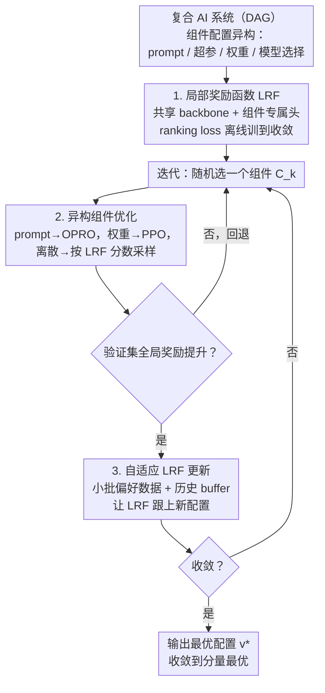

# Optimas: Optimizing Compound AI Systems with Globally Aligned Local Rewards

**会议**: ICLR 2026  
**arXiv**: [2507.03041](https://arxiv.org/abs/2507.03041)  
**代码**: [https://optimas.stanford.edu/](https://optimas.stanford.edu/)  
**领域**: LLM NLP / 系统优化  
**关键词**: 复合AI系统, 局部奖励函数, 全局对齐, 异构参数优化, 收敛保证

## 一句话总结
提出 Optimas 框架，为复合 AI 系统中每个组件维护一个与全局奖励对齐的局部奖励函数（LRF），使异构组件（prompt、模型参数、超参数、模型选择）可独立优化，在五个真实系统上平均提升 11.92%。

## 研究背景与动机
**领域现状**：现代 AI 系统越来越多地集成 LLM、检索器、工具调用、传统 ML 模型等多个组件，形成复合 AI 系统来处理复杂任务。这些系统对组件故障高度敏感——一个组件的错误会沿 pipeline 级联放大。

**现有痛点**：(a) 组件间不可微分，无法端到端梯度优化；(b) 配置空间高度异构——文本 prompt、连续超参数、模型权重、离散模型选择等需要完全不同的优化策略；(c) 每次评估全局性能都需运行完整系统，成本高昂，数据效率低下。

**核心矛盾**：现有方法（DSPy 优化 prompt、TextGrad 用文本反馈优化、OPRO 单步优化）只能处理**单一类型**的参数。即使各组件独立优化到最佳，上游组件也无法感知下游偏好，组件间协作可能是次优的。缺乏统一框架来同时优化异构配置。

**核心idea**：为每个组件学习一个局部奖励函数（LRF），只要 LRF 与全局奖励保持对齐（即局部最优方向与全局一致），就可以用各组件最适合的方法独立优化，无需频繁运行全系统。这本质上将联合优化分解为多个独立的坐标优化问题。

## 方法详解

### 整体框架
Optimas 要解决的是一个很现实的难题：当一个 AI 系统由 LLM、检索器、工具、传统 ML 模型串成 pipeline 时，怎么把里面各种"长得完全不一样"的配置（prompt、超参、模型权重、模型选择）一起调到最优。它的整体思路是——不去碰那个不可微、跑一次很贵的全局目标，而是给每个组件配一个能预测"这个组件输出对最终结果好不好"的局部打分器（LRF），让每个组件各自闷头优化，只要这些局部打分始终和全局奖励同方向，整体就会一起变好。

整套流程分两步走。**先离线把 LRF 训好**：系统被建模成有向无环图 $\mathcal{G}=(\mathcal{C},\mathcal{E})$，含 $K$ 个组件 $\{C_k\}_{k=1}^K$，每个组件 $C_k$ 带一份配置策略 $\mathbf{v}_k$（prompt、超参、权重或模型选择），输入按拓扑序流过各组件产生输出 $y=f(x;\mathbf{v})$，全局目标是 $\mathbf{v}^{\star}=\arg\max_{\mathbf{v}} \mathbb{E}_{x\sim\mathcal{D}}[R(x,f(x;\mathbf{v}))]$。**再进迭代循环**：每一轮随机挑一个组件，用最适合它那类配置的优化器、以该组件的 LRF 为目标做局部优化；新配置先过一道验证集门控，只有确实抬高了全局奖励才被接受；接受后再用一小批新偏好数据轻量校准这个 LRF，让它跟上变了的系统、保持对齐。如此往复，直到收敛。Optimas 就这样把一个耦合的联合优化，拆成了一组可独立求解、又彼此对齐的坐标优化子问题。

### 关键设计

**1. 局部奖励函数（LRF）：给每个组件一个能预测全局贡献的打分器**

直接优化全局奖励 $R$ 的麻烦在于组件之间不可微、且每评一次都要跑完整个系统。LRF 的做法是为每个组件 $C_k$ 学一个评分函数 $r_k(x_k,y_k)$，专门评估它的输出对最终全局性能的贡献。所有组件的 LRF 共享同一个 LLM backbone $\phi$，只在上面接一个组件特定的线性投影头 $h_k$，即 $r_k(x_k,y_k) = h_k \circ \phi([x_k, y_k])$——共享 backbone 让框架随组件数增长仍可扩展，独立的头则各自捕获组件特异性。

LRF 之所以能替代全局奖励，靠的是一条"对齐性质"：如果 $r_k(x_k,y_k^+) \geq r_k(x_k,y_k^-)$，那么把组件输出从 $y_k^-$ 换成 $y_k^+$ 后，下游整套系统拿到的全局奖励也应该更高。为此训练用 pairwise log-sigmoid ranking loss

$$\mathcal{L}_k = -\mathbb{E}\big[\log\sigma\big(r_k(x_k,y_k^+)-r_k(x_k,y_k^-)\big)\big]$$

其中偏好对 $(y_k^+, y_k^-)$ 这样自动构造：把系统跑到 $C_k$、记下部分轨迹，再为 $C_k$ 采两个候选输出（高温解码或换超参），用 Monte Carlo 估计各自带来的全局奖励，高的标 $y_k^+$、低的标 $y_k^-$，全程不需人工标注。这条 loss 正是"把全局优化拆成独立局部优化"的理论基石——Theorem 4.1 证明它的最小化解必然满足上面的对齐性质。

**2. 异构组件优化：每类参数用最适合它的优化器，由 LRF 统一指挥**

有了对齐的 LRF，各组件就能用各自最擅长的方法独立优化，而不必再频繁跑全系统。文本 prompt 用 OPRO，按候选 prompt 在 LRF 上的平均分数排序选最优；可训练模型（如 LLM 权重）用 PPO 这类 RL 算法，直接拿 LRF 当 critic 提供奖励信号；离散或低维连续配置（模型选择、超参）则基于 LRF 分数构建一个概率分布来采样更新。每轮只随机挑一个组件来动，更新还套了一层验证门控——只有当新配置在一个小验证集上的全局奖励确实提升时才被接受，由此挡住可能沿 pipeline 级联放大的错误。

**3. 自适应 LRF 更新：配置一变就轻量校准，避免 LRF 过时**

LRF 不是训一次就能一直用：系统配置一旦更新，它就会过时——上游组件改了，会让同一个下游输出对应的全局价值发生变化（$r_i$ 失准）；下游组件改了，又会让 LRF 面对它没见过的分布外输入。这些偏差会随迭代累积，慢慢蚀掉对齐性质。如果每次都从头重训 LRF，开销又回到了原点。Optimas 用两阶段化解：Stage 1 先离线把每个 LRF 训到收敛，建立准确的初始对齐；Stage 2 在每次配置被接受后，只采一小批新偏好数据 $\mathcal{B}_k$ 做在线 adaptation，并维护一个历史 buffer 把旧偏好数据混进来稳住训练，从而以很低的成本让 LRF 持续跟上系统的变化、保持对齐。

### 理论保证
两条定理支撑了上面"局部优化等价于全局变好"的逻辑。**Theorem 4.1** 说明 LRF 的 ranking loss 最小化器满足局部-全局对齐性质，且最大化 LRF 与最大化条件全局奖励有相同的解，这让用 LRF 替代全局奖励在理论上站得住脚。**Theorem 4.2** 进一步表明，在紧致性和唯一分量最优等条件下，Optimas 会收敛到 component-wise maximum（这是坐标最大化经典结果的直接推论）；但作者也明确指出，块坐标更新在非凸问题上不保证全局最优，这是非凸优化的通病、需额外的 PŁ/KŁ 等结构假设才有全局收敛保证。

## 实验关键数据

### 主实验（五个真实复合系统）

| 系统 | 任务 | Unoptimized | DSPy | TextGrad | **Optimas** | 相对提升 |
|------|------|-------------|------|----------|-------------|----------|
| Amazon 产品推荐 | Acc | 21.21 | 18.18 | 20.88 | **24.24** | +14.3% |
| PubMedQA 医疗 | Acc | 57.46 | 60.26 | 56.96 | **69.13** | +1.8% |
| STaRK-Prime 检索 | MRR | 40.73 | 41.40 | 41.31 | **50.54** | +22.1% |
| HotpotQA RAG | F1 | 33.80 | 44.90 | 24.86 | **50.48** | +12.4% |
| BigCodeBench 代码 | Pass | 36.67 | 33.81 | 35.71 | **38.92** | +9.0% |

### 消融与关键分析

| 配置 | 说明 |
|------|------|
| Optimas (完整) | 全部组件使用对齐 LRF 独立优化，5 个系统全部提升 |
| w/o LRF adaptation | 下降 2-5%，LRF 不更新导致对齐退化 |
| Global reward only | 下降 3-8%，缺乏局部信号数据效率低 |
| DSPy (仅prompt) | 在 Amazon 推荐上反而下降 14.3%，优化单一配置类型不可靠 |

- **Optimas 是唯一在全部 5 个任务上都提升性能的方法**；DSPy 和 TextGrad 在部分系统上反而降低性能
- LRF 排序准确率平均 77.96%，远超 LLM Judge (49.52%)，说明学习的 LRF 比直接用 LLM 打分更可靠
- 系统运行次数平均 0.71k vs DSPy 0.79k，数据效率更高
- LRF 的 adaptive update 是长期效果的关键——不更新时后期性能退化明显

### 关键发现
- 异构配置联合优化是决定性因素：仅优化 prompt 在行为驱动推荐（需要超参调整）上失效
- LRF 的对齐性质在实践中确实成立——局部改进一致地带来全局提升
- 复合系统中的瓶颈组件各不相同：Amazon 推荐的瓶颈在超参，HotpotQA 的瓶颈在 prompt

## 亮点
- 统一框架处理异构配置优化，DSPy/TextGrad 只能单类型
- LRF 对齐有严格理论保证（收敛到分量最优）
- 共享 backbone + 独立头的 LRF 架构可扩展且内存高效
- 5 个真实系统上一致提升，DSPy 在 Amazon 上反而下降 14.3%

## 局限与展望
- 坐标最大化在非凸问题中只保证分量最优，非全局最优
- LRF 在线适配仍需少量系统运行和 Monte Carlo 采样，成本并非为零
- 实验中组件数量有限（2-5个），更大规模系统的可扩展性未验证
- LRF 共享 backbone 在组件输入分布差异极大时可能学习冲突表征

## 与相关工作的对比
- **DSPy/TextGrad**: 仅优化 prompt，不支持异构配置；DSPy 在部分任务上性能不稳定
- **OPRO**: 单步生成优化，无法处理多组件多步骤
- **LLMSelector**: 仅做模型路由，系统运行成本 3x 于 Optimas
- **过程奖励模型**: 依赖人工标注或 MCTS，Optimas 通过偏好自动构造对齐数据

## 评分
- 新颖性: ⭐⭐⭐⭐ (LRF 对齐思路新颖，统一异构优化)
- 实验充分度: ⭐⭐⭐⭐⭐ (5 个真实系统 + 丰富消融 + 理论分析)
- 写作质量: ⭐⭐⭐⭐ (结构清晰，图表丰富)
- 价值: ⭐⭐⭐⭐ (复合 AI 系统优化是重要方向)

<!-- RELATED:START -->

## 相关论文

- [\[ICML 2026\] Optimizing Diversity and Quality through Base-Aligned Model Collaboration](../../ICML2026/llm_nlp/optimizing_diversity_and_quality_through_base-aligned_model_collaboration.md)
- [\[ICLR 2026\] ELLMob: Event-Driven Human Mobility Generation with Self-Aligned LLM Framework](ellmob_event-driven_human_mobility_generation_with_self-aligned_language_models.md)
- [\[ACL 2026\] Characterizing the Expressivity of Local Attention in Transformers](../../ACL2026/llm_nlp/characterizing_the_expressivity_of_local_attention_in_transformers.md)
- [\[ICLR 2026\] Speculative Actions: A Lossless Framework for Faster AI Agents](speculative_actions_faster_ai_agents.md)
- [\[ACL 2026\] Generative Floor Plan Design with LLMs via Reinforcement Learning with Verifiable Rewards](../../ACL2026/llm_nlp/generative_floor_plan_design_with_llms_via_reinforcement_learning_with_verifiabl.md)

<!-- RELATED:END -->
