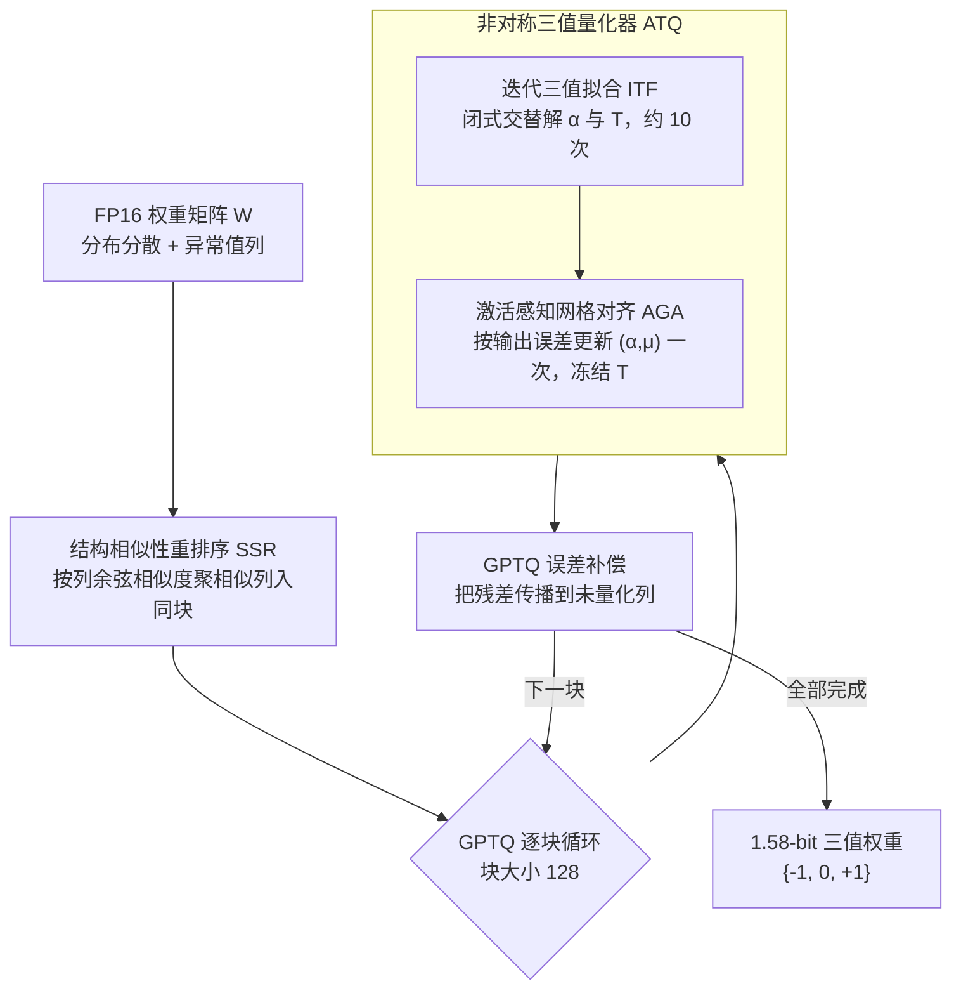

# PT2-LLM: Post-Training Ternarization for Large Language Models

**会议**: ICLR 2026  
**arXiv**: [2510.03267](https://arxiv.org/abs/2510.03267)  
**代码**: [GitHub](https://github.com/XIANGLONGYAN/PT2-LLM)  
**领域**: LLM/NLP  
**关键词**: 三值化, 后训练量化, 极低比特, LLM压缩, 列重排序

## 一句话总结

提出 PT2-LLM，首个针对 LLM 的后训练三值化框架，通过非对称三值量化器（含迭代三值拟合和激活感知网格对齐）与结构相似性重排序策略，在 1.58-bit 下实现优于 2-bit PTQ 方法的性能。

## 研究背景与动机

三值化（权重约束为 $\{-1, 0, +1\}$）是极致压缩方案：
- 相比低比特量化（2-4 bit），三值化消除了大部分浮点乘法，仅需加法运算
- 相比二值化，三值化更好匹配 LLM 权重的单峰分布，表达能力更强

现有三值化方法（BitNet b1.58、TernaryLLM）均依赖 QAT，对 LLM 不切实际。PTQ-based 三值化面临两大挑战：
1. 无法通过梯度优化三值参数——需要训练无关的参数优化方案
2. 权重分布分散且存在异常值——极低比特量化误差更大

## 方法详解

### 整体框架

PT2-LLM 想解决一个很尖的问题：把 LLM 权重压到 1.58-bit（三值 $\{-1,0,+1\}$）还要保住精度，而且**不许梯度训练**——必须在纯后训练（PTQ）设定下完成。它把整套三值化嵌进 GPTQ 的逐块误差补偿流程：原始 FP16 权重矩阵先经**结构相似性重排序（SSR）**重新排列列序，让接下来要成块的那批列分布尽量紧凑；随后 GPTQ 按块大小 128 逐块处理，每个块交给**非对称三值量化器（ATQ）**拟合成最优三值表示；量化完一块就用 GPTQ 的误差补偿把这块的残差传播到尚未量化的列，再循环处理下一块，直到全矩阵变成三值权重。ATQ 内部又靠两个训练无关的子阶段接力打磨——先用迭代三值拟合（ITF）把权重量化误差压到最低，再用激活感知网格对齐（AGA）借校准数据把优化目标切到输出误差上做一次对齐。全程只用闭式解和少量校准数据，没有任何反向传播。

### 关键设计

**1. 结构相似性重排序 SSR：把相似列聚到同一块以驯服异常值**

GPTQ 式分块三值化按原始列序切块，同一块里常混进方差悬殊的列和孤立的异常值列——块内方差高让三值网格太粗、量化误差大，离群列又会把整块的量化范围撑歪。单块只有一组 $(\alpha,\mu)$，难以同时照顾这两类列。SSR 在切块前先按列间余弦相似度衡量结构接近程度，

$$S_{ij}=\frac{\mathbf{W}_{:,i}^\top\mathbf{W}_{:,j}}{\|\mathbf{W}_{:,i}\|_2\|\mathbf{W}_{:,j}\|_2}$$

把方向对齐、数值相近的列聚到同一个量化块，使块内分布更紧凑、共享网格更贴合；离群列彼此聚拢后相对块内参考反而不再突兀，正是论文那句"异常值之间不再是异常值"。重排只是列的置换 $\mathbf{W}'=\mathbf{W}\mathbf{P},\ \mathbf{X}'=\mathbf{X}\mathbf{P}$，满足 $\mathbf{X}'\mathbf{W}'^\top=\mathbf{X}\mathbf{W}^\top$，所以不改变矩阵乘的结果、推理几乎零开销。但 GPTQ 逐块量化有块间依赖（每量化一块都做误差补偿），一次性聚类失效、每步重新全量聚类又太贵，因此 SSR 采用轻量贪心：每步从残差子矩阵算出均值参考 $\bar{\mathbf{w}}$，挑出与它最相似的 top-$k$ 列（$k$ 取量化块大小）组成下一个块，既保住重排收益又把开销压到最低。

**2. 非对称三值量化器 ATQ：用行偏移 + 闭式迭代把单块权重拟合成最优三值表示**

LLM 权重并非零均值对称分布，很多层整体偏置不为零，若直接套对称三值网格 $\hat{\mathbf{W}}=\alpha\mathbf{T}$ 会系统性偏移整行——这在 QAT 里靠反传重塑分布尚可，但 PTQ 下权重冻结、行不通。ATQ 为每行引入偏移 $\mu$（初始化为该行均值），把量化形式改成 $\hat{\mathbf{W}}=\alpha\mathbf{T}+\mu$，让网格中心对齐每行的真实均值。真正的难点是没有梯度还要同时定出尺度 $\alpha$ 和三值矩阵 $\mathbf{T}$，**ITF** 用交替闭式解破局：固定 $\mathbf{T}$ 时尺度有解析最优

$$\alpha^* = \frac{m\cdot(\mathbf{W}\circ\mathbf{T})\mathbf{1} - (\mathbf{T}\mathbf{1})\circ(\mathbf{W}\mathbf{1})}{m\cdot(\mathbf{T}\circ\mathbf{T})\mathbf{1} - (\mathbf{T}\mathbf{1})^2}$$

固定网格时三值矩阵按 $\mathbf{T}_{ij}^*=\arg\min_{t\in\{-1,0,1\}}|Z_{ij}-t|$ 灵活取整，其中归一化坐标 $Z_{ij}=(W_{ij}-\mu_i^*)/\alpha_i^*$；每步都有解析最优，约 10 次迭代即收敛。ITF 只盯权重本身的量化误差 $\mathcal{E}_w=\|\mathbf{W}-\hat{\mathbf{W}}\|_F^2$，但真正影响下游的是权重和激活相乘后的输出，因此再叠一层 **AGA**：把目标换成激活感知的输出误差 $\mathcal{E}_x=\|\mathbf{WX}-\hat{\mathbf{W}}\mathbf{X}\|_F^2$，对 $(\alpha,\mu)$ 求导置零同样得到闭式解。理论上还可继续更新 $\mathbf{T}$，但它无解析最优、贪心搜索又会在小校准集上严重过拟合，于是 AGA 冻结 $\mathbf{T}$、只更新 $(\alpha,\mu)$ 一次，既把网格校正到激活敏感方向、又躲开过拟合。

### 损失函数 / 训练策略

两阶段优化目标不同：ITF 最小化权重量化误差 $\mathcal{E}_w=\|\mathbf{W}-\hat{\mathbf{W}}\|_F^2$，AGA 切换为输出误差 $\mathcal{E}_x=\|\mathbf{WX}-\hat{\mathbf{W}}\mathbf{X}\|_F^2$ 且仅对 $(\alpha,\mu)$ 更新一次（$\mathbf{T}$ 冻结）。量化块大小取 128，整体与 GPTQ 框架逐块集成、复用其 Hessian 引导的误差补偿。

## 实验关键数据

### 主实验（LLaMA-7B 零样本问答）

| 方法 | #W (bit) | Wiki2 PPL ↓ | C4 PPL ↓ | 7任务平均 Acc ↑ |
|------|---------|------------|---------|--------------|
| FP16 | 16 | 5.68 | 7.34 | 61.73% |
| AWQ 2-bit | 2 | 2.60e5 | 2.86e5 | 32.50% |
| GPTQ 2-bit | 2 | 129.19 | 79.06 | 34.35% |
| Slim-LLM 2-bit | 2 | 14.58 | 30.71 | 39.74% |
| PB-LLM 1.7-bit | 1.7 | 82.76 | 76.63 | 33.44% |
| **PT2-LLM 1.58-bit** | 1.58 | **11.39** | **24.55** | **45.07%** |

### LLaMA-13B 结果

| 方法 | #W (bit) | Wiki2 PPL ↓ | 7任务平均 Acc ↑ |
|------|---------|------------|--------------|
| FP16 | 16 | 5.09 | 63.81% |
| GPTQ 2-bit | 2 | 20.46 | 41.00% |
| **PT2-LLM 1.58-bit** | 1.58 | **8.93** | **49.14%** |

### 关键发现

- PT2-LLM 在 1.58-bit 下超越所有 2-bit PTQ 方法，内存占用更低
- ITF 和 AGA 两阶段优化分别降低权重误差和输出误差
- SSR 有效降低块内方差，离群列的聚集使其不再成为异常值
- 推理加速：prefill 和 decode 阶段均实现端到端加速

## 亮点与洞察

- 首次在 PTQ 设置下实现 LLM 三值化，填补重要空白
- ITF 的交替优化策略优雅——每步都有闭式最优解，无需梯度优化
- AGA 的关键设计决策：冻结 $\mathbf{T}$ 仅更新网格参数，有效避免过拟合
- SSR 的直觉精辟："异常值之间不再是异常值"

## 局限与展望

- 1.58-bit 精度仍与 FP16 有较大差距（如 LLaMA-7B 平均精度 45% vs 62%）
- SSR 每步重新计算相似度有一定开销
- 未与 QAT-based 三值化方法（BitNet b1.58）直接对比
- 仅验证了 LLaMA 系列，未覆盖 Qwen、Mistral 等模型

## 相关工作与启发

- 与 GPTQ 的关系：PT2-LLM 在 GPTQ 框架内进行三值化，继承其逐块误差补偿
- 与 BitNet b1.58 的区别：PT2-LLM 是 PTQ 方案，无需从头训练
- 启示：极低比特 PTQ 仍有很大空间，非对称量化和结构感知重排序是有效方向

## 评分

- 新颖性: ⭐⭐⭐⭐ PTQ 三值化是未探索的设定
- 实验充分度: ⭐⭐⭐⭐ 多模型多任务验证，消融全面
- 写作质量: ⭐⭐⭐⭐ 数学推导清晰，可视化直观
- 价值: ⭐⭐⭐⭐ 为极低比特 LLM 部署提供新选择

<!-- RELATED:START -->

## 相关论文

- [\[NeurIPS 2025\] Q♯: Provably Optimal Distributional RL for LLM Post-Training](../../NeurIPS2025/llm_nlp/qsharp_provably_optimal_distributional_rl_for_llm_post-training.md)
- [\[ICLR 2026\] The Lattice Representation Hypothesis of Large Language Models](the_lattice_representation_hypothesis_of_large_language_models.md)
- [\[ACL 2025\] Self-Training Elicits Concise Reasoning in Large Language Models](../../ACL2025/llm_nlp/self-training_elicits_concise_reasoning_in_large_language_models.md)
- [\[ACL 2025\] Cool-Fusion: Fuse Large Language Models without Training](../../ACL2025/llm_nlp/cool-fusion_fuse_large_language_models_without_training.md)
- [\[ICLR 2026\] Toward Safer Diffusion Language Models: Discovery and Mitigation of Priming Vulnerabilities](toward_safer_diffusion_language_models_discovery_and_mitigation_of_priming_vulne.md)

<!-- RELATED:END -->
