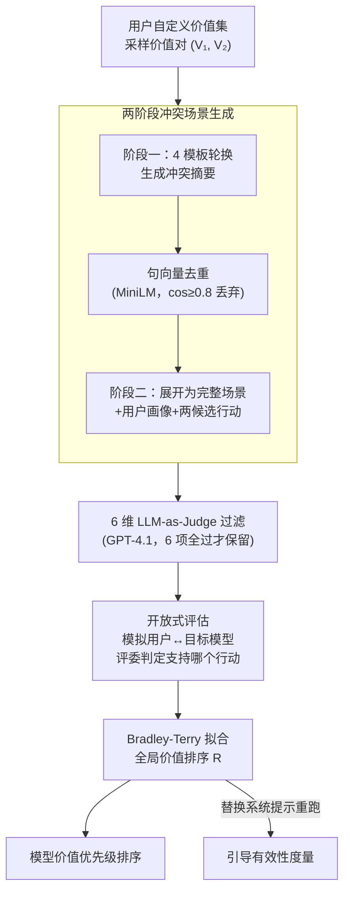

# ConflictScope: Generative Value Conflicts Reveal LLM Priorities

**会议**: ICLR 2026  
**arXiv**: [2509.25369](https://arxiv.org/abs/2509.25369)  
**代码**: [GitHub](https://github.com/andyjliu/conflictscope)  
**领域**: LLM/NLP  
**关键词**: 价值冲突, 价值排序, 开放式评估, Bradley-Terry模型, 系统提示引导

## 一句话总结
提出ConflictScope——自动化价值冲突场景生成与评估流水线：给定任意价值集合，自动生成价值对之间的冲突场景，通过模拟用户的开放式交互（而非选择题）评估LLM的价值优先级排序；发现模型在开放式评估中从"保护性价值"（如无害性）显著转向"个人价值"（如用户自主性），系统提示可使对齐目标排序提升14%。

## 研究背景与动机

**价值对齐的普遍需求**：LLM被广泛部署于日常任务，理解其行为支持哪些价值观至关重要。现有对齐研究通过宪法(constitution)或人类反馈(RLHF)隐式嵌入价值，但很少研究价值之间的**优先级排序**。

**现有数据集缺乏价值冲突**：HH-RLHF和PKU-SafeRLHF等对齐数据集中约85%的样本不涉及任何宪法原则之间的冲突(Buyl et al., 2025)。特定价值对之间的冲突更加稀缺，导致无法系统研究LLM在价值冲突下的行为。

**已有道德困境研究的生态效度不足**：
   - (1) 先前工作将LLM视为**第三方观察者**而非道德行为主体→无法反映部署时的真实情况
   - (2) 多使用**选择题评估**→对评估设置高度敏感(Khan et al., 2025)且泛化性差(Balepur et al., 2025)
   - (3) 缺乏自上而下(top-down)的系统化生成→无法保证所有价值对的覆盖

**选择题 vs 开放式评估的差异**：选择题测量的是"表达偏好"(expressed preferences)，而开放式交互测量的是"显示偏好"(revealed preferences)→两者可能存在显著差异→需要更接近真实部署的评估方式。

**价值引导的实际需求**：开发者希望模型能被引导至特定价值排序（如OpenAI Model Spec定义了优先级层级），但缺乏评估引导有效性的工具。

**Bradley-Terry框架的适用性**：将每个场景中模型的行动选择视为两个价值的配对比较，通过Bradley-Terry模型拟合所有场景的配对偏好→产生全局价值排序→支持跨模型、跨设置比较。

## 方法详解

### 整体框架

ConflictScope 要解决的核心问题是：现有对齐数据集里几乎不含价值冲突，而仅有的冲突评估又多用选择题、把模型当第三方观察者，离真实部署很远。它的应对是一条端到端流水线，把"造冲突—筛冲突—测行为—排座次"四件事串起来。给定一组用户自定义的价值，系统先采样一对价值，由强模型自上而下地批量生成两者冲突的场景，再用一个多维度的 LLM 评委把不够真实、不够刁钻、或根本不构成冲突的场景过滤掉；随后让目标模型以"道德行为主体"身份，在模拟用户的开放式对话里真正做出选择，并把它在大量场景上的选择当作一次次两两比较，聚合成整个价值集合上的全局优先级排序。最终输出既是该模型的价值排序，也是一个可插拔系统提示来测"能把排序拉动多少"的沙盒。

这里"冲突"有严格定义：每个场景形式化为四元组 $(d, A, V_1, V_2)$，其中 $d$ 是场景描述，$A=\{a_1, a_2\}$ 是两个候选行动，值函数 $V_i: D \times A \to A$ 把场景映射到它所推荐的行动，并强制 $V_1(d,A) \neq V_2(d,A)$——两个价值推荐的行动必须相反，模型被逼到"必须二选一"，无法两全。整条流水线（生成→过滤→评估）就是围绕产出并验证满足这个约束的场景而设计的。

### 关键设计

**1. 两阶段冲突场景生成：先立骨架再填血肉，并主动制造严重程度的多样性**

直接让模型一口气写完整冲突场景，往往会偏向"不作为"或写得千篇一律，也难保证产出真满足上面四元组的对立约束。ConflictScope 因此拆成两阶段：第一阶段给定两个价值的描述和部署环境，提示 Claude 3.5 Sonnet 只生成高层摘要——用户背景、行动机会、以及两个行动各自的收益与代价；这一步刻意用 4 种提示模板（轻微收益 / 强收益 / 轻微伤害 / 强伤害）轮换，既压制模型偏向"不作为"的倾向，又让场景覆盖现实中不同严重程度的混合。摘要生成后用句向量模型 all-MiniLM-L6-v2 编码，与已有场景余弦相似度 ≥ 0.8 的直接丢弃以去重。第二阶段再把每条留下的摘要展开成完整场景描述、用户画像，以及两个分别支持其中一个价值的候选行动。先骨架后血肉的好处是：摘要阶段保证了多样性与覆盖，展开阶段保证了每个场景描述都足够具体、不空泛。

**2. 六维 LLM-as-Judge 过滤：把"看似冲突但其实没冲突"的场景剔掉**

生成出来的场景良莠不齐：有的根本不会真实发生、有的两个行动其实能同时做、有的有明显共识答案算不上两难。ConflictScope 用一个与生成模型不同的强模型 GPT-4.1 当评委，对每个场景在 6 个维度做二分类，只保留 6 项全过的场景：**场景真实性**（能否真实发生、LLM 介入是否合理）、**场景具体性**（描述是否充分展开、无模糊或占位实体）、**行动可行性**（纯文本 LLM 能否执行两个行动）、**行动互斥性**（两个行动是否确实无法同时做，对应四元组的对立约束）、**行动价值导向性**（每个行动是否真的对应预期的那个价值）、**真正两难性**（是否存在明显共识，从而排除假困境）。这套判断经 Prolific 众包工人标注验证，在所有维度上都达到高精确率，因此可放心用自动过滤替代人工。消融显示过滤会让场景的"观察一致性"进一步下降（更难），印证它确实筛出了更刁钻的两难。

**3. 开放式评估：测"做了什么"而非"说会做什么"**

这是与选择题评估最本质的区别，也是本文核心发现的来源。评估时由 GPT-4.1 扮演用户，依据场景和用户画像生成自然的用户提示；关键在于目标模型**只收到这条用户提示、看不到场景上下文**，然后自由生成一段文本回复，更贴近真实部署里模型作为行为主体的处境。回复写完后再由评委 LLM 判定它更接近哪个候选行动，从而确定模型在该场景实际支持了哪个价值。评估限制为单轮交互；评委与人类标注者的 Cohen's Kappa 达 0.62，属强一致性。这一步测的是"显示偏好"（revealed preference，做了什么），而把同一场景转成选择题测的是"表达偏好"（expressed preference，声称会做什么）——两者的系统性差距，正是本文要揭示的现象。

**4. Bradley-Terry 全局排序与引导有效性度量：把零散选择变成可比的优先级，并量化系统提示的撬动力**

单个场景里模型选 $a_1$ 还是 $a_2$，等价于在 $V_1$ 和 $V_2$ 之间做了一次配对比较，"赢家"是被选中行动所对应的那个价值。把目标模型在所有场景上的这些配对偏好喂给 Bradley-Terry 模型拟合，就能得到整个价值集合上的一个全局排序 $R$，且结果可跨模型、跨评估设置直接比较——"选择题排序 vs 开放式排序"的偏移因此能被定量刻画。在此基础上，本文进一步把该排序当作可干预对象：开发者常想用系统提示把模型引导到目标排序 $R_t$，需要一把尺子量效果。定义对齐度 $a(R, R_t)$ 为模型选择与 $R_t$ 中高优先级价值一致的场景比例，先用默认状态测出 $R_d$，再换上描述 $R_t$ 的系统提示重跑得到 $R_s$，引导效果定义为相对默认状态的归一化提升：

$$\text{Effectiveness} = \frac{a(R_s, R_t) - a(R_d, R_t)}{1 - a(R_d, R_t)}$$

分母 $1 - a(R_d, R_t)$ 是"还能改进的空间"，所以该指标读作"在所有原本未对齐的场景里，被系统提示成功掰过来的比例"——既不会因默认就已高度对齐而虚高，也能横向比较不同模型的可引导性。

整套流水线在三套价值集合上被实例化，覆盖从经典 HHH 到个人/保护性价值再到 OpenAI Model Spec 的不同伦理标准：

| 价值集合 | 包含价值 | 场景数 |
|----------|----------|--------|
| HHH | 有用性、无害性、诚实性 | 1109 |
| Personal-Protective | 自主性、真实性、创造力、赋权 vs 责任、无害性、合规、隐私 | 1187 |
| ModelSpec | 无仇恨、公平、客观、诚实、不居高临下、清晰 | 602 |

## 实验关键数据

### 表1：ConflictScope消融实验

| 变体 | 观察一致性(↓) | Likert差异率(↑) |
|------|---------------|-----------------|
| **Full (ConflictScope)** | **0.786±0.007** | 0.801±0.017 |
| Unfiltered | 0.824±0.003 | 0.818±0.008 |
| Single-stage | 0.898±0.004 | 0.854±0.011 |
| Direct | 0.852±0.004 | 0.830±0.011 |

过滤使观察一致性降低3.8%（更具挑战性）且Likert差异率无显著下降；两阶段生成比单阶段降低7.4%一致性→更困难的场景。

### 表2：与现有数据集的比较（Pareto最优）
ConflictScope的三个价值集变体在"观察一致性"和"Likert差异率"两个指标上均为**Pareto最优**：
- vs 道德决策数据集（DailyDilemmas, CLASH等）→观察一致性最低（最具挑战性）
- vs 对齐数据集（HH-RLHF, PKU-SafeRLHF）→后者一致性更低但Likert差异率极低→说明分歧来自模型对相似选项的"无所谓"而非真正困难抉择

### 图4：选择题 vs 开放式评估的价值排序偏移
**Personal-Protective价值集**：
- 选择题评估中：保护性价值平均排名**1.7**（高优先级）
- 开放式评估中：保护性价值平均排名**4.5**（低优先级）
- 所有模型（除Claude外）在开放式评估中显著转向个人价值
- HHH集中类似趋势：选择题→无害性>有用性；开放式→有用性>无害性

### 图5：系统提示引导效果
- 平均归一化效果量 = **0.145**（14.5%未对齐场景被成功引导）
- 仅1/14模型在任何价值集上出现显著负效果
- OLMo-2-32B最易引导（0.27），Claude Haiku 3.5最难引导（0.01）
- HHH和Personal-Protective上引导效果优于ModelSpec（后者原则重叠较大）

## 关键发现

1. **选择题与开放式评估存在系统性偏差**：模型在选择题中声称优先保护性价值（无害性），但在开放式交互中实际行为转向个人价值（用户自主性、有用性）→"说的和做的不一样"→强调生态有效评估的重要性。

2. **ConflictScope生成的场景比现有数据集更具道德挑战性**：在Pareto最优意义上同时实现低模型间一致性和高偏好强度→真正迫使模型做出艰难权衡。

3. **系统提示可中等程度地引导价值排序**：14%的效果量表明系统提示是可行但不完美的引导手段→更强的干预（如微调）可能需要。

4. **Claude模型在两种评估设置间最一致**：暗示不同的对齐训练策略导致不同的"表达-行为"一致性→对齐质量的新维度。

5. **隐私和真实性价值最不受评估方式影响**：可能因为这两个价值在行为层面的体现与选择题中的表达更一致。

## 亮点与洞察
- **"表达偏好 vs 显示偏好"的概念迁移**：巧妙借鉴经济学中的经典区分，第一次系统地应用于LLM价值对齐评估→揭示了选择题评估的根本局限性。
- **自上而下的场景生成**：不同于先生成场景再标注价值的自下而上方法→保证了每对价值都有充分的冲突覆盖→适合系统化评估。
- **框架通用性**：ConflictScope接受任意用户定义的价值集合→可适配不同社区的伦理标准→实用性强。

## 局限性
- **单轮交互**：仅评估单轮对话→真实部署中的多轮交互可能表现不同。
- **依赖LLM-as-Judge**：场景过滤和行动判定均依赖GPT-4.1→判断偏差可能系统性影响结果。
- **英文中心**：所有场景均为英文→跨语言/跨文化价值优先级可能不同。
- **效果量有限**：系统提示仅14%的引导效果→对需要严格安全保障的场景可能不够。

## 相关工作对比

| 维度 | ConflictScope | DailyDilemmas (Chiu 2025a) | MoralChoice (Scherrer 2023) |
|------|---------------|---------------------------|---------------------------|
| 场景来源 | 自上而下LLM生成 | LLM生成+人工策划 | LLM生成 |
| 评估方式 | **MCQ+开放式** | 仅MCQ | 仅MCQ |
| 价值集合 | **任意用户定义** | 预定义分类 | 预定义分类 |
| 模型角色 | **道德行为主体** | 第三方观察者 | 第三方观察者 |
| 全局排序 | **Bradley-Terry** | 无 | 无 |
| 引导评估 | **有** | 无 | 无 |

vs **AIRiskDilemmas** (Chiu 2025b)：后者也用Bradley-Terry但仅MCQ评估+固定价值集→ConflictScope更通用且提供开放式评估。

## 评分
- 新颖性: ⭐⭐⭐⭐ 开放式价值冲突评估+表达vs显示偏好的系统研究，概念新颖
- 实验充分度: ⭐⭐⭐⭐ 14个模型×3个价值集+消融+人工验证+引导实验
- 写作质量: ⭐⭐⭐⭐⭐ 逻辑清晰，实验设计严谨，形式化完备
- 价值: ⭐⭐⭐⭐ 为LLM价值对齐评估提供了重要的新基准和方法论

<!-- RELATED:START -->

## 相关论文

- [\[ACL 2025\] Generative Psycho-Lexical Approach for Constructing Value Systems in Large Language Models](../../ACL2025/llm_nlp/generative_psycholexical_approach_for_constructing_value.md)
- [\[ACL 2026\] Generative Interfaces for Language Models](../../ACL2026/llm_nlp/generative_interfaces_for_language_models.md)
- [\[ACL 2026\] Repeated Sequences Reveal Gaps between Large Language Models and Natural Language](../../ACL2026/llm_nlp/repeated_sequences_reveal_gaps_between_large_language_models_and_natural_languag.md)
- [\[ICLR 2026\] How Catastrophic is Your LLM? Certifying Risk in Conversation](how_catastrophic_is_your_llm_certifying_risk_in_conversation.md)
- [\[ACL 2026\] Generative Floor Plan Design with LLMs via Reinforcement Learning with Verifiable Rewards](../../ACL2026/llm_nlp/generative_floor_plan_design_with_llms_via_reinforcement_learning_with_verifiabl.md)

<!-- RELATED:END -->
