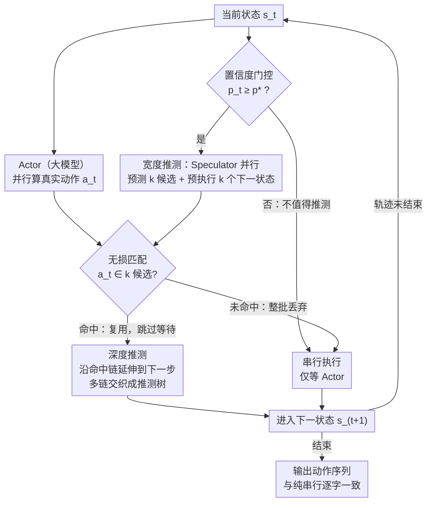

# Speculative Actions: A Lossless Framework for Faster AI Agents

**会议**: ICLR 2026 Oral  
**OpenReview**: [P0GOk5wslg](https://openreview.net/forum?id=P0GOk5wslg)  
**代码**: 无  
**领域**: 其他  
**关键词**: speculative execution, AI agents, latency reduction, lossless acceleration, MDP  

## 一句话总结
借鉴 CPU 推测执行和 LLM 推测解码的思想，提出 Speculative Actions 框架：在慢速 Actor（大模型）计算时用快速 Speculator（小模型）预测未来动作并预执行，匹配时跳过等待实现无损加速，在 Chess/电商/问答等场景实现 15-30% 延迟降低，置信度动态分支策略用 40% 更少 token 达到近似 3 条推测的加速效果。

## 研究背景与动机

**领域现状**：AI Agent 在环境中交互时遵循严格的串行模式：Agent 生成动作 → 环境响应 → Agent 生成下一步动作。使用大模型（如 GPT-5, Gemini-2.5-Pro）作为 Agent 时，每次 API 调用的延迟构成瓶颈。

**现有痛点**：(a) 推测解码仅加速 token 生成，不解决 Agent-环境交互延迟；(b) 现有 Agent 加速方法大多牺牲精度（如用小模型替代大模型）；(c) 没有理论框架分析 Agent 并行推测的成本-延迟权衡。

**核心矛盾**：大模型 Agent 精度高但慢，小模型快但不够准。能否两全——保持大模型的精度但获得近似小模型的速度？

**本文目标** 设计一个无损加速框架，利用大小模型的速度差异并行推测动作，在完全保持大模型输出质量的同时降低端到端延迟。

**切入角度**：CPU 推测执行的关键洞察——"预测然后验证"不会改变正确性，只影响效率。同样，在 Agent 交互中，预测动作并预执行，匹配就复用、不匹配就丢弃，结果与纯串行执行完全一致。

**核心 idea**：用快速小模型预测 Agent 动作并预执行环境步骤，预测正确时跳过一轮等待，保证输出轨迹与串行执行完全一致。

## 方法详解

### 整体框架
这篇论文要解决的痛点是大模型 Agent「精度高但慢」：Agent 与环境严格串行交互（生成动作 → 环境响应 → 再生成下一步），每一轮大模型 API 调用的延迟都被白白等掉。Speculative Actions 把 CPU 推测执行「预测-验证不改变正确性、只影响效率」的思想搬过来——让一个快速的 Speculator（小模型）和慢速的 Actor（大模型）并行跑：Speculator 抢先预测未来动作并预执行环境，Actor 慢慢算出真实动作；只要真实动作落在预测里就直接复用预执行结果、跳过一轮等待，否则丢弃重来。

整套流程逐步是：在每个状态先由**置信度门控**判断「这一步值不值得推测」，值得就让 Speculator 在**宽度**上并行押 $k$ 注、预执行出 $k$ 个下一状态；等 Actor 的真实动作到了，做一次精确匹配决定复用还是回退（**无损保证**）；一旦命中，就顺着命中链在**深度**上继续往后推，把单步加速接成多步链。无论命中与否，最终输出的动作序列都与纯串行执行逐字一致。

### 关键设计

**1. 置信度动态门控：只在小模型有把握时才推测，省下盲目押注的 token**

固定宽度 $k$ 的问题是不管小模型有没有把握都押满 $k$ 注，置信度低时纯属浪费。这里在每个状态先按置信度动态决定推不推：在第 $t$ 步当且仅当 $p_t \geq p^\star$ 时才接受推测，

$$\text{Accept speculation at step } t \iff p_t \geq p^\star$$

阈值 $p^\star$ 直接由成本-延迟的 cost ratio 解析算出，论文证明这一策略在成本约束下是理论最优的。效果上，它用比 $k=3$ 少约 40% 的 token，就拿到接近 $k=3$ 宽度推测的加速，把 token 都花在真正可能命中的步骤上。

**2. 宽度推测（Breadth Speculation）：在同一状态并行押 $k$ 注，多押几注就多一分命中机会**

某个状态值得推测时，最直接的加速就是在当前状态 $s_t$ 同时开多条推测：Speculator 并行预测 $k$ 个候选动作 $\{\hat{a}_t^{(i)}\}_{i=1}^k$，并为每个候选都提前算出下一状态、预先发起对应的 Actor 调用。这 $k$ 条推测彼此独立、可以完全并行铺开，命中概率随宽度上升 $p(k) = 1 - (1-p)^k$（$p$ 是单条推测的命中率），$k$ 越大命中越稳；代价是要付出 $k$ 倍的并行 token，所以宽度不能无脑加大——这也正是前面置信度门控存在的理由。

**3. 无损保证（Lossless Guarantee）：只在预测和真值精确匹配时复用，否则丢弃，轨迹与串行完全一致**

宽度押出的候选要能直接上线，前提是它不改变任何结果。Actor 只有在某个预执行结果与自己算出的真实动作 $a_t$ **精确匹配**时才复用缓存、跳过这一轮等待；一旦无一命中就把这批推测整个丢掉、退回正常串行执行。因此无论命中与否，最终输出的动作序列都与纯串行执行逐字一致（identical to sequential execution），推测只影响快慢、不影响对错。这让它可以作为纯后端优化对用户完全透明——用户不必信任小模型，也无需担心加速会引入错误。

**4. 深度推测（Depth Speculation）：命中之后顺着往下押，把单步加速接成多步链**

宽度推测一次只省一步，真正的加速来自把命中的推测继续往后接。一旦某条推测在当前步匹配成功，它就顺势延伸到下一步、再下一步，多条链交织成一棵推测树，让多步交互一次性提前跑完。直觉上深度越大计算量可能爆炸，但论文证明深度推测的总计算量被 Actor/Speculator 的速度比 $a/b$ 约束住，**不会随 horizon $T$ 指数增长**——只要小模型够快，深度推测就是划算的，且单步命中率越高、叠加出来的加速越明显。

### 理论结果
**延迟节省：** $\frac{E[T_{\text{seq}} - T_{\text{spec}}]}{E[T_{\text{seq}}]} \to \frac{p(k)}{1+p(k)} \cdot \frac{b}{a+b}$

**成本增加：** $\frac{E[M_{\text{spec}} - M_{\text{seq}}]}{E[M_{\text{seq}}]} \to \frac{k}{1+p(k)} - \frac{b}{a+b} \cdot \frac{p(k)}{1+p(k)}$

其中 Actor/Speculator 延迟分别服从 $\text{Exp}(\beta)$ 和 $\text{Exp}(\alpha)$。

## 实验关键数据

### 主实验

| 任务 | 推测数 $k$ | 延迟节省 | 额外 Token |
|------|-----------|---------|-----------|
| Chess | $k=1$ | 4-8% | ~91% |
| Chess | $k=2$ | 11-18% | ~155% |
| Chess | $k=3$ | 19-31% | ~180% |
| Chess | 置信度动态 | **16-25%** | **~88%** |

### 消融实验

| 分析维度 | 关键发现 |
|---------|---------|
| 下一步预测准确率 | 跨领域达 55% |
| 置信度动态 vs 固定 $k$ | 用 $k=1$ 的 token 成本达到 $k=3$ 的加速 |
| Lossy 模式 (OS Tuning) | 延迟降低 93.5%，成本降低 92% |
| Speculator 选择 | 同家族小模型（GPT-5-nano for GPT-5）效果最佳 |

### 关键发现
- **跨领域通用**：Chess、电商、问答、OS调优四个差异很大的领域都有效
- **置信度阈值是核心优化**：动态分支选择在 token 效率和延迟节省间取得最佳权衡
- **自托管部署免费推测**：使用 idle GPU 做推测几乎无额外成本
- **Lossy 扩展潜力大**：当允许有损时（OS Tuning），延迟和成本同时大幅降低

## 亮点与洞察
- **CPU 推测执行到 AI Agent 的完美类比**：CPU 推测执行已有 40+ 年历史，将其移植到 AI Agent 交互场景是非常自然但之前被忽略的方向
- **无损保证使其可直接部署**：作为后端优化对用户完全透明，不需要用户信任推测结果
- **理论指导最优策略**：不仅提出方法，还给出了 $p^\star$ 的理论最优阈值，避免了超参数搜索

## 局限与展望
- **依赖动作空间的可预测性**：如果 Agent 动作高度随机或创造性的任务（如开放式写作），预测准确率会很低导致推测浪费
- **仅适用于可确定性验证的环境**：需要能精确判断"预测动作 = 真实动作"，对于连续动作空间需要定义匹配阈值
- **未考虑 Speculator 训练**：使用现成的小模型作为 Speculator，未探索专门训练 Speculator 提升匹配率的可能

## 相关工作与启发
- **vs 推测解码**：推测解码加速 token 级生成，Speculative Actions 加速 action 级环境交互，两者可叠加使用
- **与 LoongRL 的关联**：LoongRL 的 plan-retrieve-reason-recheck 模式生成的动作序列可能高度可预测（尤其是 plan 和 retrieve 步骤），天然适合 Speculative Actions 加速

## 评分
- 新颖性: ⭐⭐⭐⭐ 类比经典思路到新场景，idea 优雅但不改变基础算法
- 实验充分度: ⭐⭐⭐⭐ 多任务验证+理论对齐，但缺少更大规模 Agent 任务
- 写作质量: ⭐⭐⭐⭐⭐ 理论推导严谨，系统设计清晰
- 价值: ⭐⭐⭐⭐⭐ 高实用价值，可直接部署加速现有 Agent 系统

<!-- RELATED:START -->

## 相关论文

- [\[AAAI 2026\] Whispering Agents: An Event-Driven Covert Communication Protocol for the Internet of Agents](../../AAAI2026/llm_nlp/whispering_agents_an_event-driven_covert_communication_protocol_for_the_internet.md)
- [\[ACL 2025\] FEAT: A Preference Feedback Dataset through a Cost-Effective Auto-Generation and Labeling Framework for English AI Tutoring](../../ACL2025/llm_nlp/feat_a_preference_feedback_dataset_through_a_cost-effective_auto-generation_and_.md)
- [\[ACL 2025\] Pre³: Enabling Deterministic Pushdown Automata for Faster Structured LLM Generation](../../ACL2025/llm_nlp/pre3_deterministic_pda_structured_gen.md)
- [\[ICLR 2026\] Optimas: Optimizing Compound AI Systems with Globally Aligned Local Rewards](optimas_optimizing_compound_ai_systems_with_globally_aligned_local_rewards.md)
- [\[AAAI 2026\] Blue Teaming Function-Calling Agents](../../AAAI2026/llm_nlp/blue_teaming_function-calling_agents.md)

<!-- RELATED:END -->
