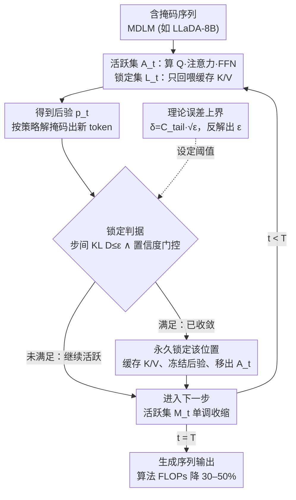

# Stopping Computation for Converged Tokens in Masked Diffusion-LM Decoding

**会议**: ICLR 2026  
**arXiv**: [2602.06412](https://arxiv.org/abs/2602.06412)  
**代码**: [https://daioba.github.io/surelock](https://daioba.github.io/surelock)  
**领域**: LLM/NLP  
**关键词**: Masked Diffusion LM, 推理加速, Token Locking, KL散度, KV Cache

## 一句话总结
提出 SureLock，当 Masked Diffusion LM 中已 unmask 的 token 后验分布稳定后永久锁定该位置（跳过 Q 投影和 FFN，缓存 KV），将每步注意力计算从 $O(N^2d)$ 降为 $O(MNd)$，在 LLaDA-8B 上减少 30-50% FLOPs 且不损生成质量。

## 研究背景与动机

**领域现状**：Masked Diffusion LM（MDLM，如 LLaDA、Dream）通过迭代去噪生成文本，每步需对所有 $N$ 个 token 位置重算注意力和 FFN，计算复杂度 $O(N^2d)$。

**现有痛点**：很多 token 在被 unmask 后后验分布迅速稳定，但标准采样器仍为它们重复计算——大量无效计算。现有加速方法要么减少步数（temporal），要么跨步复用 KV（reuse），但每步内仍发射 $N$ 个 query 行，空间复杂度不变。

**核心矛盾**：MDLM 的双向注意力要求每步全量计算，但大部分 unmask token 实际上已"收敛"，不需要重算。

**本文目标** 如何识别并永久跳过已收敛 token 的计算，实现单调递减的每步计算量？

**切入角度**：监测每个 token 位置相邻步之间的 KL 散度，低于阈值则永久锁定。

**核心 idea**：后验稳定的 token 永久退出计算（锁定 KV、跳过 Q/FFN），活跃集随采样推进单调收缩。

## 方法详解

### 整体框架
MDLM 的麻烦在于：双向注意力让每步迭代都要对全部 $N$ 个 token 重算 Q 投影、注意力和 FFN，复杂度 $O(N^2d)$，可现实是很多 token 在被 unmask 后后验早已稳定，这些重算纯属浪费。SureLock 的整体思路就是把"已经收敛的位置"永久请出计算流程。每一步它维护两个集合：活跃集 $\mathcal{A}_t$ 里的位置照常算 Q、注意力和 FFN，锁定集 $\mathcal{L}_t$ 里的位置则全部跳过、只保留之前缓存好的 $K, V$。算完后验、解出新 token，再用一个廉价的收敛判据（步间 KL，可选叠加置信度门控）筛出已稳定的位置锁死——缓存它们的 K/V、冻结后验、把它们移出活跃集。随着采样推进活跃集只减不增，每步计算量从 $O(N^2d)$ 一路降到 $O(M_tNd)$（$M_t$ 是当前活跃位置数），且因为锁定 token 仍能被其他位置通过缓存 attend 到，信息不丢。判据里那个阈值 $\varepsilon$ 不是拍脑袋设的：一条闭式定理把它映射到终端误差上界，给"该锁多激进"提供了可算的预算。

### 关键设计

**1. 永久锁定 + KV 缓存：把收敛位置一次性移出计算流程**

针对的痛点是标准采样器对所有 unmask token 一视同仁地重复计算。SureLock 一旦判定位置 $i$ 在第 $t^*$ 步收敛，就把它锁死——此后每一步都跳过它的 Q 投影和 FFN，后验直接冻结为锁定时刻的值 $\hat{p}_t^{(i)} = p_{t^*}^{(i)}$。锁定的位置从活跃集移到锁定集，活跃集定义为 $\mathcal{A}_t = \bar{\mathcal{M}}_t \setminus \mathcal{L}_t$（已 unmask 且尚未锁定）。但锁定不等于消失：通过 $K^{\text{all}}[\mathcal{L}_t] \leftarrow \mathcal{C}.k[\mathcal{L}_t]$（V 同理）把缓存的键值喂回注意力，其他活跃 token 照样能 attend 到这些位置，所以信息不丢。计算量上，注意力从 $O(N^2d)$ 降为 $O(M_tNd)$、FFN 从 $O(Nd^2)$ 降为 $O(M_td^2)$。和 dLLM-Cache 这类选择性更新方法的根本区别在于决策对象：后者每步重新挑"现在算哪些"，活跃集可增可减；SureLock 决定的是"永久移除哪些"，活跃集只减不增，因此每步计算量单调下降、可预测。

**2. 锁定判据：步间 KL 散度为主、置信度门控为辅**

要落地"永久移除"就得有个廉价又可靠的收敛信号。主判据是相邻两步后验分布的 KL 散度

$$D_t^{(i)} \triangleq \text{KL}(p_t^{(i)} \| p_{t-1}^{(i)})$$

当它降到阈值 $\varepsilon$ 以下就把该位置标记为收敛。局部 KL 的好处是几乎免费——后验本来就要算。在此之上还可叠加一道**可选的置信度门控**作为兜底：光看 KL 偶尔会误判，某个位置可能两步之间碰巧变化小、但后验还很平远没定下来。门控用不确定度 $u_t^{(i)} = 1 - \max_v p_t^{(i)}(v)$，只接受落在活跃 token 前 $m\%$ 最自信范围内（$u_t^{(i)} \leq q_m(u_t)$）的位置进入锁定候选。最终锁定规则是 $D_{t^*}^{(i)} \leq \varepsilon \wedge u_{t^*}^{(i)} \leq q_m(u_{t^*})$；门控关掉时单靠 KL 也能跑，且不影响下面的理论保证。

**3. 理论误差上界：把局部 KL 接到全局误差上**

这一设计点回答"凭什么用一个廉价的局部 KL 就敢永久锁定"。Theorem 1 给出闭式界

$$\|\log p_T^{(i)} - \log \hat{p}_T^{(i)}\|_\infty \leq C_{\text{tail}}\sqrt{D_{t^*}^{(i)}}$$

其中 $C_{\text{tail}} = L_{\text{sm}} L / (1 - \sqrt{\rho})$ 由模型的算子范数常数决定。它把锁定那一刻的、廉价可算的局部 KL $D_{t^*}^{(i)}$ 直接映射到最终 token 对数概率相对"不锁定基准"的全局偏差上限。于是阈值不再靠试错：给定可容忍的终端误差 $\delta = C_{\text{tail}}\sqrt{\varepsilon}$，直接反解 $\varepsilon(\delta) = \delta^2 / C_{\text{tail}}^2$。作者强调这个界**刻意保守、是设计导向而非精确预测器**，且依赖 A2（几何尾收缩）等较强假设。

### 损失函数 / 训练策略
SureLock 是**无训练**的推理时方法，不修改模型参数。与已有的 temporal（减步数）和 reuse（跨步复用 KV）加速方法正交，可叠加组合。

## 实验关键数据

### 主实验

**LLaDA-8B-Instruct (MT-Bench + WikiText-103)**:

| 配置 | FLOPs 减少 | 生成质量 |
|------|-----------|---------|
| Baseline (无锁定) | 0% | 基线 |
| SureLock (ε=0.01) | ~30% | ≈基线 |
| SureLock (ε=0.05) | ~50% | ≈基线 |
| SureLock (ε=0.1) | ~50%+ | 略降 |

### 消融实验

| 配置 | FLOPs 节省 | 质量 | 说明 |
|------|-----------|------|------|
| 仅 KL 判据 | 与完整版相当 | ≈ | KL 足够作为唯一判据 |
| 仅 confidence gate | 较少 | 保持 | 单独置信度不够激进 |
| 无 KV 缓存 | 同等 FLOPs | 显著下降 | 锁定 token 不可被 attend 导致信息丢失 |

### 关键发现
- 活跃位置数 $M_t$ 随步数**单调递减**，验证了"收敛 token 越来越多"的假设
- 30-50% FLOPs 减少在 WikiText-103 困惑度和 MT-Bench 评分上**零损失或极微下降**
- 与 temporal 方法（减少步数）和 reuse 方法（跨步复用 KV）正交，可叠加使用
- 理论界虽然保守（设计导向而非精确预测），但提供了调参($\varepsilon$)的明确指导

## 亮点与洞察
- **从"选择哪些计算"到"永久移除哪些计算"**：这种视角转换是关键创新。活跃集只收缩不扩张，使计算曲线单调下降，比选择性更新方法预测性更强。
- **理论-实践闭环**：KL 阈值 → 终端误差上界的闭式关系为超参选择提供了不靠调参的理论基础，这在系统加速工作中难得。
- **与 d²Cache 形成互补**：d²Cache 是细粒度选择"每步更新哪些 token"，SureLock 是永久移除已收敛 token——两者可以组合。

## 局限与展望
- Theorem 1 的几何尾收缩假设(A2)较强，实际中后验变化不一定严格满足
- 永久锁定有不可撤销风险——如果 token 在锁定后因其他位置变化而"需要"改变，无法恢复
- 仅在 LLaDA-8B 上验证，其他 MDLM（如 Dream、MDLM-original）未测试
- 锁定阈值 $\varepsilon$ 仍需手动设定，理论界中的 $C_{\text{tail}}$ 常数不易精确估计

## 相关工作与启发
- **vs dLLM-Cache**: dLLM-Cache 在每步选择性更新部分 token（非永久），SureLock 永久锁定，活跃集单调收缩，长期节省更多
- **vs Fast-dLLM**: Fast-dLLM 按块半自回归解码，SureLock 在 token 级操作，更细粒度且正交可组合
- **vs AR KV Cache**: AR 的 KV cache 天然增长，SureLock 的 KV cache 在双向注意力中模拟类似"不变量缓存"的效果

## 评分
- 新颖性: ⭐⭐⭐⭐ 永久锁定收敛 token 的思路简洁有效，理论分析加分
- 实验充分度: ⭐⭐⭐ 仅一个模型、任务覆盖有限
- 写作质量: ⭐⭐⭐⭐⭐ 动机清晰、算法表述精确、理论推导完整
- 价值: ⭐⭐⭐⭐ 为 MDLM 推理加速提供了新的正交维度

<!-- RELATED:START -->

## 相关论文

- [\[ICLR 2026\] d²Cache: Accelerating Diffusion-Based LLMs via Dual Adaptive Caching](d2cache_accelerating_diffusion-based_llms_via_dual_adaptive_caching.md)
- [\[ICLR 2026\] Toward Safer Diffusion Language Models: Discovery and Mitigation of Priming Vulnerabilities](toward_safer_diffusion_language_models_discovery_and_mitigation_of_priming_vulne.md)
- [\[ICML 2026\] SPA-Cache: Singular Proxies for Adaptive Caching in Diffusion Language Models](../../ICML2026/llm_nlp/spa-cache_singular_proxies_for_adaptive_caching_in_diffusion_language_models.md)
- [\[ICLR 2026\] DreamOn: Diffusion Language Models For Code Infilling Beyond Fixed-size Canvas](dreamon_diffusion_language_models_for_code_infilling_beyond_fixed-size_canvas.md)
- [\[ACL 2026\] Masked by Consensus: Disentangling Privileged Knowledge in LLM Correctness](../../ACL2026/llm_nlp/masked_by_consensus_disentangling_privileged_knowledge_in_llm_correctness.md)

<!-- RELATED:END -->
