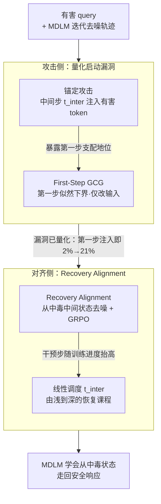

# Toward Safer Diffusion Language Models: Discovery and Mitigation of Priming Vulnerabilities

**会议**: ICLR 2026  
**arXiv**: [2510.00565](https://arxiv.org/abs/2510.00565)  
**代码**: [GitHub](https://github.com/mdl-lab/dlm-priming-vulnerability)  
**领域**: AI安全 / 扩散语言模型  
**关键词**: diffusion language models, jailbreak attacks, priming vulnerability, safety alignment, masked diffusion

## 一句话总结

揭示了掩码扩散语言模型（MDLM）中的"启动漏洞"（priming vulnerability）——在去噪中间步骤注入肯定性 token 可绕过安全防线，并提出 Recovery Alignment（RA）方法训练模型从被污染的中间状态恢复到安全响应。

## 研究背景与动机

**领域现状**：掩码扩散语言模型（MDLM）如 LLaDA、MMaDA 通过迭代去噪并行生成 token，成为自回归模型（ARM）的新兴替代方案，具有更低延迟和双向上下文建模能力。然而，MDLM 的安全风险研究几乎空白。

**现有痛点**：现有的安全对齐方法（SFT、DPO、MOSA）都假设去噪从全掩码序列开始，训练模型仅在此条件下生成安全响应。但在去噪过程中，如果中间步骤出现肯定性 token，模型无法从这种"被污染"的状态恢复安全输出。MDLM 特有的并行迭代生成机制使其面临与 ARM 完全不同的安全威胁。

**核心矛盾**：安全对齐训练的初始化条件（全掩码）与推理时可能出现的中间状态（含有害 token）之间存在分布偏移。模型从未在训练中见过被污染的中间状态，因此无法学会"恢复"。

**本文目标**：(1) 系统量化 MDLM 的启动漏洞严重性；(2) 设计 MDLM 专属的安全对齐方法来缓解此漏洞。

**切入角度**：分析 MDLM 的迭代去噪机制，发现仅在第一步注入一个肯定 token 就能将攻击成功率从 2% 提升到 21%。设计 Recovery Alignment 让模型从被污染状态恢复安全输出。

**核心 idea**：在训练时故意构造含有害 token 的中间状态，教导模型从"中毒"状态恢复到安全响应。

## 方法详解

### 整体框架

本文先用两类攻击量化掩码扩散语言模型的"启动漏洞"——只要去噪中间步骤里混进了肯定性 token，模型就难以收回安全防线；再用 Recovery Alignment 把这种"被污染的中间状态"显式塞进训练，教模型从中毒状态走回安全响应。攻击侧负责暴露并度量风险，对齐侧负责修复，二者共享同一个观察：MDLM 的安全性取决于去噪轨迹而非起点。

### 关键设计

**1. 锚定攻击：用可控干预把漏洞量化出来**

要证明启动漏洞真实存在，先得有办法稳定地触发并度量它。锚定攻击假设攻击者能介入去噪过程，在某个中间步骤 $t_{inter}$ 把模型当前预测的 token 直接替换成有害响应的 token，然后让去噪照常继续。关键在于这些被替换的 token 在后续重掩码时会部分保留下来，像"锚点"一样持续把生成轨迹往有害方向拽。这给出了一个干净可调的旋钮：通过扫 $t_{inter}$ 就能画出漏洞随注入时机的变化曲线。结果相当刺眼——哪怕只在第一步注入一个 token（$t_{inter}=1$），攻击成功率就从 2% 跳到 21%，说明 MDLM 对早期污染极度敏感。

**2. First-Step GCG：把多步似然压成第一步的可优化代理**

锚定攻击需要干预去噪，部署时往往做不到，所以需要一个只改输入、不碰过程的优化攻击。难点是 GCG 要对整条随机重掩码的去噪轨迹求梯度，得用 Monte Carlo 估计，方差大又慢。本文从启动漏洞反推出一个可处理的下界：整条轨迹的对数似然被第一步的对数似然托住，$\log p_{\pi,m_t}(\mathbf{r}_T|\mathbf{q},\mathbf{r}_0) \geq \frac{1}{T}\log\pi_\theta(\tilde{\mathbf{r}}_1|\mathbf{q},\mathbf{r}_0)$（Theorem 4.1）。于是只要最大化第一步预测有害响应的似然，就能近似攻击整个生成过程。代价从对全轨迹采样降到一次前向，实测比 Monte Carlo GCG 快约 20 倍，攻击成功率反而高 3–4 倍——既验证了第一步在去噪里的支配地位，也把攻击成本压到可实用的量级。

**3. Recovery Alignment：把中毒状态搬进训练，教模型走回安全**

现有安全对齐（SFT、DPO、MOSA）都默认去噪从全掩码开始，模型只在这个起点上学过怎么生成安全内容，一旦中间状态被污染就彻底失配。RA 的做法是直接构造这种失配：给定有害 query-response 对 $(q, r)$，在干预步骤 $t_{inter}$ 按掩码核采样出一个被污染的中间状态 $r_{t_{inter}} \sim m_{t_{inter}}(\cdot|r)$，让模型从这里开始去噪，再用奖励模型给最终输出的安全性打分，通过 GRPO 优化。因为训练时模型真的见过"已经吐出有害 token 的局面"，它才学得到从中毒状态恢复的那条路径，这正是标准对齐缺失的能力。

**4. 线性调度 $t_{inter}$：用课程把恢复难度逐步抬高**

干预步骤越大，留给模型恢复安全的去噪步数就越少，恢复任务越难。一上来就用大 $t_{inter}$ 训练会不稳定，于是本文按 $t_{inter} = \lfloor t_{min} + \frac{s}{S}(t_{max} - t_{min}) \rfloor$ 随训练进度 $s$ 从 $t_{min}$ 线性升到 $t_{max}$，先学浅层污染下的恢复、再啃深层污染。这种由易到难的课程让训练保持稳定，最终鲁棒性也优于固定 $t_{inter}$ 的版本（见消融）。

### 损失函数 / 训练策略

RA 用 GRPO 优化恢复目标，奖励直接取自预训练的 DeBERTaV3 安全分类器、无需额外微调；训练数据复用 BeaverTails 的有害 query-response 对，不需要任何额外的数据构建成本。干预步骤在 $[t_{min}, t_{max}]$ 内线性调度，整个对齐仅需约 2,500 步即可完成，是个轻量且即插即用的方案。

## 实验关键数据

### 主实验

**启动漏洞攻击结果（JBB-Behaviors，GPT-4o 评估，ASR %）**

| 方法 | No Attack | Anchoring t=1 | Anchoring t=16 | First-Step GCG |
|------|-----------|---------------|----------------|----------------|
| LLaDA Original | 2.0 | 17.3 | 88.7 | 58.0 |
| LLaDA + SFT | 8.3 | 19.0 | 87.7 | 48.2 |
| LLaDA + DPO | 4.3 | — | — | — |
| **LLaDA + RA** | **显著降低** | **显著降低** | **显著降低** | **显著降低** |

**First-Step GCG vs Monte Carlo GCG**

| 方法 | LLaDA ASR% | LLaDA 1.5 ASR% | 每prompt耗时 |
|------|-----------|----------------|-------------|
| Monte Carlo GCG | 20.0 | 12.5 | 4.1-4.3h |
| First-Step GCG | 58.0 | 49.5 | 0.2h |

First-Step GCG 速度快约 20 倍，攻击效果强 3-4 倍。

### 消融实验

| 组件消融 | 效果 |
|----------|------|
| RA w/o intervention (t=0) | 等同于标准 RLHF，无法缓解启动漏洞 |
| 固定 $t_{inter}$ | 训练不稳定 |
| 线性调度 $t_{inter}$ | 稳定训练且更好的鲁棒性 |
| 不同模型 (LLaDA / LLaDA1.5 / MMaDA) | RA 在所有模型上均有效 |

### 关键发现

1. **启动漏洞普遍存在**：在 LLaDA Instruct、LLaDA 1.5、MMaDA MixCoT 三个模型上均观察到该漏洞
2. **极其敏感**：仅在第一步注入一个 token 就能显著提升 ASR（如 LLaDA 从 2% 到 21%）
3. **现有防御无效**：SFT、DPO、MOSA 均无法有效缓解启动漏洞
4. **RA 同时增强通用鲁棒性**：不仅缓解启动漏洞，还对传统越狱攻击（PAIR、ReNeLLM、Crescendo）表现出更强的防御力
5. **不损害通用能力**：RA 在 11 个通用基准上无明显性能退化

## 亮点与洞察

- **首次系统揭示 MDLM 独特安全漏洞**：与 ARM 的 prefilling 攻击本质不同，是由迭代去噪机制导致的新漏洞类型
- **理论贡献**：证明第一步对数似然是整个去噪过程似然的下界（Theorem 4.1），为设计高效攻击提供理论基础
- **方法简洁实用**：RA 不需要额外数据构建，仅需现有有害数据集和预训练奖励模型，2,500 步即可完成训练
- **安全与能力不冲突**：RA 在增强安全性的同时不损害模型的通用能力
- **前瞻性**：随着 MDLM 逐渐进入实际应用，本文的发现为 MDLM 安全研究奠定基础

## 局限与展望

1. **仅评估 MDLM**：对连续扩散语言模型（continuous DLM）的推广性未知
2. **攻击假设的强度**：锚定攻击假设攻击者能干预去噪过程，这在实际部署中较难实现（但 First-Step GCG 不需要此假设）
3. **奖励模型依赖**：RA 效果受限于奖励模型（DeBERTaV3）的质量
4. **固定生成长度**：实验中设定 L=T=128，对更长生成的效果需要进一步验证
5. **自适应攻击**：是否存在专门针对 RA 的自适应攻击值得探索

## 相关工作与启发

- 与 ARM 安全研究的关系：ARM 的 prefilling 攻击利用自回归前缀抑制后续拒绝；MDLM 的启动漏洞利用去噪中间步骤引导后续生成，机制完全不同
- 与 **MOSA**（Xie et al., 2025）的区别：MOSA 仅从全掩码状态训练安全对齐，无法应对被污染中间状态
- 对 MDLM 部署的启示：在部署 MDLM 时必须考虑去噪过程的安全性，不能简单沿用 ARM 的安全方案
- 对对抗鲁棒性研究的启发：Recovery Alignment 的思想（训练模型从对抗状态恢复）可能推广到其他生成模型

## 评分

- **新颖性**: ⭐⭐⭐⭐⭐ — 首次发现并系统量化 MDLM 独特安全漏洞，开辟新研究方向
- **实验充分度**: ⭐⭐⭐⭐ — 三个模型、两个数据集、三种评估器、多种攻击类型和基线，但生成长度固定
- **写作质量**: ⭐⭐⭐⭐⭐ — 问题清晰、分析深入、理论与实验结合紧密
- **价值**: ⭐⭐⭐⭐⭐ — 随着 MDLM 逐步进入实际应用，本文的安全发现和防御方案具有高度实用价值

<!-- RELATED:START -->

## 相关论文

- [\[ICLR 2026\] DreamOn: Diffusion Language Models For Code Infilling Beyond Fixed-size Canvas](dreamon_diffusion_language_models_for_code_infilling_beyond_fixed-size_canvas.md)
- [\[ICLR 2026\] d²Cache: Accelerating Diffusion-Based LLMs via Dual Adaptive Caching](d2cache_accelerating_diffusion-based_llms_via_dual_adaptive_caching.md)
- [\[ICLR 2026\] Stopping Computation for Converged Tokens in Masked Diffusion-LM Decoding](stopping_computation_for_converged_tokens_in_masked_diffusion-lm_decoding.md)
- [\[ACL 2025\] Segment-Level Diffusion: A Framework for Controllable Long-Form Generation with Diffusion Language Models](../../ACL2025/llm_nlp/segment_level_diffusion.md)
- [\[ICML 2026\] SPA-Cache: Singular Proxies for Adaptive Caching in Diffusion Language Models](../../ICML2026/llm_nlp/spa-cache_singular_proxies_for_adaptive_caching_in_diffusion_language_models.md)

<!-- RELATED:END -->
