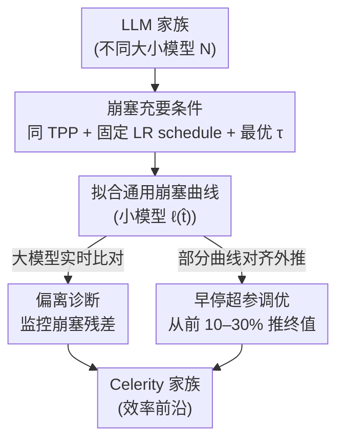

# Scaling with Collapse: Efficient and Predictable Training of LLM Families

**会议**: ICLR 2026  
**arXiv**: [2509.25087](https://arxiv.org/abs/2509.25087)  
**代码**: 无  
**领域**: 预训练  
**关键词**: 训练损失曲线崩塞, 超参缩放, 训练诊断, 早停, Cerebras

## 一句话总结
证明 LLM 家族的训练损失曲线在优化超参数与数据预算匹配时会“崩塞”到同一条通用曲线上，并利用这一现象实现两个实用应用：(1) 偏离崩塞作为训练病理的早期诊断信号，(2) 崩塞曲线的可预测性实现大规模超参调优的早停。

## 研究背景与动机

**领域现状**：扩大预训练规模是提升 LLM 性能的主路径，但一旦逼近前沿规模，就再也无法直接做实验来挑模型大小和超参。好在不少量在缩放时是可预测的：scaling law 能从小规模外推最终损失，μP 能让最优学习率跨宽度转移。可这些都只是**标量**层面的可预测性，**完整训练损失曲线（training loss curve, TLC）**整条形状能否跨规模预测，此前没在真实 LLM 规模上验证过。

**核心矛盾**：Qiu et al.（2025）发现了一个惊人规律——不同大小模型的 TLC 在简单归一化后会“崩塞（collapse）”到同一条通用曲线上；但他们只在小规模自回归任务、用无权重衰减的 vanilla Adam 验证过，并明确呼吁在真实的 scaling 配方下（宽度、深度、batch size、权重衰减联合缩放）做大规模检验。

**现有痛点**：一方面，前沿规模无法直接实验，只能从小规模外推，而到底什么决定 TLC 的形状一直没有原则性解释；另一方面，训练中判断一次 loss spike 是否需要回退/重启长期依赖**人工经验**——等异常在原始曲线上肉眼可见时往往已经晚了，缺乏客观早警信号。

**核心发现与切入角度**：本文证明，在 μP 下 TLC 崩塞的**充要条件**是——所有模型共享相同的 tokens-per-parameter（$\text{TPP}=D/N$）、固定 LR 衰减形状、且 AdamW 时间尺度 $\tau$ 对该 TPP 取最优。换句话说，崩塞不是随便就会发生的，它恰好是“优化超参对给定数据预算计算最优”的**特征标记（signature）**。作者把这个观察从一条视觉规律提炼成两个可落地的工具，并据此训出 Celerity 模型家族。

## 方法详解

### 整体框架

本文不是提出一个新网络，而是把一条经验规律工程化：当一个 LLM 家族里不同大小的模型都用相同的 tokens-per-parameter（$\text{TPP}=D/N$）训练、固定 LR 衰减形状、且让 AdamW 时间尺度 $\tau$ 对各自数据预算取最优时，它们各自尺度、时长、终值都不同的训练损失曲线，在一个简单归一化之后会“崩塞”到同一条通用曲线上。归一化沿用 Qiu et al. 的形式：把训练进度记为 $\hat t = t/T$（$T$ 是总优化步数），再把损失仿射缩放成

$$\ell(\hat t, N) = \frac{L(\hat t\cdot T^\star(N),\, N) - \hat L}{L(T^\star(N),\, N) - \hat L},$$

其中 $T^\star(N)$ 是参数量 $N$ 对应的计算最优步数，$\hat L$ 是不可约损失偏移。围绕“崩塞”这一现象，作者做了三件事：先刻画它成立的充要条件、把它确立为计算最优训练的标记（贡献①）；再把“偏离崩塞”当成训练病理的在线诊断信号（贡献②，应用一）；最后利用崩塞曲线的可预测性，把昂贵的全量超参搜索改造成只训练前一小段就能外推终值的早停流程（贡献③，应用二）。三者共享同一套底层结构——先在小模型上拟合出通用崩塞曲线，大模型再以它为参照。

### 关键设计

**1. 崩塞充要条件：把“计算最优训练”变成一个可观测的标记**

已有 scaling law 只能预测最终损失这一个标量，完整损失曲线的形状能否跨规模转移此前没在真实 LLM 规模上验证过。作者发现崩塞并非总会发生，而是有严格前提：所有模型必须共享相同的 TPP、固定相同的 LR 衰减形状，且 AdamW 时间尺度 $\tau$ 对该 TPP 取最优。其中被以往忽视的关键变量正是 $\tau$——AdamW 的更新可写成对权重更新的指数滑动平均（EMA），其归一化时间尺度

$$\tau = \tau_{\text{iter}}/T = \frac{1}{\eta\lambda T} = \frac{B}{\eta\lambda D},$$

把学习率 $\eta$ 与权重衰减 $\lambda$ 的效果统一了起来，刻画优化器“记住”过去多少梯度。前人工作表明最优 $\tau$ 只随 TPP 变化，于是“固定 TPP + 取最优 $\tau$”就保证了崩塞。反过来，$\tau$ 偏离最优会拉伸或压缩 TLC、不同的 LR 衰减形状也会破坏崩塞（如 Llama-2 因 TPP 和 $\tau$ 失配而不崩塞）。这样一来，崩塞与否就成了“这套配方是否处在计算效率前沿”的充要判据。

**2. 偏离诊断：用崩塞残差把人工盯 loss 曲线换成客观早警**

判断一次 loss spike 或缓慢上漂是否需要回退，传统上依赖人工经验，往往等异常在原始曲线上肉眼可见才反应。作者改为先从小模型拟合出通用崩塞曲线，大模型在训练中把自己归一化后的 TLC 与之实时相减，监控**崩塞残差**（normalized TLC 与通用曲线之差）。由于数值不稳定（如 bf16 精度不足导致的梯度累积漂移）会先在残差里显形，这套方法能在原始 TLC 出现明显异常前数百步就检测到偏离——在 Celerity 1.8B 的训练里，正是靠残差提前定位了一处 bf16 精度问题，修复后曲线重新回到崩塞轨迹上。

**3. 早停超参调优：靠崩塞曲线的可预测性外推最终损失**

崩塞意味着整条曲线的形状是可参数化、可预测的，因此不必把每组超参都训到底。具体流程是：先为每个候选配置确定它的 TLC 控制量（LR schedule、$\tau$、TPP），在小模型（如 111M）上为每种控制量组合拟合出通用崩塞曲线 $\ell(\hat t)$；然后对每个大规模配置只训练前一小段（如 10–30% 的 token），用“能让这段部分曲线与对应通用 TLC 最对齐的除数 $L(T)$”来读出最终损失——这个除数既是归一化常数，**又恰好是对终值的校准外推**；最后选预测终值最低的配置完成全量训练。关键技巧是调超参时**固定 $\tau$（通过调 $\lambda$）而非固定 $\lambda$**：固定 $\lambda$ 会让 $\tau$ 随之乱变、曲线交叉、中途损失无法预测终值；固定 $\tau$ 则保持曲线排序不变，从而能可靠地提前选优。实验里在 1.7B / 3.3B 上分别只训练 30% / 10% 就能选出与全量最优几乎无差距的配置。

### 损失函数 / 训练策略

模型为 GPT-2 风格架构（ALiBi 位置编码 + SwiGLU），在 SlimPajama 上用单 epoch 预训练，AdamW + μP 参数化、线性衰减到零的 LR schedule、上下文长度 2048。本文不改训练目标，方法的全部杠杆都在“按 scaling law 联合缩放 LR / batch size / 权重衰减，使 $\tau$ 对 TPP 最优”这一配方上。

## 实验关键数据

### 主实验

| 现象 | 结果 |
|------|------|
| Llama-2（不同 TPP） | TLC 不崩塞 |
| Celerity（相同 TPP + 最优超参） | **TLC 完美崩塞** |
| 偏离诊断 | 比人工判断更早检测 loss spike |
| 早停超参 | 仅训前 10–30% token，选出的配置与全量最优几乎无差距 |

### 关键发现
- **崩塞是计算最优训练的充要条件**——仅当超参按 scaling law 设为最优时才出现
- 偏离诊断可更早发现数值稳定性问题（如 bf16 精度不足）
- 早停只需训练前 10–30% 即可可靠选优，大幅节省超参搜索计算

## 消融实验与深入分析

### 崩塞条件验证

| 条件 | 是否崩塞 | 说明 |
|------|---------|------|
| 固定 TPP + 最优 $\tau$ + 固定 LR schedule | ✓ 崩塞 | Celerity 家族 |
| 不同 TPP（如 Llama-2） | ✗ 不崩塞 | 不同 D/N 比导致 TLC 形状不同 |
| 固定 TPP + 非最优 $\tau$ | ✗ 不崩塞 | $\tau$ 偏离最优会拉伸或压缩 TLC |
| 固定 TPP + 不同 LR schedule | ✗ 不崩塞 | LR 衰减形状直接影响 TLC 形状 |

### 偏离诊断的实际案例
- 在 Celerity 1.8B 训练中，缓存中旧的 loss 显示了轻微的上升趋势
- 通过崩塞残差分析（将 TLC 归一化后与通用曲线比较），在原始 TLC 出现明显异常前数百步就检测到了偏离
- 诊断结果：bf16 数值精度问题导致的梯度累积不稳定
- 修复后 TLC 重新回到崩塞曲线上

### 早停超参调优
- 对一批超参配置仅训练前 10–30% 的 token
- 用崩塞曲线参数化模型拟合部分 TLC → 对齐外推最终 loss
- 调超参时固定 $\tau$（而非固定 $\lambda$）以保持曲线排序、可靠选优
- 1.7B / 3.3B 上分别训练 30% / 10% 即选出与全量最优几乎无差距的配置

### Celerity 在效率前沿的位置

| 模型 | 参数量 | 训练 token | 平均准确率 |
|------|--------|-----------|-----------|
| 典型同规模模型 | 同等 | 同等 | 基线 |
| **Celerity** | 同等 | 同等 | **效率前沿** |

## 亮点与洞察
- **崩塞作为"健康标志"**是一个简单但强大的工程工具——如果 TLC 不崩塞就说明超参或训练配方有问题。这比任何 metric 都更直觉化。
- **崩塞 = 计算最优训练**的充要关系是核心理论贡献——将一个视觉现象连接到了优化理论
- **偏离诊断的实用性**：传统方法需要人工判断 loss spike 是否需要回退，崩塞曲线提供了客观参考
- **早停超参调优**：外推最终 loss 的可靠性使得大规模超参搜索成本大幅降低
- **$\tau$ 的统一作用**：AdamW 的 EMA 时间尺度 $\tau = 1/(\eta\lambda)$ 是一个被忽视但极其重要的超参——它统一了学习率和权重衰减的效果

## 局限与展望
- 崩塞条件要求所有模型 TPP 相同——实际中不同模型可能有不同最优 TPP（如 Chinchilla 的 20 vs 其他估计）
- 仅验证了预训练 loss——下游任务性能的崩塞未探索（loss 崩塞不保证下游 accuracy 也崩塞）
- 早停外推依赖参数化崩塌曲线模型的准确性——对于非常不同的训练配方可能需要重新拟合
- 所有实验在 Cerebras CS-3 上运行——不同硬件（如 GPU）上的崩塞行为可能略有差异（精度、通信模式等）
- 目前仅验证了 μP 参数化下的崩塞——其他参数化方案（如 SP）下是否成立未知

## 相关工作与启发
- **vs Chinchilla (Hoffmann et al.)**：Chinchilla 预测最终损失的缩放律（一个标量）；本文预测完整训练曲线的形状（一条曲线）——是缩放律的"时间序列版"
- **vs Qiu et al. (2025) Supercollapse**：他们在小规模自回归任务上发现崩塞；本文将其推广到实际 LLM 训练，并揭示了崩塞的充要条件（TPP + $\tau$ 最优）
- **vs μP (Yang & Hu)**：μP 使学习率可跨规模转移；本文发现在 μP 下整个 TLC 形状都可跨规模转移——是 μP 的更强推论
- **vs Wang & Aitchison (2024) AdamW EMA**：他们发现 $\tau$ 在图像任务上跨规模稳定；本文发现 $\tau$ 的最优值取决于 TPP，在 LLM 中是 TLC 崩塞的关键控制变量
- **启发**：崩塞理论可以推广到其他序列训练场景——如扩散模型、强化学习的训练曲线是否也存在类似的通用形状

## 评分
- 新颖性: ⭐⭐⭐⭐ 崩塞条件的发现和实用应用有独特洞察力
- 实验充分度: ⭐⭐⭐⭐⭐ 大规模 Cerebras 实验，多模型大小验证，实际训练诊断案例
- 写作质量: ⭐⭐⭐⭐⭐ Figure 1 的三列对比极其直观，行文清晰
- 价值: ⭐⭐⭐⭐⭐ 对大规模 LLM 训练的实际工程指导价值极高

<!-- RELATED:START -->

## 相关论文

- [\[ICML 2025\] Scaling Inference-Efficient Language Models](../../ICML2025/llm_pretraining/scaling_inference-efficient_language_models.md)
- [\[ICML 2026\] Annotations Mitigate Post-Training Mode Collapse](../../ICML2026/llm_pretraining/annotations_mitigate_post-training_mode_collapse.md)
- [\[ICLR 2026\] Pre-training LLM without Learning Rate Decay Enhances Supervised Fine-Tuning](pre-training_llm_without_learning_rate_decay_enhances_supervised_fine-tuning.md)
- [\[ACL 2026\] SAGE: Sign-Adaptive Gradient for Memory-Efficient LLM Optimization](../../ACL2026/llm_pretraining/sage_sign-adaptive_gradient_for_memory-efficient_llm_optimization.md)
- [\[NeurIPS 2025\] Power Lines: Scaling Laws for Weight Decay and Batch Size in LLM Pre-training](../../NeurIPS2025/llm_pretraining/power_lines_scaling_laws_for_weight_decay_and_batch_size_in_llm_pre-training.md)

<!-- RELATED:END -->
