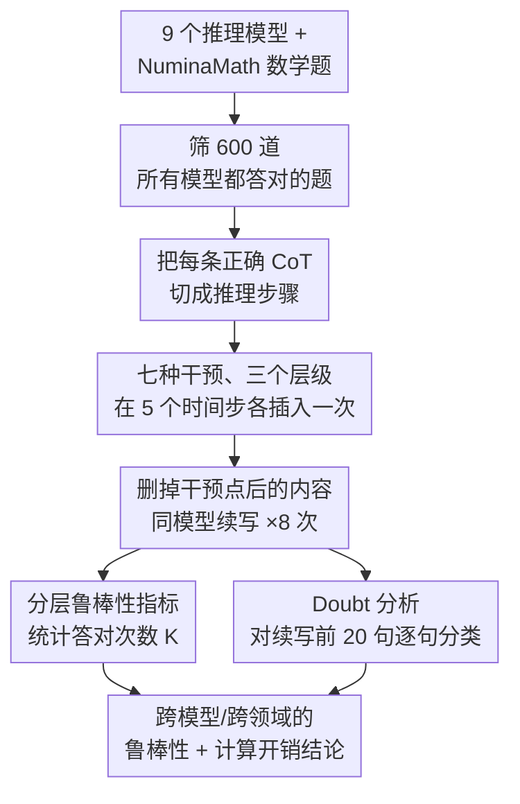

# Are Reasoning LLMs Robust to Interventions on Their Chain-of-Thought?

**会议**: ICLR 2026  
**arXiv**: [2602.07470](https://arxiv.org/abs/2602.07470)  
**代码**: 无  
**领域**: LLM推理  
**关键词**: reasoning LLM, chain-of-thought, robustness, self-correction, doubt mechanism

## 一句话总结
系统评估推理型 LLM 对其 CoT 中各种干预（良性/中性/对抗性）的鲁棒性：发现模型总体鲁棒能从干预中恢复，但改写风格（paraphrasing）会抑制"自我怀疑"表达导致正确率下降，恢复过程有显著计算开销（CoT 膨胀最高 665%）。

## 研究背景与动机
**领域现状**：推理型 LLM（如 DeepSeek-R1、QwQ）通过生成 CoT 来逐步推理，提升了复杂任务表现。但在实际部署中 CoT 可能受到噪声工具输出、对抗性注入或自身幻觉的干扰。

**现有痛点**：已知传统（非推理）LLM 的自我纠错能力有限——经常把正确答案改错。但 RLVR 训练的推理模型是否获得了更强的鲁棒性和自纠能力，缺乏系统性研究。

**核心矛盾**：推理鲁棒性和推理效率之间存在 trade-off——模型可能能恢复正确答案，但代价是 CoT 大幅膨胀、推理成本飙升。

**本文目标**（1）推理 LLM 能否从 CoT 中的干预中恢复？（2）什么因素影响恢复能力？（3）恢复的计算代价是什么？

**切入角度**：设计受控实验框架，在模型自己正确的 CoT 上施加 7 种干预，测量是否仍能得到正确答案。

**核心 idea**：推理 LLM 对 CoT 干预总体鲁棒，但其鲁棒性依赖于"自我怀疑"（doubt）这一元认知机制，改写风格会抑制 doubt 并损害性能。

## 方法详解

### 整体框架
这篇论文想回答一个问题：当推理模型的思维链（CoT）在中途被各种方式"破坏"后，它还能不能把答案救回来？为此作者搭了一个受控的干预实验框架。先从 NuminaMath 里筛出 600 道所有待测模型都能独立答对的数学题——这一步保证了"模型本来会做"，于是干预后出现的任何变化都能归因于干预本身。接着把每条 CoT 按句/段切开，在 5 个相对时间步（$t = 0.1, 0.3, 0.5, 0.7, 0.9$，即推理进行到 10%–90% 处）插入一次干预，删掉干预点之后的原始内容，让同一个模型从被改动处继续往下推，独立采样 8 次，最后统计还能答对的比例。

整个评测规模很大：9 个开源推理模型 × 600 道数学题 × 7 种干预 × 5 个时间步 × 8 次采样，仅数学就有约 152 万条推理链；再加上 Science（231 题）和 Logic（326 题），总计约 292 万条，足以支撑跨模型、跨领域的统计结论。

### 关键设计

**1. 七种干预、三个层级：用一套从良性到对抗的扰动逼出鲁棒性边界**

只看"模型还能不能答对"说明不了问题，得知道它对什么样的破坏敏感，所以作者按破坏意图把干预分成三档、共 7 种。**良性**两种：(a) 用另一个模型续写一步正确推理，(b) paraphrasing——把整条 CoT 改写一遍但保留语义。**中性**两种：(c) 在当前步骤里随机插入乱码字符，(d) 用一段无关的 Wikipedia 段落替换当前步骤。**对抗**三种：(e) 插入一步错误的推理延续，(f) 插入伪造的数学事实，(g) 把当前内容换成无关话题的 CoT 开头。其中 4 种干预需要结合上下文生成（用 Qwen-2.5-32B-Instruct 来写），另外 3 种与上下文无关。这套设计的关键在于它同时覆盖了"看起来无害的改写"和"明显的恶意注入"，从而能区分模型究竟是真有逻辑韧性，还是只在某些扰动下侥幸没崩。

**2. 分层鲁棒性指标：用三档严格度刻画"恢复"到底有多稳**

8 次独立采样里只要有几次答对，算不算鲁棒？这取决于你要多严格。作者把 8 次采样中答对的次数记为 $K$，定义三个层级：at-least-once-robust（$K \geq 1$，只要有一次救回来就算）、majority-robust（$K \geq 5/8$，多数采样能恢复）、all-robust（$K = 8$，每次都恢复）。分析主要采用 majority-robust，因为它既排除了"碰巧蒙对一次"的偶然，又不像 all-robust 那样苛刻到把正常采样波动也判成失败，是对真实恢复能力更稳健的度量。

**3. Doubt 分析：把"自我怀疑"量化成可统计的元认知信号**

作者注意到推理模型在出错后常冒出 "Wait"、"Let me check" 这类犹疑性表达，怀疑这正是它纠错的抓手，于是想把这种"自我怀疑"变成可测量的量。做法是用一个 LLM 分类器，对干预后续写的前 20 句逐句做 doubt / non-doubt 二分类，统计 doubt 句的占比，再和未干预基线的 doubt 率（0.153）作对比。这个指标让"模型在恢复时是否更频繁地自我质疑"从一种观感变成能跨干预、跨模型横向比较的数字，后文 paraphrasing 抑制 doubt 的结论正是建立在它之上。

## 实验关键数据

### 主实验：Majority Robustness（数学）

| 发现 | 细节 |
|------|------|
| 总体鲁棒 | 除最小模型外，所有模型在所有干预下 majority robustness 接近 1.0 |
| 尺寸效应 | R1-Distill-Qwen-1.5B 鲁棒性最差，32B 模型最强 |
| 时间步效应 | 干预越早（$t=0.1$），影响越大 |
| 唯一例外 | Paraphrasing 是唯一导致所有模型一致下降的干预 |

### CoT 长度膨胀（%变化 vs 原 CoT）

| 模型 | Benign:Rewrite | Neutral:Add Text | Neutral:Insert Chars | Adv:Wrong Cont. |
|------|----------------|------------------|---------------------|-----------------|
| R1-Distill-Qwen-1.5B | -37% | **+665%** | +111% | +32% |
| R1-Distill-Qwen-7B | -60% | +124% | +34% | +9% |
| R1-Distill-Qwen-14B | -62% | +54% | +6% | +10% |
| QwQ-32B | -44% | +167% | +6% | +16% |

### 关键发现
- **Doubt 是恢复的核心机制**：干预后 doubt 表达显著上升，对抗性干预触发最强 doubt 信号。成功恢复的 trace 中 doubt 量略高于失败的，说明 doubt 支持但不保证恢复。
- **Paraphrasing 的致命问题**：改写 CoT 会将 doubt 率从基线 0.153 降至 0.068-0.076，模型转为更"自信"但更容易出错的风格。在 $t=0.1$ 改写后，CoT 缩短 59-61% 但准确率下降。
- **鲁棒性跨领域一致**：Math/Science/Logic 三个领域的恢复模式基本一致。
- **小模型显著更脆弱**：1.5B 模型在 Neutral 干预下 CoT 膨胀 665%，而大模型仅 54-167%。

## 亮点与洞察
- **Doubt 作为元认知的发现**：这是首次系统量化推理 LLM 中 "Wait/Let me check" 等自我怀疑表达的功能作用。它们不是冗余输出而是主动的恢复机制——被训练出来的元认知能力。这一发现对理解 RLVR 训练产生的涌现行为有重要意义。
- **风格不变性的缺失**：Paraphrasing 保留了语义但改变了风格，就导致性能下降。这揭示了一个深刻问题——当前推理 LLM 的鲁棒性部分依赖于特定的表述风格（hedging、self-questioning），而非纯粹的逻辑推理能力。
- **实用意义——工具输出注入的风险**：在 Agent 系统中，工具返回的中间结果会被插入 CoT，本文量化了这种注入的影响（最高 +665% 计算开销），为优化推理效率提供了经验依据。

## 局限与展望
- 仅评估了开源模型，未包含 o1/o3 等闭源推理模型。
- 600 道数学题限制在"所有模型都能答对"的范围，可能高估了鲁棒性——更难的题目上恢复能力可能更差。
- 干预只在单个步骤上施加，实际场景中可能有连续多次干扰。
- 未探索如何通过训练改善 style invariance（如在 RLVR 中加入 paraphrased trace 的训练）。

## 相关工作与启发
- **vs BIG-Bench Mistake**：该基准测量错误定位能力，本文扩展为测量错误恢复能力。推理 LLM 在错误定位上显著优于传统 LLM（GPT-4 在多任务上仅 17-62%，推理模型达 66-94%）。
- **vs Yang et al. (2025)**：他们在 CoT 开头注入误导内容，本文在任意时间步干预且使用模型自己的 CoT，更接近真实场景。
- **对训练的启示**：RLVR 训练应保留 doubt 表达、提升 style robustness、开发高效恢复策略以控制 token 开销。

## 评分
- 新颖性: ⭐⭐⭐⭐ 首个系统性的推理 LLM CoT 鲁棒性基准，doubt 机制的发现是重要洞察
- 实验充分度: ⭐⭐⭐⭐⭐ 9 模型 × 7 干预 × 3 领域 × 292 万条链，规模令人印象深刻
- 写作质量: ⭐⭐⭐⭐ 结构清晰，实验细节详尽，图表丰富
- 价值: ⭐⭐⭐⭐ 为推理 LLM 的鲁棒性提供了系统性证据，对部署安全和训练改进都有指导意义

<!-- RELATED:START -->

## 相关论文

- [\[AAAI 2026\] Chain-of-Thought Driven Adversarial Scenario Extrapolation for Robust Language Models](../../AAAI2026/llm_reasoning/chain-of-thought_driven_adversarial_scenario_extrapolation_for_robust_language_m.md)
- [\[ICLR 2026\] DAG-Math: Graph-of-Thought Guided Mathematical Reasoning in LLMs](dag-math_graph-of-thought_guided_mathematical_reasoning_in_llms.md)
- [\[ICLR 2026\] SceneCOT: Eliciting Grounded Chain-of-Thought Reasoning in 3D Scenes](scenecot_eliciting_grounded_chain-of-thought_reasoning_in_3d_scenes.md)
- [\[ICLR 2026\] CoT-RVS: Zero-Shot Chain-of-Thought Reasoning Segmentation for Videos](cot-rvs_zero-shot_chain-of-thought_reasoning_segmentation_for_videos.md)
- [\[ICLR 2026\] Fine-R1: Make Multi-modal LLMs Excel in Fine-Grained Visual Recognition by Chain-of-Thought Reasoning](fine-r1_make_multi-modal_llms_excel_in_fine-grained_visual_recognition_by_chain-.md)

<!-- RELATED:END -->
