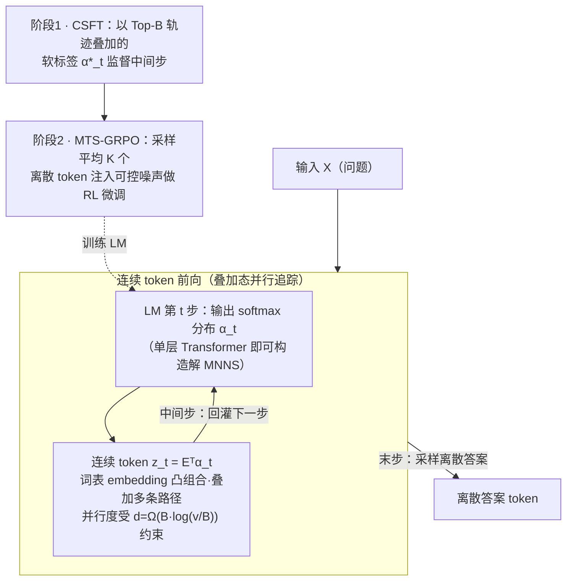

# Continuous Chain of Thought Enables Parallel Exploration and Reasoning

**会议**: ICLR 2026  
**arXiv**: [2505.23648](https://arxiv.org/abs/2505.23648)  
**代码**: [https://github.com/alperengozeten/CoT2](https://github.com/alperengozeten/CoT2)  
**领域**: LLM推理 / 模型压缩  
**关键词**: 连续思维链, 并行推理, 多轨迹追踪, GRPO, 信息论

## 一句话总结
CoT2 提出用连续值 token（词表 embedding 的凸组合）替代离散 token 进行链式推理，使模型能在单次推理中并行追踪多条推理路径，理论证明等价于 K 次 self-consistency/best-of-N 采样，并通过 GRPO 强化学习进一步提升性能。

## 研究背景与动机

**领域现状**：现代 LLM 的 CoT 推理通过自回归采样离散 token 实现，配合 self-consistency（多次采样取多数投票）或 best-of-N 解码来提升准确率。

**现有痛点**：
   - 离散采样每步最多传递 $\log_2(v)$ 比特信息，而每个 token embedding 可存储 $O(d)$ 比特——信息利用严重不足
   - 一旦采样某个 token，模型就"承诺"了某条推理路径，无法探索替代方案
   - self-consistency/best-of-N 需要多次前向传播，推理成本线性增长

**核心矛盾**：离散采样的决策不可逆性导致单条推理链容易"滚雪球"累积错误，而弥补手段（多次采样）又带来巨大计算开销

**本文目标**
   - 如何让模型在单次推理中同时追踪多条推理路径？
   - 连续 token 的并行追踪能力有多强？与离散多次采样有何理论关系？
   - 如何训练和推理连续 token 模型？

**切入角度**：将 LM 在每步的 softmax 输出不进行离散采样，而是直接作为连续 token（所有词表 embedding 的加权组合）送入下一步。这个"叠加态"自然编码了多条路径的信息。

**核心 idea**：连续 token 是词表 embedding 的凸组合，天然实现并行路径追踪，其效果理论上等价于 K 条独立离散 CoT 的聚合——一次前向传播顶 K 次采样。

## 方法详解

### 整体框架
CoT2 想解决的是离散 CoT「一步只能走一条路」的问题：标准模型每步从词表里采样一个 token，等于在推理树上提前承诺了某条分支，之后无法回头。CoT2 的做法是干脆不采样——把模型每步 softmax 输出的概率分布 $\bm{\alpha}_t$ 直接和 embedding 矩阵相乘，得到一个连续 token $\bm{z}_t = \bm{E}^\top \bm{\alpha}_t$ 送进下一步。这个连续 token 是所有词表 embedding 的凸组合，本质上是把多条候选路径叠在一个向量里同时往前推。给定输入 $\bm{X}$，模型自回归生成 $m$ 个 token，前 $m-1$ 步都是这样的连续 token（每步把当前叠加态回灌、并行追踪多条路径），只有最后一步才采样出离散的答案 token。模型本身的能力由两条理论结果托底：维度足够时单层 Transformer 就能用连续 token 并行解题，而能并行追踪几条路则受 embedding 维度上界约束。整个训练分两阶段：先用 CSFT（连续监督微调）让模型学会拟合「多轨迹叠加」的软标签，再用基于 MTS 的 GRPO 强化学习进一步压缩无关路径、提升准确率。

### 关键设计

**1. 连续监督微调（CSFT）：用多轨迹叠加当中间步的监督信号**

离散 CoT 的监督是 one-hot——每步只告诉模型「正确答案是这一个 token」，等于强迫它只学一条路径。CSFT 换了个监督目标：先用外部搜索找出 $B$ 条最优轨迹（Budget $B$），然后在每个中间步 $t$ 把这 $B$ 条轨迹经过的状态的经验分布作为软标签，$\alpha_{t,g}^* = \frac{1}{B}\sum_{\pi \in \Pi_B} \mathbf{1}\{g_t(\pi)=g\}$，最终步仍用 one-hot（正确答案），用交叉熵/KL 散度让模型拟合这些软标签。这里 $B$ 是一个连续的旋钮：$B=1$ 时软标签退化成 one-hot，完全等价于离散 CoT；$B=|\mathcal{T}|$ 时追踪所有可能轨迹，达到最大并行。换句话说，Budget 直接控制了「模型同时追踪几条路」与「模型容量够不够装」之间的折中。

**2. Budget–Embedding 维度权衡：并行度能开多大由 embedding 维度决定**

并行追踪不是越多越好——要把 $B$ 条轨迹的叠加可靠地解码出来，embedding 必须有足够维度去区分它们。论文给出信息论下界 $d = \Omega(B\log(v/B))$，其中 $v$ 是词表大小。这条不等式解释了实验里的两种行为：当 $d$ 足够大时，增大 $B$ 单调提升性能；当 $d$ 不够时，叠加会互相干扰，存在一个最优 $B$ 的 sweet spot。这正是为什么 $d=16$ 时 $B=8$ 反而比 $B=16$ 好（16 条路超出了 16 维能可靠承载的容量），而 $d=32$ 时 $B=16$ 才是最优。

**3. 单层 Transformer 构造（Proposition 1）：理论上证明 CoT2 能并行解子集和**

为了说明连续 token 的并行能力不只是经验现象，论文构造性地证明单层 Transformer 用 CoT2 就能解 MNNS（最小非负和）问题。MNNS 本质是子集和：要在 $m$ 个数字的所有 $2^m$ 种加减组合里找最小非负和，离散 CoT 每步只能选一种加减、被迫沿一条路径搜索。构造的关键是用三角函数 embedding 把所有 $2^k$ 个中间状态编码进不重叠的 $(\sin, \cos)$ 表示，注意力层负责扩展状态（对当前所有状态并行地加减下一个数字），MLP 层负责读取并过滤。这样每一步并行追踪的状态数指数增长，最后一步直接从叠加里选出最小非负和——一条路也不用真的展开。

**4. Multi-Token Sampling（MTS）+ GRPO：给确定性的连续推理注入可控噪声，让 RL 用得上**

CSFT 之后的 base CoT2 是完全确定性的：给定输入，每步的 $\bm{\alpha}_t$ 唯一确定，没有随机性。但 GRPO 这类策略梯度方法要算 policy ratio $r_t^{(i)}(\theta)$，必须有一个可定义的采样分布。MTS 的做法是在每步采样 $K$ 个离散 token 再平均，$\bm{z}_t = \frac{1}{K}\sum_{r=1}^K \bm{e}_{i_r}$，这给出 $\bm{\alpha}_t$ 的一个无偏但有噪的估计——$K$ 越大噪声越小，越接近确定性的连续 token。这个设计还顺带给出了 CoT2 的另一重理论意义：Proposition 3 证明 MTS 的估计误差等价于 $K$ 条独立离散 CoT 的聚合，也就是说一次带 $K$-MTS 的前向，样本复杂度相当于 $K$ 次离散采样——这正是「一次前向 ≈ K 次 self-consistency」量化保证的来源。有了可控噪声后，GRPO 的 clipped surrogate 就能照常套用，把 RL 微调嫁接到连续推理上。

### 损失函数 / 训练策略
- **CSFT 阶段**：$\mathcal{L}_{CSFT} = \sum_{t=1}^m D(\bm{\alpha}_t^* \| \bm{\alpha}_t)$，中间步用软标签的交叉熵，最终步用标准 CE
- **GRPO 阶段**：标准 GRPO clipped surrogate + KL 正则化，稀疏奖励（正确=1，错误=0）
- Teacher forcing 用于 CSFT（即使推理时是自回归的），效果优于 self-feeding

## 实验关键数据

### 主实验（MNNS 任务，4 位数字 1-99）

| 方法 | d=16 acc | d=24 acc | d=32 acc |
|------|---------|---------|---------|
| No-CoT | ~15% | ~15% | ~15% |
| Discrete CoT (B=1) | ~55% | ~70% | ~75% |
| COCONUT | ~45% | ~60% | ~65% |
| **CoT2 (B=16)** | ~60% | **~95%** | **~98%** |

### Pass@k 比较（d=24, MNNS）

| 方法 | Pass@1 | Pass@4 | Pass@8 | Pass@16 |
|------|--------|--------|--------|---------|
| Discrete CoT | ~70% | ~82% | ~88% | ~93% |
| **CoT2** | **~95%** | ~96% | ~97% | ~98% |

### 关键发现
- **CoT2 单次推理 ≈ 离散 CoT 多次采样**：CoT2 的 Pass@1 就达到离散 CoT Pass@16 的水平
- **Budget-Dimension 甜蜜点存在**：$d=16$ 时 $B=8$ 最优（$B=16$ 太多容量不够），$d=32$ 时 $B=16$ 最优
- **GRPO 在 CoT2 上有效**：RL 微调使模型学会优先追踪相关推理路径，降低连续 token 的熵
- **CoT2 比 COCONUT 更好**：有外部搜索监督信号时，直接拟合多轨迹分布比隐状态替换更有效
- **理论与实验高度一致**：$d=\Omega(B\log(v/B))$ 的下界在实验中被验证

## 亮点与洞察
- **信息论视角的深刻洞察**：离散 token 每步最多 $\log_2 v$ 比特，而连续 token 可以打包 $B \cdot \log_2(v/B)$ 比特——这个信息论论证非常优雅地解释了为什么连续 token 更强大。
- **"一次前向 ≈ K 次采样"的理论保证 (Proposition 3)** 是非常有力的结果——直接将 CoT2 与 self-consistency 建立了量化等价关系，赋予了连续 token 清晰的实际意义。
- **将 RL 扩展到连续动作空间用于 LLM**：传统 GRPO/PPO 在离散 token 空间操作，CoT2 的 MTS 策略巧妙地通过"采样+平均"在连续空间中引入可控噪声，使 policy gradient 方法可用。

## 局限与展望
- 仅在合成任务（MNNS、ProntoQA、ProsQA）上验证，未在真实 NLP 任务或大规模 LLM 上测试
- Assumption 1（Markov 性 + 线性叠加）在实际 Transformer 中可能不严格成立
- 连续 token 无法直接解读为自然语言，丧失了 CoT 的可解释性
- 词表 embedding 矩阵 $\bm{E}$ 的正交性会影响叠加质量，实际中 embedding 可能高度相关
- 只有最后一步输出离散 token，如果需要多步离散输出（如长答案），需要扩展框架

## 相关工作与启发
- **vs COCONUT**: 同为连续思维链，但 COCONUT 用 LLM 的隐状态替换，没有显式的多轨迹监督；CoT2 通过 CSFT 直接拟合轨迹分布，效果更好
- **vs Self-Consistency**: self-consistency 需要 K 次采样取多数投票；CoT2 理论上一次前向等价于 K 次采样，推理效率提升 K 倍
- **vs Latent Reasoning (Coconut/Quiet-STaR)**: 这些方法着重于将推理内化到隐空间，但缺乏 CoT2 的信息论保证和多轨迹并行的明确形式化

## 评分
- 新颖性: ⭐⭐⭐⭐⭐ 信息论驱动的连续推理+并行追踪，理论贡献扎实
- 实验充分度: ⭐⭐⭐ 仅限合成任务，缺乏真实 LLM 规模验证
- 写作质量: ⭐⭐⭐⭐⭐ 理论推导清晰，直觉解释到位，图表设计精美
- 价值: ⭐⭐⭐⭐ 对连续推理的理论理解贡献卓越，但实用性有待验证

<!-- RELATED:START -->

## 相关论文

- [\[ACL 2026\] Parallel Test-Time Scaling for Latent Reasoning Models](../../ACL2026/llm_reasoning/parallel_test-time_scaling_for_latent_reasoning_models.md)
- [\[AAAI 2026\] Efficient Thought Space Exploration Through Strategic Intervention](../../AAAI2026/llm_reasoning/efficient_thought_space_exploration_through_strategic_intervention.md)
- [\[ACL 2026\] Reinforced Efficient Reasoning via Semantically Diverse Exploration](../../ACL2026/llm_reasoning/reinforced_efficient_reasoning_via_semantically_diverse_exploration.md)
- [\[ICLR 2026\] Are Reasoning LLMs Robust to Interventions on Their Chain-of-Thought?](are_reasoning_llms_robust_to_interventions_on_their_chain-of-thought.md)
- [\[ICLR 2026\] SceneCOT: Eliciting Grounded Chain-of-Thought Reasoning in 3D Scenes](scenecot_eliciting_grounded_chain-of-thought_reasoning_in_3d_scenes.md)

<!-- RELATED:END -->
