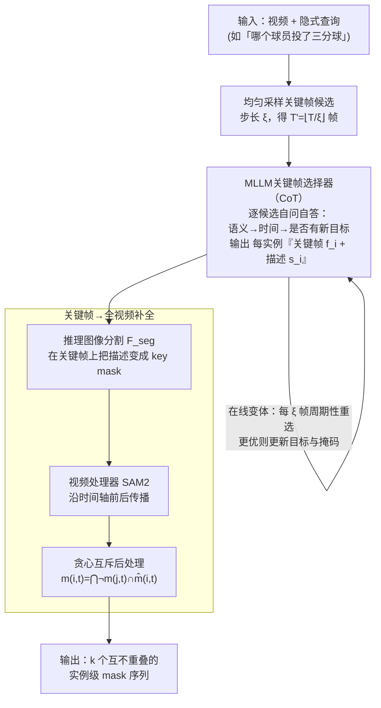

# CoT-RVS: Zero-Shot Chain-of-Thought Reasoning Segmentation for Videos

**会议**: ICLR 2026  
**arXiv**: [2505.18561](https://arxiv.org/abs/2505.18561)  
**代码**: 无  
**领域**: LLM推理  
**关键词**: 推理视频分割, Chain-of-Thought, 零样本, 关键帧选择, 多模态大模型

## 一句话总结

提出CoT-RVS，一种完全无训练的多智能体框架，利用预训练MLLM的零样本CoT推理能力进行时间-语义关联分析与关键帧选取，在推理视频分割任务上大幅超越微调方法（Refer-DAVIS J&F 79.1 vs 71.2，ReasonVOS J&F 65.5 vs 49.9）。

## 研究背景与动机

- **领域现状**: 推理视频分割(Reasoning VOS)要求模型根据复杂隐式文本查询（如"哪个球员投了三分球"）生成对应目标的视频掩码序列，属于视频理解中最具挑战性的任务之一
- **现有痛点**: 现有方法（VISA/VideoLISA/HyperSeg）微调MLLM生成分割token，但在时间敏感查询下表现不佳。核心原因在于这些方法缺乏帧间时间推理能力——它们关注帧内语义理解，但无法有效推理"哪个时间段发生了什么"
- **核心矛盾**: 图像域的CoT推理分割（Seg-Zero/ThinkFirst）已取得成功，但视频域需要额外的时间维度"思考"能力。直接从图像扩展到视频并不可行，因为视频中的目标对象会随时间发生遮挡、运动、出现或消失
- **本文切入点**: 不做任何微调，而是利用GPT-4o/Gemma3等预训练MLLM的零样本CoT能力，设计任务特定prompt引导模型进行时间-语义推理。这与推理时计算(test-time compute)的趋势高度一致
- **核心idea**: 让MLLM通过CoT自问自答的方式分析关键帧候选：从语义维度（帧内有哪些对象匹配查询）和时间维度（哪个帧的目标最容易观察）两个角度建立关联，最终选出每个实例的最佳关键帧

## 方法详解

### 整体框架

CoT-RVS 是一个三模块协作的多智能体框架，把"根据隐式查询给视频打掩码"这件难事拆成它能各个击破的几步。给定一段视频和一句复杂查询，它先以步长 $\xi$ 均匀采样出一批关键帧候选，交给 MLLM 关键帧选择器 $\mathcal{F}_{key}$ 做时间-语义关联推理、为每个目标实例挑出最值得下手的关键帧并附上文字描述；再用推理图像分割器 $\mathcal{F}_{seg}$ 在关键帧上把描述变成 key mask；最后交给视频处理器 $\mathcal{F}_{vid}$（SAM2）沿时间轴把这张 mask 追踪到全部帧，并用一道贪心互斥后处理让多个实例的掩码互不重叠。三个模块全用预训练权重、无任何微调，关键的"思考"都压在第一步的 CoT 推理里；论文还给出一个在线变体，把"看完整段视频再选关键帧"改成每隔 $\xi$ 帧周期性地重新判断，从而支持实时视频流。

### 关键设计

**1. MLLM关键帧选择器：用CoT把"哪一帧最该分割"想清楚**

这是全框架的创新核心，要解决的痛点是：视频里目标会遮挡、运动、出现又消失，盲目在每帧上跑分割既贵又不准，必须先找到那个目标"最容易被看清"的时刻。CoT-RVS 先以步长 $\xi$ 均匀采样出 $T' = \lfloor T/\xi \rfloor$ 个关键帧候选，再让 MLLM 对每个候选自问自答地合成一段从粗到细的 CoT 问答序列：先做通用语义判断（"这帧里有什么"），再做时间推理（"它是不是比之前的帧更适合当关键帧"），最后做细节确认（"是否冒出了新的目标对象"）。这段推理的产物是一个结构化清单——目标实例列表、每个实例对应的关键帧索引 $f_i$、以及帧内目标的文字描述 $s_i$（如"穿黑色球衣正在投篮的球员"），后者正好喂给下游分割模型。值得注意的是该模块按 Reasoning VIS（$k\ge 1$ 个实例）来设计，单目标的 Reasoning VOS 只是 $k=1$ 的特例，且无论闭源 GPT-4o 还是开源 Gemma3-12B、LLaVA1.5-7B 都能直接驱动，CoT prompt 是唯一需要适配的接口。

**2. 从关键帧到全视频：分割—追踪—互斥三步把 key mask 补全成实例序列**

拿到每个实例的关键帧 $f_i$ 和描述 $s_i$ 后，剩下的事是把这条信息补全成覆盖整段视频的实例 mask 序列，这一步全靠现成模块串起来、不含任何训练。先用推理图像分割器 $\mathcal{F}_{seg}$（如 Seg-Zero）只在"对的那一帧"上做一次图像级分割，以 $s_i$ 为文本条件生成 key mask $\tilde{m}_i$——分割只发生在最易观察的关键帧而非全视频，既省算力又避开了遮挡/运动帧带来的歧义，把困难的时间判断和相对简单的帧内分割彻底解耦。接着把 key mask 交给视频处理器 $\mathcal{F}_{vid}$（SAM2）当作提示沿时间轴前后传播，得到每个实例的初步序列 $\hat{m}_{i,t}$。多实例同时存在时直接叠加会互相重叠，于是再加一道贪心互斥后处理保证每个像素至多归属一个目标：按实例顺序，第 $i$ 个实例在第 $t$ 帧的最终掩码

$$m_{i,t} = \bigcap_{j=1}^{i-1} \neg m_{j,t} \cap \hat{m}_{i,t}$$

即先扣掉所有已分配给前序实例的像素，再保留自己的预测。

**3. 在线推理扩展（Online CoT-RVS）：把离线框架改成能处理视频流**

离线版要先看完整段视频才能选关键帧，无法用于实时场景。在线版本改成每隔 $\xi$ 帧（即在 $t = n\xi + 1$ 时）就周期性地调一次 MLLM，让选择器输出一个二值信号 $S_t\in\{0,1\}$ 判断当前帧 $I_t$ 是否比手上已有的关键帧更好：$S_t=1$ 就用新帧更新关键帧 $I^{key}_t$ 与目标，否则沿用历史的 $I^{key}_{\max(t-\xi,0)}$，本质是一个流式的贪心更新策略。这让 CoT-RVS 成为首个能做流式推理视频分割的方法，适配实时监控、自动驾驶等视频流场景，而性能相比离线版只掉约 1.3 个点。

### 损失函数 / 训练策略

完全无训练——三个模块全部直接使用预训练权重，不做任何微调，所有"学习"都由MLLM的零样本CoT推理在推理时完成。

## 实验关键数据

### 主实验表

| 数据集 | 指标 | CoT-RVS(GPT-4o) | GLUS | SAMWISE | VideoLISA(Po) | VISA-13B |
|--------|------|:----------------:|:----:|:-------:|:-------------:|:--------:|
| MeViS | J&F | **52.2** | 51.3 | 49.5 | 44.4 | 44.5 |
| Refer-DAVIS | J&F | **79.1** | — | 70.6 | 68.8 | 70.4 |
| ReasonVOS | J&F | **65.5** | 49.9 | — | 47.5 | — |

### 消融实验表

| 配置 | MeViS J&F | Refer-DAVIS J&F | 说明 |
|------|:---------:|:---------------:|------|
| CoT-RVS-GPT-4o | 52.2 | 79.1 | 最强闭源配置 |
| CoT-RVS-Gemma3-12B | 44.2 | 74.6 | 最强开源配置 |
| CoT-RVS-LLaVA1.5-7B | 45.9 | 73.9 | 最轻量开源配置 |
| w/o CoT(直接prompt) | — | ~65 | CoT推理带来约14个点的提升 |
| Online CoT-RVS(GPT-4o) | — | 77.8 | 在线版本性能接近离线 |

### 关键发现

- ReasonVOS上比GLUS高+15.6个点，时间敏感查询优势极为突出（如投三分球、特定动作时刻），验证了时间推理的核心价值
- 开源Gemma3版本在无API成本下仍超越VISA/VideoLISA等微调方法，说明预训练MLLM的通用推理能力被低估
- 在线版本(Online CoT-RVS)与离线版本差距仅约1.3个点，但支持流式处理，实用性显著

## 亮点与洞察

- **完全无训练的突破**: 首个兼容闭源/开源MLLM的零样本推理VOS框架，挑战了"推理分割必须微调"的范式
- **时间推理的价值**: CoT过程让MLLM真正"思考"帧间的时间语义关系，这是微调分割token方法本质上缺失的能力
- **模块化设计的灵活性**: 分割模型(LISA/Seg-Zero)和视频处理器(SAM2/Cutie)可灵活替换，未来各模块进步可直接带来系统提升
- **在线扩展的实用性**: 在线推理VOS方案极少见，对实时监控、自动驾驶等场景有意义

## 局限与展望

- GPT-4o版本推理成本高（每个视频多次API调用），大规模应用不现实
- 开源版本(Gemma3)与闭源(GPT-4o)在MeViS上差8个点，说明MLLM视觉推理能力仍是瓶颈
- 均匀帧采样可能错过关键运动帧，自适应采样策略（如运动检测引导）可能更优
- 多实例贪心后处理较简单，无法处理严重遮挡场景
- 未探索将CoT推理模块与分割/追踪模块端到端联合训练的可能性

## 相关工作与启发

- 相比VISA/VideoLISA等微调方法，CoT-RVS用零样本推理替代微调，代表了不同的技术路线
- 与Seg-Zero/ThinkFirst(图像域CoT分割)一脉相承，但增加了时间维度推理
- 体现了test-time compute趋势在视觉任务中的应用前景
- **vs VISA/VideoLISA**: 这些方法微调MLLM生成分割token，CoT-RVS完全无训练
- **vs Seg-Zero/ThinkFirst**: CoT推理图像分割方法，本文首次扩展到视频时间域
- **vs SAM2**: 作为即插即用的视频追踪模块，展示了与推理系统组合的潜力

## 评分

- 新颖性: ⭐⭐⭐⭐ 零样本CoT用于视频时间推理是首创
- 实验充分度: ⭐⭐⭐⭐ 4个benchmark + 在线扩展 + 模块替换消融
- 写作质量: ⭐⭐⭐⭐ 示例生动、框架描述清晰
- 价值: ⭐⭐⭐⭐ 无训练范式有实用意义，但依赖强MLLM

<!-- RELATED:START -->

## 相关论文

- [\[CVPR 2025\] Reason-before-Retrieve: One-Stage Reflective Chain-of-Thoughts for Training-Free Zero-Shot Composed Image Retrieval](../../CVPR2025/llm_reasoning/osrcir_reflective_cot.md)
- [\[ICML 2026\] Many-Shot CoT-ICL: Making In-Context Learning Truly Learn](../../ICML2026/llm_reasoning/many-shot_cot-icl_making_in-context_learning_truly_learn.md)
- [\[ICLR 2026\] Are Reasoning LLMs Robust to Interventions on Their Chain-of-Thought?](are_reasoning_llms_robust_to_interventions_on_their_chain-of-thought.md)
- [\[ICLR 2026\] Uni-CoT: Towards Unified Chain-of-Thought Reasoning Across Text and Vision](uni-cot_towards_unified_chain-of-thought_reasoning_across_text_and_vision.md)
- [\[ICLR 2026\] SceneCOT: Eliciting Grounded Chain-of-Thought Reasoning in 3D Scenes](scenecot_eliciting_grounded_chain-of-thought_reasoning_in_3d_scenes.md)

<!-- RELATED:END -->
