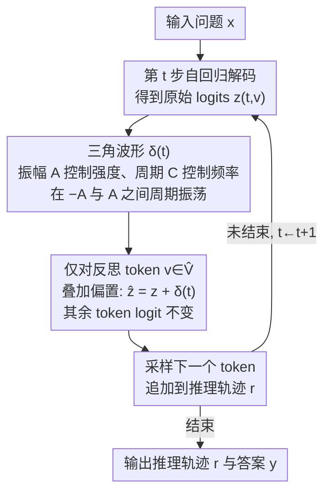

# CyclicReflex: Improving Reasoning Models via Cyclical Reflection Token Scheduling

**会议**: ICLR 2026  
**arXiv**: [2506.11077](https://arxiv.org/abs/2506.11077)  
**代码**: [https://github.com/OPTML-Group/CyclicReflex](https://github.com/OPTML-Group/CyclicReflex)  
**领域**: LLM Reasoning  
**关键词**: 大语言推理模型, 反思token调度, 测试时缩放, 周期性学习率, 解码策略

## 一句话总结
将推理过程中的反思token（如"wait"、"but"）视为可调度的"资源"，借鉴优化中周期性学习率的思想，提出CyclicReflex——一种免训练的解码策略，通过三角波形动态调控反思token的logit，在多个数学推理基准上（MATH500, AIME2024/2025, AMC2023）一致性提升1.5B-8B模型准确率。

## 研究背景与动机
大型推理模型（LRM）如OpenAI o1、DeepSeek-R1通过多步推理来解决复杂问题，推理过程由"反思token"（如"wait"、"but"、"alternatively"）引导。这些token在推理轨迹中起到关键的转折和自我评估作用。

然而，现有LRM存在两个对称性的问题：
- **思考不足（under-reflection）**：反思token过少，模型过早终止推理，无法充分探索解题路径，类似于学习率过小导致优化过早收敛
- **过度思考（over-reflection）**：反思token过多，模型反复循环（如不停输出"wait"），浪费计算资源且无法收敛到正确答案，类似于学习率过大导致优化发散

现有方法如TIP（Thought switching penalty）只能单向抑制反思token、且使用固定的logit惩罚，无法同时应对不同难度问题的under/over-reflection问题。作者提出核心问题：**如何通过资源分配策略动态调节反思token的使用频率和位置？** 其核心洞察是：将反思token调度类比为优化中的学习率调度，特别是借鉴周期性学习率（cyclical learning rate）的"步长对冲"思想。

## 方法详解

### 整体框架
CyclicReflex是一种免训练的解码策略：给定问题$\mathbf{x}$，大推理模型照常自回归地生成推理轨迹$\mathbf{r}$和答案$\mathbf{y}$，方法唯一的介入点是——在每一步解码、对原始logit做softmax采样之前，只给"反思token"（"wait"、"but"、"alternatively"等）的logit叠加一个随当前token位置$t$周期性振荡的偏置$\delta(t)$，非反思token原封不动。这个偏置既能为正（鼓励多反思）也能为负（抑制反思），随推理进程在上下两端往复，因此既不改模型参数、也不增加任何推理开销。

支撑这个极简介入的是两条逐级递进的思路：先把"反思token的多寡与位置"形式化为一个**资源分配**问题，并通过一个warm-up实验证明任何固定、单向的策略都治不好；再把反思token类比成优化里的**学习率**，借"思维景观"验证反思过少/过多恰好对应学习率过小/过大；最后落到一个借鉴**周期性学习率**的三角波形上，用一行公式实现"有进有退"的双向调度。下图是这套解码机制在自回归循环里的位置：

### 关键设计

**1. 把反思token形式化为"可调度资源"，并戳穿固定单向策略的失效**

要解决的，是图里"该不该给反思token加偏置、加多少"这个决策到底依据什么。作者先把推理中的反思token抽象成一种影响推理质量的可调度资源——它们出现的频率和位置，决定了模型是过早收敛（under-reflection）还是反复打转（over-reflection）。为说明现成方法不够用，作者拿baseline——TIP（thought switching penalty）做warm-up：TIP给反思token的logit加一个固定惩罚$\alpha\le 0$以压制频繁的思路切换。在MATH500上按生成长度与反思token数把题目聚成Easy/Medium/Hard三档（原始准确率分别约$0.92/0.71/0.21$），结果TIP只在Hard上有提升，却把Easy和Medium拉低了。换句话说，一个与推理步$t$无关的常数惩罚，按下over-reflection的同时会按出under-reflection。附录里进一步把"正向TIP（一味鼓励反思）""随机扰动""线性衰减"都试了一遍：前两者甚至不如标准TIP，线性衰减能缩小但合不上与CyclicReflex的差距。这组对照把问题逼到了唯一出路——偏置必须**随位置动态、且双向**。

**2. 反思token↔学习率的类比：用思维景观验证这是一对对称失败**

光说"要动态双向"还不够，得证明under/over-reflection确实是对称的两端、值得用"有进有退"的调度去对冲。作者给出的桥梁是一个类比：推理中的反思token之于"思维景观"，正如优化中的学习率之于"损失景观"——都是控制每一步走多远的旋钮。学习率过小会过早陷在次优解，对应under-reflection；学习率过大会发散，对应over-reflection。为坐实这个类比，作者借Landscape of Thoughts工具把每个推理步$r_i$按它与最终答案$y$的"距离"投影到二维平面，距离定义为模型在该步条件下生成答案的概率（按答案长度归一）：

$$d(r_i, y) = p_{\text{LRM}}(y \mid r_i)^{1/|y|}$$

可视化后看到三种轨迹：under-reflection太保守、始终离不开起点；desired-reflection结构良好、稳定收敛到正确答案；over-reflection最微妙——模型曾走到接近正确答案的暗色区域（如冒出"Alternatively, perhaps the correct answer is..."），却因反思过度一冲而过、最终偏离。作者还发现轨迹里的急转弯几乎都由反思token触发。这正印证了优化里"步长对冲"（stepsize hedging）的智慧——小步与大步各有失败模式，交替使用可互相弥补，而周期性学习率（cyclical learning rate）就是它在深度学习里的三角波实现，直接成了下一步的蓝本。

**3. 三角波形的双向logit调制：一行公式实现的核心解码机制**

落到实现，CyclicReflex给反思token集合$\hat{V}$里的每个token按位置叠加偏置$\delta(t)$，其余token不变：

$$\hat{z}_{t,v} = \begin{cases} z_{t,v} + \delta(t) & \text{若 } v \in \hat{V} \\ z_{t,v} & \text{否则} \end{cases}$$

$$\delta(t) = A\left|\frac{4\big((t - C/4)\bmod C\big)}{C} - 2\right| - A$$

其中振幅$A$控制调整强度、周期$C$控制振荡频率，$(t-C/4)\bmod C$给出当前token在一个周期内的相位。$\delta(t)$是一条在$[-A, A]$之间往复的三角波：在$t=C/4$处取到峰值$\delta=A$、促进反思（鼓励换思路探索），在$t=3C/4$处取到谷值$\delta=-A$、抑制反思（推动稳定收敛）。它正好把设计1要的"双向动态"和设计2类比来的"步长对冲"合二为一——上升相位放大反思促进探索、下降相位压低反思促进收敛，不押注单一步长，而用大小步交替同时对冲过早收敛与振荡发散两种风险。相比TIP那个与位置无关、只会单向压制的常数惩罚，这里整个机制没有任何可学习参数，实现上只是在每步logit上加一个由位置算出的标量，零额外开销。作者还指出周期$C$对效果的影响比振幅$A$更大。

### 损失函数 / 训练策略
本方法是纯粹的推理期策略，不涉及任何训练或参数更新。唯一需要确定的是两个超参数，通过网格搜索得到：振幅$A \in [1, 10]$、周期$C \in [200, 2000]$，具体取值因数据集而异。

## 实验关键数据

### 主实验

| 数据集 | 模型 | 指标 | Original | TIP | S1 | Silver | CyclicReflex |
|--------|------|------|----------|-----|----|----- --|-------------|
| MATH500 | Qwen-7B | Acc | 0.86 | 0.87 | 0.83 | 0.88 | **0.89** |
| AIME2024 | Qwen-7B | Acc | 0.43 | 0.43 | 0.33 | 0.37 | **0.50** |
| AIME2025 | Qwen-7B | Acc | 0.31 | 0.30 | 0.33 | 0.30 | **0.37** |
| AMC2023 | Qwen-7B | Acc | 0.81 | 0.85 | 0.85 | 0.85 | **0.90** |
| AIME2024 | Llama-8B | Acc | 0.42 | 0.47 | 0.43 | 0.47 | **0.53** |
| AMC2023 | Llama-8B | Acc | 0.81 | 0.85 | 0.75 | 0.85 | **0.90** |
| MATH500 | Qwen-1.5B | Acc | 0.74 | 0.75 | 0.73 | 0.75 | **0.77** |
| AIME2024 | Qwen-1.5B | Acc | 0.23 | 0.23 | 0.17 | 0.27 | **0.30** |

### 消融实验

| 配置 | 关键指标 | 说明 |
|------|---------|------|
| 不同难度级别 | Easy/Medium/Hard均提升 | TIP仅在Hard上有效，Easy反而下降 |
| +Best-of-N(N=8) | 持续提升BoN准确率 | 与外部test-time方法兼容互补 |
| +Beam Search | 持续提升BS准确率 | 低预算时增益更明显 |
| 初始相位$\phi=0$最优 | - | 初期鼓励反思、后期抑制效果最佳 |
| 周期$C$影响更大 | 准确率对$C$更敏感 | $C=600$在Qwen-7B/MATH500最优 |
| 振幅$A$控制长度 | 主要影响反思token数量和生成长度 | $A$越大推理越长 |

### 关键发现
- CyclicReflex在所有模型规模（1.5B-8B）和所有数据集上均一致性提升，同时生成长度与原始解码策略相当
- 自我纠错能力显著增强：在给定错误推理轨迹（100%长度）的条件下，CyclicReflex的纠错率远高于TIP和原始解码
- 生成的思维景观更集中，干扰区域更少，推理轨迹更容易直接收敛到正确答案
- S1（强制插入"Wait"）在AMC2023上严重下降，说明简单地增加反思token是不够的

## 亮点与洞察
- **类比眼光非常精到**：将反思token调度类比为学习率调度，under-reflection ↔ 学习率过小 ↔ 过早收敛，over-reflection ↔ 学习率过大 ↔ 振荡发散。这个类比不仅直觉上合理，而且通过思维景观可视化得到了很好的验证
- **极简但有效的设计**：整个方法就是一个三角波形函数，没有任何可学习参数，极易实现且零额外开销
- **双向性是关键创新**：相比TIP的单向抑制，CyclicReflex交替促进和抑制反思的能力使其能够适应不同难度的问题
- **与外部test-time scaling方法完美兼容**：与Best-of-N和Beam Search的组合均能进一步提升

## 局限与展望
- 理论基础仍偏弱：为什么LRM会出现over/under-reflection的根本原因未被阐明
- 超参数（$A$和$C$）需要针对每个数据集做网格搜索，缺乏自适应机制
- 仅在数学推理任务上验证，未测试代码生成、逻辑推理等其他推理场景
- 反思token的定义（"wait"、"but"等）较为启发式，不同模型的反思模式可能不同
- 初始相位$\phi$的最优值（$\phi=0$）暗示了更深层的推理动态规律，值得进一步探索

## 相关工作与启发
- **TIP**（Wang et al., 2025a）：通过固定惩罚抑制反思token，解决overthinking问题，是本文直接的baseline
- **S1**（Muennighoff et al., 2025）：强制在thinking tag后插入"Wait"，但效果不稳定
- **Silver Stepsize Schedule**（Altschuler & Parrilo, 2024）：优化理论中的步长对冲策略，理论上可证明加速收敛
- **Cyclical Learning Rates**（Smith, 2017）：深度学习中的周期性学习率策略，是本文核心灵感来源
- 启发：优化理论中的调度策略可能对LLM推理过程有更广泛的指导意义

## 评分
- 新颖性: ⭐⭐⭐⭐ （类比新颖，但方法本身相对简单）
- 实验充分度: ⭐⭐⭐⭐⭐ （多模型、多数据集、消融实验详尽、可视化分析到位）
- 写作质量: ⭐⭐⭐⭐⭐ （叙事流畅，类比清晰，图表出色）
- 价值: ⭐⭐⭐⭐ （实用性强，但理论基础有待加强）

<!-- RELATED:START -->

## 相关论文

- [\[ICLR 2026\] Overthinking Reduction with Decoupled Rewards and Curriculum Data Scheduling](overthinking_reduction_with_decoupled_rewards_and_curriculum_data_scheduling.md)
- [\[CVPR 2026\] Improving Vision-language Models with Perception-centric Process Reward Models](../../CVPR2026/llm_reasoning/improving_vision-language_models_with_perception-centric_process_reward_models.md)
- [\[AAAI 2026\] In-Token Rationality Optimization: Towards Accurate and Concise LLM Reasoning via Self-Feedback](../../AAAI2026/llm_reasoning/in-token_rationality_optimization_towards_accurate_and_concise_llm_reasoning_via.md)
- [\[ICLR 2026\] Fixing the Broken Compass: Diagnosing and Improving Inference-Time Reward Modeling](fixing_the_broken_compass_diagnosing_and_improving_inference-time_reward_modelin.md)
- [\[ACL 2026\] DELTA: Dynamic Layer-Aware Token Attention for Efficient Long-Context Reasoning](../../ACL2026/llm_reasoning/delta_dynamic_layer-aware_token_attention_for_efficient_long-context_reasoning.md)

<!-- RELATED:END -->
