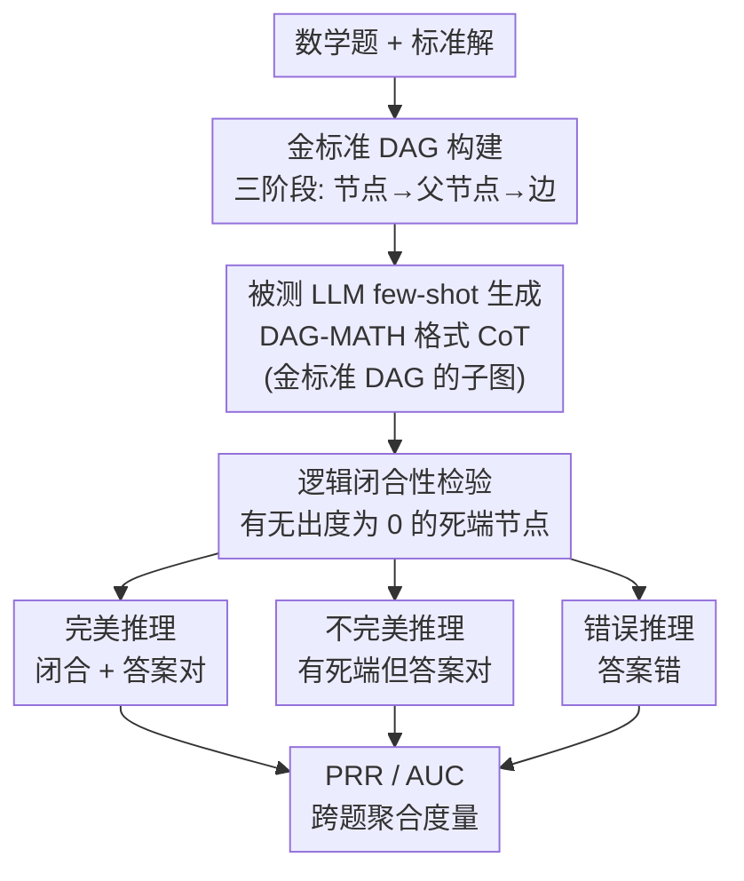

# DAG-Math: Graph-of-Thought Guided Mathematical Reasoning in LLMs

**会议**: ICLR 2026  
**arXiv**: [2510.19842](https://arxiv.org/abs/2510.19842)  
**代码**: [https://github.com/YuanheZ/DAG-MATH](https://github.com/YuanheZ/DAG-MATH)  
**领域**: LLM推理  
**关键词**: mathematical reasoning, DAG, chain-of-thought, logical closeness, evaluation metric

## 一句话总结
将 LLM 的 CoT 推理形式化为 DAG 上的基于规则的随机过程，提出"逻辑闭合性"（logical closeness）度量来评估模型是否通过搜索还是严格逻辑推理得到答案，构建了 2894 个金标准 DAG-MATH benchmark，发现即使 PASS@k 相近的模型在推理忠实度上也存在显著差异。

## 研究背景与动机
**领域现状**：LLM 在数学推理上表现强劲（o1、R1、Gemini-2.5），核心策略是 CoT。但 CoT 的黑盒性质使得难以判断模型是通过逻辑推理还是通过搜索/启发式得到正确答案。

**现有痛点**：(1) PASS@k 只看最终答案，不评估推理过程的逻辑一致性——搜索式探索也能给出正确答案；(2) LEAN 形式化验证虽严格但需要大量专家工作来预先形式化问题；(3) 现有图模型（Dziri 2023）用确定性子图匹配，忽略了多样采样和长程依赖。

**核心矛盾**：PASS@k 可能高估推理能力——模型可能通过"探索性分支"偶然找到正确答案，而非严格逻辑推导。需要一个介于自由 CoT 和形式化证明之间的评估框架。

**本文目标** 如何严格定义和评估 LLM 的数学推理能力——区分"搜索得到的正确答案"和"逻辑推理得到的正确答案"？

**切入角度**：将 CoT 建模为 DAG 上的随机过程——节点是推导步骤的结论，边是推理规则的应用。定义"逻辑闭合"要求每个中间节点都有后续节点使用它，没有无用的探索分支。

**核心 idea**：用 DAG 上的逻辑闭合性来度量 LLM 是否在做真正的逻辑推理，而非仅仅搜索。

## 方法详解

### 整体框架
本文要回答一个朴素却关键的问题：当一个 LLM 答对了一道数学题，它到底是"逻辑推导出来的"还是"瞎搜碰巧蒙对的"？PASS@k 这类只看最终答案的指标分不清这两种情况。DAG-Math 的做法是把一条 CoT 轨迹重新理解成一张有向无环图（directed acyclic graph，DAG）上的随机过程：图里源节点是题目前提，汇节点是最终答案，中间节点是每一步推导得到的结论，边则编码"用了哪些前置结论、按哪条规则推出这一步"。

落到流程上分两步走。第一步是**离线**为每道题造一张可信的金标准 DAG（benchmark 构建），它是后面一切度量的参照系；第二步是让被测 LLM 用 few-shot prompting 生成 DAG-MATH 格式的 CoT，这条生成轨迹是金标准 DAG 的一个子图。拿到生成轨迹后，先用**逻辑闭合性**检验它有没有"死端"节点（生成了却没被后续用到），再结合最终答案对错把轨迹分成三类——完美推理（逻辑闭合且答案对）、不完美推理（夹带了无用探索分支但答案仍对）、错误推理（答案错）；最后跨题聚合成 **PRR / AUC** 度量。下图是这条数据流：

### 关键设计

**1. 金标准 DAG 构建：三阶段反向 prompting 造 2894 张参照图**

逻辑闭合性也好、PRR 也好，都需要每道题有一张可信的"标准答案图"作参照，否则无从判断生成轨迹里哪些节点是冗余死端。作者为此构建了含 2894 张金标准 DAG 的 benchmark，关键技巧是按 **节点 → 父节点 → 边** 的反向顺序分三阶段生成、先固定节点集再补依赖，从而把验证拆细、抑制错误传播。Stage 1 让 GPT-o4-mini 在已知标准解的监督下逐步生成节点集，强制每个节点只含一句话、一条数学断言（统一推导粒度），并用 SymPy + LLM-as-Judge（GPT-4o）校验每步与最终答案，错了整组重采。Stage 2 给定节点集，为每个节点指定能推出它的**最小父节点集合**、组装成无环 DAG，再检验整图对汇节点是否逻辑闭合，不闭合就重采（最多 5 次，仍不行回 Stage 1）。Stage 3 用 Qwen3 生成每条边的推理说明（只能用题目与父节点、不许引入新事实）。最后人工抽检 50 题、49 题通过，确认参照图可靠。对建好的图做统计还发现：越难的题对应的 DAG 越大、越稀疏、最大出度越高，说明逻辑复杂度主要靠**分支**（一步支撑多条后续推理）而非聚合增长——这为后文"困难来自分支而非链长"提供了结构证据。

**2. 逻辑闭合性：用"有没有死端节点"区分推理与搜索**

PASS@k 只盯最终答案、对中间过程一无所知，而搜索式探索同样能撞出正确答案，这正是要解决的盲区。逻辑闭合性盯的是生成轨迹里每个中间节点的出度 $d_{\text{out}}(v)$：一个被生成出来、却没有任何后续步骤引用它的节点（$d_{\text{out}}(v)=0$）就是"死端"，意味着模型在这里做了一次无用的探索分支，而不是严格地往答案推。一条轨迹只有当不存在死端、即每个节点都被后续推理用到时才算"逻辑闭合"；若其汇节点又恰好是正确答案，就称为**完美推理**。为什么过程比答案更能暴露问题，论文用一个 toy 例子说清楚：在两条等长的链 DAG 上，要保持逻辑闭合，轨迹必须在剩下 $L-1$ 步里始终待在同一条链上、每步概率 $1/2$，于是完美推理率随深度按 $(1/2)^{L-1}$ 指数衰减；可最终答案的准确率却稳稳停在 $1/2$——光看准确率完全看不出推理的脆弱，看逻辑闭合性才看得见。

**3. Perfect Reasoning Rate（PRR）：把"是否真在推理"变成一个可计算的数**

有了逻辑闭合性的判据，就能给推理能力一个形式化度量。PRR 把闭合性和答案正确性乘在一起、对题目分布取期望：

$$\text{PRR}(\bm{X}_{\tt in}) = \mathbb{E}\big[\delta_{\text{close}} \cdot \delta_{\text{final}}\big]$$

其中 $\delta_{\text{close}}$ 标记轨迹是否逻辑闭合、$\delta_{\text{final}}$ 标记最终答案是否正确，相乘意味着缺一不可。它和 PASS@k 的关键区别正在这里：PASS@k 只要求 $\delta_{\text{final}}=1$，而 PRR 额外强制 $\delta_{\text{close}}=1$，所以它是 PASS@k 的严格加强版，二者之差恰好量化了模型靠"搜索"撑起来的那部分准确率。为避免 0/1 判定过于苛刻，论文还给了一个 AUC 变体——把要求闭合的节点比例从 0% 连续放松到 100% 扫一遍、对曲线下面积积分，得到一个平滑的连续评分用于排序。一个有意思的稳健性结论是：换不同模型（自解析 vs 外部 Thinking LLM）去解析同一条 CoT，逻辑闭合性的 AUC 分都稳定在 23.8%–25.5%，说明它是解的**内在属性**、不是解析器的产物。

### 训练策略
本文不训练模型，是评估框架 + benchmark。被测 LLM 通过 few-shot prompting 直接生成 DAG-MATH 格式 CoT 作为最终输出，再套用上述度量评估。

## 实验关键数据

### 主实验（跨模型 PRR vs PASS@1 对比）

| 发现 | 说明 |
|------|------|
| 搜索膨胀 PASS@1 | 探索性分支可以通过偶然发现正确路径来提高 PASS@1，但 PRR 不变 |
| PRR 跨模型可比 | 即使 PASS@k 差异大，各模型家族的完美推理能力其实很接近 |
| 完美推理对应简单问题 | PRR 高的问题往往是难度低的——说明当前模型对难题的逻辑推理仍然薄弱 |
| 错误 CoT 来自超能力范围 | 困难来自分支（多路推导合并）而非线性链长度 |

### 图级统计分析

| 难度 | 平均节点数 | 平均边数 | 分支因子 |
|------|----------|---------|---------|
| 简单 | 少 | 少 | 低 |
| 困难 | 多 | 多但稀疏 | 高 |

### 关键发现
- 在 MATH-500、GSM8K、AIME24/25 等上，Gemini、GPT、Qwen3 家族的 PASS@1 差异可达 10%+，但 PRR 差异小得多——说明高 PASS@1 主要来自搜索而非推理
- DAG 结构分析揭示：LLM 对需要多步汇聚（多个中间结论合并为一个步骤）的问题最容易失败
- PRR 与 PASS@1 的差值可以量化模型的"探索性开销"——差值越大说明模型越依赖搜索而非推理

## 亮点与洞察
- **首次给出 LLM 数学推理能力的形式化定义**：将直觉上的"模型是否真正在推理"转化为可计算的度量（PRR），类比学习理论中记忆/泛化的形式化
- **"Goldilocks 原则"**：框架介于自由 CoT（太松）和 LEAN 形式化证明（太严）之间，提供了实用的中间地带
- **DAG 复杂度分析的诊断价值**：通过分析 DAG 的拓扑结构（深度 vs 分支），可以精确定位模型的弱点——是线性推理不足还是多路整合不足

## 局限与展望
- DAG 的构建依赖 LLM + 人工，不完全自动化
- 节点/边的分解可能不唯一（语义变体），虽然论文讨论了但未完全解决
- 目前仅在数学推理上验证，推广到其他推理领域（如法律、科学）需要适配
- PRR 对非确定性问题（如开放式推理）的适用性受限

## 相关工作与启发
- **vs PASS@k**: PRR 是 PASS@k 的严格加强——要求不仅答案正确，推理过程也必须逻辑闭合
- **vs Dziri et al. (2023) 图匹配**: 他们用确定性子图匹配，不支持多路径和概率采样；DAG-Math 用随机过程模型
- **vs LEAN 形式化验证**: LEAN 太严格且需要预先形式化；DAG-Math 用自然语言+结构约束，更实用
- **vs Kim et al. (2025) Markov chain**: 他们用可逆马尔可夫链，不支持有向无环结构和吸收态

## 评分
- 新颖性: ⭐⭐⭐⭐⭐ 首次形式化定义 LLM 推理能力，DAG+逻辑闭合性的框架非常原创
- 实验充分度: ⭐⭐⭐⭐ 多模型家族对比、图级统计分析、多 benchmark
- 写作质量: ⭐⭐⭐⭐⭐ 理论推导严谨，概念定义清晰，toy example 说明直观
- 价值: ⭐⭐⭐⭐⭐ 为推理评估开辟新方向，可能影响该领域的评估标准

<!-- RELATED:START -->

## 相关论文

- [\[ICLR 2026\] Verifying Chain-of-Thought Reasoning via Its Computational Graph](verifying_chain-of-thought_reasoning_via_its_computational_graph.md)
- [\[ICLR 2026\] Are Reasoning LLMs Robust to Interventions on Their Chain-of-Thought?](are_reasoning_llms_robust_to_interventions_on_their_chain-of-thought.md)
- [\[ICML 2025\] MARGE: Improving Math Reasoning for LLMs with Guided Exploration](../../ICML2025/llm_reasoning/marge_improving_math_reasoning_for_llms_with_guided_exploration.md)
- [\[ICLR 2026\] MathFimer: Enhancing Mathematical Reasoning by Expanding Reasoning Steps through Fill-in-the-Middle Task](mathfimer_enhancing_mathematical_reasoning_by_expanding_reasoning_steps_through_.md)
- [\[ICLR 2026\] THOR: Tool-Integrated Hierarchical Optimization via RL for Mathematical Reasoning](thor_tool-integrated_hierarchical_optimization_via_rl_for_mathematical_reasoning.md)

<!-- RELATED:END -->
