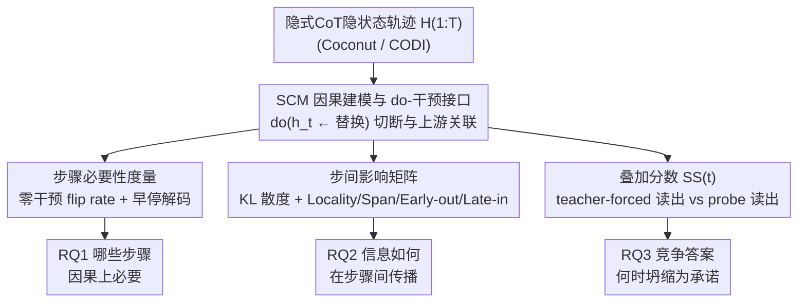

# Dynamics Within Latent Chain-of-Thought: An Empirical Study of Causal Structure

**会议**: ICLR2026  
**arXiv**: [2602.08783](https://arxiv.org/abs/2602.08783)  
**代码**: [GitHub](https://github.com/J1mL1/causal-latent-cot)  
**领域**: LLM推理  
**关键词**: 隐式思维链, 因果分析, do-干预, 结构因果模型, 可解释性  

## 一句话总结
将隐式CoT建模为结构因果模型(SCM)，通过逐步do-干预分析Coconut和CODI两种范式，发现隐式推理步骤具有异质性因果杠杆、非局部跳跃传播结构、以及输出层早期偏向与表征层晚期提交之间的持续性差距。

## 研究背景与动机
**显式CoT的固有缺陷**：Chain-of-Thought虽然提升推理准确率，但带来大量解码开销、冗长输出，且可能产生事后合理化(post-hoc rationalization)而非真实反映模型计算

**隐式CoT的兴起与挑战**：Coconut、CODI等方法将推理转入连续表征空间，降低解码成本，但中间计算不再以离散可编辑步骤暴露，传统步骤编辑/消融方法无法直接应用

**现有分析的局限**：对隐式CoT的理解主要依赖相关性探测(correlation-based probes)，缺乏因果层面的系统分析，无法回答"哪些步骤因果上必要"等关键问题

**步骤预算的本质未知**：隐式推理中固定的隐步骤预算(如T=6)是均匀贡献额外计算深度，还是扮演不同功能角色？信息如何在步骤间路由？

**输出承诺与表征承诺的关系不清**：输出层面何时"锁定"某个答案？这与内部表征的状态是否同步？竞争假设是否在中间步骤中持续存在？

**统一评估框架的缺失**：需要一个适用于不同隐式推理范式的标准化干预-读出协议，以实现可比较的因果分析

## 方法详解

### 整体框架
本文不提出新模型，而是把隐式CoT的隐状态轨迹当作一个可以被"做手术"的因果系统来研究：将每一步隐状态视为结构因果模型(SCM)中的因果变量，用 do-干预切断某一步与上游的关联，再用统一的读出协议观察下游计算和最终答案如何变化。所有分析共享同一个"SCM 建模 + do-干预"接口，之后兵分三路、各配一种读出方式来回答三个递进的研究问题——步骤必要性度量回答 RQ1(哪些步骤因果上必要)、步间影响矩阵回答 RQ2(信息如何在步骤间传播)、叠加分数回答 RQ3(竞争答案在内部何时坍缩为承诺)。因为接口与架构解耦，结构迥异的 Coconut 和 CODI 能放在同一套协议下对比。

### 关键设计

**1. SCM 因果建模与 do-干预接口：让"隐式"推理变得可手术**

隐式CoT把中间计算压进连续表征，没有离散可编辑的文字步骤，传统的步骤消融无从下手。本文对输入$x$把模型写成转移机制$H_t = f_t(H_{<t}, x, \epsilon_t; \theta)$与解码机制$Y = g(H_{1:T}, x, \epsilon_y; \theta)$，于是每个隐状态都成了因果图上的一个节点。干预通过算子$\mathrm{do}(h_t \leftarrow \tilde{h}_t)$替换第$t$步状态来切断它与上游的因果关联，被干预后的反事实轨迹再按$\tilde{h}_{t'} := f_{t'}(\tilde{h}_{<t'}, x, \tilde{\epsilon}_{t'}; \theta)$($t' > t$)向下递推。这个统一接口的好处是与具体架构解耦——Coconut(循环隐token)和CODI(自蒸馏压缩CoT)结构迥异，却共享同一套干预读出协议，从而可比。下面三个设计都是在这个接口上换不同的读出方式。

**2. 步骤必要性度量：用零干预 flip rate 找出高杠杆步骤**

要判断哪些步骤不可或缺，本文把目标步骤隐状态置零$\mathrm{do}(h_t \leftarrow \mathbf{0})$，统计 flip rate 即干预后最终预测翻转的样本比例：

$$\mathrm{Flip}(t) = \frac{1}{N}\sum_{i=1}^{N}\mathbb{I}[\tilde{y}_i^{(t)} \neq y_i]$$

选零干预而非加噪或换均值，是因为它确定性、无参数、跨架构公平，对比6种干预方式(zero/mean/mean_step/gaussian_h/gaussian_mu/gaussian_mu_step)后定性结论一致。与必要性互补的是充分性：早停解码在第$k$步后直接截断解码，用最早可解码步$k_i = \min(\{k : \hat{y}_i^{(\leq k)} = y_i^*\} \cup \{\infty\})$和累计解决率$S(k) = \frac{1}{N}\sum_{i=1}^{N}\mathbf{1}\{k_i \leq k\}$刻画答案"什么时候已经够用"。flip rate 高的步骤就是高杠杆步骤，正是它揭示了步骤间因果杠杆的异质分布。

**3. 步间影响矩阵：用 KL 散度画出信息传播图**

仅知道单步重不重要还不够，本文要看信息怎么在步骤间流动。把单步干预与下游 teacher-forced 读出结合，用输出分布的 KL 散度量化步$t$到步$s$的定向传播强度$\mathrm{KL}_{t \to s}^{(i)} = \frac{1}{|y_i^*|}\sum_{u=1}^{|y_i^*|}\mathrm{KL}(p_{\text{base}}^{(s)}(\cdot \mid y_{i,<u}^*) \| p_{\mathrm{do}(t)}^{(s)}(\cdot \mid y_{i,<u}^*))$，再聚合成影响矩阵$W_{t,s} = \mathbb{E}_i[\mathrm{KL}_{t \to s}^{(i)}]$。可视化时只保留边权$> 0.1 \cdot \max(W)$的 top-1 出边构成主导影响图，并配四个归一化结构指标——Locality(影响质量在对角线附近的集中度)、Span(期望跳跃距离)、Early-out(来自早期步骤的影响占比)、Late-in(汇聚到晚期步骤的影响占比)。正是这组指标揭示了隐式CoT 的非局部跳跃传播，与显式CoT 的近链式局部传播形成对照。

**4. 叠加分数：分离"输出提交"与"表征提交"**

最后一个问题是：模型内部何时真正"想清楚"了答案。本文在二元标签的 StrategyQA 上随机采样得到两模式 prompt，每个 prompt 采$K$次 rollout 分到$\mathcal{C}_Y$和$\mathcal{C}_N$，并用两种读出在每步测两个答案的支持度——teacher-forced readout 在固定答案模板上算 token 级 log 概率，probe readout 用固定探针把$h_t$映射到下一 token 概率。叠加分数定义为$\mathrm{SS}(t) = \min(p_Y(t), p_N(t))$，分数高说明两个候选答案在中间步骤仍在竞争。两种读出的反差正是核心发现的来源：输出层早早锁定(SS 低)，表征层却把竞争假设保留到最后一步才坍缩(SS 高)，说明"可解码"并不等于"已承诺"。

### 一个完整示例
以 GSM8K 上一个 Coconut 样本($T=6$)为例：先跑无干预基线得到隐轨迹$H_{1:6}$和正确答案；RQ1 逐个把$h_t$置零重跑，发现中间步(如$t=3,4$)置零后 flip 远高于首尾步，定位出高杠杆步骤；RQ2 对$h_3$做干预后逐步读出 KL，发现影响并未顺着$3\to4\to5$链式衰减，而是出现$3\to6$的跳跃强边，反映非局部路由；若换到 StrategyQA，RQ3 会看到 teacher-forced 的 SS 全程很低(输出早提交)，而 probe 的 SS 中段偏高、末步才骤降(表征晚提交)。同一套干预读出接口贯穿三步，逐层从"哪步重要"走到"竞争如何收敛"。

## 实验结果

### 表1: RQ1 步骤必要性——Flip Rate关键发现

| 设置 | 任务 | Flip Rate范围 | 模式 |
|------|------|------|------|
| Coconut (GPT-2) | GSM8K | 0.10-0.20+ | 中间步峰值，波动大 |
| CODI (GPT-2) | GSM8K | 0.05-0.15 | 低于Coconut同backbone |
| Coconut (Llama3-1B) | GSM8K | 较高 | backbone增强但不消除结构 |
| CODI (Llama3-1B) | GSM8K | 中等 | 相对Coconut更稳定 |
| Coconut (Qwen3-4B) | GSM8K | 较低 | 强backbone显著抑制flip |
| CODI (Qwen3-4B) | GSM8K | 最低 | 强backbone+CODI最稳定 |
| 各范式 | CommonsenseQA | 普遍<0.1 | 常识任务对干预更鲁棒 |

### 表2: RQ2 信息流结构指标对比 (GSM8K)

| 模型类型 | Locality (↑=局部) | Span (↑=长程) | Early-out | Late-in |
|------|------|------|------|------|
| CoT-SFT (GPT-2) | ≥0.6 | 低 | 中等 | 中等 |
| CoT-SFT (Llama3-1B) | ≥0.6 | 低 | 中等 | 中等 |
| Coconut (各backbone) | 显著低于CoT | 高 | 高 | 高 |
| CODI (各backbone) | 低于CoT但高于Coconut | 中高 | 中等 | 高 |

### 表3: RQ3 叠加分数对比 (StrategyQA)

| 读出方式 | Coconut SS趋势 | CODI SS趋势 |
|------|------|------|
| Teacher-forced | 全程低且几乎不变——早期输出提交 | 全程低且几乎不变——早期输出提交 |
| Probe | 中间步较高，末步骤显著下降 | 全程高于Coconut，末步下降 |

## 关键发现

1. **因果杠杆异质分布**：隐式推理步骤的flip rate随步骤索引显著变化，呈非均匀/中间步峰值模式。不同步骤扮演不同功能角色，某些"高杠杆"步骤的移除对下游计算造成不成比例的破坏
2. **任务依赖的决策脆弱性**：GSM8K(数学)的flip rate远高于CommonsenseQA，表明算术推理更依赖中间隐状态计算，而常识推理对步骤干预更鲁棒
3. **非局部跳跃传播**：隐式CoT影响图包含大量skip connection，信息常绕过中间步骤直接从早期传播到晚期，与显式CoT的近链式(局部)传播形成鲜明对比。Coconut偏向early→final直连，CODI更分散
4. **输出提交与表征提交不同步**：Teacher-forced readout显示输出早期就锁定答案(SS低)，但probe readout显示中间表征持续保留竞争假设(SS高)直到最后一步才坍缩。这意味着"可解码"不等于"已承诺"
5. **范式与backbone的正交效应**：更强的backbone降低绝对flip rate但不改变步骤依赖结构；Coconut在matched backbone下比CODI更脆弱，范式本身塑造因果结构
6. **早停解码的任务差异**：CommonsenseQA的$S(k)$前2-3步即快速饱和，GSM8K的$S(k)$持续增长到第6步，表明数学任务确实需要更多隐计算步

## 亮点
- **首次因果分析隐式CoT**：建立了统一的"干预+读出"协议，区分了可用性(availability)与稳定性(stability)
- **三个RQ层层递进的分析框架**：从现象(步骤重要性)到机制(传播结构)再到本质(模式竞争与承诺)，逻辑严密
- **揭示核心设计洞察**：隐步骤预算并非均匀的"额外深度"，而是具有非局部路由的分阶段功能接口——改善隐式推理应塑造路由/提交机制而非简单加步数
- **输出vs表征提交的发现**对推理系统设计有深远影响：表面上模型已"做出决定"，但内部表征仍在"犹豫"

## 局限性
- 仅研究Coconut和CODI两种隐式CoT范式，未覆盖Token Assorted、SoftCoT等更多方法
- 零干预(置零)虽鲁棒性已验证，但可能引入off-manifold分布偏移
- 固定隐步骤预算T=6，未探索不同预算长度下的因果结构变化
- RQ3仅在StrategyQA(二元标签)上实验，开放式任务(如GSM8K)的模式分析因输出空间过大而困难
- 未提出具体的训练/解码改进方法，分析启发了方向但未验证
- 影响图稀疏化阈值α=0.1和early/late分界m=2/5的选择较主观

## 与相关工作的对比

| 对比维度 | 本文 | Wu等(2025) "单线程推理" |
|------|------|------|
| 核心观点 | 表征层面保留竞争假设（probe readout高SS） | 连续推理本质上是贪心/单线程的 |
| 分析粒度 | 步级因果干预+读出 | 行为/输出层分析 |
| 关键区别 | 揭示"输出提交≠表征提交"，两者不矛盾但视角不同 | 未区分输出与表征层面的承诺 |

| 对比维度 | 本文 | 经典Mechanistic Interpretability (Elhage等) |
|------|------|------|
| 分析单元 | 隐推理"步骤"（宏观） | 神经元/注意力头/特征（微观） |
| 干预方式 | 步级do-干预 + teacher-forced readout | activation patching/ablation |
| 互补性 | 步级分析→发现功能路由 | 微观→定位具体计算机制 |

## 评分
- **新颖性**: ⭐⭐⭐⭐ — 首次因果分析隐式CoT，三个RQ层层递进，框架有统一性和可扩展性
- **实验充分度**: ⭐⭐⭐⭐ — 多范式(Coconut/CODI)×多backbone(GPT-2/Llama/Qwen)×多任务(GSM8K/CommonsenseQA/StrategyQA)
- **写作质量**: ⭐⭐⭐⭐⭐ — 结构极清晰，"现象→机制→本质"的递进逻辑贯穿全文
- **实用价值**: ⭐⭐⭐⭐ — 对隐式推理系统设计有重要启发(路由/提交而非堆步数)，但未提出具体改进方法

<!-- RELATED:START -->

## 相关论文

- [\[ICLR 2026\] When Reasoning Meets Compression: Understanding the Effects of LLMs Compression on Large Reasoning Models](when_reasoning_meets_compression_understanding_the_effects_of_pruning_and_quant.md)
- [\[ICLR 2026\] Uni-CoT: Towards Unified Chain-of-Thought Reasoning Across Text and Vision](uni-cot_towards_unified_chain-of-thought_reasoning_across_text_and_vision.md)
- [\[ICLR 2026\] LogicReward: Incentivizing LLM Reasoning via Step-Wise Logical Supervision](logicreward_incentivizing_llm_reasoning_via_step-wise_logical_supervision.md)
- [\[ICLR 2026\] Generalizable End-to-End Tool-Use RL with Synthetic CodeGym](generalizable_end-to-end_tool-use_rl_with_synthetic_codegym.md)
- [\[ICLR 2026\] Native Reasoning Models: Training Language Models to Reason on Unverifiable Data](native_reasoning_models_training_language_models_to_reason_on_unverifiable_data.md)

<!-- RELATED:END -->
