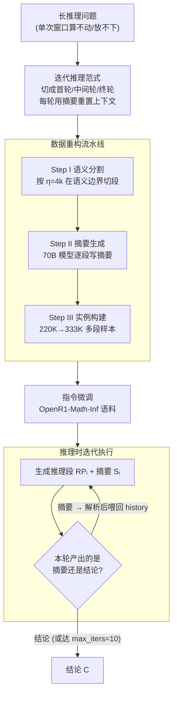

# InftyThink: Breaking the Length Limits of Long-Context Reasoning in Large Language Models

**会议**: ICLR 2026  
**arXiv**: [2503.06692](https://arxiv.org/abs/2503.06692)  
**代码**: [Project Page](https://zju-real.github.io/InftyThink)  
**领域**: 模型压缩  
**关键词**: 长上下文推理, 迭代推理, 摘要压缩, 计算效率, 推理范式

## 一句话总结
提出 InftyThink，一种将整体式长推理转化为迭代式短推理+中间摘要的新范式，在不修改模型架构的前提下实现理论上无界的推理深度、显著降低计算成本，Qwen2.5-Math-7B 在 AIME24 上提升11%。

## 研究背景与动机
以DeepSeek-R1、o1为代表的推理模型通过长链思维实现了卓越性能，但长上下文推理面临三个根本问题：

**二次方计算扩展**：Decoder-based LLM的计算复杂度随序列长度呈二次增长，推理阶段资源消耗巨大

**上下文长度天花板**：推理过程受max_length约束，经常被截断而无法得出结论

**超出训练窗口后性能退化**：大多数模型预训练窗口仅4k-8k tokens，推理超过此范围时性能明显下降

现有解决方案（如CoT-Valve压缩推理链、TokenSkip删除冗余token、LightThinker用特殊token动态压缩）仍在"单次连续推理"范式内优化，未触及根本的计算扩展问题。

核心idea：借鉴人类认知——复杂问题分解为可管理的部分并总结中间进展。将整体推理分为多个边界长度的段落，每段后生成摘要，下一段基于摘要继续推理，形成"锯齿形"内存模式。

## 方法详解

### 整体框架
InftyThink 要解决的是单次连续长推理的"二次方计算 + 上下文天花板"问题，做法是把一条长链拆成多轮有界推理，每轮算完一段就压缩成摘要再往下走。整体分两条线：离线先用一条数据重构流水线，把现成的长推理语料翻译成"分段推理 + 中间摘要"的格式并做指令微调；上线后模型按迭代推理范式执行——第 1 轮读题，生成推理段 $RP_1$ 和它的摘要 $S_1$；从第 2 轮起，模型只把前一轮的摘要 $S_{i-1}$ 当作历史上下文，在此基础上生成新的推理段 $RP_i$ 和新摘要 $S_i$；直到最后一轮不再产出摘要、而是直接给出结论 $C$。因为每轮真正进 attention 的只有"当前段 + 一份摘要"，上下文长度始终被压在 $\eta$ 量级，整体内存占用呈周期性涨落的"锯齿形"，而不是随推理变长单调膨胀。

### 关键设计

**1. 迭代推理范式：用周期性摘要把无界长链压成有界短段**

针对的是长推理在单次窗口里既算不动也放不下的痛点。InftyThink 用三种固定的序列模板把推理切成首轮、中间轮、终轮三类：首轮是 `<|U|>Q<|A|><think>RP₁</think>
S₁
`，中间轮把上一轮摘要塞进 history——`<|U|>Q<|A|><history>Sᵢ₋₁</history><think>RPᵢ</think>
Sᵢ
`，终轮则用结论替换摘要——`<|U|>Q<|A|><history>Sₙ₋₁</history><think>RPₙ</think>C`。关键在于每一轮的输入长度都被摘要"重置"回有界水平，于是推理深度可以无限叠加而上下文不爆。这套范式还天然向下兼容：简单问题在第一轮就能直接给出结论，整个流程退化成传统的一次性推理，不需要额外开关。

**2. 数据重构流水线：把现成长推理数据离线翻译成 InftyThink 的多段格式**

模型要学会"算一段就总结"，得有对应格式的训练数据，但从零生成代价太高，所以作者直接改造已有的高质量长推理语料。流水线分三步：Step I 推理分割，按超参 $\eta$（最大段长度）在句子/段落这种语义边界处把原始长推理切成多段，避免从中间截断破坏语义；Step II 摘要生成，用 Meta-Llama-3.3-70B-Instruct 为每段写摘要，且生成时让它看到此前所有段的上下文，保证摘要能接续整条推理脉络而不是孤立总结当前段；Step III 训练实例构建，把切好的段组装成多条独立样本——首段样本是 $(Q, RP_1, S_1)$，中间段是 $(Q, S_{i-1}, RP_i, S_i)$，末段是 $(Q, S_{n-1}, RP_n, C)$。靠这套流水线，作者把 OpenR1-Math 的 220K 原始样本重构成 333K 条 InftyThink 格式样本（$\eta$=4k），等于免费复用了已有的高质量推理数据。

**3. 推理时的迭代执行：边生成边解析摘要，自行决定何时收敛**

这一步让范式在推理阶段真正跑起来，且不依赖任何架构改动。模型每轮的输出会被解析出 `
`，作为下一轮的 history 上下文继续喂回去，循环往复直到某轮产出的是结论而非摘要。为防止训练不充分时陷入无限循环，作者设了 max_iters=10 兜底；实测训练良好的模型并不会顶到上限，而是会在合理轮数内自然收敛到结论。由于全程只动输入输出的拼接、不碰模型结构，任何 decoder-only 模型都能直接套用。

### 一个完整示例
以一道需要约 10k tokens 才能算完的 AIME 题、$\eta$=4k 为例：第 1 轮模型读题后写出前约 4k tokens 的推理 $RP_1$，再压成一段几百 tokens 的摘要 $S_1$（记下已建立的方程与中间结论）；第 2 轮模型丢掉 $RP_1$ 全文，只把 $S_1$ 放进 `<history>`，接着往下推出 $RP_2$ 并总结成 $S_2$；第 3 轮同样以 $S_2$ 为起点，这次推理已逼近答案，于是模型不再产出摘要而直接给出结论 $C$。三轮里每轮真正进 attention 的都只有"一份摘要 + 当前 4k 段"，峰值上下文从一次性的 ~10k 压回 ~4k，内存曲线在三轮间反复回落形成锯齿，而推理链的总长度并不受单轮窗口限制。

### 训练策略
用 instruction fine-tuning 在 OpenR1-Math-Inf（InftyThink 格式语料）上训练多种基础模型，关键超参为段长度 $\eta$ = 4k、推理时上限 max_iters = 10。

## 实验关键数据

### 主实验（base models, pass@16, temperature=0.7）

| 模型 | 格式 | MATH500 ACC | AIME24 ACC | GPQA ACC | Avg ACC |
|------|------|------------|-----------|---------|---------|
| Qwen2.5-Math-1.5B | Vanilla | 75.24 | 16.04 | 26.48 | 59.54 |
| Qwen2.5-Math-1.5B | InftyThink | **79.57** | **26.04** | **35.89** | **65.48** |
| Qwen2.5-Math-7B | Vanilla | 89.51 | 32.92 | 43.94 | 74.78 |
| Qwen2.5-Math-7B | InftyThink | **91.29** | **43.96** | **52.97** | **78.92** |
| Llama-3.1-8B | Vanilla | 82.10 | 20.83 | 41.35 | 68.49 |
| Llama-3.1-8B | InftyThink | **82.28** | **34.17** | **47.51** | **70.84** |

### 延迟对比（推理耗时）

| 模型 | MATH500延迟 Vanilla→InftyThink | AIME24延迟 |
|------|------|------|
| Qwen2.5-Math-7B | 1.26s→0.76s | 4.15s→4.66s |
| Qwen2.5-14B | 1.49s→1.43s | 11.30s→7.11s |

### 关键发现
- Qwen2.5-Math-7B 在 AIME24 上提升11%（32.92→43.96），GPQA上提升9%（43.94→52.97）
- 小模型（1.5B）获益更大：AIME24提升10%，GPQA提升9.4%
- MATH500延迟从1.26s降至0.76s，计算效率显著提升（曲线下面积更小）
- 模型规模越大（14B/32B），InftyThink的accuracy提升趋于平缓但延迟收益仍然显著
- 摘要生成模型的规模对最终性能影响不大（70B vs 更小模型差异有限）

## 亮点与洞察
- "锯齿形内存模式"概念直观且强大——周期性压缩使计算复杂度可控
- 无需架构修改、无需专门训练基础设施，仅需数据重构和SFT即可获得显著提升
- 挑战了"推理深度与计算效率必须权衡"的假设——两者可同时改善

## 局限与展望
- 摘要质量如何影响推理正确性缺乏系统分析——信息丢失可能在长推理链中累积
- $\eta$（段长度）固定为4K，动态调整可能更优（简单段无需4K，困难段可能不够）
- 依赖SFT训练，若结合RL（如GRPO）可能释放更大潜力
- 多轮摘要的可靠性在数值推理vs语言推理中可能表现不同

## 相关工作与启发
- **vs CoT-Valve**: CoT-Valve需预设压缩比，InftyThink自适应判断何时结束
- **vs LightThinker**: LightThinker压缩为隐式表示，InftyThink保持文本可解释性
- **vs TokenSkip**: TokenSkip删token会损失推理性能，InftyThink通过摘要保留关键信息

## 评分
- 新颖性: ⭐⭐⭐⭐ 迭代推理范式简单但有效，概念清晰
- 实验充分度: ⭐⭐⭐⭐⭐ 5种基础模型、多benchmark、延迟分析、消融丰富
- 写作质量: ⭐⭐⭐⭐⭐ 图示优秀，锯齿形对比图直观易懂
- 价值: ⭐⭐⭐⭐⭐ 实用价值极高，可直接用于现有模型

<!-- RELATED:START -->

## 相关论文

- [\[ACL 2026\] Long-Context Reasoning Through Proxy-Based Chain-of-Thought Tuning](../../ACL2026/llm_reasoning/long-context_reasoning_through_proxy-based_chain-of-thought_tuning.md)
- [\[ICLR 2026\] Vision-R1: Incentivizing Reasoning Capability in Multimodal Large Language Models](vision-r1_incentivizing_reasoning_capability_in_multimodal_large_language_models.md)
- [\[ICML 2026\] SmartThinker: Progressive Chain-of-Thought Length Calibration for Efficient Large Language Model Reasoning](../../ICML2026/llm_reasoning/smartthinker_progressive_chain-of-thought_length_calibration_for_efficient_large.md)
- [\[ICLR 2026\] AgentMath: Empowering Mathematical Reasoning for Large Language Models via Tool-Augmented Agent](agentmath_empowering_mathematical_reasoning_for_large_language_models_via_tool-a.md)
- [\[ACL 2026\] PPA-Plan: Proactive Pitfall Avoidance for Reliable Planning in Long-Context LLM Reasoning](../../ACL2026/llm_reasoning/ppa-plan_proactive_pitfall_avoidance_for_reliable_planning_in_long-context_llm_r.md)

<!-- RELATED:END -->
