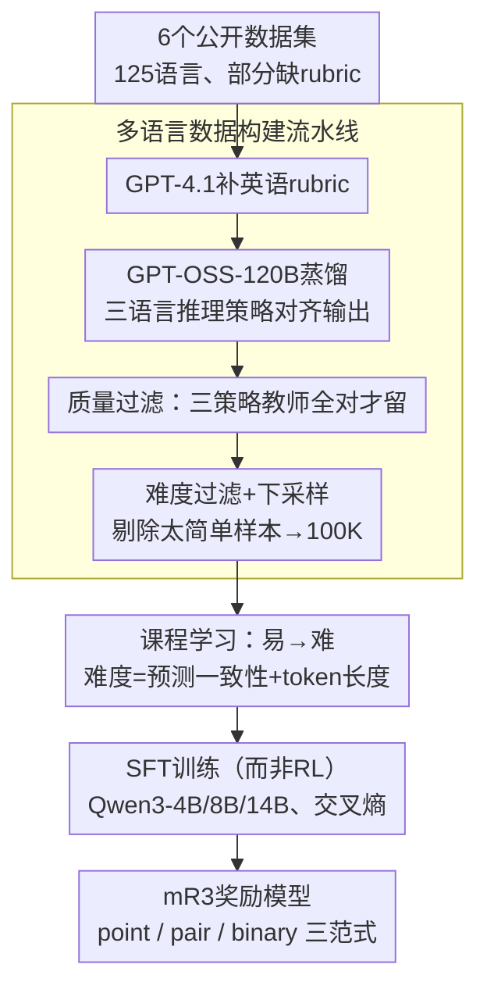

# mR3: Multilingual Rubric-Agnostic Reward Reasoning Models

**会议**: ICLR 2026  
**arXiv**: [2510.01146](https://arxiv.org/abs/2510.01146)  
**代码**: [github.com/rubricreward/mr3](https://github.com/rubricreward/mr3)  
**领域**: LLM推理 / 对齐RLHF  
**关键词**: 多语言奖励模型, 推理评估, 课程学习, rubric评估, 知识蒸馏

## 一句话总结
提出 mR3，一系列覆盖72种语言的多语言rubric-agnostic推理奖励模型，通过系统化的数据构建（GPT-OSS-120B蒸馏+难度过滤）和课程学习策略训练，14B模型在多语言评估基准上超越120B教师模型及所有同类基线，同时支持point-wise/pair-wise/binary三种评估范式。

## 研究背景与动机

**领域现状**：LLM-as-judge评估方法在英语场景已被广泛采用，但对非英语语言的支持极其有限。现有奖励模型（如ArmoRM、RM-R1）几乎完全聚焦英语，多语言评估模型（如m-Prometheus）仅覆盖6种语言，且缺乏对训练策略的系统性研究。

**现有痛点**：
   - 现有奖励模型在非英语设置下准确率显著下降
   - LLM在低资源语言（LRL）上缺乏连贯推理的能力
   - 多语言评估缺乏标准化框架，现有工作仅支持pair-wise比较，不支持point-wise和binary评估
   - 如何为多语言奖励模型构建高质量训练数据？指令语言、rubric语言、推理语言各应使用什么？缺乏系统研究

**核心矛盾**：多语言评估需要同时具备强推理能力和跨语言知识迁移能力，但现有模型的推理能力在非英语语言上远逊于英语。如何在有限的多语言数据条件下同时提升二者？

**本文目标**
   - 设计覆盖72种语言的多语言奖励推理模型
   - 系统研究指令语言、推理语言、目标语言的最优组合
   - 探索数据选择和课程学习策略
   - 支持point-wise/pair-wise/binary全评估范式

**切入角度**：与其训练传统的标量奖励模型，不如训练能产出推理trace+评分的生成式奖励模型，通过显式的推理过程提升评估的可解释性和跨语言鲁棒性。

**核心 idea**：通过GPT-OSS-120B蒸馏构建72语言对齐数据集（100K样本），结合难度过滤和课程学习训练生成式推理奖励模型，以小博大超越教师模型。

## 方法详解

### 整体框架

mR3 想做的事很直接：训练一个能对「任意语言、任意 rubric」的回答给出评分的**生成式**奖励模型，而不是传统那种只吐一个标量分的打分器。它把评估写成 $f(x)=y$ 的形式——输入 $x=(t, i, a, r)$ 包含任务指令 $t$、输入实例 $i$、候选回答 $a$ 和评估 rubric $r$；输出 $y=(\text{trace}, e, s)$，即模型先生成一段推理 trace，再给一句简短解释 $e$，最后落到评分 $s$。同一套模型支持三种评估模式：point-wise（给单个回答打分）、pair-wise（比较两个回答）、binary（判对错）。

整条 pipeline 的重心不在模型结构（就是 Qwen3 + 监督微调），而在「喂什么数据、按什么顺序喂、用什么目标训」。所以整条链路是这样转的：先把 6 个公开数据集汇成 125 语言的原始池、给缺 rubric 的样本补一份英语 rubric，再用 GPT-OSS-120B 蒸馏出三种语言策略的对齐输出，经质量过滤和难度过滤压到 100K 高质量样本；这批数据按"从易到难"排序后用交叉熵做 SFT，最终得到 4B/8B/14B 三档奖励模型。下面四个关键设计正好对应这条链路上的四个环节——数据怎么造、用哪条推理路径、按什么顺序喂、用 SFT 还是 RL。

### 关键设计

**1. 多语言数据构建流水线：从 300 万 + 样本里筛出 100K 高质量多语言训练集**

多语言奖励模型最缺的是覆盖广、质量高的对齐数据，这条流水线就是为此设计的。初始数据池汇集 6 个公开数据集（Human Arena Preference、HelpSteer3、MMMLU、HumanEval-XL、MATH-500 Multilingual、PolyGuardMix），覆盖 125 种语言；其中缺少 rubric 的样本先用 GPT-4.1 自动补一份英语 rubric。随后用 GPT-OSS-120B 做蒸馏，对每个样本生成三种语言策略下的输出（即下一个设计点要展开的 eng-eng / tgt-eng / tgt-tgt）。

数据质量靠两道过滤把关：**质量过滤**只保留三种策略下教师都能正确回答的样本，剔除教师本身就没把握的噪声；**难度过滤**则反向把太简单的样本筛掉——以 gpt-oss-20b 在 5 次尝试里答对几次来度量难度，答对越多越简单，连续都能答对的"过于容易"样本被丢弃，正确数 $\leq 2$ 的难样本则优先保留。最后下采样到 100K。这样得到的训练集不是越大越好，而是"教师有把握、又确实有难度"的那一部分。

**2. 三语言推理策略：系统比较 eng-eng / tgt-eng / tgt-tgt 三条推理路径**

蒸馏时每个样本都备齐了三种语言策略的对齐输出——eng-eng（英文指令 + 英文推理）、tgt-eng（目标语指令 + 英文推理）、tgt-tgt（目标语指令 + 目标语推理，靠系统提示和起始推理 token 强制用目标语思考）。因为三套数据内容对齐、只有推理语言不同，系统比较就能干净地回答"推理到底该用哪种语言"。结果呈现一条清晰的梯度：eng-eng 整体最强，因为英语推理能力最成熟；tgt-eng 紧随其后，说明大模型对非英语 prompt 的鲁棒性其实不差；tgt-tgt 在微调前最弱，但**微调后提升幅度最大**，甚至能超过基座模型的 eng-eng 性能。这个结果很关键——它意味着多语言训练能有效"激活"模型原本薄弱的跨语言推理能力，而目标语推理对低资源语言用户的可解释性和信任感又恰恰最重要，因此值得花代价去缩小这道差距。

**3. 课程学习：按易到难排序训练数据，先建基础再啃硬骨头**

数据筛好之后，喂入的顺序也会影响最终能力。作者对比了随机打乱、英语优先、难度排序、混合方案等六种排列，发现按**从易到难**排序效果最佳——这里的难度先看正确性（gpt-oss-20b 答对次数越少越难），再在同一正确性档内看 token 长度（越长越难）。直觉上，易样本先帮模型建立基础评估能力，难样本留到后期微调，避免训练初期就被噪声样本带偏。

**4. 用 SFT 而非 RL 训练，最大化目标 token 的对数似然**

在训练目标上，mR3 没有走当下流行的 RL 路线，而是回到标准的监督微调交叉熵：

$$\mathcal{L}_{\text{SFT}}(\theta) = -\frac{1}{N}\sum_{i=1}^{N}\sum_{t=1}^{T_i}\log \pi_\theta\big(y_t^{(i)} \mid y_{<t}^{(i)}, x^{(i)}\big)$$

即在已构建好的高质量多语言数据上，直接最大化教师输出（trace + 解释 + 评分）的似然。作者用 RLVR + GRPO（从 50K SFT 检查点起再跑 50K RL）做对照，发现在这个场景下 RL 一致不如 SFT——当数据本身已经过严格的质量与难度过滤后，监督信号反而更稳；而且 SFT 跑完 100K 只要 4 张 H100 约 8 小时，RLVR 却要 16 张 H100 约 2 天，又快又好。

### 损失函数 / 训练策略

训练以上面的 SFT 交叉熵损失为目标，基座选用 Qwen3 模型家族的 4B / 8B / 14B 三档。数据按课程学习从易到难排序送入，同一样本在 eng-eng / tgt-eng / tgt-tgt 三种语言策略下均保持对齐，使模型在一次训练中同时学到三条推理路径。

## 实验关键数据

### 主实验（Pairwise评估基准，eng-eng设置）

| 模型 | m-RewardBench (23lang) | RewardBench (1lang) | MM-Eval (18lang) | IndoPref (1lang) |
|------|----------------------|--------------------|-----------------|-----------------| 
| GPT-OSS-120B | 89.05 | 90.30 | 85.01 | 72.15 |
| Nemotron-Multi-49B | 89.03 | 89.62 | 76.27 | 68.40 |
| R3-Qwen3-14B-LoRA | 88.07 | **91.00** | 84.04 | 72.65 |
| **mR3-Qwen3-14B** | **89.18** | 90.79 | **86.05** | **74.14** |
| **mR3-Qwen3-8B** | 88.44 | 90.50 | 84.84 | 72.86 |
| **mR3-Qwen3-4B** | 87.61 | 89.74 | 82.62 | 72.22 |

mR3-Qwen3-14B以14B参数超越120B教师模型（+0.13 on m-RB, +1.04 on MM-Eval, +1.99 on IndoPref），且比49B Nemotron快3.5倍。

### 消融实验

| 配置 | 关键发现 |
|------|---------|
| 课程学习：易→难 vs 随机 | 易→难在HelpSteer3验证集上最优 |
| 数据量：50K vs 100K vs 200K | 100K为甜点，200K无显著提升 |
| 语言策略：eng-eng vs tgt-tgt | eng-eng绝对分高，但tgt-tgt微调后提升最大 |
| 难度过滤：有 vs 无 | 去除简单样本显著提升模型性能 |
| 训练方法：SFT vs RLVR | SFT在本任务中一致优于RL方法 |

### 关键发现
- **小模型大能量**：14B参数模型系统性超越120B教师模型和49B竞品，说明高质量数据+正确训练策略比规模更重要
- **tgt-tgt策略的阶跃提升**：基座模型的目标语推理最弱，但微调后提升幅度最大，甚至超过基座的eng-eng。这说明多语言训练能有效"激活"跨语言推理能力
- **DPO下游验证**：用mR3-Qwen3-14B作为奖励模型对Qwen3-30B-A3B做DPO，在m-ArenaHard-v2.0英语winrate从49.1%提升到57.3%
- **人类评估**：20名母语者跨12种语言评估，mR3的推理trace在事实性(2.78)和逻辑性(2.67)上大幅优于Qwen3基线(2.06/2.05)

## 亮点与洞察
- **72语言统一训练框架**是多语言奖励模型领域的重大突破，远超之前最多6语言的m-Prometheus。三种语言策略（eng-eng/tgt-eng/tgt-tgt）的对齐数据设计非常巧妙，既保证了研究的可控性，又覆盖了真实使用场景
- **"易→难"课程学习在奖励模型训练中有效**：这一发现可直接迁移到其他生成式评估模型的训练中
- **数据质量>数据规模**：100K精选数据训练的14B模型超越3M+数据训练的大模型，强调了multi-stage过滤（三策略一致性+难度过滤）的重要性
- **目标语推理的可解释性价值**：虽然eng推理准确率更高，但tgt推理对低资源语言用户的可访问性和trust至关重要，微调能有效缩小差距

## 局限与展望
- 教师模型GPT-OSS-120B的蒸馏输出本身存在语言偏差（英语最好），这会传递给mR3
- 72种语言中低资源语言的覆盖可能不均匀（数据集主要来源偏向高/中资源语言）
- 只用SFT训练，未充分探索RL后训练（如GRPO）的潜力
- 人类评估仅覆盖12种语言（虽然已比同类工作多很多），未涵盖所有72种训练语言
- **可改进方向**：对低资源语言做专门的数据增强（如利用高资源→低资源的翻译+回译），以及探索在线RL微调是否能进一步提升

## 相关工作与启发
- **vs R3 (Anugraha et al., 2025)**：R3是mR3的英语版前身，仅用英语数据训练。mR3继承其rubric-agnostic框架并扩展到72语言，在多语言基准上大幅超越R3（m-RewardBench: 89.18 vs 88.07），同时R3在纯英语RewardBench上略胜（91.00 vs 90.79）
- **vs m-Prometheus (Pombal et al., 2025)**：仅6语言+480K训练数据，m-RewardBench 79.51 vs mR3的89.18，差距巨大
- **vs Nemotron-Multilingual-49B (Wang et al., 2025)**：49B参数仅支持13语言的pair-wise评估，mR3-14B以1/3.5参数量和7.2倍语言覆盖全面超越

## 评分
- 新颖性: ⭐⭐⭐⭐ 72语言统一框架和三策略对齐数据构建新颖，但模型架构和训练方法（SFT）相对常规
- 实验充分度: ⭐⭐⭐⭐⭐ 覆盖7个基准、多种消融、课程学习对比、DPO下游验证、20人12语言人类评估，极为全面
- 写作质量: ⭐⭐⭐⭐ 结构清晰，表格和图表丰富，但论文较长（大量附录），核心贡献需从海量实验中提炼
- 价值: ⭐⭐⭐⭐⭐ 填补了多语言奖励模型的重大空白，对非英语LLM对齐有直接实用价值

<!-- RELATED:START -->

## 相关论文

- [\[ACL 2026\] C2: Scalable Rubric-Augmented Reward Modeling from Binary Preferences](../../ACL2026/llm_reasoning/c2_scalable_rubric-augmented_reward_modeling_from_binary_preferences.md)
- [\[ACL 2026\] Large Reasoning Models Are (Not Yet) Multilingual Latent Reasoners](../../ACL2026/llm_reasoning/large_reasoning_models_are_not_yet_multilingual_latent_reasoners.md)
- [\[ICLR 2026\] DRPO: Efficient Reasoning via Decoupled Reward Policy Optimization](drpo_efficient_reasoning_via_decoupled_reward_policy_optimization.md)
- [\[ICLR 2026\] Why is Your Language Model a Poor Implicit Reward Model?](why_is_your_language_model_a_poor_implicit_reward_model.md)
- [\[ICLR 2026\] Fixing the Broken Compass: Diagnosing and Improving Inference-Time Reward Modeling](fixing_the_broken_compass_diagnosing_and_improving_inference-time_reward_modelin.md)

<!-- RELATED:END -->
