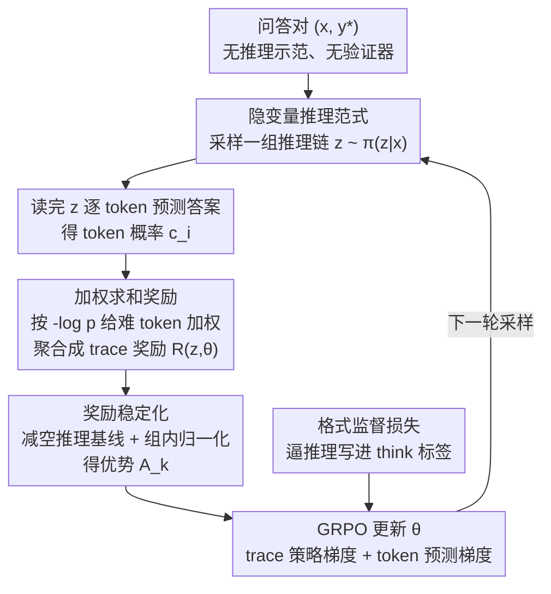

# Native Reasoning Models: Training Language Models to Reason on Unverifiable Data

**会议**: ICLR2026  
**arXiv**: [2602.11549](https://arxiv.org/abs/2602.11549)  
**代码**: 待确认  
**领域**: LLM推理  
**关键词**: 推理训练, 无验证器RL, 隐变量推理, GRPO, 奖励设计

## 一句话总结
提出 NRT（Native Reasoning Training）框架，将推理链视为隐变量，通过模型自身对参考答案的预测置信度作为内在奖励信号训练 LLM 推理能力，无需外部验证器或专家推理示范；在 Llama-3.1-8B 上 9 个基准平均提升 10.2 分（46.0→56.2），超越需要验证器的 RLPR +5.4 分。

## 研究背景与动机

**领域现状**：当前 LLM 推理能力提升主要靠两条路径——(a) 用人类/GPT-4 标注的推理链做 SFT（如 o1 复现），(b) 用外部验证器的 RL（RLVR），如数学题用最终答案正确性做奖励。两者在数学/编程等可验证领域表现出色。

**现有痛点**：大量学科任务（历史、常识、开放 QA、多跳推理）的答案**不可程序化验证**——没有确定性的 verifier 能判断推理过程是否正确。这类"不可验证数据"占实际应用的大多数，但现有 RLVR 方法无法处理。

**核心矛盾**：推理能力需要 RL 训练，RL 需要奖励信号，传统奖励来自外部验证器——但不可验证领域不存在这样的验证器。如何在没有外部奖励的情况下训练推理？

**本文要解决**：在仅有 (question, answer) 对、没有推理示范、没有外部验证器的情况下，如何训练 LLM 生成有效的推理链？

**切入角度**：将推理链 $z$ 视为**隐变量**——好的推理链应该让模型对正确答案 $y^*$ 的预测概率更高。奖励 = 模型自身在读完推理后预测答案的 token 级概率。

**核心 idea**：用"推理链是否帮助模型自己更好地预测答案"作为内在奖励，不依赖任何外部验证——模型既是推理者也是自己的评判者。

## 方法详解

### 整体框架
NRT 要回答的是：手上只有 (question $x$, answer $y^*$) 对、既没有推理示范也没有外部验证器时，怎么训练模型生成有用的推理链。它的做法是让模型自己当裁判。对每个问题，模型先采样一组推理链 $z \sim \pi_\theta(z|x)$，然后在读完推理后逐 token 地去预测参考答案，得到 token 级概率 $c_i = \pi_\theta(y^*_i \mid x, z, y^*_{<i})$。这些概率经一个**加权聚合函数**压成 trace 级奖励 $R(z,\theta)$——推理链越能抬高难 token 的预测概率、奖励越高——再经**减基线 + 组内归一化**变成稳定的优势 $A_k$，最后用 GRPO 更新 $\theta$；训练时另挂一个轻量的格式监督损失，逼模型把推理真写进 `<think>` 标签里而不是跳步直接报答案。整个回路里没有任何外部信号，奖励完全来自模型自身的预测置信度。

### 关键设计

**1. 隐变量推理范式：把推理链当成无标注的隐变量，用"能否帮自己答对"来评价**

不可验证领域的根本困境是没有验证器能判断一条推理对不对。NRT 绕开这个问题：既然没人能标注 $z$，那就不标注，把 $z$ 当隐变量，让模型自己生成、自己评估。判据是一个朴素但自洽的假设——一条好的推理 $z$ 应当抬高模型对正确答案的预测概率 $\pi_\theta(y^*\mid x,z)$，也就是读完推理后模型对正确答案更"有信心"。这样模型同时扮演学生（生成推理）和老师（用预测置信度打分），是不依赖外部验证时唯一自洽的奖励来源。

**2. 加权求和奖励：按 token 难度反比加权，让奖励聚焦在难预测的关键词上**

如果直接用 token 概率的对数和（标准 logP）做奖励，信号会被"the""of"这类高频简单 token 主导，它们本来概率就接近 1，模型在它们身上学不到任何对困难预测的改进。NRT 改成加权求和，权重反比于 token 的基础难度 $w_i \propto 1/c_{i,base}$：简单 token 权重趋近 0，关键事实词这类难 token 权重被放大。实践中最有效的是 $-\log p$ 加权方案，在 Llama-3.1-8B 上比 logP 高 3.3 分。这个方案还有理论解释——$-\log p$ 加权等价于交叉熵 $-\sum c_j \log c_{j,base}$，等于直接去缩小模型在困难 token 上的 KL 散度，因此优化压力天然集中在模型最不确定的地方。

**3. 奖励稳定化：减基线 + 组内归一化，避开 RL 训练的策略崩塌**

RLPR 这类方法有个致命问题：训练几步后推理链的熵迅速塌到 0，模型退化成不再认真推理、质量直接归零。NRT 用两步稳住训练。先做 clipped reward $R' = \max(0,\, R - R_{base})$，减去"没有推理链时"的基线奖励，让只有真正帮上忙的推理才拿到正奖励，把推理的增益和答案本身的难易解耦开；再做组内（group-wise）标准化，使 GRPO 在一组采样里的梯度尺度稳定。靠这两点，NRT 全程保持高熵和高质量推理，没有出现 RLPR 的崩塌。

**4. 格式监督损失：用一个轻量约束逼模型真去推理而不是跳步**

只有内在奖励时，模型有偷懒的捷径——跳过推理直接输出答案。NRT 加一个权重 0.3 的格式监督损失，要求输出必须用 `<think>...</think>` 标签包住推理过程，确保推理链真实存在、奖励信号有的放矢。

### 损失函数 / 训练策略
总目标是最大化期望奖励 $J(\theta) = \mathbb{E}_{z \sim \pi_\theta}[R(z,\theta)]$，用 GRPO 配重要性采样优化。它的梯度可以分解成两部分：trace policy gradient 强化整条推理链（推理好就整体上调它的采样概率），token prediction gradient 则按前面的难度权重对 token 级预测做更新。训练用 200K 样本，取自 tulu-3-sft-mixture，平均响应长度 415 tokens。

## 实验关键数据

### 主实验

**Llama-3.1-8B 在 9 个基准上**:

| 方法 | BBH | MMLU | DROP | GSM8K | MATH | HumanEval | IFEval | 总体均值 |
|------|-----|------|------|-------|------|-----------|--------|---------|
| SFT | 38.0 | 59.2 | 36.7 | 29.0 | 17.8 | 74.7 | 58.3 | 46.0 |
| RLPR* | 41.2 | 58.7 | 32.5 | 65.0 | 27.8 | 77.8 | 61.3 | 50.8 |
| Verifree* | 35.7 | 58.3 | 33.5 | 54.3 | 19.4 | 76.3 | 59.3 | 48.1 |
| NRT-GM | 54.3 | 66.1 | 48.7 | 70.3 | 32.2 | 76.3 | 55.3 | 54.9 |
| **NRT-WS(-logp)** | **51.0** | **66.7** | **52.2** | **76.0** | **30.7** | **77.8** | **59.0** | **56.2** |

**Llama-3.2-3B**:

| 方法 | 总体均值 |
|------|---------|
| SFT | 36.4 |
| NRT-WS(-logp) | **39.9**（+3.5） |

### 消融实验

| 奖励聚合方式 | Llama-3.1-8B 总体 |
|-------------|------------------|
| logP（对数概率） | 52.9 |
| P（概率乘积） | 51.4 |
| GM（几何均值） | 54.9 |
| AM（算术均值） | 53.3 |
| WS-1/p（逆概率加权） | 53.3 |
| **WS-(-logp)** | **56.2** |

### 关键发现
- **策略崩塌问题解决**：RLPR 训练过程中推理链熵迅速降为 0（推理质量崩塌），NRT 全程保持高熵和高质量推理
- **困难 token 定向提升**：WS 加权方案使模型在高熵 token 上概率提升最多达 15%，而 RLPR 几乎无改善
- **不需要可验证数据**：在 GSM8K（数学，可验证）和 BBH（推理，不可验证）上同时大幅提升，证明方法不局限于特定领域
- **推理与答案解耦**：词汇分析显示模型自动学会在推理中使用 meta-cognitive 词汇（"premise"、"reasoning"），同时抑制答案格式词

## 亮点与洞察
- **范式创新：隐变量推理**：将推理链视为隐变量、用模型自身预测置信度做奖励的想法极其优雅——不需要任何外部标注或验证器，扩展了 RL 推理训练的适用范围到所有领域
- **困难 token 加权的理论直觉**：-log p 加权让奖励聚焦在模型最不确定的关键 token 上，与课程学习和 hard example mining 的精神一致。这个简单的修改带来了 3.3 分的显著提升
- **策略崩塌的诊断与解决**：清晰展示了 RLPR 的崩塌现象（推理熵→0），并通过内在奖励设计自然避免了这一问题——因为崩塌的推理无法帮助预测答案

## 局限与展望
- **奖励函数手工设计**：5 种聚合方式 + 多种加权方案都是手工设定，可以探索自动学习奖励函数
- **采样效率有限**：RL 训练需要大量采样（GRPO 需要组内多条推理链），计算成本较高
- **仅限微调阶段**：未在预训练阶段验证，如果能在预训练就引入推理训练可能效果更好
- **幻觉风险**：案例研究显示模型可能在开放任务中生成不存在的程序名——内在奖励不能防止事实错误

## 相关工作与启发
- **vs RLPR（Reasoning via Planning with RL）**: RLPR 使用外部答案匹配奖励，在不可验证任务上崩塌。NRT 用内在预测置信度做奖励，全场景适用
- **vs Verifree**: 前人的无验证器方法使用更简单的奖励设计，NRT 的 token 级加权方案效果更好（+8.1 on Llama-8B）
- **vs STaR/Self-Improvement**: STaR 依赖正确答案筛选推理链做 SFT，NRT 用 RL 直接优化推理质量，避免了 SFT 的分布匹配问题

## 评分
- 新颖性: ⭐⭐⭐⭐⭐ 隐变量推理范式和内在奖励设计是全新视角，从根本上解决了无验证器领域的推理训练问题
- 实验充分度: ⭐⭐⭐⭐⭐ 3 个模型 × 9 个基准 × 5 种奖励变体，训练动态分析、token 级分析、案例研究全覆盖
- 写作质量: ⭐⭐⭐⭐⭐ 从问题定义到理论推导到实验分析层层递进，公式推导清晰
- 价值: ⭐⭐⭐⭐⭐ 解决了当前 reasoning 训练最核心的瓶颈——将 RL 推理训练从可验证领域扩展到任意领域

<!-- RELATED:START -->

## 相关论文

- [\[ICLR 2026\] Understanding the Role of Training Data in Test-Time Scaling](understanding_the_role_of_training_data_in_test-time_scaling.md)
- [\[ICLR 2026\] Training Large Reasoning Models Efficiently via Progressive Thought Encoding](training_large_reasoning_models_efficiently_via_progressive_thought_encoding.md)
- [\[ACL 2026\] Efficient PRM Training Data Synthesis via Formal Verification](../../ACL2026/llm_reasoning/efficient_prm_training_data_synthesis_via_formal_verification.md)
- [\[ICLR 2026\] Vision-R1: Incentivizing Reasoning Capability in Multimodal Large Language Models](vision-r1_incentivizing_reasoning_capability_in_multimodal_large_language_models.md)
- [\[CVPR 2026\] Improving Vision-language Models with Perception-centric Process Reward Models](../../CVPR2026/llm_reasoning/improving_vision-language_models_with_perception-centric_process_reward_models.md)

<!-- RELATED:END -->
