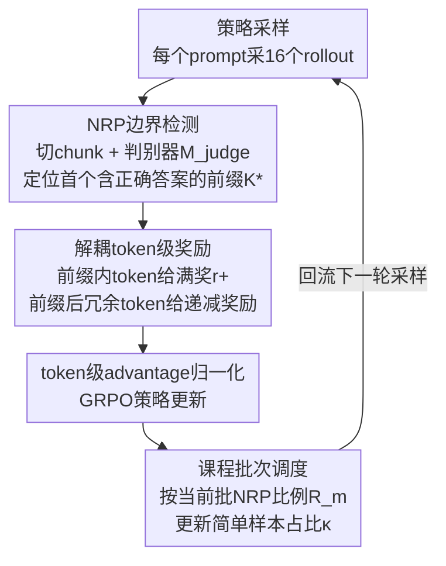

# Overthinking Reduction with Decoupled Rewards and Curriculum Data Scheduling

**会议**: ICLR 2026 Oral  
**arXiv**: [2509.25827](https://arxiv.org/abs/2509.25827)  
**代码**: [github.com/pixas/DECS](https://github.com/pixas/DECS)  
**领域**: LLM推理  
**关键词**: overthinking, 解耦奖励, 课程学习, RLVR, NRP

## 一句话总结

从理论上揭示了现有长度惩罚方法的两个根本缺陷——错误惩罚高熵探索token和错误奖励冗余token，提出 DeCS 框架，通过解耦token级奖励和课程批次调度，在7个基准上将推理token减少50%以上同时保持甚至提升模型性能。

## 研究背景与动机

**领域现状**：大推理模型（LRM）通过RLVR展现强大推理能力，但存在严重的"overthinking"问题——模型在得到正确答案后仍生成大量冗余推理步骤，推理效率低下。

**现有痛点**：现有方法通过在正确性奖励中加入长度惩罚$r'(\boldsymbol{o}_i) = r(\boldsymbol{o}_i) - \gamma |\boldsymbol{o}_i|$来鼓励简洁推理，但效率提升往往以性能下降为代价，无法达到最优效率-性能权衡。

**核心矛盾**：轨迹级长度奖励与token级策略优化之间的根本性不对齐——(1) 负advantage反向传播到所有token，错误地抑制了正确的高熵探索token（如"wait"、"however"）；(2) 较短轨迹中NRP后的冗余token仍获得正advantage，被错误地强化。

**本文目标** 如何精准区分和惩罚冗余token，同时保护对推理有贡献的必要token，实现真正无损的推理压缩。

**切入角度**：定义"必要推理前缀"（NRP）作为判断标准，将奖励在NRP边界处解耦，对NRP前后的token施加不同的奖励信号。

**核心 idea**：训练轻量判别器识别NRP边界，对NRP内token给最大奖励、NRP后冗余token给递减惩罚，配合课程调度控制简单样本比例以保护高熵探索能力。

## 方法详解

### 整体框架

DeCS 先用一个轻量判别模型 $\mathcal{M}_{\text{judge}}$ 找出每条正确轨迹中"足以得出正确答案的最短前缀"（NRP）边界，然后把 token 级奖励在这个边界处解耦——前缀内 token 拿满奖励、之后的冗余 token 拿与位置成反比的递减奖励——再叠加一个课程调度器，按当前批次的 NRP 比例动态调节简单样本的占比。整条流水线挂在 GRPO 之上：采样得到的正确轨迹经判别器定位 NRP、按边界发放解耦奖励、算出 token 级 advantage 更新策略，调度器再据当前批的冗余水平回流调整下一轮的样本配比，三者合起来既精准压制冗余、又不伤探索能力。

### 关键设计

**1. NRP 边界检测：把模糊的"想多了"变成可操作的 token 标签** overthinking 难处理的根源在于"哪些 token 是冗余"本身缺乏定义。本文把它精确化为"必要推理前缀（NRP）"——首次得出正确答案所需的最短 chunk 序列。具体做法是微调一个轻量语言模型 $\mathcal{M}_{\text{judge}}$，把推理过程按分隔符切成 chunk $\{s_1, \ldots, s_{|S|}\}$，对每个 chunk 在给定问题 $q$、前缀 $s_c$ 和标准答案 $y^*$ 下判断是否已包含正确答案 $j_{s_c} \sim \mathcal{M}_{\text{judge}}(\cdot \mid q, s_c, y^*)$，首个判为"是"的 chunk 及其之前的全部 chunk 即构成 NRP，边界位置记为 $K_{o_i}^*$。这一步把训练信号从轨迹级粗粒度细化到 token 级，为后续差异化奖励提供了支点。

**2. 解耦 token 级奖励：让冗余的第一个 token 就被否定** 现有长度惩罚之所以伤性能，是因为它把奖励作用在整条轨迹上。本文的 Theorem 2 证明了一个更致命的问题：在序列级长度奖励下，NRP 后第一个冗余 token 的梯度信号 $\mathcal{J}(A; j=K^*+1) > 0$，也就是模型反而被鼓励继续往下写而非及时停笔。DeCS 在 NRP 边界处把奖励拆开：前缀内 token（$j \leq K_{o_i}^*$）给最大奖励 $r_{i,j} = r_+ \cdot \mathbf{1}_{\text{correct}}$；前缀后的思考 token（$j > K_{o_i}^*$）给随轨迹长度衰减的奖励 $r_{i,j} = (r_0 - (r_+ - r_0)L_i/L_{\max}) \cdot \mathbf{1}_{\text{correct}}$。这样 NRP 后任何前导冗余 token 都拿到负 advantage，再借自回归特性把"提前停止"的压力传导到整段冗余上，从源头掐断啰嗦。

**3. 课程批次调度：按需放简单样本，保住高熵探索 token** 简单样本（所有 rollout 都答对的 prompt）是效率优化的主力，因为此时长度成了唯一可区分的信号；但简单样本一多，高熵探索 token（如"wait""however"）的 logit 下降会主导整个批次梯度，把模型的探索能力压垮。本文用 Lemma 2 证明长度惩罚会让高熵 token 的期望 logit 变化严格为负，并用 Theorem 1 给出维持其生成概率的充要条件 $\kappa \sigma_L < C$。据此调度器按 $\kappa_m = \text{clip}(\kappa_{m-1} + \beta(\mathcal{R}_m - \mathcal{R}_{m-1}), 0, \kappa_m^0)$ 更新简单样本占比，其中 $\mathcal{R}_m$ 是当前批次正确序列的 NRP 比例：冗余越少（NRP 比例越高）就放进越多简单样本继续压缩，否则收紧占比保护探索，实现压缩与探索的动态平衡。整套设计的理论地基由 Lemma 1 给出——它建立了 policy gradient 下 logit 变化与 advantage 的线性关系，使上述两个定理得以推导。

### 损失函数 / 训练策略

训练沿用基于 GRPO 的 PPO 代理损失（Eq. 3），token 级 advantage 归一化为 $A_{i,j}^{\text{DeCS}} = (r_{i,j} - \text{mean})/\text{std}$。超参取 $r_+=1.1$、$r_0=1.0$、$\beta=0.2$，训练集为 DeepScaleR（40k 数学题），每个 prompt 采 16 个 rollout，base 模型为 DS-1.5B 与 DS-7B，框架用 veRL。

## 实验关键数据

### 主实验

| 数据集 | 指标 | DeCS(1.5B) | Base(1.5B) | 最佳基线 | 说明 |
|--------|------|------|------|------|------|
| 7基准平均 | Pass@1 | 47.78 | 45.21 | 45.83(ThinkPrune) | +2.57, 效率与性能双提升 |
| 7基准平均 | #Token | 4000 | 9340 | 3975(ThinkPrune) | 减少57.17% |
| 7基准平均 | AES | 0.74 | 0.00 | 0.62(ThinkPrune) | AES最优 |
| AIME2024(1.5B) | Pass@1 | 31.25 | 27.99 | 29.87(TLMRE) | +3.26提升 |
| AIME2024(1.5B) | #Token | 5550 | 12202 | 5306(ThinkPrune) | 减少54.5% |
| 7基准平均(7B) | Pass@1 | 62.48 | 61.57 | 62.17(ThinkPrune) | +0.91 |
| 7基准平均(7B) | #Token | 3968 | 7857 | 4940(ThinkPrune) | 减少49.5% |

### 消融实验

| 配置 | Pass@1 | #Token | 说明 |
|------|------|------|------|
| 仅DR（解耦奖励） | 提升但残留~25%冗余 | 受限 | 缺调度导致高熵token被过度抑制 |
| 仅CS（课程调度） | 性能下降 | 减少有限 | 缺解耦奖励无法精准惩罚冗余 |
| DR+CS (DeCS完整) | 最优 | 最大减少 | 二者互补 |
| Qwen3-4B骨干 | 69.72(+1.32) | 4115(减少54.8%) | AES 0.61, 骨干通用性好 |

### 关键发现

- DeCS在减少>50% token的同时保持甚至提升Pass@1，且Pass@K曲线与base模型几乎完全重合，证明探索能力未受损
- NRP检测器虽训练于数学语料，在域外任务（GPQA-D减少56.33%、LCB减少33.52%）上同样有效
- token分析显示DeCS主要减少了"自校正/验证"和"结论"类token，"探索/替代"类token频率几乎不变

## 亮点与洞察

- 理论分析是核心贡献：两个定理精确刻画了序列级长度奖励的两个失败模式，不仅解释了现有方法为何次优，还直接指导了解耦奖励的设计。这种"先理论证明失败，再对症设计方案"的研究范式值得学习。
- NRP的概念定义简洁而深刻——"首次得出正确答案的最短前缀"，将模糊的"overthinking"概念精确化为可操作的token级标签。

## 局限与展望

- NRP检测器的质量直接影响方法效果，检测错误可能导致必要推理被惩罚
- 当前chunk分割依赖预定义分隔符（如换行），更精细的语义分割可能带来进一步提升
- 实验仅覆盖数学/编程/科学推理，对自然语言推理等软任务的泛化性未验证

## 相关工作与启发

- **vs ThinkPrune**: ThinkPrune虽减少同量token，但部分减少来自必要推理token（PNRP得分低），导致性能下降；DeCS精准减少非NRP部分
- **vs LC-R1**: LC-R1残留~10%冗余，DeCS通过解耦奖励进一步压缩
- **vs GRPO+长度惩罚**: 理论证明GRPO+长度惩罚必然导致高熵token退化（Lemma 2），DeCS通过NRP保护这些token

## 评分

- 新颖性: ⭐⭐⭐⭐⭐ 理论分析深刻且指导方法设计，NRP概念和解耦奖励方案原创性强
- 实验充分度: ⭐⭐⭐⭐⭐ 7基准+2模型规模+骨干泛化+5个研究问题分析，极其全面
- 写作质量: ⭐⭐⭐⭐⭐ 理论推导严谨，分析透彻，可视化丰富
- 价值: ⭐⭐⭐⭐⭐ 解决推理型LLM的核心效率问题，50%+压缩无损性能的实用价值极高

<!-- RELATED:START -->

## 相关论文

- [\[ICLR 2026\] DRPO: Efficient Reasoning via Decoupled Reward Policy Optimization](drpo_efficient_reasoning_via_decoupled_reward_policy_optimization.md)
- [\[NeurIPS 2025\] Curriculum Abductive Learning](../../NeurIPS2025/llm_reasoning/curriculum_abductive_learning.md)
- [\[ICLR 2026\] CyclicReflex: Improving Reasoning Models via Cyclical Reflection Token Scheduling](cyclicreflex_improving_reasoning_models_via_cyclical_reflection_token_scheduling.md)
- [\[ACL 2026\] GanitLLM: Difficulty-Aware Bengali Mathematical Reasoning through Curriculum-GRPO](../../ACL2026/llm_reasoning/ganitllm_difficulty-aware_bengali_mathematical_reasoning_through_curriculum-grpo.md)
- [\[ICLR 2026\] The First Impression Problem: Internal Bias Triggers Overthinking in Reasoning Models](the_first_impression_problem_internal_bias_triggers_overthinking_in_reasoning_mo.md)

<!-- RELATED:END -->
