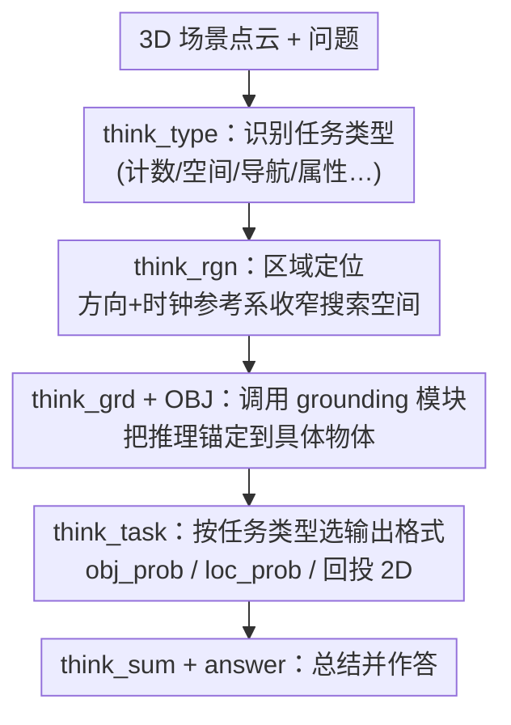

# SceneCOT: Eliciting Grounded Chain-of-Thought Reasoning in 3D Scenes

**会议**: ICLR 2026  
**arXiv**: [2510.16714](https://arxiv.org/abs/2510.16714)  
**代码**: 有（项目页面提供）  
**领域**: LLM推理  
**关键词**: 3D reasoning, chain-of-thought, grounded QA, 3D-LLM, scene understanding

## 一句话总结
提出 SceneCOT，首个将 Chain-of-Thought 推理引入 3D 场景理解的框架，通过四阶段推理管线（任务识别→区域定位→实体接地→接地推理）将中间推理步骤显式关联到视觉 grounding，在 Beacon3D 上 Good Coherence 达到 34.7%（比最强 baseline 的 20.4% 高出 70%+）。

## 研究背景与动机

**领域现状**：3D-LLM 在场景问答上取得进展，但回答往往缺乏与场景实际 grounding 的关联——模型可能给出看似合理的答案但没有真正"看到"相关物体。

**现有痛点**：Beacon3D 评估发现 grounding-QA 一致性（Good Coherence）极低：LEO 1.6%, PQ3D 16.5%, Chat-Scene 19.5%。大量回答属于"gounding 对但 QA 错"或"QA 对但 grounding 错"——说明推理过程与视觉感知脱节。

**核心矛盾**：3D 推理任务复杂多变（计数、存在性、属性、空间关系、导航等），需要不同类型的视觉线索和推理策略。单一端到端模型难以灵活处理所有任务类型。

**切入角度**：将 CoT 推理从文本领域迁移到 3D 场景，将复杂推理分解为可解释的步骤，每步显式关联到场景中的对象/区域。

**核心 idea**：通过特殊 token 编码的四阶段 CoT 推理（任务→区域→grounding→推理），将语言推理与 3D 视觉感知紧密耦合。

## 方法详解

### 整体框架
SceneCOT 把"在 3D 场景里回答问题"拆成一条由特殊 token 串起来的四阶段思维链：模型先判断这是什么类型的问题，再缩小到场景中的相关区域，接着把推理锚定到具体物体上，最后基于这些被"看到"的物体、按任务类型选合适的输出格式给出答案。整条链由多模态大语言模型（MLLM）骨干驱动，但区域识别、3D grounding、属性推理分别交给专用模块完成，从而让语言推理的每一步都有可检查的视觉依据。下图是这条链的数据流，方框里的 `<think_*>` 就是切分各阶段的特殊 token：

### 关键设计

**1. 四阶段 grounded CoT：让推理过程显式挂到视觉证据上**

以往 3D-LLM 端到端直接吐答案，回答经常"说得通但没看到对的物体"。SceneCOT 把推理显式切成四步并用特殊 token 标记：`<think_type>` 识别任务类型、`<think_rgn>` 定位区域、`<think_grd>`+`[OBJ]` 接地到具体实体（调用专用 grounding 模块）、`<think_task>` 完成接地后的推理并输出任务相关结果，最后 `<think_sum>` 总结、`<answer>` 给出回答。关键在于第三步的 `[OBJ]` 不是一句文字描述，而是真正触发 grounding 模块去场景里找物体——后续推理只能基于这些被定位到的对象展开，从机制上堵住了"凭空作答"的漏洞，这也是 Good Coherence 大幅领先的根源。

**2. 区域定位作为空间先验：用方向与时钟参考系收窄搜索空间**

整个场景里候选物体太多，直接 grounding 容易被无关对象干扰，所以第二阶段 `<think_rgn>` 先做一次区域定位再接地。SceneCOT 用方向线索（前后左右）和时钟参考系（1–12 点方向、30° 增量）把空间离散成有限的方位区间，再由规则解析器从问题里提取方向信息、过滤掉不相关的对象。这相当于给后面的 grounding 模块加了一道注意力前置，把候选范围大幅收窄，让第三阶段的实体接地更准也更快——消融里去掉区域识别会让 Overall 从 55.6 掉到约 50。

**3. 任务感知路由：不同问题走不同的推理路径和输出格式**

3D 推理任务差异很大——计数、空间关系、导航、属性各需要不同的视觉线索和答案表示，用单一输出头硬套会互相干扰。所以第一阶段识别出的任务类型不只是个标签，它在最后的 `<think_task>` 阶段决定输出格式：计数任务用对象概率 `<obj_prob>` 直接统计被 grounding 的物体数量，空间推理用 `<obj_loc_prob>` 输出位置概率，导航用极坐标形式 `<obj_loc_plr_prob>`，属性判断则用图像 token `<highlight_obj>` 把物体回投到 2D 让 VLM 看清细节。这种"先分类、再按类选路"的设计让计数这类依赖精确 grounding 的任务受益最明显（47.9% vs Chat-Scene† 37.4%）。

### 损失函数 / 训练策略
训练目标把三部分加在一起联合优化——思维链监督、最终答案、以及 grounding 结果：$\mathcal{L} = \mathcal{L}_{\text{CoT}} + \mathcal{L}_{\text{ans}} + \mathcal{L}_{\text{ground}}$，其中 grounding 项直接约束 `[OBJ]` 定位到的物体是否正确，消融显示去掉它会让 Overall 从 55.6 掉到约 53。骨干为 LLaVA-1.5 + LoRA，搭配微调过的 PQ3D 做 3D grounding、2D VLM 做属性推理和一个轻量掩码预测器。数据用自建的 SceneCOT-185K（145.6K 情境推理 + 40K 对象推理），在 4×A100 上 LoRA 微调 5 个 epoch。

## 实验关键数据

### 主实验

| 方法 | MSQA Overall | Beacon3D Case | Beacon3D Obj. | Good Coherence |
|------|------------|-------------|-------------|---------------|
| GPT-4o | 52.3 | 57.1 | 20.2 | - |
| LEO | 54.8 | 43.2 | 7.8 | 1.6 |
| Chat-Scene† | 56.6 | 53.6 | 14.0 | 19.5 |
| **SceneCOT** | **55.6** | **58.9** | **23.2** | **34.7** |

### 消融实验

| 配置 | Overall |
|------|---------|
| Full Model | 55.6 |
| w/o 任务类型识别 | ~45（强制错误类型） |
| w/o 区域识别 | ~50 |
| w/o Grounding Loss | ~53 |
| Oracle（完美 grounding） | 78.1 |

### 关键发现
- **Good Coherence 是最大亮点**：34.7% vs 20.4%（SceneVerse）——唯一真正实现 grounding-QA 对齐的方法
- **计数任务提升最大**：47.9% vs Chat-Scene† 37.4%（+10.5），得益于通过 grounding 统计对象数量
- **Oracle 分析**揭示 grounding 错误是最大瓶颈——完美 grounding 可将 overall 从 55.6→78.1
- 零样本泛化：在 SQA3D/ScanQA 上未微调仍表现良好（F1@50: 51.6/40.8）

## 亮点与洞察
- **推理过程可解释**：四阶段 CoT 的每一步都可检查——任务类型正确吗？区域对吗？grounding 到了正确物体吗？这在之前的 3D-LLM 中是不可能的
- **区域定位作为注意力机制**：时钟参考系简洁优雅地将 3D 空间离散化，大幅减少候选对象——类似于视觉 Transformer 中的区域注意力

## 局限与展望
- MSQA Overall 并未超过 Chat-Scene†（55.6 vs 56.6），在属性任务上较弱（49.6）
- 依赖外部 grounding 模块（PQ3D），grounding 精度是性能上限——oracle 实验证明了这一点
- 仅在 ScanNet 场景上训练，室外/大规模场景泛化未验证
- 四阶段管线推理延迟较高，不适合实时交互

## 相关工作与启发
- **vs Chat-Scene**: Chat-Scene QA 精度略高但 Good Coherence 仅 19.5%——回答不总是基于正确 grounding
- **vs LEO**: LEO 的 GC 仅 1.6%，几乎完全不做 grounding 就回答
- **vs GPT-4o**: GPT-4o 在 Beacon3D 上表现不错（57.1）但缺乏 3D grounding 能力

## 评分
- 新颖性: ⭐⭐⭐⭐⭐ 首次将 CoT 引入 3D 场景推理，四阶段设计系统完整
- 实验充分度: ⭐⭐⭐⭐ 多 benchmark 评估、详尽消融、oracle 分析、零样本泛化
- 写作质量: ⭐⭐⭐⭐ 问题定义清晰，CoT 设计动机到位
- 价值: ⭐⭐⭐⭐⭐ 定义了 3D 推理的新范式，Good Coherence 指标值得广泛采用

<!-- RELATED:START -->

## 相关论文

- [\[ICLR 2026\] Are Reasoning LLMs Robust to Interventions on Their Chain-of-Thought?](are_reasoning_llms_robust_to_interventions_on_their_chain-of-thought.md)
- [\[CVPR 2025\] Argus: Vision-Centric Reasoning with Grounded Chain-of-Thought](../../CVPR2025/llm_reasoning/argus_vision-centric_reasoning_with_grounded_chain-of-thought.md)
- [\[ICLR 2026\] CoT-RVS: Zero-Shot Chain-of-Thought Reasoning Segmentation for Videos](cot-rvs_zero-shot_chain-of-thought_reasoning_segmentation_for_videos.md)
- [\[ICLR 2026\] Co-rewarding: Stable Self-supervised RL for Eliciting Reasoning in Large Language Models](co-rewarding_stable_self-supervised_rl_for_eliciting_reasoning_in_large_language.md)
- [\[ICLR 2026\] Verifying Chain-of-Thought Reasoning via Its Computational Graph](verifying_chain-of-thought_reasoning_via_its_computational_graph.md)

<!-- RELATED:END -->
