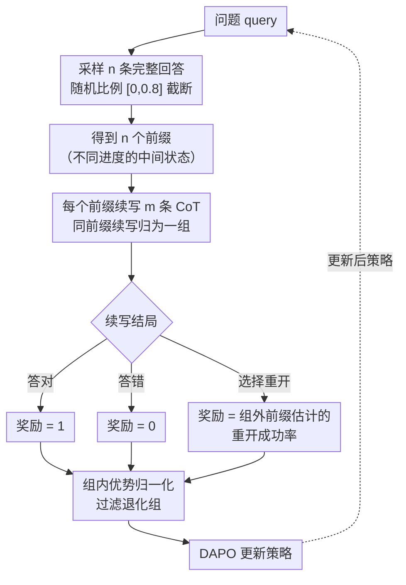

# $\textbf{Re}^{2}$: Unlocking LLM Reasoning via Reinforcement Learning with Re-solving

**会议**: ICLR 2026  
**arXiv**: [2603.07197](https://arxiv.org/abs/2603.07197)  
**代码**: [PinzhengWang322/rl-resolving](https://github.com/PinzhengWang322/rl-resolving)  
**领域**: Reinforcement Learning  
**关键词**: RLVR, LLM推理, 思维链优化, 重新求解, 过度思考

## 一句话总结
本文提出 Re² 方法，通过纯强化学习训练 LLM 学会在推理过程中主动放弃无效思维链并重新开始求解，将罕见的 redo 行为从 0.5% 提升至 30% 以上，在相同训练计算预算下显著超越标准 RLVR 方法。

## 研究背景与动机
大语言模型的推理能力可通过带有可验证奖励的强化学习（RLVR）来提升，这类方法通过增加测试时计算量来改善表现。然而，即便经过充分的 RLVR 训练，模型在生成思维链（Chain-of-Thought, CoT）时仍然容易产生不必要且低质量的推理步骤，导致"过度思考"（overthinking）问题，在消耗大量 token 的同时反而降低了最终答案的质量。

核心观察是：**当 CoT 的初始方向或质量不佳时，模型往往无法到达正确答案**，即使模型为此生成了比初始 CoT 质量良好时多出数倍的 token。这揭示了一个关键问题——标准 RLVR 训练的模型缺乏"及时止损"和"重新开始"的能力，它们总是执着于完成已经走偏的推理路径。

本文的核心 idea：教会 LLM 在推理过程中灵活地放弃不productive的推理路径，并在必要时重新开始求解过程，而非总是固守到最终答案。

## 方法详解

### 整体框架
Re²（Reinforcement Learning with Re-solving）想解决的是：标准 RLVR 训练出的模型一旦思维链（Chain-of-Thought, CoT）开头方向走偏，后续即便堆几倍 token 也很难拉回正轨。它的对策是让模型在推理途中多出一个动作——除了继续写到最终答案，还可以**主动放弃当前路径、从头重新求解**（re-solve）。难点不在于让模型「会重开」（vanilla 模型本来就有约 0.5% 的自发 redo），而在于**怎么给「重开」这个动作一个有依据的奖励**：答错给 0、答对给 1 都好说，但「我现在选择重开、还没写出答案」该给多少分？

Re² 用一套"前缀分组 + 三路奖励"的纯强化学习流程回答这个问题，全程不需要监督微调（SFT）。对每道题：先采样若干条完整回答并随机截断，得到一批代表「不同进度的中间推理状态」的前缀；每个前缀再续写出多条 CoT；按续写的结局（答对 / 答错 / 选择重开）发三种奖励，其中「重开」的奖励用**同组之外**那些前缀的统计成功率来估计；最后按 DAPO 做组内优势归一化并更新策略。下图是一轮训练的数据流：

### 关键设计

**1. 前缀分组采样：先造出一批"中间状态"，才能估计重开的收益**

要奖励「重开」，就得知道「从头再解这道题大概能成功多少」——但单看一条轨迹估不出这个概率。Re² 的做法是先对每道题用旧策略采样 $n$ 条完整回答，再把每条按 $[0,0.8]$ 内均匀抽取的比例随机截断，得到 $n$ 个**进度不一的前缀**（intermediate reasoning states）；每个前缀再独立续写 $m$ 条 CoT，同一前缀的续写归为一组（论文取 $n{=}8$、$m{=}8$）。这套分组结构是后面三路奖励能落地的前提：估某个前缀「重开成功率」时，正好可以借用**其他前缀**（out-of-group，即前缀不是当前 $\text{Pre}_i$ 的）的续写结果做经验估计，避免用自己这一组的样本自我循环。为了让基座模型一开始就肯尝试重开，还配了一个专门的提示策略（prompting strategy）来激发 re-solve 行为。

**2. 三路奖励：给"重新求解"一个基于组外成功率的分数**

这是 Re² 的核心。对第 $i$ 个前缀的第 $j$ 条续写 $O_{i,j}$，它的结局 $C_{i,j}$ 有三种：给出正确答案、给出错误答案、或选择重开。前两种沿用标准 RLVR——对得 1、错得 0；关键是第三种「重开」：它的奖励等于**从头重解这道题的期望准确率**，用组外那 $(n{-}1)\cdot m$ 条续写里答对 / 答错 / 重开的经验概率 $P_{\neq i}(\cdot)$ 来估计，并按最多允许 $R$ 轮重开（论文取 $R{=}5$）展开成等比级数：

$$r_{i,j}=\begin{cases}1, & C_{i,j}=\text{correct}\\[2pt]0, & C_{i,j}=\text{incorrect}\\[4pt]P_{\neq i}(\text{correct})\cdot\dfrac{1-P_{\neq i}(\text{resolve})^{R}}{1-P_{\neq i}(\text{resolve})}, & C_{i,j}=\text{resolve}\end{cases}$$

这样设计的好处是：当前轨迹靠谱时，直接写完答案的期望奖励更高，模型倾向继续；当前轨迹已经走乱时，「重开」的期望准确率超过硬写下去，模型就被推向放弃重来。换句话说，重开值不值得不是人工拍的阈值，而是由组外样本算出来的、随题目难度自适应的分数。

**3. 组内优势归一化 + DAPO 更新：把三路奖励变成可优化的梯度**

有了逐条续写的奖励，Re² 沿用 DAPO 的优化流程把它转成策略更新。先在每个前缀组内做优势归一化 $\hat{A}_{i,j}=\dfrac{r_{i,j}-\text{mean}(\{r_{i,j}\})}{\text{std}(\{r_{i,j}\})}$，组内所有续写奖励完全相同的「退化组」直接过滤掉（这类组提供不了对比信号）；再用 DAPO 的裁剪式目标（$\varepsilon_\text{low}{=}0.2$、$\varepsilon_\text{high}{=}0.28$）更新策略。整套训练不引入任何新网络模块，也不需要 SFT——正是这套奖励信号让原本约 0.5% 的稀有 redo 行为在训练中自发爬升到 30% 以上。

## 实验关键数据

训练集为 DAPO-Math-17K（17K 道数学题，答案统一转成整数便于规则判分），基线是 vanilla 模型与 DAPO，且 Re² 与 DAPO 训练时消耗的生成 token 量持平以保证公平。评测覆盖五个基准：AIME24 / AIME25 / AMC23（数学竞赛）、GSM8K（小学应用题）、GPQA-Diamond（研究生级科学推理，域外）。

### 主实验（五个基准平均准确率，括号为相对 DAPO 的提升）

| 模型 | 方法 | AIME24 | AIME25 | AMC23 | GSM8K | GPQA | Avg |
|------|------|--------|--------|-------|-------|------|-----|
| Qwen2.5-7B Base | + DAPO | 11.9 | 10.3 | 64.7 | 91.8 | 29.7 | 41.7 |
| Qwen2.5-7B Base | + Re² | 17.1 | 19.0 | 70.8 | 93.6 | 36.8 | **47.5 (+5.8)** |
| Qwen2.5-14B Base | + DAPO | 18.2 | 15.7 | 64.0 | 94.3 | 44.8 | 47.4 |
| Qwen2.5-14B Base | + Re² | 28.5 | 23.4 | 68.5 | 94.6 | 49.6 | **52.9 (+5.5)** |
| Qwen2.5-7B-Instruct | + DAPO | 16.0 | 8.6 | 62.3 | 92.6 | 35.4 | 43.0 |
| Qwen2.5-7B-Instruct | + Re² | 18.6 | 21.2 | 64.7 | 94.1 | 38.4 | **47.4 (+4.4)** |
| DeepSeek-R1-Distill-Llama-8B | + DAPO | 38.4 | 26.5 | 86.9 | 89.6 | 38.4 | 55.9 |
| DeepSeek-R1-Distill-Llama-8B | + Re² | 47.2 | 29.6 | 88.7 | 92.2 | 44.8 | **60.5 (+4.4)** |

> Re² 在 3B–14B 的 base / instruct / 推理模型上一致超过 DAPO（$p<0.05$），含域外的 GPQA 也有提升；AIME25 在所有受测模型训练之后发布，可排除数据污染。

### 消融与行为分析

| 配置 | 关键指标 | 说明 |
|------|---------|------|
| Vanilla 模型 | redo 率 ~0.5% | RL 之前自发重开极罕见 |
| Re² 训练后 | redo 率 >30% | 纯 RL（无 SFT）即把稀有行为放大约 60 倍 |
| 训练时扩展（AIME25） | 同 token 预算 | 各训练步上 Re² 准确率持续高于 DAPO |
| 测试时扩展（AIME25） | 随采样数增加 | Re² 优于 DAPO 的多数投票，scaling 曲线更陡 |

> 关键超参：每步 32 道题，每题 $n{=}8$ 前缀、每前缀 $m{=}8$ 续写，最多 $R{=}5$ 轮重开，训练序列长 8192、评测放宽到 16384。

### 关键发现
- 当 CoT 初始方向不佳时，即使模型生成数倍于正常长度的 token，也难以纠正错误——这正是 re-solving 的必要性所在
- 纯 RL（不用 SFT）足以把 redo 率从 0.5% 拉到 30%+，靠的是三路奖励给「重开」动作一个组外估计的成功率，而非人工标注格式
- Re² 在测试时表现出更好的 scaling：随采样数增加性能持续提升，说明重开带来了更多样、更高质量的推理路径
- 域外科学推理基准 GPQA-Diamond 上同样有提升，说明方法不只过拟合数学题

## 亮点与洞察
- **简洁而有效的设计理念**: 不是设计更复杂的推理结构，而是赋予模型"重头再来"的能力，这与人类解题时的自然行为一致
- **纯 RL 训练无需 SFT 数据**: 证明了仅通过强化学习就能从模型中挖掘和放大有益的推理模式，这为未来的 LLM 训练提供了新的思路
- **对 overthinking 问题的深入分析**: 清晰地揭示了标准 RLVR 模型在 CoT 初始方向不佳时的脆弱性
- **测试时计算效率**: Re² 不仅提升了 pass@1，在需要多次采样的 pass@k 设置下也表现出色，说明该方法生成的多条推理路径更加多样化

## 局限与展望
- 论文主要关注数学推理任务，在代码生成、逻辑推理等其他推理领域的效果有待验证
- Re-solving 机制增加了模型的平均输出长度，在推理延迟敏感的场景中可能不够理想
- 何时触发 re-solving 的决策完全由模型隐式学习，缺乏显式的触发条件分析
- 对于简单问题，re-solving 机制可能带来不必要的计算开销
- 能否与更先进的 CoT 优化方法（如 tree-of-thought）结合使用值得探索

## 相关工作与启发
- **RLVR 方法系列**: 如 DeepSeek-R1 等工作通过可验证奖励提升 LLM 推理能力，Re² 在此基础上解决了 overthinking 问题
- **CoT 优化**: 与 self-reflection、backtracking 等方法不同，Re² 采用更彻底的"重新开始"策略而非局部修正
- **测试时计算优化**: Re² 在测试时的表现暗示了 re-solving 对样本多样性的正面影响，与 best-of-N 采样策略有协同效应
- **启发**: 在 RL 训练中，模型自身蕴含的罕见但有益的行为模式可以被有效放大，这一思路可能推广到其他领域

## 评分
- 新颖性: ⭐⭐⭐⭐
- 实验充分度: ⭐⭐⭐⭐
- 写作质量: ⭐⭐⭐⭐
- 价值: ⭐⭐⭐⭐

<!-- RELATED:START -->

## 相关论文

- [\[ICML 2026\] When to Re-Plan: Subgoal Persistence in Hierarchical Latent Reasoning](../../ICML2026/llm_reasoning/when_to_re-plan_subgoal_persistence_in_hierarchical_latent_reasoning.md)
- [\[ICLR 2026\] Stabilizing Policy Gradients for Sample-Efficient Reinforcement Learning in LLM Reasoning](stabilizing_policy_gradients_for_sample-efficient_reinforcement_learning_in_llm_.md)
- [\[ICLR 2026\] Temperature as a Meta-Policy: Adaptive Temperature in LLM Reinforcement Learning](temperature_as_a_meta-policy_adaptive_temperature_in_llm_reinforcement_learning.md)
- [\[AAAI 2026\] Well Begun, Half Done: Reinforcement Learning with Prefix Optimization for LLM Reasoning](../../AAAI2026/llm_reasoning/well_begun_half_done_reinforcement_learning_with_prefix_optimization_for_llm_rea.md)
- [\[NeurIPS 2025\] Re-FORC: Adaptive Reward Prediction for Efficient Chain-of-Thought Reasoning](../../NeurIPS2025/llm_reasoning/re-forc_adaptive_reward_prediction_for_efficient_chain-of-thought_reasoning.md)

<!-- RELATED:END -->
