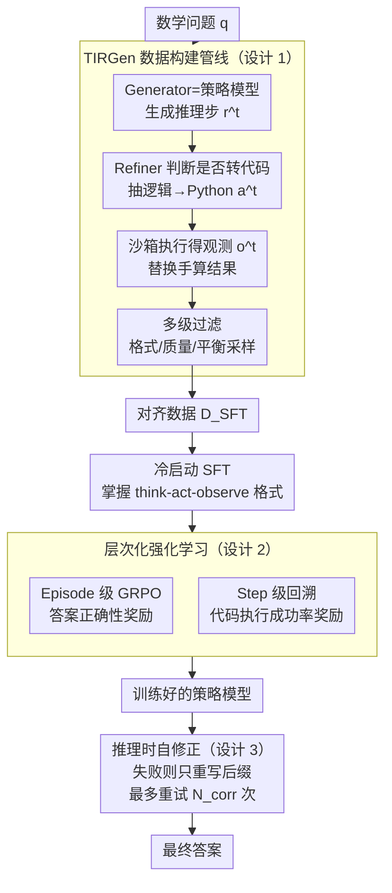

# THOR: Tool-Integrated Hierarchical Optimization via RL for Mathematical Reasoning

**会议**: ICLR 2026  
**arXiv**: [2509.13761](https://arxiv.org/abs/2509.13761)  
**代码**: [GitHub](https://github.com/JingMog/THOR)  
**领域**: LLM推理  
**关键词**: tool-integrated reasoning, hierarchical RL, GRPO, code generation, self-correction, mathematical reasoning

## 一句话总结

提出 THOR 框架，通过 TIRGen 数据构建管线 + 层次化强化学习（episode 级 + step 级联合优化）+ 自修正推理机制三大组件，系统性解决 LLM 工具集成数学推理中数据构建、细粒度优化和推理增强三大挑战，在 MATH500/AIME 等基准上达到同规模 SOTA。

## 研究背景与动机

1. LLM 作为概率 next-token 预测器，在高精度数值计算、方程求解、符号操作等任务上天然存在缺陷——概率采样误差在多步计算中不断累积

2. 工具集成推理（Tool-Integrated Reasoning, TIR）是弥补该缺陷的有效范式，但面临三大核心挑战：

    - **数据构建困难**：用 GPT-4o 等外部大模型 prompt 合成数据存在风格不匹配问题，对推理模型（如 DeepSeek-R1）效果差；START 等规则注入方法位置选择不精准导致冗余代码调用
    - **优化粒度粗糙**：现有 RL 方法（Agent-R、ToRL、ReTool）仅做 episode 级优化，以最终答案正确性作为唯一奖励信号——在长推理链中导致严重的稀疏奖励问题，中间代码步骤得不到细粒度更新
    - **推理缺乏纠错**：单 pass 推理忽略了工具执行的即时反馈——代码执行失败时应该回溯修正而非继续盲推

3. SFT 方法（Toolformer、AIMO-2）需大量高质量示范数据且泛化能力差

4. **核心洞察**：中间工具调用的执行成功率是最终答案正确性的强预测因子——这为 step 级优化提供了天然的、密集的奖励信号

## 方法详解

### 整体框架

THOR 把工具集成数学推理拆成数据、训练、推理三段连续的工程：先用 TIRGen 管线自动生成一批与策略模型分布对齐的工具调用数据 $\mathcal{D}_{SFT}$，以此冷启动 SFT 后做 episode 级与 step 级联合的层次化强化学习，最后在推理时挂上一个利用执行反馈回溯纠错的自修正模块。三段共享同一种交互格式：给定问题 $q$，模型生成 think-act-observe 交替序列 $\tau=(r^1, a^1, o^1, \ldots, r^n)$，其中 $r^t$ 是自然语言推理步、$a^t$ 是代码动作、$o^t$ 是沙箱执行结果。贯穿全篇的核心洞察是——中间代码调用能否执行成功，是最终答案正确与否的强预测因子，这把一个原本只有"答对/答错"稀疏信号的问题，变成了每一步都有反馈的密集优化问题。下面三个设计正好对应数据、训练、推理三段，而那条洞察是把它们串起来的主线。

### 关键设计

**1. TIRGen 数据构建管线：让训练数据天然贴合策略模型自己的推理风格**

用 GPT-4o 之类外部大模型 prompt 合成 TIR 数据有个老毛病——风格和推理模型对不上，喂给 DeepSeek-R1 这类模型反而掉点。TIRGen 改用 Generator-Refiner 分工：Generator 就是策略模型本身，负责生成自然语言推理步骤（单步长度上限 $L_{step}$），保留它原本的推理风格；Refiner 逐步判断这一步是否适合转成代码（数值计算、解方程等），把其中的纯逻辑部分 $r_{logic}^t$ 抽出来翻译成可执行 Python 代码 $a^t$，再丢进沙箱执行器拿到观测 $o^t$ 去替换原来手算的结果。关键在于 Refiner 只看单步推理、不看完整题目和标准答案，所以它产出的数据天然落在 Generator 的策略分布内，避开了分布外数据拖累性能的陷阱；同时任务被拆成"高级数学推理"和"基本指令跟随 + 代码生成"两半，后者不需要超大模型也能做，降低了对外部模型的依赖。最后再过一道多级过滤——格式一致性检查、要求代码包含 sympy/numpy 调用或控制流的质量过滤、按难度和调用轮次做平衡采样、剔除纯 CoT 就能解的简单题——保证留下的都是真正用得上工具的样本。

**2. 层次化强化学习：用代码执行成功率给长推理链补上密集奖励**

现有 RL 方法（ToRL、ReTool 等）只做 episode 级优化，把最终答案对错当唯一奖励，长链条里中间那些代码步骤根本得不到细粒度更新，稀疏奖励问题严重。THOR 先用 $\mathcal{D}_{SFT}$ 冷启动 SFT 让模型掌握 think-act-observe 格式，再两级联合优化。Episode 级沿用 GRPO，以答案正确性为奖励（$\mathcal{R}_i=1$ 正确、$0$ 错误），并过滤掉因环境问题而执行失败的整条轨迹避免误罚，优势按组内归一化计算：

$$A_i=\frac{\mathcal{R}_i-\text{mean}(\mathcal{R})}{\text{std}(\mathcal{R})}$$

Step 级则专门盯着执行失败的代码步骤做回溯修正：把出错的推理 $r^t$ 切成前缀 $r_{pre}^t$ 和后缀 $r_{suf}^t$（后缀长度 $L_{suf}$），保留前缀上下文不动，只重新生成后缀加代码动作，以代码能否执行成功作为步级奖励。这样每一步都有反馈，正好把洞察里的"执行成功率预测正确率"落成可训练的信号。此外还借鉴 VAPO，对正优势样本额外加一项系数为 $\alpha$ 的 NLL 损失 $\mathcal{L}_{NLL}$，直接强化好样本的似然。

**3. 推理时自修正：执行失败就只回退后缀重写，开销几乎可忽略**

单 pass 推理浪费了工具执行的即时反馈——代码一旦报错本该回头改，而不是带着错继续盲推。THOR 在推理时复用 step 级训练学到的回溯能力：当某个代码动作 $a^t$ 执行失败，就把对应推理 $r^t$ 拆成 $r_{pre}^t$ 和 $r_{suf}^t$，基于到 $r_{pre}^t$ 为止的历史重新生成后缀 $\hat{r}_{suf}^t$ 和修正动作 $\hat{a}^t$，最多重试 $N_{corr}$ 次。因为每次只重写后缀而非整条轨迹，纠错带来的额外计算极小，这也是它平均推理 token 数反而低于 ToRL、ReTool 的原因。

### 损失函数 / 训练策略

训练流程是先冷启动 SFT、再做联合 RL，总损失由 episode 级和 step 级两项相加：

$$\mathcal{L}(\theta) = \mathcal{L}_{\pi_\theta}^{epis}(\theta) + \mathcal{L}_{\pi_\theta}^{step}(\theta)$$

两级都采用 GRPO 的 clipped surrogate objective 再叠加 VAPO 式 NLL 损失。Episode 级 $\mathcal{L}^{epis}$ 用最终答案正确性奖励，并通过指示函数 $I(s_{i,t})$ 确保只对模型自己生成的 token、而非外部执行器返回的 $o^t$ 计算梯度；step 级 $\mathcal{L}^{step}$ 用代码执行成功率奖励，每个样本只含单个 think-act-observe 循环，从而保证奖励密集、每步可学。

## 实验设计

### 数据集与基准

| 基准 | 类型 | 说明 |
|------|------|------|
| MATH500 | 数学推理 | 500 道覆盖 7 个难度级别的数学题 |
| AIME 2024 | 竞赛数学 | 美国数学邀请赛 2024 |
| AIME 2025 | 竞赛数学 | 美国数学邀请赛 2025 |
| AMC | 竞赛数学 | 美国数学竞赛 |
| Minerva Math | 数学推理 | STEM 数学问题集 |
| Olympiad Bench | 竞赛数学 | 奥林匹克数学基准 |
| HumanEval | 代码生成 | 函数级代码生成 |
| MBPP | 代码生成 | 基础编程问题 |
| LiveCodeBench | 代码生成 | 实时更新的编程竞赛题 |

### 基线方法

| 模型 | 参数量 | 类型 | 是否使用工具 |
|------|--------|------|-------------|
| QwQ-32B | 32B | 推理模型 | ✗ |
| DeepSeek-R1-Distill-32B | 32B | 蒸馏推理模型 | ✗ |
| ToRL-Qwen-32B | 32B | RL + 工具调用 | ✓ |
| ReTool-32B | 32B | RL + 工具调用 | ✓ |
| START-32B | 32B | 规则注入 + 工具调用 | ✓ |
| DeepSeek-R1-7B | 7B | 蒸馏推理模型 | ✗ |
| STILL-3-1.5B | 1.5B | 小型推理模型 | ✗ |
| AIMO-2 | 32B | SFT + 工具调用 | ✓ |

## 实验结果与分析

### 主实验结果（数学基准 Avg@4）

| 模型 | MATH500 | AIME24 | AIME25 | AMC | Minerva | OlympiadBench | 平均 |
|------|---------|--------|--------|-----|---------|---------------|------|
| QwQ-32B | 96.4 | 79.2 | 72.0 | - | - | - | - |
| DeepSeek-R1-Distill-32B | 94.3 | 72.6 | 60.2 | - | - | - | - |
| ToRL-Qwen-32B | 95.6 | 75.2 | 67.3 | - | - | - | - |
| ReTool-32B | 95.2 | 72.5 | 67.5 | - | - | - | - |
| **THOR-32B** | **97.5** | **82.2** | **76.0** | - | - | - | **最优** |

**关键发现**：

1. ⭐⭐⭐ **THOR 在同规模模型中全面领先**：在 MATH500 上达到 97.5%，AIME24 达 82.2%，AIME25 达 76.0%，超过所有同规模基线

2. ⭐⭐⭐ **跨架构泛化能力强**：THOR 在推理模型（QwQ-32B 基座）和非推理模型（Qwen-2.5-32B 基座）上均有效，不同参数规模（1.5B/7B/32B）同样适用

3. ⭐⭐ **代码基准同步提升**：在 HumanEval、MBPP、LiveCodeBench 上同样有正增益，step 级代码优化带来了通用代码生成能力的提升

4. ⭐⭐ **推理开销低**：自修正机制仅在执行失败时触发，且每次仅重新生成后缀而非整条轨迹，平均推理 token 数低于 ToRL 和 ReTool

### 消融实验

| 配置 | MATH500 | AIME24 | AIME25 | 变化趋势 |
|------|---------|--------|--------|----------|
| Full THOR | **97.5** | **82.2** | **76.0** | 完整框架 |
| − Step-level RL | 96.8 | 78.5 | 72.7 | ↓ 明显退化 |
| − Self-Correction | 96.4 | 80.3 | 73.5 | ↓ 推理下降 |
| − TIRGen (用 GPT-4o 数据) | 95.9 | 76.8 | 70.3 | ↓ 显著退化 |
| 仅 Cold Start SFT | 94.2 | 68.3 | 58.7 | ↓ 大幅退化 |

**关键发现**：

1. ⭐⭐⭐ **Step 级 RL 贡献最大**：移除后 AIME24 降 3.7 分，AIME25 降 3.3 分，验证了中间代码执行成功率作为密集奖励的有效性

2. ⭐⭐ **TIRGen 数据对齐至关重要**：换用 GPT-4o 合成数据后 AIME25 降 5.7 分，说明策略对齐的训练数据远优于分布外数据

3. ⭐⭐ **自修正机制在难题上效果显著**：对 AIME25（最难基准）贡献 2.5 分提升，因为难题更容易出现代码执行失败需要纠错

### 关键统计验证

论文验证了核心洞察——中间工具调用成功率与最终答案正确性高度相关：所有代码调用成功的轨迹中最终答案正确率显著高于存在执行失败的轨迹，为 step 级优化提供了理论基础。

## 优点与创新

1. ⭐⭐⭐ **系统性框架设计**：数据-训练-推理三阶段互补，TIRGen 解决数据、层次化 RL 解决优化、自修正解决推理，形成完整闭环
2. ⭐⭐⭐ **层次化 RL 的密集奖励**：利用代码执行成功率作为 step 级奖励信号，有效缓解长推理链中的稀疏奖励问题
3. ⭐⭐ **Generator-Refiner 数据构建**：Refiner 仅看单步不看全题的设计巧妙实现策略对齐，同时降低对外部大模型的依赖
4. ⭐⭐ **低开销自修正**：仅重新生成后缀而非整条轨迹，计算代价极小
5. ⭐ **广泛的模型适用性**：推理/非推理模型、多种参数规模均有效

## 不足与展望

1. ⭐⭐ **工具类型单一**：当前仅支持 Python 代码执行器，未扩展到符号求解器（Mathematica）、搜索引擎等更多工具
2. ⭐⭐ **回溯策略固定**：后缀长度 $L_{suf}$ 为固定超参，未自适应地根据错误类型调整——过长浪费计算、过短无法修复根本错误
3. ⭐ **数学领域局限**：未验证在科学推理、逻辑推理等更广泛推理任务上的效果
4. ⭐ **自修正重试次数有限**：$N_{corr}$ 次重试仍可能无法修复某些系统性错误，缺乏放弃该路径并换道的机制

## 总结

THOR 是一个端到端的工具集成数学推理增强框架，核心贡献在于：(1) TIRGen 管线生成与策略模型对齐的高质量 TIR 数据；(2) 层次化 RL 通过 episode 级（答案奖励）和 step 级（代码执行奖励）联合优化，有效缓解稀疏奖励；(3) 自修正机制利用工具反馈实现低开销在线纠错。该框架在多个数学和代码基准上达到同规模 SOTA，展示了工具集成推理的系统性解决方案。

<!-- RELATED:START -->

## 相关论文

- [\[CVPR 2026\] Scaling Agentic Reinforcement Learning for Tool-Integrated Reasoning in VLMs](../../CVPR2026/llm_reasoning/scaling_agentic_reinforcement_learning_for_tool-integrated_reasoning_in_vlms.md)
- [\[ICLR 2026\] AgentMath: Empowering Mathematical Reasoning for Large Language Models via Tool-Augmented Agent](agentmath_empowering_mathematical_reasoning_for_large_language_models_via_tool-a.md)
- [\[ICLR 2026\] Generalizable End-to-End Tool-Use RL with Synthetic CodeGym](generalizable_end-to-end_tool-use_rl_with_synthetic_codegym.md)
- [\[ICLR 2026\] Harder Is Better: Boosting Mathematical Reasoning via Difficulty-Aware GRPO and Multi-Aspect Question Reformulation](harder_is_better_boosting_mathematical_reasoning_via_difficulty-aware_grpo_and_m.md)
- [\[ICLR 2026\] DRPO: Efficient Reasoning via Decoupled Reward Policy Optimization](drpo_efficient_reasoning_via_decoupled_reward_policy_optimization.md)

<!-- RELATED:END -->
