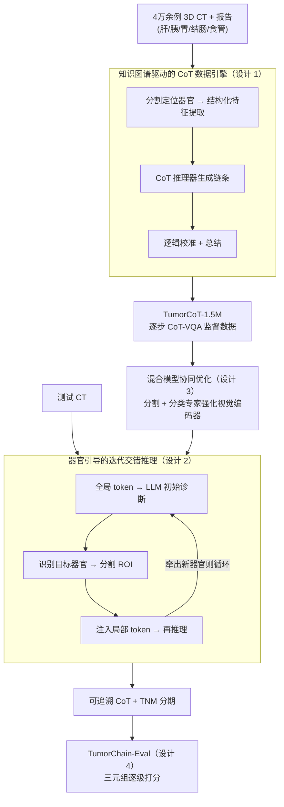

# TumorChain: Interleaved Multimodal Chain-of-Thought Reasoning for Traceable Clinical Tumor Analysis

**会议**: ICLR 2026  
**arXiv**: [2603.05867](https://arxiv.org/abs/2603.05867)  
**代码**: [GitHub](https://github.com/ZJU4HealthCare/TumorChain)  
**领域**: LLM推理  
**关键词**: 肿瘤分析, 多模态CoT推理, 交错推理, 3D CT, TNM分期

## 一句话总结

提出TumorChain，面向消化系统五大器官肿瘤分析的交错多模态CoT推理框架，通过知识图谱驱动的1.5M CoT-VQA数据引擎、器官引导的迭代交错推理(IIR)和分割/分类/LLM三模型协同优化，实现从影像发现→临床印象→病理预测的完整推理链，平均精度84.41%，大幅超越GPT-5-Mini(51.59%)。

## 研究背景与动机

- **领域现状**: 医学VLM在通用报告生成上有进展，但在临床肿瘤学这一高风险场景中严重不足。肿瘤分析需要连接影像发现(findings)、临床印象(impressions)和病理终点(TNM分期)的完整推理链
- **三大痛点**: (1) 现有Med-VLM缺乏肿瘤特化能力，不能可靠地将放射学发现映射到病理级别终点；(2) 缺乏大规模、多粒度的肿瘤特定数据集，现有CT-RATE等为选择题/短文本QA，不支持CoT推理；(3) 大多数Med-VLM限于2D图像和单步推理，3D CT的结构复杂度要求多步临床推理
- **核心矛盾**: 临床肿瘤诊断是一个多步推理过程（发现异常→综合判断→病理分期），但现有模型无法产生可追溯的推理链，内部推理过程不透明
- **本文切入**: 构建完整的findings→impressions→pathology推理管线，用专门设计的CoT评估协议(TumorChain-Eval)衡量推理链的每一步质量

## 方法详解

### 整体框架

TumorChain把"从影像发现到病理分期"的临床推理做成一条端到端、可追溯的管线，覆盖数据、训练、推理、评估四环。**数据**上，先用知识图谱约束的多Agent引擎，把4万余例3D CT和放射/病理报告炼成150万条逐步监督的CoT-VQA数据(TumorCoT-1.5M)；**模型**上，TumorChain由3D视觉编码器$\mathcal{E}_v$、器官分割专家$\mathcal{S}eg$、异常分类模型$\mathcal{C}ls$、MLP投影器$\mathcal{P}$和大语言模型$\mathcal{LLM}$协同；**推理**时，模型像放射科医师一样"先全局浏览整张CT、再聚焦可疑器官反复确认"，把这套交错读片工作流写进前向过程；**评估**上，把生成的推理链拆成三元组逐级打分，衡量每一步是否可信。核心思路是先做全局-局部视觉对齐，再用迭代交错推理把临床读片逻辑显式化，从而让中间推理过程透明、可追溯。

### 关键设计

**1. 知识图谱驱动的CoT数据引擎（TumorCoT-1.5M）：解决肿瘤特化CoT数据从零到有的问题**

肿瘤推理之所以难训，根子在于现有的CT-RATE等数据集只有选择题或短文本QA，没有可监督的逐步推理链。TumorChain从41,059个3D CT扫描、10,708份放射学报告及部分病理报告出发（覆盖肝/胰/胃/结肠/食管五大消化器官），用六个Agent接力把原始影像炼成CoT：分割专家(TotalSegmentator)定位器官，结构化特征提取器(Qwen3-235B)抽出病灶属性，CoT推理器(GPT-4o-mini)生成推理链，逻辑校准器(Claude3.5-Haiku)检查链条合理性，总结器(GPT-5-mini)整理输出。关键约束来自一张与放射科/病理科医生共建的五器官诊断知识图谱(KG)，它把临床标准编码成推理路径，逼迫生成的链条沿着真实诊断逻辑走；一旦逻辑校准器发现链条有问题，就触发"扩展器官区域"或"提供疑似原因"两种修复策略引导重新推理。这套交叉验证机制最终产出1,497,818个CoT-VQA对，覆盖定位、病灶属性、TNM分期、CoT报告四类任务，让肿瘤特化的多步监督第一次有了规模化数据。

**2. 器官引导的迭代交错推理(IIR)：让模型像放射科医师一样反复聚焦可疑区域**

3D CT结构复杂，单步推理很容易漏掉局部细节。IIR把推理拆成可循环的三步：第一步LLM只看全局CT token和任务prompt，给出初始诊断$\mathcal{R}^1_{cot}$；第二步从这份初始输出里识别出目标器官，调分割专家抠出该器官的ROI，并自动生成"需要更关注[器官名]"的增强prompt，得到局部器官token；第三步把全局token、任务prompt、初始答案和局部token拼在一起重新喂给LLM做迭代推理，如果新一轮又牵出别的相关器官，就继续循环下去。这种"全局浏览→聚焦可疑区→再回看"的交错过程直接对应放射科医师的实际读片习惯，多轮自我验证也压低了一次性推理容易产生的幻觉。

**3. 混合模型协同优化(HCO)：用分割和分类两个专家把LLM的判别力顶上去**

光靠LLM并不能保证对细微异常足够敏感，HCO让三个模型在训练阶段互相补强：分割模型持续提供精确的ROI定位，分类模型在局部器官特征上训练正常/异常二分类，把对细微病灶的判别力直接灌进视觉编码器，LLM则整合这些结果并借助分割结果做迭代决策。三者通过联合损失一起优化，$L_{total} = L_{LLM} + \lambda L_{cls}$，其中$\lambda$平衡语言生成与分类判别两条监督信号，使视觉表征既服务推理生成又保留对异常的敏感度。

**4. TumorChain-Eval评估协议：把推理链拆成结构化三元组逐级打分**

端到端的准确率掩盖了推理链中间步骤的对错，所以本文专门设计了一套链级评估。它先从CoT推理过程中提取主谓宾三元组（如"胰尾-发现-恶性肿瘤"），再按推理层级分三级评分：发现链$S_{FC}$衡量独立事实是否准确，印象链$S_{IC}$衡量多个发现的综合判断，长推理链$S_{LRC}$衡量更高级的病理推断。最终用GPT-4按评分标准对三元组打分，综合得分$CoT_e$取三项加权和，从而把"推理链每一步是否可信"量化成可比较的指标，而非只看最后的病理结论对不对。

## 实验关键数据

### 主实验表

| 方法 | 平均精度 | TNM-T | TNM-N | TNM-M | CoTe Score |
|------|:-------:|:-----:|:-----:|:-----:|:----------:|
| GPT-5-Mini | 51.59% | — | — | — | 61.23 |
| Gemini2.0 | 41.29% | — | — | — | 54.28 |
| **TumorChain-7B** | **84.41%** | **88.83%** | **61.63%** | **71.07%** | **58.33** |

### 消融实验表

| 配置 | 平均精度 | 说明 |
|------|:-------:|------|
| Full TumorChain | **84.41%** | 完整框架 |
| w/o IIR | 80.34% (-4.07%) | 迭代推理是最大贡献 |
| w/o CoT | 82.45% (-1.96%) | CoT数据也有显著贡献 |
| w/o 分类模型 | 82.93% (-1.48%) | 辅助分类增强判别力 |

### 关键发现

- 定位精度近乎完美：器官级99.97%，位置级97.57%，大幅领先所有baseline
- IIR贡献最大(去掉降4.07%)——迭代精化是核心，模拟了放射科医师的"看→聚焦→再看"工作流
- 在公开DeepTumorVQA上零样本泛化：73.30% vs MedVLM-R1 56.41%，证明方法的领域迁移能力
- TNM-N(淋巴结转移)准确率最低(61.63%)——这也是临床上最难判断的环节

## 亮点与洞察

- **完整的临床推理管线**: finding→impression→pathology的三级推理链设计，确保可追溯性和可解释性
- **知识图谱驱动的数据引擎**: 自动生成1.5M高质量CoT数据，解决了肿瘤特定数据稀缺问题
- **迭代交错推理(IIR)**: 优雅地将全局上下文和局部证据融合，通过多轮自我验证减少幻觉风险
- **三元组评估协议**: 从CoT链中提取结构化知识进行评分，比端到端指标更细粒度

## 局限与展望

- 迭代推理增加2.51秒/样本延迟，实时临床应用需要加速
- CoT评估依赖GPT-4评分，可能存在系统偏差
- 目前仅覆盖消化系统五大器官，通用性待验证（如肺/乳腺等）
- TNM-N分期准确率仅61.63%，淋巴结转移判断仍是难点
- 数据来源为多中心中国医院，跨地区/跨设备泛化需进一步验证
- 与专科医生的对比实验缺失，难以说明临床部署价值

## 相关工作与启发

- 相比CT-RATE/3D-RAD等通用医学VLM数据集，TumorCoT-1.5M首次提供大规模肿瘤特定CoT标注
- 相比MedVLM-R1等医学推理模型，TumorChain通过迭代交错推理实现更深的多步推理
- IIR的设计思路（LLM→识别ROI→分割→注入局部特征→再推理）可推广到其他需要空间精细化的医学影像任务

## 评分

- 新颖性: ⭐⭐⭐⭐⭐ (首个面向肿瘤的多模态CoT推理框架)
- 实验充分度: ⭐⭐⭐⭐⭐ (1.5M数据/多任务/泛化验证/消融)
- 写作质量: ⭐⭐⭐⭐ (临床动机深入，技术细节完整)
- 价值: ⭐⭐⭐⭐⭐ (精准肿瘤学的重要工具，临床转化潜力大)

<!-- RELATED:START -->

## 相关论文

- [\[ICLR 2026\] AIMCoT: Active Information-driven Multimodal Chain-of-Thought for Vision-Language Reasoning](aimcot_active_information-driven_multimodal_chain-of-thought_for_vision-language.md)
- [\[CVPR 2025\] Interleaved-Modal Chain-of-Thought](../../CVPR2025/llm_reasoning/interleaved-modal_chain-of-thought.md)
- [\[AAAI 2026\] BLM-Guard: Explainable Multimodal Ad Moderation with Chain-of-Thought and Policy-Aligned Rewards](../../AAAI2026/llm_reasoning/blm-guard_explainable_multimodal_ad_moderation_with_chain-of.md)
- [\[ICLR 2026\] Compositional Generalization from Learned Skills via CoT Training: A Theoretical and Structural Analysis for Reasoning](compositional_generalization_from_learned_skills_via_cot_training_a_theoretical_.md)
- [\[ACL 2025\] MM-Verify: Enhancing Multimodal Reasoning with Chain-of-Thought Verification](../../ACL2025/llm_reasoning/mm-verify_enhancing_multimodal_reasoning_with_chain-of-thought_verification.md)

<!-- RELATED:END -->
