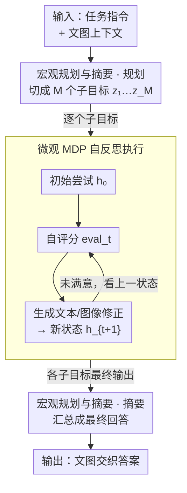

# Uni-CoT: Towards Unified Chain-of-Thought Reasoning Across Text and Vision

**会议**: ICLR2026  
**arXiv**: [2508.05606](https://arxiv.org/abs/2508.05606)  
**代码**: [https://github.com/Fr0zenCrane/UniCoT](https://github.com/Fr0zenCrane/UniCoT)  
**领域**: LLM推理  
**关键词**: 多模态思维链, 文图交织推理, 宏微分层, MDP自反思, 统一生成

## 一句话总结
提出 Uni-CoT 分层宏-微推理框架，将多模态 CoT 分解为宏观任务规划（将复杂任务分解为子目标）和微观子任务执行（MDP 式自反思迭代优化），通过注意力掩码设计将 $O(T^2)$ 复杂度降至 $O(T)$，在 GenEval 上超越 BAGEL 基线 +0.02，实现了文本-图像交织的统一推理。

## 研究背景与动机

**领域现状**：CoT 推理在纯文本 LLM 上已被广泛验证有效，但在多模态（文本+视觉）领域的 CoT 仍处于早期。现有多模态推理方法要么仅用文本 CoT 忽略视觉中间产物，要么用 pipeline 式的松耦合MLLM + 图像生成器。

**现有痛点**：(a) 纯文本 RL 推理方法在视觉相关任务（几何、导航）上表现很差；(b) 交织文图生成的序列极长（每步约 10000 tokens），朴素自回归建模计算量为 $O(T^2)$，不可承受；(c) 长序列交织生成导致训练不稳定。

**核心矛盾**：多模态推理需要生成中间视觉状态来支撑推理（如拼图需要看中间结果），但每个视觉状态需要数千 token，使得标准 CoT 在多模态场景下的计算和训练都不可行。

**本文要解决**：如何高效地实现文本-视觉交织的 CoT 推理？

**切入角度**：分层设计——宏观层做任务规划（仅看子目标描述），微观层做子任务执行（MDP 式仅看相邻状态），通过注意力掩码限制可见范围降低计算量。

**核心 idea**：宏-微分层 + MDP 自反思 + 注意力掩码 = 线性复杂度的多模态 CoT。

## 方法详解

### 整体框架
Uni-CoT 想让模型像人解几何题那样"边想边画"：遇到需要视觉支撑的任务时，先生成一张中间图、看一眼、不对就改，直到推理走通。难点在于每个视觉状态要数千 token，把这些交织步骤直接拼成一条长链做自回归，计算量是 $O(T^2)$、序列动辄上万 token，根本训不动。框架的解法是把整条推理拆成两层：宏观层把任务切成若干子目标、最后再把各子目标的结果汇总；微观层逐个去做每个子目标，并用一轮轮"尝试→自评→修正"把它做对。两层都靠精心设计的注意力掩码限制各 token 能看到谁——宏观层只看骨架、微观层只看上一状态——从而把复杂度从朴素自回归的 $O(T^2)$ 经分层的 $O(T^2/M)$ 一路压到线性的 $O(T)$，这是交织文图推理第一次能在真实硬件上端到端训练的关键。底座沿用 BAGEL（解码器 Transformer + MoE），图像理解走 SigLIP2 ViT（约 4900 tokens）、图像生成走 FLUX VAE（4096 tokens），同一套权重里靠 MoE 在"看图"和"画图"两条路径间切换。

### 关键设计

**1. 宏观规划与摘要：让高层只看骨架，不被细节淹没**

直接把上万 token 的交织推理喂给一个规划器，它会被海量底层细节淹没、也算不动。宏观规划器（Macro Planner）先把复杂任务分解成 $M$ 个子目标 $z_{plan} = \{z_1, ..., z_M\}$，可以是顺序依赖也可以是并行分解；等微观层把各子目标做完，摘要器（Summarizer）再把结果汇总成最终回答——规划和摘要共用同一套宏观注意力掩码，构成框架里包住微观层的"外壳"。关键就在这套掩码：宏观层的 token 只允许看到原始输入、各子目标的描述、以及每个子目标的**最终输出**，而完全跳过子目标内部那些反复试错的中间状态。这样高层始终在"骨架"上规划，单条链的长度被切成约 $1/M$，复杂度从 $O(T^2)$ 降到 $O(T^2/M)$。

**2. 微观 MDP 自反思执行：把每个子目标做成一条马尔可夫修正链**

子目标内部仍可能要多轮才做对，若每一轮都回看前面所有轮的状态，长度又会涨回来。微观执行器（Micro Operator）把单个子目标的执行形式化成一个马尔可夫决策过程（MDP）：从初始尝试 $h_0$ 出发，每一步先对当前结果打一个自评分 $eval_t$，再据此生成文本或图像层面的修正，得到新状态 $h_{t+1}$，循环到满意为止。核心约束是 Markov 性——当前状态 $h_t$ 只依赖前一状态 $h_{t-1}$ 和所属子目标 $z_i$，不去看更早的历史，这一点同样由注意力掩码强制实现。于是每一步看到的 token 数被钉成常数，子目标这一层的复杂度从 $O(T^2/M)$ 进一步压到 $O(T)$。直觉上这也合理：要改对一张拼图，看一眼上一版拼成什么样就够了，不必把每一次失败的尝试都重读一遍。两个设计正好互补——只分层不 Markov，单段内部仍是平方；只 Markov 不分层，跨子目标的长程依赖又压不下来，缺一不可。

### 损失函数 / 训练策略
联合目标同时优化文本与图像两条路径：$\mathcal{L}_{joint} = \lambda_{CE} \cdot \mathcal{L}_{CE}^{text} + \mathcal{L}_{MSE}^{image}$，文本用交叉熵、图像用 MSE。微观层额外挂 4 个辅助任务（文本动作生成、图像动作生成、下一状态预测、奖励估计）来教会模型自评估和修正。训练数据 31K 样本（11K 宏观交织对 + 20K 微观示例），在 8×A100 上训练约 1 周。

## 实验关键数据

### 主实验

**GenEval 图像生成基准**:

| 指标 | Uni-CoT | BAGEL | FLUX.1-dev | Janus-Pro-7B |
|------|---------|-------|-----------|-------------|
| 单物体 | **0.99** | 0.99 | 0.98 | 0.99 |
| 双物体 | **0.95** | 0.92 | 0.93 | 0.89 |
| 计数 | **0.82** | 0.78 | 0.75 | 0.59 |
| 颜色属性 | **0.69** | 0.64 | 0.65 | 0.66 |
| 总体 | **0.81** | 0.79 | 0.82 | 0.80 |

计数能力提升最显著（+0.04），双物体也有明显改善（+0.03）。

### 消融实验

| 方法 | 复杂度 | 每步 token 开销 |
|------|--------|--------------|
| 朴素自回归 CoT | $O(T^2)$ | ~10000 tokens（不可行） |
| 分层分解 | $O(T^2/M)$ | 降低 $M$ 倍 |
| **分层 + MDP（Uni-CoT）** | **$O(T)$** | **线性** |

### 关键发现
- **视觉中间产物对推理关键**：纯文本 CoT 在几何/拼图等任务上失败，需要"看到"中间步骤的视觉结果
- **MDP Markov 假设有效**：仅看上一步状态就足以做出好的修正，无需全部历史
- **自反思迭代确实改进质量**：模型能自评估并修正错误，特别是在计数和空间关系上

## 亮点与洞察
- **多模态 CoT 的计算可行性首次解决**：从 $O(T^2)$→$O(T)$ 的降阶使得交织文图推理在实际硬件上可行。核心洞察是"推理不需要看所有历史"——分层 + Markov 注意力掩码的组合设计是关键创新
- **统一理解与生成的推理框架**：基于 BAGEL 的 MoE 架构无缝切换理解/生成路径，推理过程中自然混合"看图"和"画图"动作
- **将 MDP 形式化引入多模态 CoT**：把自反思过程建模为 MDP（状态、动作、奖励），为后续用 RL 优化多模态推理奠定了形式化基础

## 局限与展望
- **实验规模有限**：主要在 GenEval 上展示生成结果，理解任务（MMBench、MathVista 等）的结果未在主文中充分展示
- **训练数据量小**：仅 31K 样本，限制了推理能力的深度
- **基线对比不够充分**：主要与 BAGEL 基线比较，+0.02 的提升较小。缺少与 GPT-4o、Gemini 等闭源模型的对比
- **可改进**：(1) 用 RL（如 NRT/GRPO）替代 SFT 训练微观推理器；(2) 支持更多迭代步数的自反思；(3) 扩大训练数据到 100K+ 级别

## 相关工作与启发
- **vs 纯文本 CoT 推理（o1、R1）**: 这些方法只输出文本推理，在视觉任务上力不从心。Uni-CoT 首次让模型"边想边画"
- **vs Janus-Pro**: 也支持理解+生成但没有 CoT 能力，生成质量受限于单次推理
- **vs CogCoM/Visual Sketchpad**: 使用外部工具做视觉中间产物，Uni-CoT 完全端到端，不依赖外部工具

## 评分
- 新颖性: ⭐⭐⭐⭐⭐ 首个实用的多模态 CoT 框架，宏微分层 + MDP + 注意力掩码的组合设计独特
- 实验充分度: ⭐⭐⭐ 核心概念验证充分但评估数据集和基线对比有限
- 写作质量: ⭐⭐⭐⭐ 复杂度分析清晰，但论文结构略长
- 价值: ⭐⭐⭐⭐⭐ 为多模态 reasoning 奠定了可行的计算框架，开源代码有利于社区跟进

<!-- RELATED:START -->

## 相关论文

- [\[ACL 2026\] AIM-CoT: Active Information-driven Multimodal Chain-of-Thought for Vision-Language Reasoning](../../ACL2026/llm_reasoning/aim-cot_active_information-driven_multimodal_chain-of-thought_for_vision-languag.md)
- [\[ICLR 2026\] AIMCoT: Active Information-driven Multimodal Chain-of-Thought for Vision-Language Reasoning](aimcot_active_information-driven_multimodal_chain-of-thought_for_vision-language.md)
- [\[ICLR 2026\] CoT-RVS: Zero-Shot Chain-of-Thought Reasoning Segmentation for Videos](cot-rvs_zero-shot_chain-of-thought_reasoning_segmentation_for_videos.md)
- [\[CVPR 2026\] Revisiting the Necessity of Lengthy Chain-of-Thought in Vision-centric Reasoning Generalization](../../CVPR2026/llm_reasoning/revisiting_the_necessity_of_lengthy_chain-of-thought_in_vision-centric_reasoning.md)
- [\[ACL 2026\] CSRP: Chain-of-Thought Reasoning for Chinese Text Correction via Reinforcement Learning with Efficiency-Aware Rewards](../../ACL2026/llm_reasoning/csrp_chain-of-thought_reasoning_for_chinese_text_correction_via_reinforcement_le.md)

<!-- RELATED:END -->
