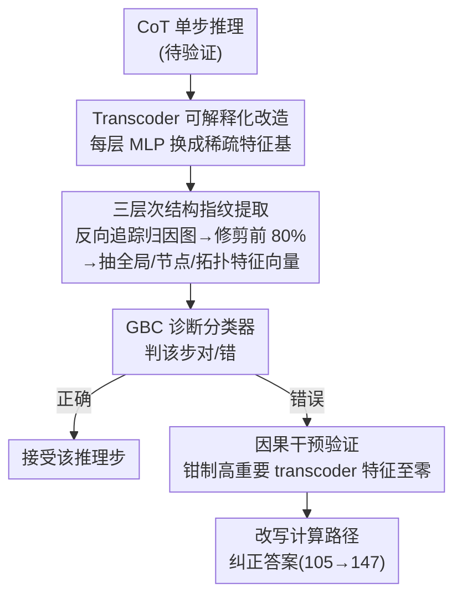

# Verifying Chain-of-Thought Reasoning via Its Computational Graph

**会议**: ICLR 2026 Oral  
**arXiv**: [2510.09312](https://arxiv.org/abs/2510.09312)  
**代码**: [有](https://github.com/facebookresearch/CRV)  
**领域**: LLM Reasoning / Mechanistic Interpretability  
**关键词**: Chain-of-Thought, 归因图, Transcoder, 推理验证, 因果干预

## 一句话总结

提出 CRV（Circuit-based Reasoning Verification），通过将 LLM 的 MLP 替换为 transcoder 构建可解释归因图，从图的结构特征中提取推理错误的"指纹"，实现白盒 CoT 推理验证，并可通过因果干预修正错误推理。

## 研究背景与动机

现有 CoT 验证方法分为两类：**黑盒方法**（分析输出文本或 logit 分布）和**灰盒方法**（利用隐层激活或隐状态轨迹的探针）。这些方法能检测到错误的"相关性"，但无法揭示推理**为何**出错——即无法深入到模型的计算过程层面理解失败的原因。

作者的核心假设是：模型内部实现了特定的"潜在算法电路"来完成推理任务，推理失败本质上是电路执行中的缺陷。通过构建归因图（类似软件调试中的执行追踪），可以从计算图的结构属性中检测到错误的可辨识信号。

## 方法详解

### 整体框架

CRV 把"验证一步推理对不对"重新表述成"检查这一步背后的计算电路长什么样"。它先把模型每层 MLP 替换成可解释的 transcoder，再为每个推理步骤反向追踪出一张稀疏归因图，从图的结构里抽出固定维度的"指纹"向量 $\mathbf{x}_i = \phi(G_i)$，最后用一个轻量分类器 $\hat{y}_i = f_\theta(\mathbf{x}_i)$ 判断该步是否正确——错误推理在计算图上会留下与正确推理不同的可辨识结构。一旦判为错误，还能反向定位到图里的关键特征、用因果干预把它压掉来修正答案。

### 关键设计

**1. Transcoder 可解释化改造：把不透明的 MLP 换成稀疏特征基**

要让归因图有语义，前向传播必须经过一个可解释的瓶颈，而原始 MLP 是一团稠密激活，看不出每个维度对应什么概念。CRV 为每层 MLP 训练一个 transcoder，训练目标是直接拟合 MLP 的输入-输出函数 $f(x) \approx \text{MLP}(x)$，而不是自编码器式地重构自身输入；输出落在一个过完备的特征空间上（维度 $D \gg d$），并用 TopK 激活强制大部分元素为零，每个非零元素对应一个可解释概念。这样 transcoder 就成了 MLP 的"功能替身"：它以可解释的方式完成同等计算，让后续归因图的每个节点都带有明确语义，而标准 SAE 只重构输入、无法承担这种计算替代角色。

**2. 三层次结构指纹提取：把一张图压成分类器能吃的固定向量**

对每个推理步骤，CRV 用贪心路径查找从最终 logit 反向追踪高归因连接，得到稀疏有向图 $G_i = (\mathcal{V}, \mathcal{E})$（节点含输入 token、transcoder 特征、输出 logit），并修剪到保留前 80% 影响力的节点与边。随后从三个互补层次抽特征：全局图统计（活跃特征节点数、logit 概率与熵）刻画整体计算复杂度和不确定性；节点影响力统计（激活值与影响力分数的均值/最大值/标准差，以及按层的活跃特征直方图）区分"少数高激活特征驱动"与"大量弱特征扩散"两种计算模式；拓扑与路径特征（图密度、度中心性、介数中心性、连通性）刻画信息流结构。三类特征缺一不可，消融显示节点影响力统计最关键——移除后算术任务的 FPR@95 从 37.09% 升到 49.07%。

**3. 因果干预验证：从"检测到错误"闭环到"修好错误"**

光检测出错误只能说明指纹与错误相关，CRV 进一步证明二者之间是因果关系。当某步被判为错误时，它追溯到图中高重要性的 transcoder 特征（例如一个对应"乘法"概念的特征），通过 forward hook 把该特征的激活值钳制为零，从而改写模型的计算路径。实验中抑制乘法特征（ID 91814）成功把错误的运算顺序（先乘后加）纠正为先加后乘，答案从 105 改回 147。这条从检测到诊断再到修复的闭环，是只能给出相关性信号的探针方法做不到的。

### 损失函数 / 训练策略

Transcoder 用 L2 重构损失加 TopK 激活训练；诊断分类器选用梯度提升分类器 (GBC)，直接在抽取出的表格化特征上学习。训练标签上，合成任务（布尔/算术）由解析器自动标注，GSM8K 则以 Llama 3.3 70B Instruct 作半自动评注、再经人工审核。

## 实验关键数据

### 主实验（表格）

| 方法 | 范式 | Boolean AUROC↑ | Arithmetic AUROC↑ | GSM8K AUROC↑ |
|------|------|----------------|-------------------|-------------|
| MaxProb | Black-box | 58.81 | 61.87 | 54.91 |
| Energy | Black-box | 51.08 | 76.45 | 62.55 |
| CoE-C | Gray-box | 51.03 | 69.39 | 53.57 |
| MLP Probe | Gray-box | 53.63 | 54.41 | 56.02 |
| **CRV (Ours)** | **White-box** | **75.87** | **92.47** | **70.17** |

CRV 在所有数据集上全面超越黑盒和灰盒基线。在算术任务上 AUROC 达 92.47，FPR@95 降至 37.09%（最强基线为 63.33%）。

### 消融实验（表格）

| 特征集 | Arithmetic AUROC↑ | Arithmetic FPR@95↓ |
|--------|-------------------|--------------------|
| CRV（全部三类） | 92.47 | 37.09 |
| w/o 全局统计 | 89.62 | 44.54 |
| w/o 节点统计 | 88.31 | 49.07 |
| w/o 拓扑统计 | 90.89 | 39.19 |

节点影响力统计是最关键的特征类别。

### 关键发现

- **错误指纹具有领域特异性**：不同推理任务（布尔逻辑 vs 算术 vs 自然语言数学）的错误在计算图上表现为不同的结构模式。单独在算术上训练的分类器迁移到 GSM8K 仅获得 57.04 AUROC。
- **联合训练可恢复性能**：用三个任务的联合数据训练的分类器在 GSM8K 上达到 70.62 AUROC，略超专用模型（70.17）。
- **因果干预成功**：在算术任务中，通过抑制一个"乘法"概念的 transcoder 特征（ID 91814），成功将错误的运算顺序（先乘后加）修正为正确顺序（先加后乘），答案从 105 修正为 147。

## 亮点与洞察

- 首次将归因图作为"推理执行追踪"用于自动化验证，在检测与理解之间架起桥梁
- 揭示了"计算完整性区域"的存在——正确推理占据了错误推理不可达的结构空间
- 因果干预的闭环设计——从检测到诊断到修复的完整链路——是传统探针方法做不到的

## 局限与展望

- 计算开销大：需要训练每层 transcoder + 构建归因图 + 训练分类器，不适合作为即插即用的验证器
- 仅在标准指令微调模型上验证，未测试搜索/回溯等高级推理模型（如 o1）
- 跨域泛化有限，需要为新任务收集标注数据重新训练分类器
- 实验模型仅为 Llama 3.1 8B Instruct，更大模型上的表现未知

## 相关工作与启发

- 与 PRM（过程奖励模型）互补：PRM 是黑盒训练的步骤级判别器，CRV 提供白盒可解释诊断
- 基于 transcoder 归因图技术 (Ameisen et al., 2025)，但从定性可视化推进到定量自动化验证
- 启发方向：可结合 CRV 的诊断能力与 PRM 的可扩展性，构建混合验证系统

## 评分

⭐⭐⭐⭐ 方法新颖度高，白盒归因图验证是全新视角，因果干预验证了因果性而非仅相关性，但计算开销限制了实用性。

<!-- RELATED:START -->

## 相关论文

- [\[ICML 2026\] Clustering as Reasoning: A $k$-Means Interpretation of Chain-of-Thought Graph Learning](../../ICML2026/llm_reasoning/clustering_as_reasoning_a_k-means_interpretation_of_chain-of-thought_graph_learn.md)
- [\[ICLR 2026\] DAG-Math: Graph-of-Thought Guided Mathematical Reasoning in LLMs](dag-math_graph-of-thought_guided_mathematical_reasoning_in_llms.md)
- [\[ICML 2026\] Verifying Meta-Awareness via Predictive Rewards in Reasoning Models](../../ICML2026/llm_reasoning/verifying_meta-awareness_via_predictive_rewards_in_reasoning_models.md)
- [\[ICLR 2026\] Are Reasoning LLMs Robust to Interventions on Their Chain-of-Thought?](are_reasoning_llms_robust_to_interventions_on_their_chain-of-thought.md)
- [\[ICLR 2026\] SceneCOT: Eliciting Grounded Chain-of-Thought Reasoning in 3D Scenes](scenecot_eliciting_grounded_chain-of-thought_reasoning_in_3d_scenes.md)

<!-- RELATED:END -->
