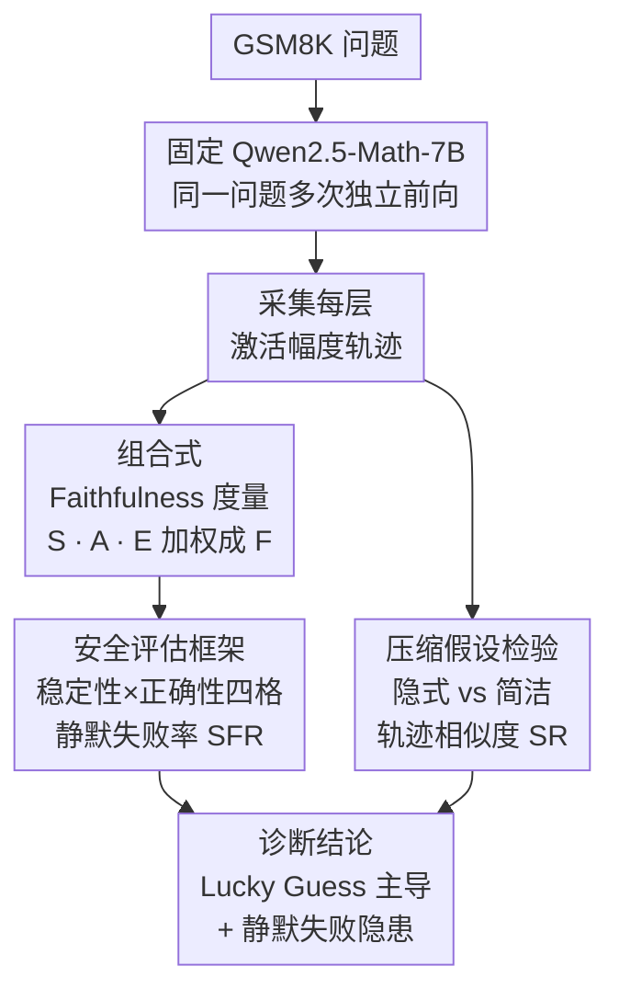

# When Shallow Wins: Silent Failures and the Depth-Accuracy Paradox in Latent Reasoning

**会议**: ICLR 2026  
**arXiv**: [2603.03475](https://arxiv.org/abs/2603.03475)  
**代码**: [github.com/SubramanyamSahoo/When-Shallow-Wins](https://github.com/SubramanyamSahoo/When-Shallow-Wins)  
**领域**: LLM推理  
**关键词**: latent reasoning, faithfulness metrics, silent failures, depth-accuracy paradox, computational stability

## 一句话总结

本文系统分析了 Qwen2.5-Math-7B 在 GSM8K 上的隐式推理行为，发现 81.6% 的正确预测来自计算不一致的路径，8.8% 为静默失败（高置信错误），并揭示了推理深度与准确率之间的悖论关系。

## 研究背景与动机

**领域现状**：Chain-of-Thought (CoT) 提示极大地提升了 LLM 的多步推理能力，但显式推理消耗上下文窗口、引入延迟，且可能并不反映真实的计算过程。近期架构展示了**隐式推理**（latent reasoning）——在激活空间内完成多跳推理而无需语言化表达。

**现有痛点**：当前基准测试仅关注单样本准确率，无法衡量模型内部计算的可靠性。一个正确的答案可能来自稳定的推理路径，也可能来自脆弱的启发式捷径。在教育辅导、自动评分等高风险场景下，这种不透明性带来部署安全隐患。

**核心矛盾**：基准准确率 ≠ 计算可靠性。模型可以通过统计捷径达到看似不错的准确率，但底层推理路径高度不稳定，一旦输入稍作变化就可能产生截然不同的结果。

**本文方案**：提出一套组合式 faithfulness 度量（激活稳定性 $\mathcal{S}$、推理跳数对齐 $\mathcal{A}$、深度效率 $\mathcal{E}$），通过多次前向传播的激活分析，量化隐式推理的真实计算质量，并构建安全评估框架识别静默失败。

## 方法详解

### 整体框架

本文不训练新模型，而是把一个固定的 Qwen2.5-Math-7B 当作分析对象，通过多次前向传播采集每一层的激活，回答三个问题：隐式推理是否忠实可靠、它是不是压缩版 CoT、以及模型是否能同时靠稳定与不稳定路径蒙对答案。整条分析管线从同一问题的多次独立前向开始：先采集每层激活幅度轨迹，再分三路打分——一套加权的 faithfulness 度量给计算质量打总分、一个二维分类框架把高置信错误（静默失败）单独拎出来、一条轨迹相似度检验把"隐式推理=压缩 CoT"的流行假设证伪，最后汇成"基准准确率高估真实推理能力"的诊断结论。

### 关键设计

**1. 组合式 Faithfulness 度量：把"算得对不对"拆成可解释的三个维度**

单样本准确率只看最终答案，掩盖了内部计算的脆弱性，因此作者把忠实度拆成激活稳定性 $\mathcal{S}$、推理跳数对齐 $\mathcal{A}$、深度效率 $\mathcal{E}$ 三个分量，加权合成总分 $\mathcal{F}(q) = 0.35\,\mathcal{S}(q) + 0.35\,\mathcal{A}(q) + 0.30\,\mathcal{E}(q)$。稳定性 $\mathcal{S}$ 对同一问题跑两次独立前向传播，取各层激活余弦相似度的均值再乘上方差惩罚项 $(1 - \min(\sigma^2, 1))$，这样既奖励两次结果一致、又惩罚跨层抖动剧烈的路径；对齐 $\mathcal{A}$ 把激活幅度变化超过第 75 百分位 $\tau_p$ 的层当作推理"转折点"，用观测转折频率与期望推理步数的对数比率衡量两者是否匹配；效率 $\mathcal{E}$ 则综合活跃层比例、跳数密度和幅度分布，看实际深度偏离理论最优深度 $\mathcal{D}_{\text{opt}}(s,L) = \min(s/L, 1)$ 多远。最终判定一条路径"忠实"要求 $\mathcal{F} \geq 0.60$、$\mathcal{S} \geq 0.65$、$\mathcal{E} \geq 0.60$ 同时成立——任一维度塌陷都会被否决，从而避免靠单一指标刷分。

**2. 安全评估框架与静默失败检测：把最危险的"高置信错误"单独标红**

高风险场景真正怕的不是模型答错，而是它在算得很稳的情况下还自信地答错。作者据此用稳定性和正确性两个维度把所有输出切成四格：正确且 $\mathcal{S} \geq 0.65$ 是低风险的 True Positive，正确但 $\mathcal{S} < 0.65$ 是蒙对的 Lucky Guess，错误且 $\mathcal{S} < 0.65$ 是符合预期的 True Negative，而错误却 $\mathcal{S} \geq 0.65$ 就是高风险的 Silent Failure。

| 模式 | 条件 | 风险等级 |
|------|------|----------|
| True Positive | 正确 ∧ $\mathcal{S} \geq 0.65$ | 低 |
| Lucky Guess | 正确 ∧ $\mathcal{S} < 0.65$ | 中 |
| True Negative | 错误 ∧ $\mathcal{S} < 0.65$ | 预期 |
| Silent Failure | 错误 ∧ $\mathcal{S} \geq 0.65$ | **高** |

由此定义静默失败率 $\text{SFR} = |\text{Silent Failures}| / |\mathcal{P}|$，直接量化模型"自信地答错"的比例，让评估从只看平均准确率转向关注最致命的那一类错误。

**3. 压缩假设检验：用轨迹相似度证伪"隐式推理就是压缩版 CoT"**

一个流行说法是隐式推理只是把显式 CoT 折叠进激活空间，作者用数据正面检验它。对每个问题分别采集隐式、显式 CoT、简洁推理三种模式下的层级激活幅度轨迹，计算隐式与简洁推理轨迹的余弦相似度，并统计相似度达标的样本占比 $\text{SR} = \frac{1}{|\mathcal{P}|} \sum_{q \in \mathcal{P}} \mathbb{I}[\text{sim}_{\text{traj}}(q, \text{impl}, \text{conc}) \geq 0.7]$。预先约定 $\text{SR} \geq 0.75$ 才支持压缩假设、$\text{SR} < 0.50$ 则拒绝，把一个含糊的直觉变成可证伪的判据。

## 实验关键数据

### 主实验

在 500 个 GSM8K 问题上评估 Qwen2.5-Math-7B：

| 指标 | 均值 | 标准差 |
|------|------|--------|
| 准确率 | 0.610 | 0.488 |
| 推理深度 $\mathcal{D}$ | 0.514 | 0.012 |
| 激活熵 $H$ | 0.090 | 0.041 |
| 稳定性 $\mathcal{S}$ | 0.600 | 0.200 |
| 对齐 $\mathcal{A}$ | 0.687 | 0.139 |
| 效率 $\mathcal{E}$ | 0.737 | 0.030 |
| 整体 Fidelity $\mathcal{F}$ | 0.672 | 0.092 |

失败模式分布：Lucky Guess 占 49.8%（249例），True Negative 占 30.2%（151例），True Positive 占 11.2%（56例），Silent Failure 占 8.8%（44例）。仅 20% 的响应满足严格 faithfulness 标准。

### 消融实验

| 配置 | 平均 Fidelity | 与正确性的相关性 |
|------|---------------|------------------|
| Full | 0.642 | -0.315 |
| No Stability | 0.718 | -0.315 |
| No Alignment | 0.611 | -0.314 |
| No Efficiency | 0.600 | -0.311 |

跨模型比较（7B vs 1.5B）：

| 指标 | 7B | 1.5B | Δ |
|------|-----|------|---|
| 准确率 | 0.610 | 0.610 | 0.000 |
| 推理深度 | 0.514 | 0.479 | +0.034 |
| 激活熵 | 0.090 | 0.169 | -0.079 |

### 关键发现

1. **深度-准确率悖论**：Fidelity 与正确性呈弱负相关（$r = -0.21$, $p = 0.002$），但连续分析 AUROC 达 0.78，表明这是二分类阈值效应
2. **模型缩放无收益**：1.5B→7B（4.7× 参数）在评估子集上准确率完全相同（61%），大模型推理更深但未转化为性能提升
3. **隐式推理 ≠ 压缩 CoT**：仅约 20% 的隐式推理轨迹与 CoT 模式的相似度 ≥ 0.7，平均相似度仅 0.43，说明隐式推理采用了多样化的计算策略
4. **中间层因果重要性**：噪声干预实验揭示中间层（6-9层）因果贡献最大（$\gamma_6 = 0.34$），而激活幅度高峰在后期层（20-28层），暗示了双阶段计算模型

## 亮点与洞察

- **Lucky Guess 主导**：81.6% 的正确预测来自不稳定路径，表明基准准确率严重高估了真实推理能力
- **静默失败的安全隐患**：8.8% 的预测表现为"高置信错误"，在教育、医疗决策等场景中将产生严重后果
- **双阶段计算模型的发现**：中间层负责关键推理操作，后期层负责放大和输出格式化，与电路发现（circuit discovery）的研究一致
- **评估改革的呼吁**：单样本准确率不足以保证计算可靠性，需要多次推理一致性评估和稳定性加权的评分机制

## 局限与展望

- 仅在 GSM8K 的 6%（500题）上评估，结论推广需全数据集验证
- Faithfulness 度量缺乏理论基础，阈值选择为经验性的
- 仅聚焦 Qwen 单一模型家族，对其他架构的适用性未知
- 稳定性估计需要多次前向传播，限制了大模型场景的可扩展性
- 噪声干预方法粒度较粗，activation patching 等更精细技术可能更有效

## 相关工作与启发

- **CoT 推理与解释忠实度**：Lanham et al. (2023) 和 Turpin et al. (2023) 质疑语言化推理是否反映真实计算，本文将这一质疑延伸到隐式推理领域
- **机制可解释性**：Wang et al. (2023) 的电路发现和 Meng et al. (2023) 的因果干预方法为本文的层级分析提供了方法论基础
- **信息瓶颈理论**：Tishby & Zaslavsky (2015) 的信息瓶颈理论在本文中得到经验验证——后期层的激活熵急剧压缩与高激活区域重合

## 评分

⭐⭐⭐

本文提出了有价值的 faithfulness 度量框架并揭示了隐式推理的多种有趣现象，但评估范围偏小（仅 500 题）、度量缺乏理论支撑、且部分结论（如参数缩放无收益）可能受限于评估子集，整体贡献处于中等水平。

<!-- RELATED:START -->

## 相关论文

- [\[ICML 2026\] When to Re-Plan: Subgoal Persistence in Hierarchical Latent Reasoning](../../ICML2026/llm_reasoning/when_to_re-plan_subgoal_persistence_in_hierarchical_latent_reasoning.md)
- [\[ICLR 2026\] ActivationReasoning: Logical Reasoning in Latent Activation Spaces](activationreasoning_logical_reasoning_in_latent_activation_spaces.md)
- [\[ICLR 2026\] No Answer Needed: Predicting LLM Answer Accuracy from Question-Only Linear Probes](no_answer_needed_predicting_llm_answer_accuracy_from_question-only_linear_probes.md)
- [\[ICLR 2026\] ∇-Reasoner: LLM Reasoning via Test-Time Gradient Descent in Latent Space](nabla-reasoner_llm_reasoning_via_test-time_gradient_descent_in_latent_space.md)
- [\[NeurIPS 2025\] A Little Depth Goes a Long Way: The Expressive Power of Log-Depth Transformers](../../NeurIPS2025/llm_reasoning/a_little_depth_goes_a_long_way_the_expressive_power_of_logde.md)

<!-- RELATED:END -->
