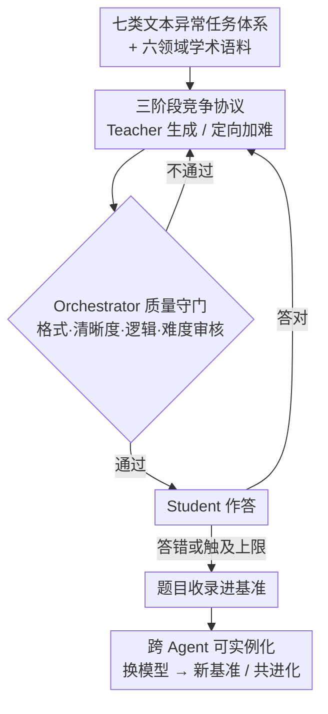

# From Static Benchmarks to Dynamic Protocol: Agent-Centric Text Anomaly Detection for Evaluating LLM Reasoning

**会议**: ICLR 2026  
**arXiv**: [2602.23729](https://arxiv.org/abs/2602.23729)  
**代码**: 待发布  
**领域**: AI安全 / 评估方法  
**关键词**: dynamic benchmark, text anomaly detection, agent-centric evaluation, LLM reasoning, teacher-student

## 一句话总结

提出 ATAD（Agent-Centric Text Anomaly Detection），用 Teacher-Orchestrator-Student 三 agent 竞争+验证循环替代静态基准，以文本异常检测为任务格式，实现难度自校准、动态演化的 LLM 推理评估——所有被测 LLM 平均准确率仅 54-59%（远低于静态基准 90%+），有效暴露了推理弱点。

## 研究背景与动机

**领域现状**：MMLU、GSM8K、Big-Bench 等静态基准曾是可靠的模型进步指标，但前沿 LLM 已在多数任务上逼近甚至超越人类水平。

**静态基准的三大致命问题**：
   - **数据污染**：大规模预训练语料常包含基准题目，移除不彻底导致模型可能"记忆"答案而非真正推理
   - **过拟合循环**：模型开发者可能无意中针对基准特征调优，产生分数虚高的反馈循环
   - **快速过时**：基准一旦"被解决"，社区必须快速创建替代品，形成消耗性循环

**核心矛盾**：评估需要动态演化以跟上模型进步，但构建高质量题目天然困难——增加难度常牺牲清晰度，保持清晰度又导致过于简单。

**为何选文本异常检测**：(a) 需要跨句逻辑推理 (b) 抵抗模式匹配快捷方式和训练数据泄露 (c) 支持客观、细粒度评分。

**核心 idea**：三 agent 竞争+验证循环自动生成难度适配的推理评估题目，基准随模型进步共进化。

## 方法详解

### 整体框架

ATAD 想解决的是"静态基准一旦被刷穿就报废、且很难既出得难又出得清楚"这件事，做法是把"出题—审题—答题"变成 Teacher、Orchestrator、Student 三个 LLM agent 的闭环协议。题面统一用文本异常检测（一段文字里藏着某种逻辑/连贯/风格上的异常，让模型找出来），分七类、覆盖六个学术领域。一道题的生命周期是这样转的：Teacher 先出一道基础难度的题，Orchestrator 按多维标准审核，不过关就打回去重出；过关后交给 Student 作答，只要 Student 答对，Orchestrator 就驱动 Teacher 针对 Student 的失败模式出更难的版本，再走一遍审核——如此循环，直到把 Student 难住（或触及循环上限）才把这道题收录进基准。因为只有"刚好难住当前模型"的题才留下，难度自动落在被测模型的能力边界上；而三个角色都可换成更强的模型，整套基准也随之共同进化。

### 关键设计

**1. 七类文本异常任务体系：选一种抗记忆、可客观评分的推理探针**

评估题面用什么任务，直接决定它能不能抵抗"背答案"。ATAD 选文本异常检测，是因为它需要跨句逻辑推理、天然抵抗模式匹配和训练数据泄露，又支持客观细粒度评分。任务被拆成七类，各自探测一种不同的推理能力：

| 任务类型 | 全称 | 考察推理能力 | 挑战因素 |
|---------|------|-----------|---------|
| T1 | 语境异常 | 语境推理 | 微妙的主题偏移、语义偏离（语法正确但主题不一致）|
| T2 | 段落顺序一致性 | 篇章连贯 | 局部连贯但全局结构错误 |
| T3 | 填空选择异常 | 词汇+语用推理 | 语法正确但语境不恰当 |
| T4 | 桥接句评估 | 逻辑衔接 | 弱逻辑连接、突兀的话题切换 |
| T5 | 指代歧义 | 共指消解 | 模糊代词、不明确的指称 |
| T6 | 逻辑矛盾 | 因果/矛盾推理 | 矛盾声明、因果反转 |
| T7 | 风格违规 | 风格推理 | 语域混搭、语调突变 |

这套任务覆盖科学、哲学、政治/社会、心理学、经济学、文学六个学术领域，保证基准的难度来自推理本身而非领域偏门，也让七个维度的得分能定位模型具体弱在哪一类推理上。

**2. 三阶段竞争协议：让难度自动逼近被测模型的能力边界**

静态基准最怕"出太简单没区分度、出太难又超纲"，ATAD 用一条带上限的循环把难度收敛到合适处。初始化阶段 Teacher 生成基础题，Orchestrator 验证不通过就让 Teacher 重生成，直到通过或触及 `max_init_loops`；自适应阶段让 Student 作答，答错则题目当即收录，答对则 Orchestrator 要求 Teacher **针对性加难**——关键在于 Teacher 能看到 Student 的答题成败，于是被隐式激励去分析它的失败模式，下一版专门冲着这些具体弱点去，而不是无差别地堆长度或塞生僻词。加难后的新题再过一遍验证，循环到 Student 答错或触及 `max_student_loops`。因为只有"刚好难住当前 Student"的题才会留下，基准天然落在被测模型的能力边界上，且每一轮加难都带来真实的推理挑战、不会很快饱和，而不是停在某个人为设定的固定难度。

**3. Orchestrator 质量守门：在加难的同时不牺牲清晰度**

加难最容易顺带引入歧义或干脆变得无解，这一矛盾正是动态基准最难的地方。Orchestrator 因此沿格式正确性、清晰度、逻辑一致性、任务类型匹配、难度适当性、公平性这几个维度逐题审核，拦下对抗性或本就无解的题目。它没有固定的迭代时间表，而是自主判断 Teacher 是否需要重生成；当一版更难的题始终过不了验证时，它会让 Teacher 在同一难度层级内微调、保留原任务结构，从而把"难度提升"和"题目可解、表述清晰"这对矛盾解耦——这一思路借鉴了 GRE/GMAT/LSAT 等标准化考试既难又无歧义的命题经验。

**4. 跨 Agent 可实例化：支持横向比较与基准共进化**

三个角色都可换成不同模型，于是同一协议能实例化出多种配置（如以 GPT-4o 为 Teacher、Gemini 为 Student 的 $\text{ATAD}_{\text{gemini}}^{\text{gpt-4o}}$）。不同配对生成的基准互不相同，既能横向比较哪种模型更会出题、哪种更会答题，也能在更强模型出现时把它换进来，让基准跟着模型一起演化，从根上绕开"基准被解决就报废"的循环。

## 实验关键数据

### 主实验：10 个 LLM 在 ATAD 上的表现（准确率 %）

| 模型 | T1 | T2 | T3 | T4 | T5 | T6 | T7 | Avg |
|------|----|----|----|----|----|----|----|----|
| GPT-o4-mini | 63.3 | 30.3 | 68.5 | 53.0 | 47.3 | 57.3 | 80.0 | **57.1** |
| Gemini-2.0-Flash | 65.3 | 25.0 | 63.0 | 58.3 | 51.0 | 62.0 | 88.0 | **58.9** |
| Gemini-2.0-Flash-Lite | 64.0 | 10.8 | 63.5 | 52.3 | 62.8 | 62.0 | 86.3 | **57.4** |
| GPT-4o | 62.0 | 21.3 | 68.3 | 53.3 | 49.3 | 56.8 | 81.0 | **56.0** |
| GPT-4o-mini | 57.3 | 17.0 | 62.5 | 54.0 | 52.5 | 58.8 | 83.0 | **55.0** |
| GPT-3.5-Turbo | 59.0 | 16.0 | 66.8 | 48.5 | 55.8 | 51.8 | 81.5 | **54.2** |
| Gemini-1.5-Flash | 6.0 | 11.3 | 62.0 | 48.8 | 17.5 | 10.8 | 21.0 | **25.3** |

### 消融：难度提升有效性

| 对比维度 | 初始题目 | Orchestrator 最终题目 | 变化 |
|---------|---------|-------------------|----|
| 平均 Student 准确率 | 更高 | 显著更低 | 难度有效提升 |
| 清晰度验证通过率 | — | 保持高水平 | 清晰度未牺牲 |
| 跨模型区分度 | 低 | 高 | 更能区分模型能力 |

### 关键发现

- **所有 LLM 在 ATAD 上平均准确率仅 54-59%**，远低于 MMLU 等静态基准的 90%+——证明 ATAD 有效暴露推理弱点
- **T2（段落顺序）最难**（10-30%），需要全局篇章理解；**T7（风格违规）最简单**（80-88%），模式较明显
- Gemini-1.5-Flash 在多个任务上表现异常差（T1: 6%, T5: 17.5%, T6: 10.8%），暴露严重推理缺陷
- 跨模型配对揭示互补关系：某模型作为 Teacher 生成的难题对特定模型更有区分度
- 推理模型（GPT-o4-mini）相对优势主要体现在 T2（段落顺序），其他任务领先有限

## 亮点与洞察

- **基准与模型的共进化**：随更强模型引入为 Teacher/Student/Orchestrator，基准自动升级——解决了"基准被解决"的根本问题
- **清晰度-难度 trade-off 的解决**：Orchestrator 验证保证即使难度增加，题目仍然清晰无歧义，受 GRE/GMAT/LSAT 等标准化考试设计启发
- **失败驱动的基准构建**：题目在 Student 答错时才被收录，确保基准始终位于模型能力边界
- **动态难度局部化**：ATAD 在实例级别调整难度（而非全局），精准探测模型的特定推理弱点

## 局限性

- Orchestrator 本身也是 LLM，验证质量受限于其推理能力——更弱的 Orchestrator 可能放过有缺陷的题目
- 仅聚焦文本异常检测，推广到数学/代码/多模态等领域需要全新的任务设计
- 生成成本较高：每个题目需多轮 LLM 调用（Teacher 生成 + Orchestrator 验证 + Student 解答，可能多次循环）
- 排行榜可比性：不同 Agent 配置生成的基准不完全相同，跨配置比较需要注意

## 相关工作

- **vs MMLU/GSM8K**：静态 vs 动态，ATAD 的自适应难度使其不会被"解决"
- **vs DynaBench**：DynaBench 也用人-模型对抗生成困难样本，但 ATAD 完全自动化（三 agent 替代人工标注）
- **vs C3LLM**：C3LLM 统计认证安全风险，ATAD 动态生成推理评估——两者都超越固定基准的局限，但方向不同

## 评分

- 新颖性: ⭐⭐⭐⭐ 三 agent 动态基准范式新颖，Teacher-Orchestrator-Student 设计巧妙
- 实验充分度: ⭐⭐⭐⭐ 10 个 LLM × 4 个 agent 配置 × 7 个任务类型，覆盖面广
- 写作质量: ⭐⭐⭐⭐ 框架描述清晰，协议设计有说服力
- 价值: ⭐⭐⭐⭐ 提出了可持续 LLM 评估的新方向，对该分数在 MMLU 过饱和后尤为重要

<!-- RELATED:START -->

## 相关论文

- [\[ACL 2026\] MemoPhishAgent: Memory-Augmented Multi-Modal LLM Agent for Phishing URL Detection](../../ACL2026/llm_safety/memophishagent_memory-augmented_multi-modal_llm_agent_for_phishing_url_detection.md)
- [\[ICLR 2026\] Veritas: Generalizable Deepfake Detection via Pattern-Aware Reasoning](veritas_generalizable_deepfake_detection_via_pattern-aware_reasoning.md)
- [\[NeurIPS 2025\] DRAGON: Guard LLM Unlearning in Context via Negative Detection and Reasoning](../../NeurIPS2025/llm_safety/dragon_guard_llm_unlearning_in_context_via_negative_detection_and_reasoning.md)
- [\[ICML 2026\] Watermarking LLM Agent Trajectories (ACTHOOK)](../../ICML2026/llm_safety/watermarking_llm_agent_trajectories.md)
- [\[ICLR 2026\] Unmasking Backdoors: An Explainable Defense via Gradient-Attention Anomaly Scoring for Pre-trained Language Models](unmasking_backdoors_an_explainable_defense_via_gradient-attention_anomaly_scorin.md)

<!-- RELATED:END -->
