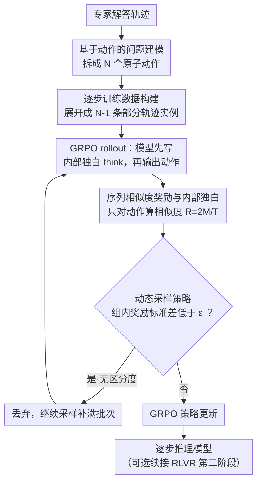

# Supervised Reinforcement Learning: From Expert Trajectories to Step-wise Reasoning

**会议**: ICLR 2026  
**arXiv**: [2510.25992](https://arxiv.org/abs/2510.25992)  
**代码**: 无  
**领域**: 代码智能  
**关键词**: 强化学习, 监督学习, 逐步推理, 序列相似度奖励, 难题学习

## 一句话总结

提出 Supervised Reinforcement Learning (SRL)，将问题求解重新建模为逐步动作生成过程，通过基于序列相似度的密集奖励信号，使小模型能够从专家轨迹中学习原本 SFT 和 RLVR 都无法解决的困难推理问题。

## 研究背景与动机

大语言模型在多步推理任务中面临一个根本性困境：

**RLVR 的局限性**：基于最终答案正确性的强化学习（如 GRPO）依赖于模型在有限 rollout 中采样到正确解的能力。对于小模型（如 7B），在困难问题上 pass@k 接近零，导致奖励信号极度稀疏，模型无法从中学到有意义的策略。DAPO 等方法通过过滤掉全错/全对的样本来缓解，但本质上放弃了这些难题。

**SFT 的局限性**：监督微调通过 token 级别的模仿学习，强制模型逐字复制专家轨迹。对于长而复杂的推理链，这种刚性模仿容易导致过拟合和浅层推理行为。实验表明，在 s1K 数据集上直接做 SFT 反而导致性能下降（见 Figure 1）。

**核心矛盾**：难题数据量少且推理链复杂，SFT 学不好；模型又采样不到正确解，RLVR 也学不好。这在训练小型开源模型时尤为突出。

作者将这类问题定义为 $\mathcal{D}_{\text{hard}}$——模型在 $k$ 次采样中成功率趋近于零的问题集合。SRL 的目标就是在这个困难区域提供有效的学习信号。

## 方法详解

### 整体框架

SRL 把"解一道难题"重新表述为一个顺序决策过程：不再要求模型一口气生成完整解答，也不强迫它逐 token 复制专家轨迹，而是让模型每一步只生成一个"动作"（即一个推理步骤），并用这个动作与专家对应动作的序列相似度作为密集奖励。训练时先把每条专家解答拆成逐步动作序列、再展开成多条"从中间状态继续推理"的训练实例，最后在 GRPO 框架下用序列相似度奖励做强化学习——这样即使模型一次也采样不到完整正确解，每一步的局部相似度仍能源源不断地提供梯度。

### 关键设计

**1. 基于动作的问题建模：把连续推理离散成可对比的原子操作。** RLVR 之所以在难题上失效，是因为它只看最终答案这一个稀疏信号；要想在过程中给反馈，就得先把推理"切片"。SRL 将专家解答轨迹 $\mathbf{y}$ 分解为动作元组序列 $\mathbf{y} = \{\mathbf{y}_{\text{step}}^n\}_{n=1}^N$，每个 $\mathbf{y}_{\text{step}}^n$ 代表一个逻辑动作——在数学推理里是一次代数运算，在软件工程里是一条终端命令。这种切片方式与领域无关，且把"学会整条长链"这个难任务降解成"学会每一步"的若干易任务，让模型在局部就能拿到有意义的反馈。

**2. 逐步训练数据构建：一条专家解答展开成多条训练实例。** 难题本身就少，直接拿来做 SFT 数据量严重不足。SRL 从一个含 $N$ 步的完整解中构造 $N-1$ 个部分轨迹：预测第 $k$ 步时，输入是题目加上前 $k-1$ 步专家动作 $\mathbf{x}_{\text{step}}^k = [\mathbf{x}, \mathbf{y}_{\text{step}}^1, \ldots, \mathbf{y}_{\text{step}}^{k-1}]$，目标是预测下一步 $\mathbf{y}_{\text{step}}^k$。这一展开既把训练样本量放大了近 $N$ 倍，又显式教会模型"从任意中间状态出发该怎么往下走"，覆盖了推理链上的各种局面。

**3. 序列相似度奖励与内部独白：在动作层面打分，给思考留自由。** 关键问题是怎么打分才能既密集又不扼杀模型自己的推理风格。SRL 让模型先生成被 `<think>` 标签包裹的内部推理 $\mathbf{y}'_{\text{think}}$，再输出动作 $\mathbf{y}'^k_{\text{step}}$，而奖励**只**比对动作部分与专家动作的序列相似度，完全不约束内部独白：

$$R(\mathbf{y}'^k_{\text{step}}, \mathbf{y}^k_{\text{step}}) = \frac{2M}{T}$$

其中 $T$ 是两序列的总元素数，$M$ 是所有非重叠匹配块中元素的总数，实现上直接调用 Python 的 `difflib.SequenceMatcher`，格式不合法则记 $-1$。因为比较发生在动作而非 token 层面，模型可以用任意思路推到同一步；又因为相似度是连续的 $r\in[0,1]$ 而非二值，哪怕所有 rollout 都不完全正确，相互之间仍有可区分的优劣，从而保证梯度不为零。

**4. 动态采样策略：把算力花在还能学到东西的样本上。** GRPO 的优势函数靠组内奖励差异定义，一旦一批 rollout 的奖励几乎相同，优势就趋近零、这条样本白训。SRL 沿用并推广 DAPO 的过滤思想（DAPO 只能处理二值奖励，这里推广到连续奖励）：过滤掉 rollout 奖励标准差低于阈值 $\epsilon$ 的样本，持续采样与过滤直到批次填满，从而避免在"已经学透"或"完全无法区分"的样本上空耗计算。

### 损失函数 / 训练策略

整体在 GRPO 优化目标下结合上述序列相似度奖励，关键超参为：批次大小 512（GRPO 基线因过滤率高用 128）、学习率 5e-7、每题 rollout 8 条、KL 损失系数 0（不加 KL 约束）、最多训练 30 个 epoch 并按验证集选最佳 checkpoint。训练既可单独跑 SRL，也可走 SRL → RLVR 的两阶段课程学习——先用细粒度专家指导建立基础推理能力，再放开做最终答案奖励的自由探索。

## 实验关键数据

### 主实验

**数学推理**（基座模型：Qwen2.5-7B-Instruct，训练数据：s1K-1.1，1000 道难题）

| 方法 | AMC23 Avg@32 | AIME24 Avg@32 | AIME25 Avg@32 | Minerva Math | 平均 |
|------|-------------|---------------|---------------|-------------|------|
| Base Model | 49.3 | 10.5 | 7.5 | 34.9 | 24.6 |
| SFT (R1 reasoning) | 26.8 | 3.9 | 5.4 | 20.2 | 16.6 |
| RLVR (GRPO) | 52.0 | 11.1 | 7.4 | 33.8 | 24.5 |
| **SRL** | **51.5** | **13.2** | **7.1** | **36.4** | **27.6** |
| **SRL → RLVR** | **52.1** | **13.3** | **8.6** | **36.4** | **28.3** |

关键观察：SFT 在难数据上性能严重下降（-8 个点）；RLVR 基本持平；SRL 带来显著提升（+3.0%）；SRL→RLVR 达到最强（+3.7%）。

**软件工程**（基座模型：Qwen2.5-Coder-7B-Instruct，5000 条专家轨迹）

| 方法 | Oracle File Edit | End-to-End |
|------|-----------------|------------|
| Base Model | 5.8 | 3.2 |
| SWE-Gym-7B (SFT) | 8.4 | 4.2 |
| **SRL** | **14.8** | **8.6** |

SRL 在 Oracle 设置下相对 SWE-Gym-7B 提升 74%，端到端性能翻倍。

### 消融实验

| 配置 | 平均性能 | 说明 |
|------|---------|------|
| SRL w/o 动态采样 | 24.7 | 过滤低方差样本带来 +2.9% |
| SRL w/ 动态采样 | 27.6 | 确认过滤策略的重要性 |
| 最终答案奖励 (RLVR) | 24.5 | 稀疏奖励效果有限 |
| 整体序列相似度（单步）| 25.9 | 有一定提升但不如多步 |
| 多步序列相似度 (SRL) | 27.6 | 细粒度引导效果最优 |

### 关键发现

1. **推理长度未显著增加**：SRL 训练后的模型与基座模型的推理长度分布几乎一致，说明性能提升来自推理质量而非更多 token
2. **涌现交错推理模式**：SRL→RLVR 模型展示了独特的推理行为——(1) 前期规划，(2) 过程中动态调整，(3) 反思性验证。这些模式在传统模型中不存在
3. **跨领域泛化**：SRL 不仅在数学推理中有效，在软件工程 Agent 任务中同样表现出色，证明框架的通用性

## 亮点与洞察

1. **填补了一个重要空白**：在 SFT 过拟合和 RLVR 稀疏奖励之间找到了一个优雅的中间方案。通过逐步分解 + 序列相似度奖励，既保留了专家指导又给予模型推理自由
2. **奖励函数设计精妙**：只对动作计算相似度、不约束内部思考过程，这个设计让模型可以发展出自己的推理风格。使用 `difflib.SequenceMatcher` 使得奖励计算既快速又稳定
3. **课程学习策略**：SRL → RLVR 的组合将 SRL 视为一种更好的初始化手段，先通过细粒度专家指导建立基础推理能力，再通过自由探索进一步优化
4. **实用性强**：无需训练额外的奖励模型，无需复杂的过程奖励标注，仅利用现有的 SFT 数据就能构建训练信号

## 局限与展望

1. **依赖专家轨迹的结构化格式**：SRL 要求解答轨迹具有明确的步骤划分（如 DeepSeek R1 的编号步骤格式），并非所有数据都满足
2. **学生模型需要基本的指令跟随能力**：如果基座模型完全不能生成格式正确的输出，初始 rollout 就无法提供有用的学习信号
3. **序列相似度奖励可能不够精细**：基于字符串匹配的相似度可能无法区分语义等价但表述不同的数学步骤
4. **未探索更大模型**：实验仅在 7B 模型上进行，更大模型上 SRL 的边际收益尚不清楚
5. **可扩展至过程奖励模型**：结合 PRM 可能提供比序列相似度更语义化的步骤级奖励

## 相关工作与启发

- **DeepSeek-R1** 和 **GRPO** 是 RLVR 的代表工作，SRL 建立在 GRPO 的优化框架之上
- **s1K**、**LIMO** 等工作证明少量高质量数据可以有效蒸馏推理能力，SRL 在同样的数据上走得更远
- **SWE-Gym** 和 **SWE-Smith** 提供了软件工程领域的 SFT 数据，SRL 在相同数据上大幅超越 SFT 基线
- 启发：将 RL 和模仿学习的思想结合，在"模仿什么"和"自由探索什么"之间找到平衡点

## 评分

- 新颖性: ⭐⭐⭐⭐⭐ — SFT 和 RLVR 之间的巧妙融合，填补了重要空白
- 实验充分度: ⭐⭐⭐⭐ — 数学+SWE 两个领域验证，消融充分，但仅限 7B 模型
- 写作质量: ⭐⭐⭐⭐⭐ — 动机清晰，方法描述精确，图示直观
- 价值: ⭐⭐⭐⭐⭐ — 为训练小模型处理难题提供了实用的新范式

<!-- RELATED:START -->

## 相关论文

- [\[NeurIPS 2025\] Contextual Integrity in LLMs via Reasoning and Reinforcement Learning](../../NeurIPS2025/llm_safety/contextual_integrity_in_llms_via_reasoning_and_reinforcement_learning.md)
- [\[ICLR 2026\] wd1: Weighted Policy Optimization for Reasoning in Diffusion Language Models](wd1_weighted_policy_optimization_for_reasoning_in_diffusion_language_models.md)
- [\[ICLR 2026\] PURGE: Reinforcement Unlearning via Group Relative Policy Optimization](reinforcement_unlearning_via_group_relative_policy_optimization.md)
- [\[ACL 2026\] Privacy-R1: Privacy-Aware Multi-LLM Agent Collaboration via Reinforcement Learning](../../ACL2026/llm_safety/privacy-r1_privacy-aware_multi-llm_agent_collaboration_via_reinforcement_learnin.md)
- [\[NeurIPS 2025\] Reverse Engineering Human Preferences with Reinforcement Learning](../../NeurIPS2025/llm_safety/reverse_engineering_human_preferences_with_reinforcement_learning.md)

<!-- RELATED:END -->
