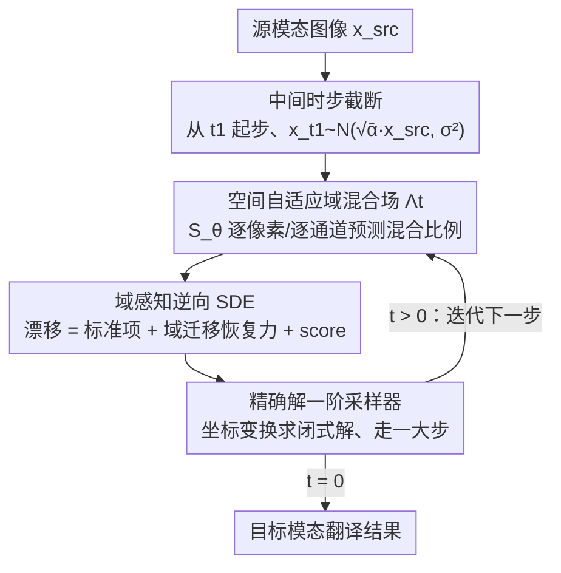

# Adaptive Domain Shift in Diffusion Models for Cross-Modality Image Translation

**会议**: ICLR 2026  
**arXiv**: [2601.18623](https://arxiv.org/abs/2601.18623)  
**代码**: [https://github.com/LaplaceCenter/CDTSDE](https://github.com/LaplaceCenter/CDTSDE)  
**领域**: 医学图像 / 扩散模型  
**关键词**: 跨模态图像翻译, 扩散SDE, 域迁移调度, 空间自适应混合, 逆向SDE  

## 一句话总结
提出CDTSDE框架，在扩散模型的逆向SDE中嵌入可学习的空间自适应域混合场 $\Lambda_t$，使跨模态翻译路径沿低能量流形前进，在MRI模态转换、SAR→光学、工业缺陷语义映射任务上以更少去噪步数实现更高保真度。

## 研究背景与动机

**领域现状**：跨模态图像翻译（如MRI T1→T2、SAR→光学）已从GAN时代进入扩散模型时代，扩散方法在稳定性和生成质量上优于GAN。

**现有痛点**：现有扩散翻译方法普遍依赖源域→目标域之间的**固定线性插值** $d_t = \eta_t \hat{x}_0^{\text{src}} + (1-\eta_t) x_0$，这条直线路径会穿过两个模态流形之间的高能量区域，迫使采样器做大量偏离流形的校正。

**核心矛盾**：线性插值假设源-目标变换是全局均匀的，但真实跨模态差异在空间上高度异质——某些区域（如纹理差异大的边缘）需要更多校正，而均匀区域几乎不需要。

**本文目标**：能否让域迁移调度本身学习一条"自适应弯曲"的路径，绕过高能量区域，从而减轻去噪负担并提高语义一致性？

**切入角度**：作者从路径能量泛函的几何视角出发，证明了在温和异质性条件下，逐像素自适应路径的能量严格低于任何全局调度路径（Theorem 1）。

**核心 idea**：将域迁移从"全局线性插值"升级为"逐像素、逐通道的可学习非线性混合场"，并将其嵌入扩散SDE的漂移项中。

## 方法详解

### 整体框架
CDTSDE（Cross-Domain Translation SDE）要解决的是：跨模态翻译里源域到目标域的过渡路径若走全局线性直线，会穿过两模态流形之间的高能量区，逼着采样器做大量偏离流形的校正。它的整体思路是把这条过渡路径变成可学习的弯路——在 VP 扩散过程里引入一个空间自适应域混合场 $\Lambda_t \in (0,1)^{C \times H \times W}$，逐像素决定每一步该掺入多少源域信息，并把这条混合路径 $d_t = \Lambda_t \odot \hat{x}_0^{\text{src}} + (1-\Lambda_t)\odot x_0$ 直接写进扩散 SDE 的漂移项。运行时（见下图）：给定源模态图像，采样不从纯噪声、而从中间时步 $t_1$ 的"源图像中心噪声"起步；此后每一步先由混合场网络 $\mathcal{S}_\theta$ 预测当前 $\Lambda_t$，再用带域迁移恢复力的逆向 SDE 配合闭式精确解采样器走一大步，迭代收敛到 $t=0$ 即得目标模态图像，全程仅需约 5 步。

### 关键设计

**1. 空间自适应域混合场：让每个像素自己决定混合多少源域信息**

固定线性插值的根本问题是全局均匀，但跨模态差异在空间上高度异质，纹理差异大的边缘和几乎不变的均匀区域不该用同一个混合比例。CDTSDE 因此在每个逆向时步 $t$ 预测一个全分辨率的混合场 $\Lambda_t \in (0,1)^{C \times H \times W}$，逐像素、逐通道地给出当前该掺入多少源图像。具体由一个轻量卷积网络 $\mathcal{S}_\theta$ 承担：它接收基础线性步 $\lambda_t^{\text{lin}}$ 和位置编码 $\pi(p)$，输出空间调制信号 $h_{t,c}(p)$；再经零中心化变换 $g = 2h-1$ 与保端点插值

$$f_{t,c} = \lambda_t^{\text{lin}}\big[1 + g_{t,c}(1-\lambda_t^{\text{lin}})\big]$$

把调制叠加到线性基准上（保端点保证 $t=0,T$ 处仍退化到正确边界），最后经 calibrated logistic map 压缩回 $(0,1)$ 得到 $\Lambda_{t,c}(p)$。这一设计不是拍脑袋：**Theorem 1** 在局部几何异质（不同像素有不同的最优混合比例）和非退化对比度条件下，证明了 $\inf_{\Lambda \in \mathcal{C}_{\text{pix}}} \mathcal{E}[d] < \inf_{\Lambda \in \mathcal{C}_{\text{glob}}} \mathcal{E}[d]$——逐像素调度的路径能量严格低于任何全局调度，这就是绕过高能量区域、减轻去噪负担的理论依据。

**2. 域感知前向/逆向 SDE：把域迁移直接写进扩散的漂移项里**

光有混合场还不够，关键是让生成动力学本身知道域在迁移。CDTSDE 把 $\Lambda_t$ 嵌进 VP 扩散：前向边际取 $q(x_t \mid x_0, \hat{x}_0^{\text{src}}) = \mathcal{N}(\sqrt{\bar\alpha_t}\, d_t,\ \sigma_t^2 I)$，其中域混合路径 $d_t = \Lambda_t \odot \hat{x}_0^{\text{src}} + (1-\Lambda_t)\odot x_0$；相比标准扩散多出一项漂移 $\sqrt{\bar\alpha_t}\,\dot\Lambda(t)\odot(\hat{x}_0^{\text{src}} - x_0)$，使前向均值随时间追踪这条混合路径。对应的逆向 SDE（Eq.9）由三股力合成：标准漂移 $f(t)x_t$、显式的域迁移恢复力、以及 score 函数。把域迁移物理编码进漂移项的好处是，即使用大步长积分，每一步更新本身就携带域感知的校正方向，从而始终保持在流形上——去噪模型的活也因此从"全局对齐"降级为"局部残差校正"。

**3. 精确解与一阶采样器：靠坐标变换求出闭式解，5 步出图**

要把上面那条带域迁移漂移的逆向 SDE 高效求解，作者引入坐标变换 $\Upsilon_t = \sqrt{\bar\alpha_t}(1-\Lambda_t)$、$y_t = x_t \oslash \Upsilon_t$、$\lambda_t = \sigma_t \oslash \Upsilon_t$，把方程化成可用 variation-of-constants 公式精确积分的形式。**Proposition 1** 给出的精确解含四项：(a) 缩放传播、(b) 数据预测积分、(c) 源图像恢复项、(d) 随机项。精确解的意义在于它保证了边际一致性，于是据此设计的一阶数值采样器仅需 5 步即可达到 ~15dB PSNR，而 BBDM 这类方法要走到 1000 步。

**4. 中间时步截断：从源图像中心起步，省掉前半段噪声**

由于 $t \geq t_1$ 之后 $\Lambda_t = 1$，前向均值已退化为以纯源图像为中心的噪声过程，那段路径不含任何域迁移信息、走它纯属浪费。于是采样不必从纯噪声开始，而是在起始时间 $t_1 < T$ 直接从 $x_{t_1} \sim \mathcal{N}(\sqrt{\bar\alpha_{t_1}}\,\hat{x}_0^{\text{src}},\ \sigma_{t_1}^2 I)$ 初始化，跳过 $T - t_1$ 步，进一步压缩采样开销。

### 训练策略
- 噪声预测模型 $\varepsilon_\theta$ 与域调度网络 $\mathcal{S}_\theta$ 联合训练
- UNet backbone + PyTorch Lightning混合精度
- 各任务训练步数适中：Sentinel 20K, IXI 10K, PSCDE 5K

## 实验关键数据

### 主实验
在三个跨模态翻译任务上与Pix2Pix、BBDM、ABridge、DBIM、DOSSR对比：

| 任务 | 指标 | CDTSDE | DOSSR(次优) | Pix2Pix |
|------|------|--------|------------|---------|
| Sentinel (SAR→Optical) | SSIM↑ | **0.382** | 0.360 | 0.230 |
| Sentinel | PSNR↑(dB) | **17.46** | 17.14 | 15.12 |
| IXI (T2→T1) | SSIM↑ | **0.825** | 0.800 | 0.710 |
| IXI (T2→T1) | PSNR↑(dB) | **24.33** | 24.13 | 22.24 |
| PSCDE (缺陷语义) | Dice↑ | **0.488** | 0.460 | 0.178 |
| PSCDE | Hausdorff↓ | **39.87** | 59.53 | 156.28 |

CDTSDE在几乎所有指标上居首，在效率方面仅需5个采样步（1.8s/图）达到15dB PSNR，比DOSSR（10步, 3.6s）快2x。

### 消融实验

| 调度类型 | Dice (PSCDE) | Hausdorff↓ | 说明 |
|---------|-------------|-----------|------|
| Linear (全局线性) | 0.46 | 59.5 | 固定 $\eta_t \cdot \mathbf{1}$ |
| Channel Non-linear | 0.46 | 43.0 | 逐通道非线性但空间均匀 |
| Dynamic (完整) | **0.49** | **39.8** | 空间+通道自适应 |

### 关键发现
- 从Linear→Dynamic，Dice提升6.1%，Hausdorff降低33%，说明空间自适应域调度的核心价值
- Channel Non-linear已能显著改善边界质量（Hausdorff 59.5→43.0），但区域重叠不变，空间维度的自适应提供了额外的overlap提升
- Bridge-based方法（BBDM、ABridge、DBIM）在高度异质的PSCDE任务上几乎完全失效（Dice<0.17），而CDTSDE和DOSSR因显式域迁移设计表现远好

## 亮点与洞察
- **理论驱动的设计**：Theorem 1从路径能量泛函角度严格证明了逐像素调度优于全局调度，这个理论结果不仅支撑了方法设计，还具有更广泛的启示——在任何需要学习两个分布间过渡路径的生成任务中，空间自适应调度都可能有益
- **精确解→高效采样**：通过坐标变换得到逆向SDE的精确解，实现5步高质量翻译，是理论到实践的典范
- **域迁移力嵌入漂移项**的设计让去噪模型从"全局对齐"降级为"局部残差校正"，大幅降低了学习难度

## 局限与展望
- 在低域差异场景（如IXI）改善幅度有限（SSIM从0.80→0.82），说明当模态差异小时额外的自适应调度并非必要
- 仅在配对数据上训练和评估，未探索非配对跨模态翻译
- GAN方法在感知质量（sharpness）上可能更好，CDTSDE可以考虑加入轻量感知/对抗损失
- 域调度网络 $\mathcal{S}_\theta$ 的容量和架构选择对性能的影响没有充分探讨
- 仅验证了256×256分辨率，高分辨率场景的计算开销和显存待评估

## 相关工作与启发
- **vs DOSSR**: 同为显式域迁移扩散方法，但DOSSR用固定线性调度，CDTSDE用可学习空间自适应调度，后者在PSCDE上Dice高3个点
- **vs BBDM/Bridge方法**: Bridge方法在配对数据间建布朗桥，但缺乏对域异质性的建模，在复杂翻译任务上严重退化
- **vs SDEdit**: SDEdit通过固定噪声水平控制翻译，无显式域迁移机制，在复杂跨模态场景下语义漂移严重

## 评分
- 新颖性: ⭐⭐⭐⭐⭐ 将域迁移物理嵌入SDE漂移项+理论证明空间调度优越性，理论和方法都有创新
- 实验充分度: ⭐⭐⭐⭐ 三个不同难度任务+消融+效率分析完整，但数据集规模偏小
- 写作质量: ⭐⭐⭐⭐ 数学推导严谨，Fig.1的流形路径可视化直观，整体逻辑清晰
- 价值: ⭐⭐⭐⭐ 在医学图像和遥感领域有实际应用价值，自适应调度idea可迁移到其他条件生成任务

<!-- RELATED:START -->

## 相关论文

- [\[ICLR 2026\] DM4CT: Benchmarking Diffusion Models for Computed Tomography Reconstruction](dm4ct_benchmarking_diffusion_models_for_computed_tomography_reconstruction.md)
- [\[ICCV 2025\] SciVid: Cross-Domain Evaluation of Video Models in Scientific Applications](../../ICCV2025/medical_imaging/scivid_cross-domain_evaluation_of_video_models_in_scientific_applications.md)
- [\[ICLR 2026\] Improving 2D Diffusion Models for 3D Medical Imaging with Inter-Slice Consistent Stochasticity](improving_2d_diffusion_models_for_3d_medical_imaging_with_inter-slice_consistent.md)
- [\[CVPR 2026\] KLIP: localized distribution shift detection via KL-divergence with diffusion priors in Inverse Problems](../../CVPR2026/medical_imaging/klip_localized_distribution_shift_detection_via_kl-divergence_with_diffusion_pri.md)
- [\[CVPR 2026\] MUST: Modality-Specific Representation-Aware Transformer for Diffusion-Enhanced Survival Prediction with Missing Modality](../../CVPR2026/medical_imaging/must_modality-specific_representation-aware_transformer_for_diffusion-enhanced_s.md)

<!-- RELATED:END -->
