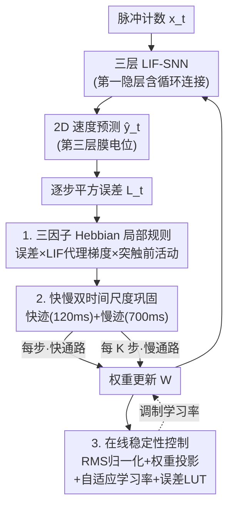

# Biologically Plausible Online Hebbian Meta-Learning: Two-Timescale Local Rules for Spiking Neural Brain Interfaces

**会议**: ICLR2026  
**arXiv**: [2509.14447](https://arxiv.org/abs/2509.14447)  
**代码**: 待确认  
**领域**: LLM评测  
**关键词**: SNN, BCI, Hebbian学习, 在线适应, 脉冲神经网络

## 一句话总结
提出一种无需BPTT的在线SNN解码器，通过三因子Hebbian局部学习规则结合双时间尺度eligibility trace和自适应学习率控制，在O(1)内存下实现可比离线训练方法的BCI神经解码精度（Pearson R≥0.63/0.81），并在闭环仿真中展现了对神经信号非平稳性的持续适应能力。

## 研究背景与动机

**领域现状**：脑机接口（BCI）将神经活动翻译为控制信号，绕过传统神经肌肉通路。侵入式方法提供高保真度记录，但面临信号不稳定、噪声大和资源受限等障碍。解码器从经典的卡尔曼滤波器发展到深度学习方法（如 LSTM），但传统方法难以处理非平稳性，而深度模型需频繁重新校准。

**现有痛点**：神经记录会因电极包覆、神经可塑性等因素持续漂移（信号非平稳性），频繁校准中断用户体验；电生理数据高维且噪声大，低延迟解码困难；模型跨会话或个体泛化差，往往需要重新训练。而最棘手的是计算约束——BPTT 需要 O(T) 内存，不适合功耗和内存受限的植入式系统，且反向传播在生物神经系统中也缺乏合理性（权重传输问题）。

**核心矛盾**：在线适应性与计算高效性相互掣肘。要实现持续在线适应就需要足够复杂的学习算法，但植入式 BCI 硬件极度资源受限，无法承受 BPTT 的 O(T) 内存和计算开销；同时现有方法往往割裂地处理上述各个问题，缺乏统一机制。

**本文目标**：设计一个统一框架，在 SNN 中集成多因子可塑性、双时间尺度巩固和在线元学习，使其能够避免 BPTT 以降低内存/计算开销、支持逐样本在线适应、并适配神经形态硬件。

**切入角度**：把 eligibility trace 重新定义为 Hebbian 累积器（而非 BPTT 近似的梯度代理），用强化信号调制，再结合快慢时间尺度的记忆巩固机制来平衡可塑性与稳定性。

**核心 idea**：用局部三因子 Hebbian 规则 + 双时间尺度 eligibility trace + 元学习自适应学习率，构建 O(1) 内存的在线 SNN-BCI 解码器。

## 方法详解

### 整体框架
论文要解决的是：在内存和功耗都极度受限的植入式脑机接口（BCI）上，让解码器随神经信号的持续漂移不断在线适应，又不能背负 BPTT（时间反向传播）那 $O(T)$ 的内存开销。它的做法是把一个三层 LIF（leaky integrate-and-fire，泄漏积分-发放）脉冲神经网络（SNN）改造成纯在线学习器：每来一帧原始脉冲计数 $\mathbf{x}_t \in \mathbb{R}^N$，网络前向出 2D 速度预测 $\hat{\mathbf{y}}_t \in \mathbb{R}^2$（第三层膜电位直接当输出），与真值算出逐步平方误差。这个误差不走反传，而是就地用一条三因子 Hebbian 局部规则算出权重更新，先存进快/慢两条 eligibility trace（资格迹），再分别经"每步快通路"和"每 K 步慢通路"写回权重；整条回路外加 RMS 归一化、权重投影和自适应学习率三道稳定化措施兜底，全程不展开计算图、不需要回放缓冲区，序列维上只占 $O(1)$ 内存。

### 关键设计

**1. 三因子 Hebbian 局部规则：把任务监督塞进只看当前帧的本地更新里**

整套学习算法的地基是一条不依赖时间反传的局部规则——这正是绕开 BPTT 的 $O(T)$ 内存的关键。每层的误差驱动信号先用当前前馈权重把输出误差"空间地"投回本层，再与突触前活动 $\text{pre}^{(\ell)}_t$、突触后敏感度（LIF 代理梯度 $d^{(\ell)}_t$）三者逐元素相乘，得到本层的权重更新量：

$$\Delta W^{(\ell)}_{\text{hebb}}(t) = (\tilde{\mathbf{e}}^{(\ell)}_t \odot d^{(\ell)}_t)(\text{pre}^{(\ell)}_t)^\top$$

之所以要三因子而不是经典 STDP 的两因子（只看前后突触脉冲），是因为纯 STDP 是无监督的、学不到任务目标。这里多出来的代理梯度 $d^{(\ell)}_t$ 充当一道"灵敏度门"，把可塑性集中到膜电位接近发放阈值的神经元上，既保留了"只用当前帧、无需展开计算图"的生物合理性，又把密集的逐帧运动学误差当作信用分配信号引了进来——消融显示，这道门在信噪比较低、连续混合记录的 Zenodo 数据集上很关键，去掉退化成 delta 规则后明显变差。

**2. 快慢双时间尺度巩固：用两条衰减速度不同的轨迹化解稳定性-可塑性困境**

瞬时算出的 Hebbian 更新并不立刻写进权重，而是先累积到两条衰减速度不同的 eligibility trace 上，再经两条通路落到权重——这一档同时回答了"反应要快"和"记得要牢"这对矛盾。快迹衰减快（$\tau_{\text{fast}}=120$ms）抓即时变化，慢迹衰减慢（$\tau_{\text{slow}}=700$ms）积累持久证据，二者都按指数衰减递推（如 $E^{\text{fast}}(t) = \lambda_{\text{fast}} E^{\text{fast}}(t-1) + \Delta W_{\text{hebb}}(t)$），并按 $E_{\text{comb}} = \alpha_{\text{mix}} E^{\text{fast}} + (1 - \alpha_{\text{mix}}) E^{\text{slow}}$ 混合。混合迹再走两条通路写回权重：快通路每帧直接施加 $W^{(\ell)} \leftarrow W^{(\ell)} + \eta_{\text{fast}} E^{(\ell)}_{\text{comb}}(t)$，应对突发漂移；慢通路每 K 步执行一次，先对动量平滑的累积器做 RMS 归一化再更新 $W^{(\ell)} \leftarrow W^{(\ell)} + \eta_{\text{slow}} \mathcal{R}(\bar{G}^{(\ell)}_K)$，守住长期结构。这套快慢分流直接对应生物突触的早/晚长时程增强（LTP）；消融里"双通路最安全、只留慢通路或冻结则处处有害"印证了两条通路缺一不可。

**3. 在线稳定性控制：用本地统计替代 BatchNorm，防止逐样本更新发散**

batch size=1 的逐样本更新极易数值爆炸，方法叠了一组硬件友好、只依赖本地统计的稳定化手段，全程不需要 BatchNorm 那样的全局信息。其一，RMS 归一化用指数移动平均把误差和脉冲信号的幅度限住（如 $\text{RMS}^2_{\text{err}}(t) = \lambda_{\text{rms}}\text{RMS}^2_{\text{err}}(t-1) + (1-\lambda_{\text{rms}})\|\mathbf{e}^{(\ell)}_t\|^2$ 后做归一化）——消融显示它在 Zenodo 上是必需项。其二，逐行权重投影约束每行范数 $\|W^{(\ell)}_{i:}\|_2 \leq c_\ell = 6$，防止权重失控增长。其三，自适应学习率（元学习）每 K 步按窗口化损失变化 $z_t$ 调整可塑性乘数 $p_{t+1} = \text{clip}(p_t[1 + \eta_{\text{meta}} z_t])$，损失降就放大、停滞就收缩（但消融表明它只带来小幅增益，并非主驱动）。此外还挂了一张轻量误差调制查找表（LUT）：把逐帧误差离散成 16 个桶、按桶重缩放快学习率，相当于一个几乎零开销的粗粒度神经调制信号，让大误差时刻获得更强的即时可塑性。

### 损失函数 / 训练策略
解码器以逐时间步平方误差 $\mathcal{L}_t = \|\hat{\mathbf{y}}_t - \mathbf{y}_t\|_2^2$ 为唯一训练目标，采用纯在线逐样本更新（batch size=1），仅 5 个 epoch 即可收敛。由于无需展开计算图或回放缓冲区，整个流程在序列长度 $T$ 维度上保持 $O(1)$ 内存，只在参数维度占 $O(P)$——这正是它相对 BPTT 的 $O(T)$ 内存的核心优势所在。

## 实验关键数据

### 主实验
在两个灵长类皮层内数据集上评估：MC Maze（10ms重采样，80ms运动学延迟）和Zenodo Indy（50ms bins，零延迟）。

| 数据集 | 方法 | Pearson R (X) | Pearson R (Y) | 备注 |
|--------|------|---------------|---------------|------|
| MC Maze | Online SNN (Batched) | ~0.81 | ~0.81 | 与BPTT-SNN可比 |
| MC Maze | BPTT-SNN | ~0.85 | ~0.85 | 50 epoch + Adam |
| MC Maze | LSTM | ~0.80 | ~0.80 | 离线训练 |
| MC Maze | Kalman Filter | ~0.65 | ~0.65 | 在线序贯 |
| Zenodo Indy | Online SNN (Batched) | ~0.63 | ~0.63 | 可比离线方法 |
| Zenodo Indy | BPTT-SNN | ~0.65 | ~0.65 | 50 epoch |

### 内存开销对比

| 架构 | Online (MB) | BPTT (MB) | 节省比例 |
|------|-------------|-----------|----------|
| 96-256-128-2 | 1.41 | 2.17 | 35% |
| 96-1024-512-2 | 19.15 | 26.67 | 28% |

### 消融实验

| 配置 | 效果 | 说明 |
|------|------|------|
| 三因子 vs Delta Rule | 数据集依赖 | Zenodo上三因子显著更好，MC Maze上差异小 |
| 循环 vs 前馈 | 循环更优 | 两个数据集上循环连接均有贡献，Zenodo上贡献更大 |
| Full RMS vs 无RMS | Full RMS关键 | Zenodo上必须有RMS归一化，部分RMS应避免 |
| 双时间尺度trace vs 单 | 最优选择依数据集 | MC Maze偏好慢/双，Zenodo偏好快 |
| 双通道更新 vs 单 | 双通道最安全 | 仅慢更新或冻结在所有数据集上有害 |
| 元自适应 vs 固定 | 小增益 | 有资源就保留，但非主要驱动 |

### 闭环仿真关键发现
- **90%重映射干扰**：Online SNN在~20次到达后恢复到干扰前水平（≤0.30s），固定模型性能>1.5s
- **90%漂移干扰**：Online SNN在20次到达后从1.5s适应到~0.75s
- **90%丢失干扰**：Online SNN在15-20次到达后恢复
- **从零学习**：无预训练的Online SNN初始0.75s，通过在线学习稳定在0.6s；固定权重的离线方法在校准前几乎无法完成任务

### 关键发现
- Online SNN仅5个epoch（逐样本更新）即可达到接近BPTT-SNN 50个epoch的性能，体现更高的样本效率
- 消融结果具有强数据集依赖性：MC Maze信噪比高故简单规则即可，Zenodo连续混合记录需要三因子门的噪声鲁棒性
- 闭环适应是Online SNN最突出的优势——固定参数方法完全无法应对非平稳性

## 亮点与洞察
- **三因子 = Hebbian × 代理梯度 × 误差**的分解非常优雅，既保持了生物合理性（局部计算），又通过代理梯度门控引入了任务相关的信用分配，是一个巧妙的折中设计
- **快/慢双时间尺度设计贯穿全方法**（trace + 权重更新 + 学习率控制），层层嵌套解决不同时间尺度的适应需求，这种设计哲学可迁移到其他持续学习场景
- **RMS归一化和权重投影**作为硬件友好的稳定性工具替代了BatchNorm等需要全局统计的方法，对神经形态芯片部署很有启发
- 闭环"从零学习"实验展示了无需离线校准即可使用BCI的可能性，这对临床应用意义重大

## 局限与展望
- 闭环实验基于合成神经群体，尚未在真实慢性人类记录上验证
- 巩固窗口K和重置阈值是手动调参的，全自动调度机制待开发
- 在神经形态硬件上的实际部署和扩展性未经验证
- 消融结果的强数据集依赖性暗示方法可能需要针对不同BCI场景做超参调整，泛化性存疑
- 仅评估了2D速度解码任务，更复杂的高自由度运动控制（如手指运动）未探索

## 相关工作与启发
- **vs e-prop (Bellec et al., 2020)**：e-prop也用eligibility trace实现BPTT-free SNN学习，但其trace来源于BPTT的近似梯度；本文将trace重新定义为Hebbian累积器，更强调生物合理性和硬件友好性
- **vs SuperSpike (Zenke & Ganguli, 2018)**：SuperSpike用广播误差信号+局部trace，但仍在trace推导中依赖梯度流；本文的三因子规则更加纯粹地局部化
- **vs 传统R-STDP**：R-STDP使用稀疏延迟的多巴胺类信号做调制，本文用密集的逐帧运动学误差做信用分配，信息更丰富但生物合理性略降
- 双时间尺度巩固思想可以与持续学习/增量学习中的弹性权重巩固（EWC）等方法做有趣对比

## 评分
- 新颖性: ⭐⭐⭐⭐ 统一框架将多个已有思想（三因子规则、双时间尺度、元学习）有机融合，但各组件并非全新
- 实验充分度: ⭐⭐⭐⭐ 两个数据集+全面消融+闭环仿真，但缺乏真实硬件和人类数据验证

<!-- RELATED:START -->

## 相关论文

- [\[NeurIPS 2025\] NeurIPT: Foundation Model for Neural Interfaces](../../NeurIPS2025/medical_imaging/neuript_foundation_model_for_neural_interfaces.md)
- [\[CVPR 2026\] Meta-learning In-Context Enables Training-Free Cross Subject Brain Decoding](../../CVPR2026/medical_imaging/meta-learning_in-context_enables_training-free_cross_subject_brain_decoding.md)
- [\[ICLR 2026\] Brain-Semantoks: Learning Semantic Tokens of Brain Dynamics with a Self-Distilled Foundation Model](brain-semantoks_learning_semantic_tokens_of_brain_dynamics_with_a_self-distilled.md)
- [\[CVPR 2026\] Interpretable Cross-Domain Few-Shot Learning with Rectified Target-Domain Local Alignment](../../CVPR2026/medical_imaging/interpretable_cross-domain_few-shot_learning_with_rectified_target-domain_local_.md)
- [\[NeurIPS 2025\] FireGNN: Neuro-Symbolic Graph Neural Networks with Trainable Fuzzy Rules for Interpretable Medical Image Classification](../../NeurIPS2025/medical_imaging/firegnn_neuro-symbolic_graph_neural_networks_with_trainable_fuzzy_rules_for_inte.md)

<!-- RELATED:END -->
