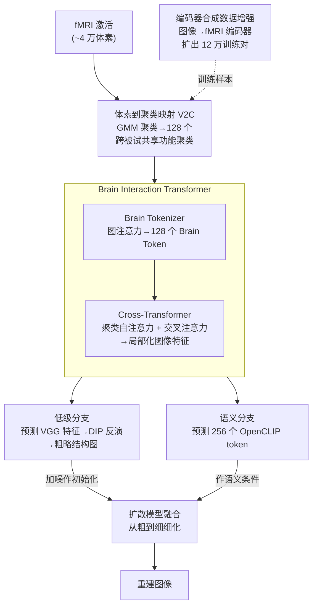

# Brain-IT: Image Reconstruction from fMRI via Brain-Interaction Transformer

**会议**: ICLR 2026  
**arXiv**: [2510.25976](https://arxiv.org/abs/2510.25976)  
**代码**: [项目页面](https://amitzalcher.github.io/Brain-IT/)  
**领域**: 3D视觉  
**关键词**: fMRI脑解码, 图像重建, 脑-交互Transformer, 跨被试迁移, 扩散模型, 深度图像先验

## 一句话总结

提出 Brain-IT 框架，通过脑启发式的 Brain Interaction Transformer (BIT) 将功能相似的脑体素聚类为跨被试共享的 Brain Token，并从中预测局部化的语义和结构图像特征，实现从 fMRI 到图像的高保真重建，仅用 1 小时数据即达到先前方法 40 小时的性能。

## 研究背景与动机

从 fMRI 脑信号重建视觉体验是神经科学和脑-机接口领域的核心挑战。尽管扩散模型的引入带来了显著进展，但现有方法在**忠实度**上仍有明显不足——生成的图像虽然视觉效果好，但常常偏离实际看到的图像，表现为：

- **结构偏差**：位置、颜色、空间布局不正确
- **语义失真**：遗漏或扭曲部分语义内容
- **根本原因**：过度依赖扩散模型的生成先验，即使脑活动引导不足也能生成"逼真"图像

作者将问题归因于三个层面：(1) fMRI 表征提取方式不当——现有方法将所有体素压缩为单一全局嵌入，丢失了视觉皮层的分布式信息；(2) 到图像特征的映射方式——全连接层无法利用脑区分布式本质；(3) 生成模型的特征整合——缺乏结构性引导。

此外，fMRI 数据采集昂贵耗时（一个被试需 40 小时扫描），如何用极少量数据迁移到新被试是重要的实际需求。

## 方法详解

### 整体框架

Brain-IT 把"从 fMRI 重建图像"拆成两个串联阶段：先用脑启发的 Brain Interaction Transformer (BIT) 把脑信号翻译成**局部化的图像特征**，再用语义与结构两个分支把这些特征还原为图像。具体地，几万个体素先经体素到聚类映射 (V2C) 压成 128 个跨被试共享的功能聚类，BIT 内部由 Brain Tokenizer（产出 128 个 Brain Token）和 Cross-Transformer（建模聚类交互并写出局部图像特征）两步组成；随后语义分支预测 CLIP token 作生成条件、低级分支经 Deep Image Prior 反演出粗结构图，推理时二者在扩散模型里融合。整条流水线的关键在于全程不把脑活动压成一个全局向量，而是让视觉皮层的分布式信息一路保留到图像空间，从而既忠实于实际看到的结构、又能借扩散模型补全细节。

### 关键设计

**1. 体素到聚类映射 V2C：把几万个体素压成跨被试共享的功能单元**

直接在约 4 万个体素上做注意力计算既昂贵又无法跨被试对齐。Brain-IT 先用 Beliy et al. (2024) 的脑编码器为每个体素求出捕获其功能角色的嵌入，再对所有被试的体素嵌入联合做高斯混合模型 (GMM) 聚类，把每个被试的体素映射到 **128 个功能聚类**上。由于聚类是在功能嵌入空间而非解剖空间上求的，它能把不同个体中功能相似的脑区归到同一类，从而成为跨被试共享的"信息瓶颈"——既把后续建模从体素级压到聚类级大幅降复杂度，也为迁移到新被试时复用同一套聚类与网络权重打下基础。

**2. Brain Interaction Transformer：把 fMRI 激活翻译成 128 个 Brain Token 再映射到局部图像特征**

BIT 分两步。Brain Tokenizer 先生成 Brain Token：用一组可学习的逐体素嵌入（512 维）与该体素的 fMRI 激活值相乘做调制，再用一组逐聚类嵌入（512 维）作为 Query、调制后的体素激活作为 Key/Value，通过一个单头图注意力层聚合——注意力范围由 V2C 映射限制，使每个聚类只汇聚属于它的体素，输出 128 个 512 维 Brain Token。随后的 Cross-Transformer 用自注意力建模聚类之间的交互关系，再用交叉注意力把 Brain Token 的信息直接写到一组局部化的图像特征上：每个 query token 对应一个输出特征位置，于是信息从"功能聚类"到"局部图像特征"形成一条直达通路。正是这种局部化映射保留了空间布局，交叉注意力图也因此呈现出清晰的对侧组织与语义选择性，而非全局压缩后丢失位置的均匀响应。

**3. 双分支重建：语义分支管"是什么"、低级分支管"在哪里"，推理时融合**

语义分支负责高级内容：BIT 预测 256 个空间 OpenCLIP ViT-bigG/14 token，训练先用 L2 损失做特征对齐，再联合训练 BIT 与扩散模型（扩散损失）——联合阶段允许 BIT 的输出偏离原始 CLIP 表征，学出更适合 fMRI 条件生成的特征。低级分支负责结构：BIT 用 InfoNCE 损失预测多层 VGG 特征，再通过 Deep Image Prior (DIP) 反演成图像——随机初始化一个 CNN 输出图像，优化它使其 VGG 特征匹配 BIT 的预测，借 DIP 卷积本身的归纳偏置当作强图像先验，无需训练就能生成粗略但位置、颜色、轮廓正确的布局。推理时两路互补：低级分支的粗略图像加噪后作为扩散过程的初始化提供可靠全局结构，语义分支作为条件引导，让扩散模型沿"从粗到细"把粗结构细化成精细图像。

**4. 编码器合成数据增强：借图像到 fMRI 编码器扩出 12 万训练对**

fMRI 采集昂贵导致真实训练对稀缺。Brain-IT 用 Beliy et al. (2024) 的图像到 fMRI 编码器，为约 12 万张 COCO 无标注图像预测对应的 fMRI 响应，当作额外的图像-fMRI 训练对。这在数据极少的迁移学习场景下尤其关键，让模型在只有 1 小时真实扫描时仍有足够样本拟合 BIT。

## 实验关键数据

**数据集**：NSD 数据集（7T fMRI），4 个被试（S1/2/5/7），每被试约 9000 张图像，1000 张共享测试集。

**40 小时全量数据主要结果**（表 1，4 被试平均）：

| 指标 | MindEye2 | MindTuner | **Brain-IT** |
|------|----------|-----------|-------------|
| PixCorr ↑ | 0.322 | 0.322 | **0.386** |
| SSIM ↑ | 0.431 | 0.421 | **0.486** |
| Alex(2) ↑ | 96.1% | 95.8% | **98.4%** |
| Alex(5) ↑ | 98.6% | 98.8% | **99.5%** |
| Incep ↑ | 95.4% | 95.6% | **97.3%** |
| CLIP ↑ | 93.0% | 93.8% | **96.4%** |
| Eff ↓ | 0.619 | 0.612 | **0.564** |
| SwAV ↓ | 0.344 | 0.340 | **0.320** |

→ **8 项指标中 7 项 SOTA**，低级指标（PixCorr、SSIM）大幅领先

**1 小时迁移学习**：

| 指标 | MindEye2 (1h) | MindTuner (1h) | **Brain-IT (1h)** |
|------|---------------|----------------|------------------|
| PixCorr | 0.195 | 0.224 | **0.331** |
| SSIM | 0.419 | 0.420 | **0.473** |
| Alex(2) | 84.2% | 87.8% | **97.1%** |

→ **1 小时数据的 Brain-IT 可比肩先前方法 40 小时的性能**
→ 仅 15 分钟即可获得有意义的重建结果

**分支贡献消融**：
- 低级分支：SSIM=0.505（结构保真最优），CLIP=85.8%（语义弱）
- 语义分支：SSIM=0.431，CLIP=95.2%（语义强）
- 双分支融合：SSIM=0.486，CLIP=96.4%（互补增强）

## 亮点与洞察

1. **脑启发式设计**：功能聚类 + Brain Token 的设计直接对应视觉皮层的分布式组织和视网膜拓扑结构，比全局压缩更合理
2. **局部化特征预测**：从 Brain Token 直接预测局部化图像特征（而非全局嵌入），保留空间信息，交叉注意力图显示清晰的对侧组织和语义选择性
3. **DIP 低级分支创新**：用 Deep Image Prior 反演 VGG 特征是首创的信号到图像思路，无需训练即可利用 CNN 归纳偏置，有效捕获颜色、轮廓等结构信息
4. **极高效迁移学习**：仅需微调体素嵌入（冻结网络），1 小时 ≈ 先前 40 小时，15 分钟仍有意义——得益于共享聚类和权重的设计
5. **注意力图可解释性**：不同 Brain Token 对应特定空间位置和语义概念（面部、肢体、文字），具有神经科学洞察价值

## 局限性

1. **重建不完美**：语义和细粒度细节有时仍不准确（文中承认），可能受限于 fMRI 信号本身的分辨率
2. **依赖预训练编码器**：V2C 映射依赖 Beliy et al. 的脑编码器质量，聚类质量影响整个流水线
3. **DIP 推理开销**：每张图像的低级重建需独立优化 DIP 网络，推理时间较长
4. **数据集单一**：主要在 NSD 数据集验证，虽有 NSD Synthetic 的 OOD 测试但未验证其他 fMRI 数据集
5. **被试数量有限**：仅 4 个被试（S1/2/5/7），个体差异的泛化性有待更大规模验证

## 相关工作

- **全局嵌入方法**: MindEye/MindEye2 (Scotti et al.) — 线性/MLP 映射 fMRI→CLIP 全局嵌入，丢失空间信息
- **跨被试方法**: MindTuner (Gong et al.), MindBridge (Wang et al.) — fMRI 扫描级对齐，仅利用扫描级共享表征
- **体素分组**: NeuroPictor (Huo et al.), NeuroVLA (Shen et al.) — 解剖空间中的体素分组，但仍预测全局表征
- **Brain-IT 优势**：功能聚类 + 局部化预测 + 双分支融合，从体素到图像特征保持信息空间性

## 评分

- 新颖性: ⭐⭐⭐⭐⭐ (脑启发式功能聚类、局部化特征预测、DIP低级分支均为首创)
- 实验充分度: ⭐⭐⭐⭐ (全面指标对比，迁移学习分析充分，但仅一个数据集)
- 写作质量: ⭐⭐⭐⭐⭐ (结构清晰，图示优秀，方法对应直觉易懂)
- 价值: ⭐⭐⭐⭐⭐ (大幅推进 fMRI 图像重建 SOTA，1小时迁移有重要临床意义)

<!-- RELATED:START -->

## 相关论文

- [\[CVPR 2026\] Bridging Brain and Semantics: A Hierarchical Framework for Semantically Enhanced fMRI-to-Video Reconstruction](../../CVPR2026/medical_imaging/bridging_brain_and_semantics_a_hierarchical_framework_for_semantically_enhanced_.md)
- [\[CVPR 2026\] Modeling the Brain's Grammar: ROI-Guided fMRI Pretraining for Transferable and Interpretable Vision Decoding](../../CVPR2026/medical_imaging/modeling_the_brains_grammar_roi-guided_fmri_pretraining_for_transferable_and_int.md)
- [\[ICLR 2026\] Towards Interpretable Visual Decoding with Attention to Brain Representations](towards_interpretable_visual_decoding_with_attention_to_brain_representations.md)
- [\[ICLR 2026\] DM4CT: Benchmarking Diffusion Models for Computed Tomography Reconstruction](dm4ct_benchmarking_diffusion_models_for_computed_tomography_reconstruction.md)
- [\[ICLR 2026\] Brain-Semantoks: Learning Semantic Tokens of Brain Dynamics with a Self-Distilled Foundation Model](brain-semantoks_learning_semantic_tokens_of_brain_dynamics_with_a_self-distilled.md)

<!-- RELATED:END -->
