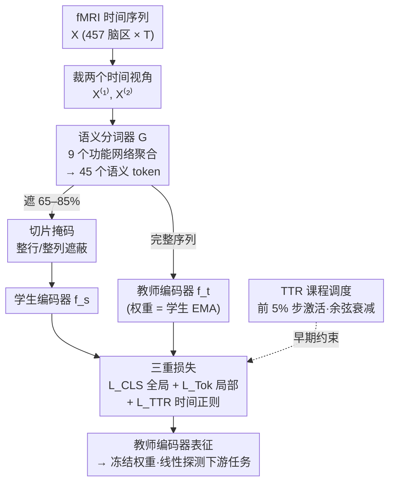

# Brain-Semantoks: Learning Semantic Tokens of Brain Dynamics with a Self-Distilled Foundation Model

**会议**: ICLR2026  
**arXiv**: [2512.11582](https://arxiv.org/abs/2512.11582)  
**代码**: [https://github.com/SamGijsen/Brain-Semantoks](https://github.com/SamGijsen/Brain-Semantoks)  
**领域**: 时间序列  
**关键词**: fMRI基础模型, 自蒸馏, 语义分词器, 脑动态表征学习, 线性探测

## 一句话总结
提出 Brain-Semantoks，一种基于语义分词器和自蒸馏目标的 fMRI 基础模型，将大脑功能网络聚合为鲁棒的语义 token，并通过跨时间视角的一致性学习抽象的脑动态表征，在线性探测设置下即可达到 SOTA 性能。

## 研究背景与动机

**领域现状**：fMRI 基础模型近年快速发展，BrainLM、Brain-JEPA、NeuroSTORM 等先驱工作均采用掩码-重建（mask-and-reconstruct）目标。这些方法专注于低层信号预测——BrainLM 直接在输入空间重建 BOLD 信号，Brain-JEPA 在潜空间做预测以避免噪声建模，NeuroSTORM 在 4D 体素上做时空重建。

**核心矛盾**：重建目标与下游任务目标之间存在根本性不匹配。下游任务（如疾病诊断、认知评估）需要的是稳定的、高层次的表型签名（phenotypic signature），而重建目标学到的表征对噪声和时间波动敏感，必须依赖大量微调才能适配。这种对微调的依赖削弱了基础模型的实用价值，尤其在 fMRI 领域——不同数据集在被试群体、硬件和采集协议上差异巨大。

**关键假设**：有效预测稳定表型需要从"重建"转向"抽象"——目标不是精确编码 BOLD 信号，而是从中提取底层的表型特征。

**切入角度**：(1) 单个 ROI 的时间序列噪声大、语义不明确，不适合作为 Transformer 的输入 token；(2) 大脑的功能组织（如默认模式网络等）提供了强有力的神经科学先验，可用于构建语义 token。

**核心 idea**：用功能网络级别的语义分词器将 noisy 的区域信号聚合为鲁棒 token，再通过自蒸馏目标学习跨时间稳定的抽象表征。

## 方法详解

### 整体框架
Brain-Semantoks 是一个学生-教师自蒸馏架构：输入 fMRI 时间序列 $X \in \mathbb{R}^{C \times T}$（C=457 个脑区）被裁出两个长片段作为不同的时间视角，先由语义分词器把噪声很大的 ROI 信号聚合成功能网络级 token，再送入 Transformer 编码器。学生网络看的是被切片掩码遮掉一部分的 token 序列，教师网络看完整序列且权重是学生的指数移动平均（EMA）。整个训练不重建任何 BOLD 信号，而是用全局、局部、时间正则三重跨视角损失逼着两个视角的表征互相对齐，从而学到对时间波动不敏感的抽象脑动态特征；其中时间正则那一项只在训练早期由 TTR 课程激活，用来稳住自蒸馏。

### 关键设计

**1. 语义分词器：把噪声 ROI 信号聚合成语义 token**

单个 ROI 的时间序列信噪比低、语义不明确，直接当 Transformer 的输入 token 既冗长又难学。作者借用大脑功能组织这一神经科学先验，按 Yeo 7-网络皮层分区加上皮下与小脑，共划出 9 个功能网络，每个网络配一个独立的分词模块 $g_n$ 处理其内部所有 ROI 的时序。时间维被切成 P 个较长片段，每片段经标准卷积加结构化卷积的双分支提取多尺度时间模式，最终输出 token 张量 $Z \in \mathbb{R}^{N \times P \times D}$（9 网络 × P 片段 × 768 维）。这样序列长度从 457 个 ROI 压到 $N \times P=45$，相当于 NLP 里把字符聚成词——既大幅缩短序列，又把分散的噪声信号汇成语义丰富、更稳定的网络级 token。

**2. 切片掩码：逼模型学网络间与跨时间的复杂关系**

token 被排成 $N \times P$ 的二维矩阵，每步随机选一种掩码方式：网络切片（掩掉整行，即某个功能网络的所有片段）或时间切片（掩掉连续若干列）。掩码比例取得很高，$\mathcal{U}[0.65, 0.85]$，且按整行整列成块地掩。这种结构化高比例掩码堵死了模型靠相邻片段简单插值就能填空的捷径，迫使它真正去建模网络之间、时间片之间的高层依赖关系，而不是记住局部连续性。

**3. 三重损失：在全局稳定与局部时间敏感之间分工**

训练目标由三项跨视角蒸馏组成。全局损失 $\mathcal{L}_{CLS}$ 让学生与教师的 [CLS] token 在两个时间视角间做双向蒸馏，学习稳定的整体表型签名，并用 coding rate 正则项撑开表征空间防止坍塌。token 级损失 $\mathcal{L}_{Tok}$ 在单个视角内让学生重建被掩掉的网络 token 去匹配教师输出，负责捕捉时间敏感的局部特征。第三项 $\mathcal{L}_{TTR}$（教师引导时间正则化）把每个网络的 P 个 patch 嵌入平均成单个 summary token 再跨视角蒸馏，引导模型先抓住时间平均后的网络签名。消融显示去掉 $\mathcal{L}_{CLS}$ 时平均分从 52.39 跌到 47.32，证明全局这一支对稳定表征最为关键。

**4. TTR 课程调度：早期约束 token 空间以稳住自蒸馏**

直接在低信噪比 fMRI 上跑自蒸馏极易训练不稳、表征坍塌。TTR 之所以只在训练前 5% 的步骤激活、随后余弦衰减到零，是因为它在早期把可对齐的 token 空间从 $N \times P + 1$ 压到 $N + 1$，给模型一个低维、好找的初始解去落脚；等表征稳住后再放开，让模型自己去建模更精细的时间变化，避免长期施加这一约束反而限死最终的解。消融印证了这种时序的重要性：完全不用 TTR 因训练不稳掉到 50.88，而全程开启 TTR（100%）因过度约束反而更差，只有 49.60。

### 损失函数 / 训练策略
时间裁剪长度 $T_{crop}=100$，patch 长度 20，9 个功能网络每网络 5 个 patch。Transformer 宽度 $D_f=768$、8 层，投影头 2 个隐层 $D_h=1024$、输出维 $D_{proj}=128$。预训练在 UKBioBank 的 39139 条静息态 fMRI 上进行，单卡（<20GB 显存）不到 2 小时即可完成。归一化上用 Z-scoring 替代 robust scaling，以抹平不同数据集间的 DC offset，改善跨数据集迁移。

## 实验关键数据

### 线性探测（冻结权重 + 单层线性层）

| 数据集/任务 | BrainLM | Brain-JEPA | **Brain-Semantoks** |
|------------|---------|------------|---------------------|
| ABIDE (ASD) | 53.84 | 52.92 | **65.13** |
| HBN CELF | 42.03 | 41.50 | **42.18** |
| HBN WISC | 38.26 | 38.34 | **40.87** |
| UKB Sex | 86.71 | 83.23 | **87.52** |
| UKB Age | 30.16 | 30.60 | **31.15** |
| SRPBS SZ | 57.61 | 57.63 | **69.26** |
| SRPBS MDD | 55.72 | 52.72 | **62.60** |

- 在 9 个任务中 8 个取得最高分，临床诊断任务上优势尤为明显（ASD +12, SZ +12, MDD +7）

### 与监督方法的对比
- 仅用线性探测即超越所有完全监督端到端训练的基线（FC、BNT、BolT、BrainMass）和微调后的 BrainLM/Brain-JEPA
- 12 个任务上平均 52.72% vs 监督最优 50.68%，证明学到的表征无需微调即可广泛使用

### 任务态 fMRI 泛化（Hariri 情绪任务）
- Brain-Semantoks 线性探测 93.84-96.50%，大幅超越 Brain-JEPA 的 81.06-82.29%
- 利用掩码蒸馏框架加上 patch 构造策略解决预训练-推理时间尺度不匹配问题

### Scaling Laws
- 首次为 fMRI 基础模型提供详细的 scaling 分析
- 线性探测性能随预训练数据量的对数呈幂律增长
- OOD 任务上也观察到一致的 scaling 收益，且无性能平台
- 即使 HBN 数据集与 UKB 有 >20 年的年龄差距，仍有持续的性能提升

### 消融实验关键发现

| 配置 | 平均分 | 说明 |
|------|--------|------|
| 完整 Brain-Semantoks | 52.39 | 语义分词器 + TTR + CLS + Tok |
| 去掉 TTR（0%） | 50.88 | 训练不稳定，性能下降 1.5 |
| TTR 全程激活（100%） | 49.60 | 过度约束，反而更差 |
| 去掉 CLS 损失 | 47.32 | 全局表征损失至关重要 |
| 线性投影替代语义分词器 | 差距大 | 导致部分坍塌，cosine 相似度迅速升到 0.95 |
| 随机掩码替代切片掩码 | 51.03 | 切片掩码减少插值学习 |

## 亮点与洞察

- **从重建到抽象的范式转变**：不同于此前所有 fMRI 基础模型的重建目标，Brain-Semantoks 明确以学习抽象表征为目标，这一范式转变带来了线性探测性能的巨大提升
- **语义分词器的巧妙设计**：将神经科学先验（功能网络）融入模型架构，既压缩了序列长度（457→45），又将噪声区域信号聚合为语义 token，类似于 NLP 中将字符聚合为词
- **TTR 课程学习**：解决了低信噪比数据+自蒸馏目标组合的训练不稳定问题。只在前 5% 步骤中激活的设计精准平衡了稳定性和灵活性
- **Z-scoring > Robust Scaling**：看似简单的归一化策略变化解决了跨数据集迁移时 DC offset 不一致的问题，是工程层面的重要贡献
- **首个 fMRI scaling law 分析**：证明了 OOD 性能随预训练数据量可靠提升，增强了社区对 fMRI 基础模型的信心

## 局限与展望

- 功能网络划分依赖固定的 Yeo 7-网络分区，未来可探索从数据中学习 ROI 分组
- 预训练仅使用静息态 fMRI（UKB），任务态数据的整合可能进一步提升表征质量
- 下游评估中连续目标被离散化为多类标签，可能无法充分反映表征在回归任务上的能力
- Scaling 分析虽然显示无平台，但受限于 UKB 数据量（~39K），更大规模的预训练效果未知
- 单 GPU 训练效率很高（<2h），但 Transformer 8 层的容量是否限制了更复杂模式的学习尚未探讨

## 相关工作与启发

- **vs BrainLM/Brain-JEPA**：两者采用 ROI 级掩码重建目标，Brain-Semantoks 在网络级做语义蒸馏，线性探测性能全面超越（尤其在 OOD 临床任务上差距超过 10%）
- **vs BrainMass**：BrainMass 使用静态功能连接矩阵，忽略了时间动态；Brain-Semantoks 显式建模时间信息
- **vs DINO/iBOT/SimDINO**：Brain-Semantoks 将视觉自蒸馏范式成功迁移到 fMRI，同时引入了领域特定的语义分词器和 TTR 稳定课程
- **启发**：功能网络作为语义分词器的思路可推广到其他脑成像模态（EEG、MEG）；TTR 的"先学平均再学细节"策略可能对其他低 SNR 数据的自蒸馏有用

## 评分
- 新颖性: ⭐⭐⭐⭐⭐ 范式转变（重建→抽象），语义分词器和TTR都是原创设计
- 实验充分度: ⭐⭐⭐⭐⭐ 11个下游任务×6个数据集，线性探测+微调+消融+scaling+可解释性，极为全面
- 写作质量: ⭐⭐⭐⭐ 动机清晰，逻辑递进，消融系统化
- 价值: ⭐⭐⭐⭐⭐ 为fMRI基础模型建立了新范式，线性探测即超监督方法，实用价值高

<!-- RELATED:START -->

## 相关论文

- [\[NeurIPS 2025\] Brain Harmony: A Multimodal Foundation Model Unifying Morphology and Function into 1D Tokens](../../NeurIPS2025/medical_imaging/brain_harmony_a_multimodal_foundation_model_unifying_morphology_and_function_int.md)
- [\[ICLR 2026\] SEED: Towards More Accurate Semantic Evaluation for Visual Brain Decoding](seed_towards_more_accurate_semantic_evaluation_for_visual_brain_decoding.md)
- [\[ICLR 2026\] Biologically Plausible Online Hebbian Meta-Learning: Two-Timescale Local Rules for Spiking Neural Brain Interfaces](biologically_plausible_online_hebbian_meta-learning_two-timescale_local_rules_fo.md)
- [\[ICLR 2026\] Brain-IT: Image Reconstruction from fMRI via Brain-Interaction Transformer](brain-it_image_reconstruction_from_fmri_via_brain-interaction_transformer.md)
- [\[NeurIPS 2025\] BrainOmni: A Brain Foundation Model for Unified EEG and MEG Signals](../../NeurIPS2025/medical_imaging/brainomni_a_brain_foundation_model_for_unified_eeg_and_meg_signals.md)

<!-- RELATED:END -->
