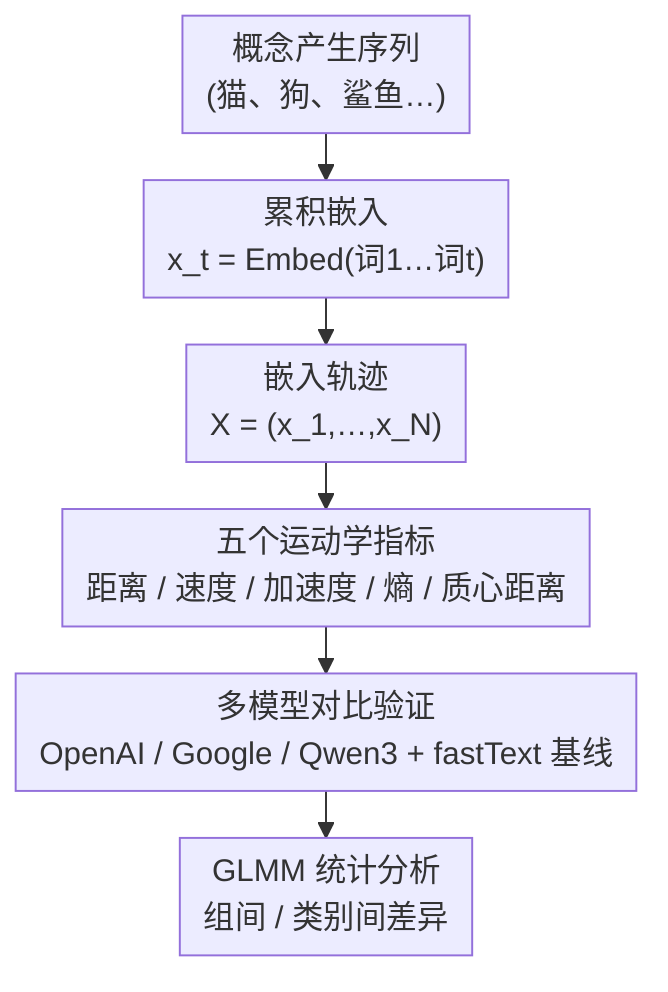

# Characterizing Human Semantic Navigation in Concept Production as Trajectories in Embedding Space

**会议**: ICLR2026  
**arXiv**: [2602.05971](https://arxiv.org/abs/2602.05971)  
**代码**: [https://github.com/jesuinovieira/semtraj-iclr2026](https://github.com/jesuinovieira/semtraj-iclr2026)  
**领域**: 医学图像  
**关键词**: semantic navigation, embedding trajectory, cognitive modeling, verbal fluency, neurodegenerative disease

## 一句话总结
提出将人类概念产生过程建模为 Transformer 嵌入空间中的累积轨迹，定义 5 个运动学指标（距离、速度、加速度、熵、质心距离），在 4 个数据集（3 种语言、神经退行性疾病/脏话流畅性/属性列举）上成功区分临床组和概念类别，且不同嵌入模型产生高度一致的结果。

## 研究背景与动机

**领域现状**：人类语义检索被认知科学建模为在语义空间中的"觅食"过程——在利用（聚类）和探索（切换）之间平衡。传统方法用 clustering/switching 二分法分析语言流畅性任务数据。

**现有痛点**：(a) clustering/switching 分析依赖费时的人工标注和异构处理流程，跨研究不可比；(b) 静态词嵌入（如 fastText）忽略了语义检索的累积性——每个词的语义受前序词影响；(c) 传统分析只给粗粒度分类（聚类 vs 切换），缺乏逐步动态的量化。

**核心矛盾**：语义检索是依赖历史的动态过程（需要工作记忆抑制已说过的词），但现有 NLP 分析方法将每个词独立嵌入，丢失了序列依赖性。

**本文目标** 建立一个基于累积嵌入的轨迹分析框架，用物理运动学指标量化人类语义导航的逐步动态。

**切入角度**：将概念产生序列视为嵌入空间中的轨迹——每一步的嵌入是所有已说词的累积编码。从物理学借鉴距离、速度、加速度等概念表征轨迹特性。

**核心 idea**：用 Transformer 累积嵌入将语义检索建模为高维空间中的运动轨迹，用运动学指标实现自动化、跨语言的语义导航分析。

## 方法详解

### 整体框架
这篇论文想解决的是：怎么把人类在语言流畅性任务里"逐个吐词"的语义检索过程，变成一条可量化、可跨语言比较的轨迹，从而自动区分临床组和概念类别。整条流程是这样转的：拿到某个参与者的概念产生序列（如"猫、狗、鲨鱼…"）后，用 Transformer 文本嵌入模型做**累积编码**——第 $t$ 步的嵌入 $x_t$ 编码的是"第 1 到第 $t$ 个词的拼接"而非单个词，于是嵌入序列 $X=(x_1,\ldots,x_N)$ 天然带着历史、构成语义空间里的一条轨迹。在这条轨迹上算**五个运动学指标**（距离、速度、加速度、熵、质心距离），把"聚类 vs 切换"的粗标签升级成连续动态特征；同一套指标还在**多个嵌入模型上并行计算并比对一致性**，以确认捕捉到的是认知结构而非某模型的几何伪影；最后用 GLMM 统计模型分析这些指标在组间/类别间的差异。

### 关键设计

**1. 累积嵌入（Cumulative Embeddings）：把序列依赖编码进每一步的嵌入里**

静态词嵌入（fastText 那一类）把每个词独立编码，丢掉了语义检索的累积性——而认知科学早就发现，已经说出口的词会通过工作记忆和抑制控制影响后续检索。累积嵌入直接顺着这个机制来：第 $t$ 步的嵌入 $x_t$ 不是第 $t$ 个词的独立向量，而是"词1 词2 … 词t"整段拼接后的整体嵌入。比如参与者说完"猫 狗"，$x_2$ 编码的是"猫 狗"这个短语而非单独的"狗"。这样每一步的嵌入都天然带着前缀历史，序列依赖性被装进了向量本身，无需额外建模就还原了"检索依赖历史"这一认知事实。

**2. 五个运动学指标：把语义检索的逐步动态量化成可读的物理量**

有了累积嵌入序列 $X=(x_1,\ldots,x_N)$ 作为语义空间里的轨迹，论文从物理运动学借了五个量来刻画它，从局部跳跃一直覆盖到全局分散：

- **Distance to Next**：相邻嵌入间的余弦距离，量化每一步"语义跳跃"有多大。
- **Velocity** $\mathbf{v}_t = \mathbf{x}_{t+1} - \mathbf{x}_t$：保留方向的向量差，不只知道跳多远，还知道往哪个方向跳。
- **Acceleration** $\mathbf{a}_t = \mathbf{v}_{t+1} - \mathbf{v}_t$：速度的变化，反映搜索策略稳不稳定——低加速度对应稳定聚类，高加速度对应频繁切换。
- **Entropy**：先把距离序列按中位数二值化（高于中位数记 1、低于记 0），再算 Shannon 熵，衡量搜索过程的可预测性。
- **Distance to Centroid**：每个嵌入到该参与者所有嵌入质心的距离，衡量搜索的全局分散度。

前三个抓的是局部逐步动态（跳多远、往哪跳、稳不稳），后两个分别从可预测性和全局铺展两个角度补全，五个指标合起来就把传统"聚类 vs 切换"的二分粗标签升级成了连续可量化的轨迹特征。

**3. 多模型对比验证：确认轨迹特征是认知现象而非某个模型的伪影**

单靠一个嵌入模型算出来的轨迹，无法排除结论只是该模型几何偏置的副产品。论文因此并行跑 OpenAI text-embedding-3-large、Google text-embedding-004、Qwen3-Embedding-0.6B 三个 Transformer 模型，再加 fastText 作静态基线，比较同一批轨迹指标在不同模型间的相关性。逻辑很直接：如果训练管线各异（因果 vs 双向 attention）的模型在轨迹指标上仍高度一致，那捕捉到的就是真实的认知结构而非模型特定的伪影；反之某个指标在模型间不一致，也正好暴露它依赖模型几何（后文质心距离即如此）。

### 统计分析
使用广义线性混合模型（GLMM），参与者和概念作为随机效应，Tukey HSD 校正多重比较。对数正态分布拟合距离/熵/速度/加速度，高斯分布拟合质心距离。

## 实验关键数据

### 主实验（4 个数据集的组间/类别间差异）

| 数据集 | 比较 | Distance to Next | Velocity | Entropy | Distance to Centroid |
|--------|------|-----------------|----------|---------|---------------------|
| **神经退行性疾病** | HC vs PD/bvFTD | HC **低** | HC **低** | HC **低** | HC **高** |
| **脏话流畅性** | 动物 vs 脏话 | 脏话 **最高** | 脏话 **最高** | 脏话 **最高** | 脏话 **最低** |
| **意大利语** | Bird vs 其他类别 | Bird **最高** | Bird **最高** | 类别差异选择性 | 部分类别更高/更低 |
| **德语** | Bird vs 其他类别 | Bird **最高** | Bird **最高** | 类别差异选择性 | 不同于意大利语 |

### 消融实验（跨模型一致性 - Pearson 相关）

| 指标 | OpenAI vs Google | OpenAI vs Qwen3 | 说明 |
|------|-----------------|-----------------|------|
| Velocity | >0.9 | >0.9 | 局部动态高度一致 |
| Acceleration | >0.9 | >0.9 | 局部动态高度一致 |
| Entropy | ~1.0 | ~1.0 | 基于排序，最稳定 |
| Distance to Centroid | 0.3-0.6 | 0.3-0.6 | 最不一致，依赖模型几何 |

### 关键发现
- **神经退行性疾病的运动学签名**：PD 和 bvFTD 患者展现更高的速度、加速度和熵（搜索紊乱、不可预测）但更低的质心距离（搜索空间受限）——这与执行功能障碍导致的"在更小空间中更混乱地搜索"一致
- **脏话的独特语义拓扑**：脏话在嵌入空间中形成紧凑但高变异性的簇——质心距离最小（空间紧凑）但距离/速度/加速度/熵最高（检索路径最不规则）
- **跨语言差异揭示文化编码**：意大利语和德语使用相同协议但类别效应不同——说明语义组织受语言/文化影响，这些差异可被轨迹指标捕捉
- **嵌入模型间一致性高**：不同训练管线（因果/双向attention）的模型在局部轨迹动态上高度一致（$r > 0.9$），但全局几何（质心距离）不同——说明局部语义结构在模型间是共享的

## 亮点与洞察
- **物理学启发的认知指标**：将物理运动学（速度、加速度）直接映射到语义导航——概念上优雅，让认知科学家可以用直觉理解的物理比喻来描述语义搜索
- **累积 vs 非累积嵌入的互补性**：累积嵌入在长序列上更好（捕捉历史依赖），短序列上非累积可能更好（上下文不足）——这提供了实用选择指南
- **质心距离的模型差异性**：质心距离在模型间一致性最低——这反而可以被利用来探究不同模型如何组织全局语义结构，成为比较 LLM 语义空间的工具
- **可扩展到 LLM 评估**：框架可以直接应用于分析 LLM 生成文本的语义导航模式，提供人类 vs AI 语义搜索的量化比较

## 局限与展望
- **假设欧氏动态**：在高维各向异性嵌入空间中使用欧氏距离/导数是简化。非欧几何（如双曲空间）可能更适合
- **无时间戳**：数据集中没有每个词的产生时间，所有步假设等时间间隔。有时间戳的数据可以计算真正的速度/加速度
- **仅流畅性/属性列举任务**：覆盖场景有限。自由叙述、对话等更复杂的语言产生任务需要验证
- **训练数据可能包含测试场景**：Transformer 模型的训练数据可能包含类似的语义关联知识，这可能人为增强了累积嵌入的区分力

## 相关工作与启发
- **vs 传统 clustering/switching 分析**：传统方法需要人工标注子类别边界。本框架完全自动化，且提供连续的逐步动态而非二分分类
- **vs Linz et al. (2017) 的词嵌入分析**：他们用静态 word2vec 分析语言流畅性。本文升级为累积 Transformer 嵌入+运动学指标，信息量大幅增加
- **vs Nour et al. 的精神分裂症语言分析**：他们也用嵌入轨迹分析精神疾病。本文系统化了指标体系并验证了跨模型/跨语言鲁棒性

## 评分
- 新颖性: ⭐⭐⭐⭐ 累积嵌入+运动学指标的框架设计新颖，物理-认知的类比优雅
- 实验充分度: ⭐⭐⭐⭐ 4 数据集×3 语言×3 嵌入模型+1 基线，统计严谨（GLMM+Tukey），但缺少预测性任务验证
- 写作质量: ⭐⭐⭐⭐ 认知科学和 NLP 的桥梁叙事清晰，但部分结果呈现较冗长
- 价值: ⭐⭐⭐⭐ 为认知科学提供了自动化分析工具，对临床诊断有潜在价值

<!-- RELATED:START -->

## 相关论文

- [\[CVPR 2026\] Diffusion MRI Transformer with a Diffusion Space Rotary Positional Embedding (D-RoPE)](../../CVPR2026/medical_imaging/diffusion_mri_transformer_with_a_diffusion_space_rotary_positional_embedding_d-r.md)
- [\[ICLR 2026\] SEED: Towards More Accurate Semantic Evaluation for Visual Brain Decoding](seed_towards_more_accurate_semantic_evaluation_for_visual_brain_decoding.md)
- [\[ICLR 2026\] Brain-Semantoks: Learning Semantic Tokens of Brain Dynamics with a Self-Distilled Foundation Model](brain-semantoks_learning_semantic_tokens_of_brain_dynamics_with_a_self-distilled.md)
- [\[AAAI 2026\] Human-in-the-Loop Interactive Report Generation for Chronic Disease Adherence](../../AAAI2026/medical_imaging/human-in-the-loop_interactive_report_generation_for_chronic_disease_adherence.md)
- [\[CVPR 2025\] SapiensID: Foundation for Human Recognition](../../CVPR2025/medical_imaging/sapiensid_foundation_for_human_recognition.md)

<!-- RELATED:END -->
