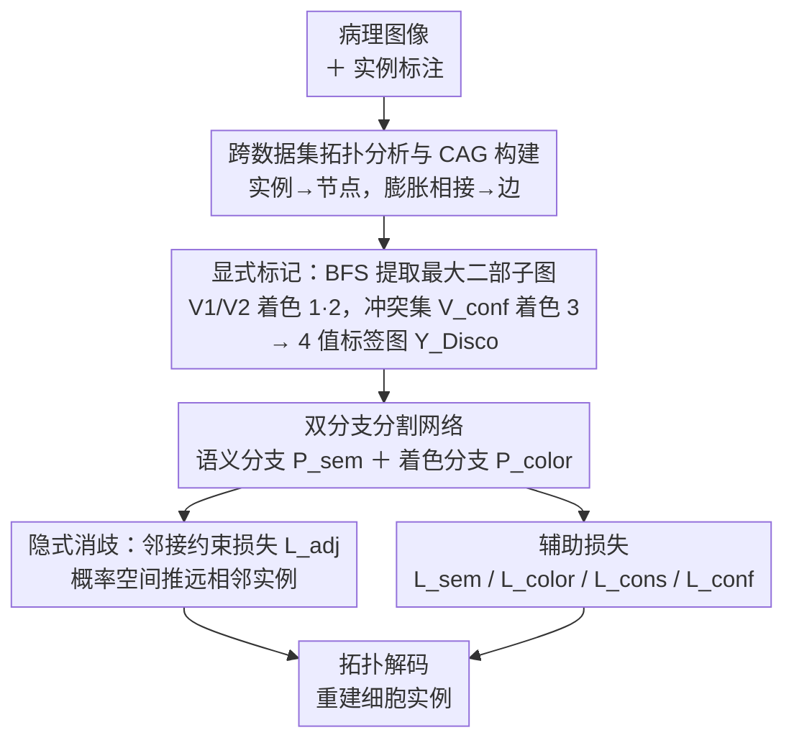

# DISCO: Densely-overlapping Cell Instance Segmentation via Adjacency-aware Collaborative Coloring

**会议**: ICLR 2026  
**arXiv**: [2602.05420](https://arxiv.org/abs/2602.05420)  
**代码**: [https://github.com/SR0920/Disco](https://github.com/SR0920/Disco)  
**领域**: 医学图像 / 分割  
**关键词**: 细胞实例分割, 图着色, 密集重叠, 邻接约束, 病理图像

## 一句话总结

将密集重叠细胞实例分割建模为图着色问题，提出"显式标记冲突节点 + 隐式邻接约束消歧"的分治框架 Disco，通过 BFS 分解细胞邻接图并引入五种协同损失函数，在高密度病理数据集 GBC-FS 2025 上 PQ 提升 7.08%，同时在四个异质数据集上均取得 SOTA。

## 研究背景与动机

**领域现状**：细胞实例分割是数字病理分析的核心任务，对细胞计数、形态分析乃至癌症分级都至关重要。当前主流方法可分为四类：基于检测的（Mask R-CNN）依赖边界框和 NMS、基于轮廓的（DCAN）对二值化阈值敏感、基于距离/方向图的（HoverNet、StarDist）需要复杂后处理、以及基于图着色的（FCIS）从拓扑角度建模。前三类方法的共同弱点是只利用局部像素级或几何信息来推断实例归属，在密集细胞簇中容易产生系统性错误。

**现有痛点**：图着色方法为密集分割提供了具有全局意识的新范式，但其核心假设存在严重缺陷。最简洁的 2-着色模型假设细胞邻接图是二部图（不含奇数环），而本文通过跨四个数据集的首次系统分析发现：真实细胞邻接图大多是非二部的。在 CryoNuSeg 中 56.67% 的图像包含非二部图，在高密度的 GBC-FS 2025 中高达 30.49% 的节点是冲突节点。另一方面，FCIS 采用的 4-着色虽然完备但引入了不必要的表征冗余和优化困难——大部分区域其实只需要 2 种颜色。

**核心矛盾**：这是一个"金发姑娘难题"：2-着色太简单无法处理奇数环拓扑冲突，4-着色太复杂对简单区域造成学习负担。需要一个既能高效处理主体二部结构、又能精准应对稀疏冲突区域的方案。

**本文目标** (1) 如何系统刻画真实细胞邻接图的拓扑性质？(2) 如何设计一个自适应的着色框架，在简单拓扑退化为高效 2-着色、在复杂拓扑动态处理冲突？(3) 如何在标签系统无法完美编码次级冲突的情况下，让网络在连续特征空间中隐式学习区分？

**切入角度**：作者首先做了扎实的拓扑分析——构建四个数据集的细胞邻接图（CAG），统计节点度分布、奇数环分布和冲突节点比例。关键发现是：(1) 所有非二部图中 90%+ 的奇数环是 3-环（三角形）；(2) 冲突节点往往不是孤立的，而是形成密集的"冲突簇"，存在大量"次级冲突"（冲突节点彼此相邻）。这个分析直接指导了框架设计：先用 BFS 高效提取最大二部子图解决主体，再用专门机制处理冲突残余。

**核心 idea**：将图着色问题分治——BFS 分离二部子图做 2-着色，剩余冲突节点标为第 3 色，再用邻接约束损失在连续概率空间中隐式消歧，实现"显式标记 + 隐式消歧"的协同框架。

## 方法详解

### 整体框架

输入一张病理图像及其实例标注，Disco 的整体流程分为三个阶段：(1) **拓扑分析与标签生成**：从实例 mask 构建细胞邻接图（CAG），用形态学膨胀（3×3 核）定义 8-连通邻接关系，然后通过 BFS 提取最大二部子图，将节点划分为两个独立集 $V_1, V_2$（着色 1、2）和冲突集 $V_{conf}$（着色 3），加上背景共生成 4 类标注图 $Y_{Disco} \in \{0,1,2,3\}^{H \times W}$；(2) **双分支分割网络**：一个语义分支预测前景/背景的语义图 $P_{sem}$，一个着色分支预测 4 类着色图 $P_{color}$；(3) **解耦约束损失系统**：5 种损失协同优化——语义损失 $\mathcal{L}_{sem}$、着色损失 $\mathcal{L}_{color}$、一致性损失 $\mathcal{L}_{cons}$、冲突损失 $\mathcal{L}_{conf}$、以及最关键的邻接约束损失 $\mathcal{L}_{adj}$。推理时通过着色图进行拓扑解码重建实例。

### 关键设计

**1. 跨数据集拓扑分析与 CAG 构建：先用数据证明 2-着色假设在真实病理图上站不住脚**

整篇方法的前提，是先回答"图着色范式到底配不配真实细胞图"。作者把实例 mask 转成细胞邻接图 $G=(V,E)$，让节点 $v_i$ 与实例 $s_i$ 一一对应，边按膨胀后是否相接来定义：$E = \{(v_i, v_j) \mid \mathcal{N}(s_i) \cap s_j \neq \emptyset\}$，其中 $\mathcal{N}(s_i)$ 是实例 $s_i$ 经 3×3 膨胀后的像素集。统计四个数据集后，结论很硬：PanNuke 100% 是二部图（冲突率 0%），DSB2018 冲突率 1.99%，CryoNuSeg 5.64%，到高密度的 GBC-FS 2025 已飙到 30.49%。更关键的两个结构性发现是——所有非二部数据集里 3-环（三角形）占奇数环的 90% 以上，且 GBC-FS 中有 24.64% 的节点存在"次级冲突"（冲突节点彼此相邻）。这组数字直接定了框架的基调：冲突真实存在但高度局部化、几乎都是三角形，所以没必要把整张图升级到高色数模型，而是该"分治"——主体二部结构用最省的方式解决，冲突残余单独处理。

**2. 显式标记（Explicit Marking）：把 NP-hard 的最优着色降级成一个可学习的分类任务**

最优图着色本身是 NP-hard，硬解不现实。Disco 的做法是对 CAG 跑一遍 BFS 提取最大二部子图，把节点切成 $V_1$（颜色 1）、$V_2$（颜色 2）和冲突集 $V_{conf}$（颜色 3）。理论上还能对残余图 $G_{rem}$ 继续递归分解下去，但作者基于"充分表征原则"做了一个关键的工程取舍：到此为止，把所有冲突节点统一标成第 3 色。理由是冲突节点数量少却拓扑复杂，再往下递归着色收益递减、计算开销却越来越大。最终落地成一张 4 值标注图 $Y_{Disco} \in \{0,1,2,3\}^{H \times W}$。这样一来，BFS 以极低的计算代价就覆盖了绝大多数节点的正确着色，把任务干净地拆成"已经解决的二部子图"和"待处理的冲突集"两部分，也给后面的隐式消歧留下了清晰的学习目标。

**3. 隐式消歧（Implicit Disambiguation）：用邻接约束损失在概率空间里把标签相同的冲突节点推开**

显式标记留了个尾巴——所有冲突节点共享"颜色 3"这一个标签，离散标签系统根本没法区分两个彼此相邻的冲突节点（即次级冲突）。邻接约束损失 $\mathcal{L}_{adj}$ 就是来补这个洞的。它先算出每个实例 $s_i$ 的平均颜色概率向量 $\bar{P}(s_i)$，再对邻接图里所有边 $(v_i, v_j) \in E$ 最小化两端的余弦相似度：

$$\mathcal{L}_{adj} = \frac{1}{|E|} \sum_{(v_i,v_j) \in E} \frac{\bar{P}(s_i) \cdot \bar{P}(s_j)}{\|\bar{P}(s_i)\| \|\bar{P}(s_j)\|}$$

可以把它看成一种监督对比损失：同一实例内部的像素是正样本（由 $\mathcal{L}_{color}$ 聚合到一起），相邻实例则是显式的负样本（由 $\mathcal{L}_{adj}$ 推远）。它的妙处在于既不破坏主体、又能救场冲突——在二部区域它强化已有的正交 2-色编码，在次级冲突区域则逼着网络在次要特征维度上学出可分离的表示。因为约束直接做在概率空间而非特征空间，反向梯度能让标签相同、拓扑不同的冲突节点被推向不同的概率分布。消融实验也印证了它的分量：单独加 $\mathcal{L}_{adj}$ 就贡献了 PQ +5.69%，是五种损失里贡献最大的一项。

### 损失函数 / 训练策略

总损失由五个分量线性叠加：$\mathcal{L}_{total} = \mathcal{L}_{sem} + \mathcal{L}_{color} + \mathcal{L}_{cons} + \mathcal{L}_{conf} + \mathcal{L}_{adj}$

- $\mathcal{L}_{sem}$：前景/背景二分类的语义分割损失
- $\mathcal{L}_{color}$：4 类着色的加权交叉熵损失，对冲突类做类别平衡
- $\mathcal{L}_{cons}$（一致性损失）：抑制二部区域像素错误预测为冲突色，$\mathcal{L}_{cons} = \mathbb{E}_{i \in M_{bip}}[(\sigma(P_{color}(i))_t)^2]$——让二部节点的冲突色概率趋近 0
- $\mathcal{L}_{conf}$（冲突损失）：鼓励冲突区域准确预测冲突色，$\mathcal{L}_{conf} = \mathbb{E}_{i \in M_{conf}}[(1 - \sigma(P_{color}(i))_t)^2]$——让冲突节点的冲突色概率趋近 1
- $\mathcal{L}_{adj}$（邻接约束损失）：在概率空间推远相邻实例的特征表示（见上文）

$\mathcal{L}_{cons}$ 和 $\mathcal{L}_{conf}$ 构成"推-拉"机制：前者在简单区域"推"走冲突色预测，后者在冲突区域"拉"来冲突色预测。训练使用 Adam 优化器，初始学习率 $1 \times 10^{-4}$，权重衰减 $5 \times 10^{-4}$，第 70 epoch 学习率衰减 10 倍，前 100 迭代线性 warmup，总训练 200 epochs，8 × RTX 4090。

## 实验关键数据

### 主实验

四个数据集上与 8 种主流方法的全面对比（仅列 AJI 和 PQ 两个关键指标）：

| 数据集 | 方法 | AJI (↑) | PQ (↑) | 备注 |
|--------|------|---------|--------|------|
| PanNuke | CellPose | 0.6262 | 0.5918 | 距离/方向图 |
| PanNuke | FCIS | 0.6394 | 0.6109 | 4-着色 |
| PanNuke | **Disco** | **0.6566** | **0.6271** | PQ +1.62% |
| DSB2018 | CellPose | 0.8247 | 0.7647 | 距离/方向图 |
| DSB2018 | FCIS | 0.8287 | 0.7739 | 4-着色 |
| DSB2018 | **Disco** | **0.8426** | **0.7781** | PQ +0.42% |
| CryoNuSeg | CellPose | 0.5876 | 0.5724 | 距离/方向图 |
| CryoNuSeg | FCIS | 0.5944 | 0.5793 | 4-着色 |
| CryoNuSeg | **Disco** | **0.6134** | **0.5970** | PQ +1.77% |
| GBC-FS 2025 | CellPose | 0.4376 | 0.4218 | 距离/方向图 |
| GBC-FS 2025 | FCIS | 0.4518 | 0.4379 | 4-着色 |
| GBC-FS 2025 | **Disco** | **0.5209** | **0.5087** | **PQ +7.08%** |

### 消融实验

框架级别对比（GBC-FS 2025）：

| 方法 | 着色方案 | 邻接约束 | DICE | AJI | PQ |
|------|---------|---------|------|-----|-----|
| Baseline | 2-Color | 无 | 0.727 | 0.379 | 0.338 |
| FCIS | 4-Color | 特征正交约束 | 0.779 | 0.452 | 0.438 |
| **Disco** | **显式标记** | **概率空间 $\mathcal{L}_{adj}$** | **0.814** | **0.521** | **0.509** |

损失分量消融（GBC-FS 2025）：

| 配置 | $\mathcal{L}_{cons}$ | $\mathcal{L}_{conf}$ | $\mathcal{L}_{adj}$ | AJI | PQ |
|------|:---:|:---:|:---:|-----|-----|
| 仅显式标记 | ✗ | ✗ | ✗ | 0.449 | 0.426 |
| + 一致性 + 冲突 | ✓ | ✓ | ✗ | 0.471 | 0.458 |
| + 邻接约束 | ✗ | ✗ | ✓ | 0.506 | 0.483 |
| **Disco (Full)** | **✓** | **✓** | **✓** | **0.521** | **0.509** |

### 关键发现

- **冲突节点越多，Disco 优势越大**：GBC-FS 2025 冲突率 30.49%，Disco 比 FCIS 的 PQ 提升 7.08%（绝对）/ 16.2%（相对）；PanNuke 冲突率 0%，Disco 仅提升 1.62%，说明框架能自适应退化为高效 2-着色
- **$\mathcal{L}_{adj}$ 是核心引擎**：仅加入 $\mathcal{L}_{adj}$（不加 $\mathcal{L}_{cons}$ 和 $\mathcal{L}_{conf}$）就能让 PQ 从 0.426 飙升到 0.483（+5.69%），远超一致性+冲突损失的贡献（+3.26%）。五种损失协同时 PQ 达到 0.509
- **Disco vs 4-着色**：在同数据集上，Disco（动态 2+1 着色）全面超越 FCIS（固定 4-着色），说明分治策略优于暴力增加颜色数——更少的颜色意味着更清晰的学习目标，冲突处理交给损失函数而非标签系统
- **SQ 维度优势**：在 DSB2018 上，虽然 FCIS 在 DQ 上略优，但 Disco 在 SQ 上显著领先，说明 Disco 生成的细胞轮廓更精确

## 亮点与洞察

- **"先分析再设计"的范式**：论文没有直接提方法，而是先做了四个数据集的系统拓扑分析，定量揭示 2-着色的失效模式和冲突分布规律，再针对性设计框架。这种从数据结构出发的方法论非常扎实，避免了"拍脑袋"设计
- **分治哲学的优雅实现**：不追求理论完备的高色数模型（4-着色），而是利用"大部分图是二部的"这个经验发现，用最经济的方式（2-着色 + 冲突标记）覆盖主体，再用连续空间约束处理例外。这种"粗标签 + 细约束"的思路可迁移到其他标签噪声/歧义场景
- **邻接约束损失的巧妙设计**：在概率空间（而非特征空间）做余弦相似度约束。相比 FCIS 在特征空间做正交约束，概率空间更直接对应分类决策边界，且对比损失的"正样本=同实例、负样本=邻接实例"的定义来自图结构，天然利用了拓扑信息
- **冲突图作为可解释性工具**：预测的冲突图（Conflict Map）本身就可以量化组织拓扑复杂度，为数据驱动的病理学研究提供了新视角——不仅分割准确，还能告诉病理医生"这里的细胞排列特别复杂"

## 局限与展望

- **BFS 分解的非唯一性**：最大二部子图提取依赖 BFS 遍历顺序，不同随机起点可能得到不同的 $V_1, V_2, V_{conf}$ 划分，论文未讨论这种随机性对训练稳定性的影响。可以探索确定性的分解算法或多次 BFS 取一致子集
- **冲突集全部标为同一色是信息丢失**：当冲突集内部结构复杂时（如 $\chi(G_{rem}) > 2$），单一冲突色损失了潜在的着色信息。$\mathcal{L}_{adj}$ 虽然部分弥补，但对超大冲突簇可能力不从心。可考虑 $V_{conf}$ 的递归分解（至少一层）
- **数据集同质性**：四个数据集都是 H&E 或荧光染色的细胞核，其中 GBC-FS 2025 是自建单一 WSI 切片数据。方法在其他密集实例分割场景（如卫星遥感建筑物、拥挤行人、密集文本检测）的泛化性未验证
- **没有讨论推理效率**：推理时是否需要构建 CAG？如果需要，从预测 mask 构建图并解码的耗时是多少？在实时病理分析场景中可能成为瓶颈

## 相关工作与启发

- **vs FCIS (ICML 2025)**：首个将四色定理引入细胞分割的工作，使用固定 4-着色 + 特征正交约束。Disco 的核心改进有两点：(1) 动态着色替代固定着色——在简单区域用 2 色减少学习负担，只在冲突区域引入第 3 色；(2) 在概率空间做邻接约束替代特征空间正交约束，更直接对应分类决策。GBC-FS 2025 上 Disco PQ 高出 FCIS 7.08%
- **vs HoverNet / StarDist**：基于距离/方向图的经典方法，依赖局部像素级信息 + 复杂后处理。Disco 通过全局拓扑建模避免了后处理的误差传播，特别是在密集簇中优势明显
- **vs CellPose (Nature Methods 2025)**：基于梯度流的通用分割方法，性能强但在密集重叠场景仍受限于局部信息。Disco 在所有数据集上均超越
- **可迁移的思路**：这种"图结构驱动的分治 + 连续空间约束"的框架对任何存在"局部拓扑冲突"的密集实例分割任务都有启发，如 panoptic segmentation 中的 stuff-thing 边界处理、3D 点云实例分割中的密集对象分离

## 评分

- 新颖性: ⭐⭐⭐⭐ 将图着色理论与深度学习以分治策略结合，拓扑分析扎实且直接指导设计，但核心贡献主要在损失函数层面
- 实验充分度: ⭐⭐⭐⭐⭐ 四个异质数据集 + 8 种对比方法 + 框架级消融 + 损失分量消融 + 特征空间可视化，覆盖全面
- 写作质量: ⭐⭐⭐⭐ 叙事逻辑清晰，从分析到设计的推导自然连贯，但部分描述略显冗长
- 价值: ⭐⭐⭐⭐ 为图着色范式的实用化补上了关键缺失（处理非二部图），对密集病理分割有直接应用价值

<!-- RELATED:START -->

## 相关论文

- [\[ICML 2025\] The Four Color Theorem for Cell Instance Segmentation](../../ICML2025/medical_imaging/the_four_color_theorem_for_cell_instance_segmentation.md)
- [\[ICCV 2025\] COIN: Confidence Score-Guided Distillation for Annotation-Free Cell Segmentation](../../ICCV2025/medical_imaging/coin_confidence_score-guided_distillation_for_annotation-free_cell_segmentation.md)
- [\[AAAI 2026\] Graph-Theoretic Consistency for Robust and Topology-Aware Semi-Supervised Histopathology Segmentation](../../AAAI2026/medical_imaging/graph-theoretic_consistency_for_robust_and_topology-aware_semi-supervised_histop.md)
- [\[CVPR 2026\] IVAAN: Instance-level Vision-Language Alignment via Attribute-Guided Text Prompts Generation for Nuclei Analysis](../../CVPR2026/medical_imaging/ivaan_instance-level_vision-language_alignment_via_attribute-guided_text_prompts.md)
- [\[ICLR 2026\] COMPASS: Robust Feature Conformal Prediction for Medical Segmentation Metrics](compass_robust_feature_conformal_prediction_for_medical_segmentation_metrics.md)

<!-- RELATED:END -->
