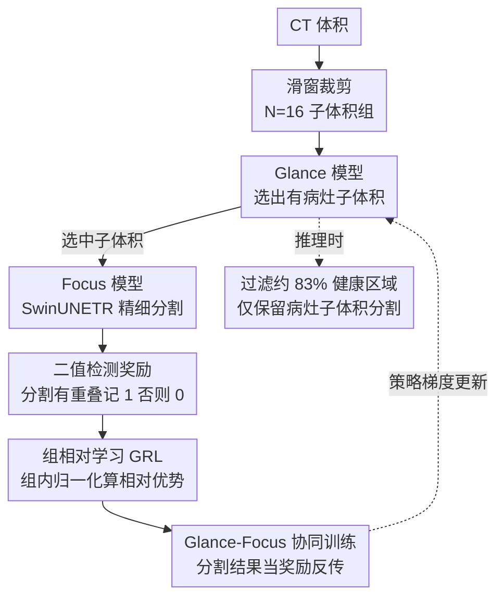

# Glance and Focus Reinforcement for Pan-cancer Screening

**会议**: ICLR 2026  
**arXiv**: [2601.19103](https://arxiv.org/abs/2601.19103)  
**代码**: [GitHub](https://github.com/Luffy03/GF-Screen)  
**领域**: 医学图像/癌症筛查  
**关键词**: 泛癌筛查, 强化学习, GRPO, CT分割, 前景-背景不平衡

## 一句话总结

提出 GF-Screen 两阶段框架——轻量 Glance 模型用强化学习快速定位含病灶的 CT 子体积，Focus 模型只对选中区域做精细分割；通过将 GRPO 的"组内相对比较"思想从 NLP 迁移到视觉子体积组，首次在纯视觉任务中实现无价值网络的 RL 优化，在 FLARE25 泛癌挑战中以 +25.6% DSC 大幅领先冠军方案且推理快 5.7 倍。

## 研究背景与动机

**领域现状**：泛癌筛查（Pan-cancer Screening）旨在用一个通用模型从大规模 CT 扫描中检测和分割多种类型的病灶。现有方法如 nnUNet、SwinUNETR、CancerUniT 等均采用滑动窗口方式遍历整个 CT 体积进行逐块分割，在单一病灶类型上取得了不错效果。

**现有痛点**：CT 体积中病灶仅占约 0.085% 的面积，前景-背景极度不平衡。遍历式推理带来两个严重问题：一是在大量健康区域上浪费算力，推理效率低（每次扫描超过 100 秒），不利于大规模部署；二是对健康区域的冗余关注反而增加了假阳性，降低了筛查精度。

**核心矛盾**：精度和效率看似矛盾——要提高检出率就需要密集扫描，但密集扫描又带来大量假阳性和计算浪费。根本原因在于现有方法对所有区域一视同仁，缺乏"选择性注意"机制。

**本文目标** (1) 如何让模型像放射科医生一样先全局粗扫再局部精查，跳过无关区域？(2) 如何在不引入额外价值网络的情况下用 RL 训练"选择"行为？(3) 如何让选择策略不被前景-背景不平衡拖垮？

**切入角度**：放射科医生读 CT 时采用"扫视-聚焦"策略——先快速浏览全局排除正常区域，再仔细看可疑位置。作者观察到，从同一 CT 裁剪出的一组子体积天然构成 GRPO 需要的"候选组"，可以直接做组内相对比较，不需要 LLM 来生成候选答案。

**核心 idea**：用轻量分类网络做"扫视"选择，分割网络做"聚焦"精查，将分割结果作为 RL 奖励信号，通过组相对学习在子体积组内做比较优化，同时解决效率和精度问题。

## 方法详解

### 整体框架

GF-Screen 由两个协同工作的模型组成：Glance 模型（轻量 3D ResNet-18，~32M 参数）负责将 CT 体积裁剪的子体积分类为"有病灶"或"无病灶"；Focus 模型（SwinUNETR）对被选中的子体积进行像素级分割。训练时，随机裁剪的 N=16 个子体积同时送入两个模型——Focus 模型用 Dice-CE 损失做有监督分割训练，其分割结果作为奖励信号通过 RL 反传给 Glance 模型。推理时，CT 体积先用滑动窗口裁成子体积组，Glance 模型快速过滤掉约 83.3% 的健康区域，仅保留 16.7% 含病灶的子体积送 Focus 模型分割。

整个 pipeline 的关键在于：选择动作不可微，所以两阶段靠"分割结果→奖励"这条 RL 链路串起来，三个核心设计（二值检测奖励、组相对学习、协同训练）正是为打通这条链路而设。

### 关键设计

**1. 二值检测奖励：只问"有没有检测到病灶"，不问"分割得好不好"**

Glance 模型的每个选择动作需要一个 RL 奖励来评判好坏，最直接的想法是用 Focus 模型的分割 DSC 当奖励，但作者刻意没有这么做。奖励定义为 $r_i = \mathbb{1}(s_i \cap m_i \neq \emptyset)$——只要 Focus 模型在子体积 $i$ 上的分割预测 $s_i$ 与标注 $m_i$ 有任意重叠就给 1，否则为 0。之所以拒绝看似更精细的 DSC 奖励，是因为 DSC 会把模型推向"容易分割"的视角（边界清晰、角度标准），而那些部分包含病灶、角度刁钻的子体积虽然 DSC 低，却往往是诊断上最关键的区域。二值奖励把 Glance 的职责收窄成纯粹的检测判断，避免它为了拿高分而漏掉困难但重要的病例。

**2. 组相对学习（GRL）：用同一 CT 裁出的子体积组互相比较，省掉价值网络**

传统 PPO 要额外训练一个 critic 网络来估计每个动作的优势值，在视觉子体积选择这种场景里既不稳定又昂贵。GRL 借用 GRPO 的思路：从同一张 CT 裁出的 N 个子体积天然构成一个比较组，组内归一化即可算出相对优势 $A_i = (r_i - \text{mean}(r_{1..N})) / \text{std}(r_{1..N})$，优势为正的子体积被鼓励选中、为负的被鼓励丢弃。优化目标 $\mathcal{J}_{GRL}$ 采用 PPO 风格的 clipped ratio 乘以优势值，外加 KL 正则（$\beta=0.01$）约束策略偏移，再叠一个小权重的分类交叉熵（$\alpha=0.1$）提供基础监督。关键 insight 在于：GRPO 在 NLP 里需要 LLM 自己生成多个候选回答来凑比较组，而 CT 子体积裁剪这个看似平凡的数据增强操作本身就提供了现成的多候选结构——这让纯视觉感知任务第一次能直接套用 GRPO，既省去价值网络又收敛更稳。

**3. Glance-Focus 协同训练：用分割结果当奖励，桥接两个不可微的阶段**

"选哪些子体积"是离散决策，分割损失的梯度无法直接回传给 Glance 模型，这正是必须引入 RL 的原因。两个模型端到端联合训练，总损失 $L = L_{GRL} + L_{seg}$，其中 $L_{seg}$ 是标准 Dice-CE 分割损失，把 Focus 模型的分割结果转化成奖励信号是连接二者的关键一环。为了稳定训练，Glance 维护一个冻结的 reference model $G_{ref}$、每个 epoch 更新一次。全程单张 A800 80G GPU，batch size=4，每个体积裁 4 个子体积、共 16 个构成一组。

### 损失函数 / 训练策略

Focus 模型使用标准的 Dice-CE 分割损失训练。Glance 模型的 GRL 损失包含三项：(1) clipped policy gradient 项——核心优化信号；(2) KL 散度正则化项（$\beta=0.01$）——防止策略偏离过远；(3) 交叉熵分类项（$\alpha=0.1$）——提供弱监督，$\alpha$ 设为小值避免因前景-背景不平衡导致模型坍缩到全预测负类。优化器为 AdamW，学习率 3e-4，cosine decay 调度，子体积尺寸 $96 \times 96 \times 64$。

## 实验关键数据

### 主实验：泛癌分割与检测（9 种病灶，16 内部 + 7 外部数据集）

| 方法 | 分割 DSC (%) | 检测 F1 (%) | 假阳性率 (%) | 推理时间 (s/scan) |
|------|-------------|------------|-------------|-------------------|
| nnUNet | 53.3 | 90.2 | 30.4 | 136 |
| SwinUNETR | 48.6 | 92.5 | 47.5 | 114 |
| VoCo | 56.1 | 92.2 | 41.8 | 114 |
| SuPreM | 54.4 | 90.4 | 38.7 | 114 |
| PASTA | 52.8 | 88.6 | 42.6 | 197 |
| **GF-Screen** | **60.8** | **95.9** | **15.6** | **28** |

GF-Screen 在分割 DSC 上超过次优方法 VoCo 4.7 个点，检测 F1 达到 95.9%（+3.4%），假阳性率从次优的 30.4% 降至 15.6%（-14.8%），推理速度快 4-7 倍。在外部数据集上同样领先（平均 DSC 54.1% vs 次优 49.0%）。FLARE25 公开验证排行榜上，GF-Screen 以 58.6% DSC / 52.2% NSD 大幅领先 FLARE24 冠军方案（33.0% / 24.0%），分别 +25.6% 和 +28.2%。

### 消融实验：RL 训练策略对比（FLARE23 数据集）

| 训练方式 | DSC (%) | 选中比例 (%) | 说明 |
|----------|---------|-------------|------|
| SwinUNETR 基线 | 41.5 | 100 | 无 Glance，全量分割 |
| 交叉熵 (CE) | 37.6 | 3.1 | 坍缩到负类，选太少 |
| 平衡 CE | 37.8 | 5.3 | 略好但仍坍缩 |
| Focal Loss | 36.5 | 4.0 | 不平衡问题未解决 |
| OHEM | 39.5 | 7.2 | 硬样本挖掘帮助有限 |
| PPO + 价值网络 | 24.5 | 51.6 | 训练不稳定，严重崩溃 |
| GRL + DSC 奖励 | 43.2 | 21.3 | 偏向"简单"视角 |
| GRL + 二值奖励 | 53.1 | 23.0 | 检测奖励显著优于 DSC 奖励 |
| **GRL + 二值奖励 + αCE** | **56.7** | **16.7** | **完整方案，最优** |

### 关键发现

- **分类损失直接训练必然失败**：前景-背景极端不平衡导致 CE/Focal/OHEM 全部坍缩到负类（选中比例 3-7%），说明纯分类范式无法解决此问题
- **PPO 方案不稳定**：引入额外价值网络后训练震荡严重（DSC 仅 24.5%），验证了在视觉子体积选择场景中传统 RL 方法的不适用性
- **二值奖励 >> DSC 奖励**：53.1% vs 43.2%，差距达 10 个点。说明 Glance 模型需要关注"有没有病灶"而非"分割有多好"
- **小权重 CE 辅助有效**：加入 $\alpha=0.1$ 的 CE 项后从 53.1% 提升到 56.7%，提供了有益的弱监督而不引入坍缩风险
- **组大小敏感性**：N=16 最优（56.5% DSC），N=4 时下降严重（45.9%），说明组内足够多的比较候选对 GRL 至关重要
- **Glance 模型灵敏度高**：敏感度 97.7%（几乎不漏诊），特异度 75.9%（有效过滤健康区域）

## 亮点与洞察

- **GRPO 从 NLP 迁移到视觉的关键 insight**：子体积裁剪天然形成候选组，不需要 LLM 生成能力即可做组内相对比较。这个 insight 非常巧妙——把医学影像中"随机裁剪"这个看似平凡的数据增强操作，重新解读为 RL 中的"候选生成"，使得视觉任务可以借用 GRPO 的全部优势
- **效率与精度正向耦合**：传统方法中"看更多"通常意味着更准确，但本文证明"选择性地看少"反而更准——丢弃健康区域不仅省算力，还主动消除假阳性来源。这种"做减法提精度"的思路值得在其他前景稀疏任务中推广
- **二值奖励设计的 insight**：拒绝使用看似更精细的 DSC 奖励，而采用粗粒度的二值检测奖励。背后的道理是 Glance 模型的角色是"门卫"不是"医生"——它只需判断"这里有没有可疑物"，不需要评估分割质量。角色分工的清晰化是系统设计的关键

## 局限与展望

- **Glance 模型漏诊风险**：虽然敏感度达 97.7%，但在病灶极微小或跨子体积边界时仍可能遗漏，漏诊在临床场景代价极高
- **固定子体积尺寸**：$96 \times 96 \times 64$ 的固定裁剪尺寸对不同大小的病灶可能不是最优的，大病灶可能被分割到多个子体积中
- **仅验证 CT 模态**：未在 MRI、超声、PET 等其他影像模态上测试，GRL 范式能否迁移到其他模态的前景稀疏场景有待验证
- **组内比较依赖组的多样性**：如果 CT 中病灶非常密集（全是阳性）或完全健康（全是阴性），组内比较的梯度信号会退化
- 可以考虑自适应子体积尺寸或多尺度裁剪策略来应对不同大小的病灶

## 相关工作与启发

- **vs CancerUniT**：CancerUniT 用 query-based Mask-Transformer 对八种病灶做统一检测分割，但仍采用全量推理无前景选择机制。GF-Screen 在分割精度上全面领先（+7.5% DSC），同时推理快数倍，说明"先选后割"优于"全量推理"
- **vs PPO 视觉 RL (Wang et al. 2020)**：先前将 PPO 用于图像分类中的冗余 patch 丢弃，但需要额外训练价值网络且无法处理分割等密集预测任务。GF-Screen 用 GRL 替代 PPO，既省去价值网络又在分割任务上表现更稳定（PPO 方案 DSC 仅 24.5%）
- **vs GRPO (Shao et al. 2024)**：GRPO 在 LLM 中通过模型自身生成多个回答做组内比较，GF-Screen 发现 CT 子体积裁剪天然提供了候选组，是 GRPO 在非语言任务中的首次成功迁移
- **vs PASTA**：PASTA 通过肿瘤合成做预训练，但未解决推理效率问题（197s/scan，所有方法中最慢）。GF-Screen 用完全不同的思路同时提升了精度和效率

## 评分

- 新颖性: ⭐⭐⭐⭐ 将 GRPO 迁移到视觉任务的 insight 很巧妙，但整体框架（先粗后细）属于成熟范式
- 实验充分度: ⭐⭐⭐⭐⭐ 9 种病灶、23 个数据集、内外部验证 + FLARE25 排行榜，消融实验非常详尽系统
- 写作质量: ⭐⭐⭐⭐ 逻辑链清晰，图表设计好，但某些段落有重复论述
- 价值: ⭐⭐⭐⭐⭐ +25.6% DSC 领先 FLARE25 冠军方案且推理快 5.7 倍，实际部署价值极高

<!-- RELATED:START -->

## 相关论文

- [\[AAAI 2026\] PanFoMa: A Lightweight Foundation Model and Benchmark for Pan-Cancer Pathology Image Analysis](../../AAAI2026/medical_imaging/panfoma_a_lightweight_foundation_model_and_benchmark_for_pan-cancer.md)
- [\[AAAI 2026\] MedEyes: Learning Dynamic Visual Focus for Medical Progressive Diagnosis](../../AAAI2026/medical_imaging/medeyes_learning_dynamic_visual_focus_for_medical_progressive_diagnosis.md)
- [\[CVPR 2025\] Association of Radiologic PPFE Change with Mortality in Lung Cancer Screening Cohorts](../../CVPR2025/medical_imaging/association_of_radiologic_ppfe_change_with_mortality_in_lung_cancer_screening_co.md)
- [\[CVPR 2026\] OraPO: Oracle-educated Reinforcement Learning for Data-efficient and Factual Radiology Report Generation](../../CVPR2026/medical_imaging/orapo_oracle-educated_reinforcement_learning_for_data-efficient_and_factual_radi.md)
- [\[NeurIPS 2025\] FairGRPO: Fair Reinforcement Learning for Equitable Clinical Reasoning](../../NeurIPS2025/medical_imaging/fairgrpo_fair_reinforcement_learning_for_equitable_clinical_reasoning.md)

<!-- RELATED:END -->
