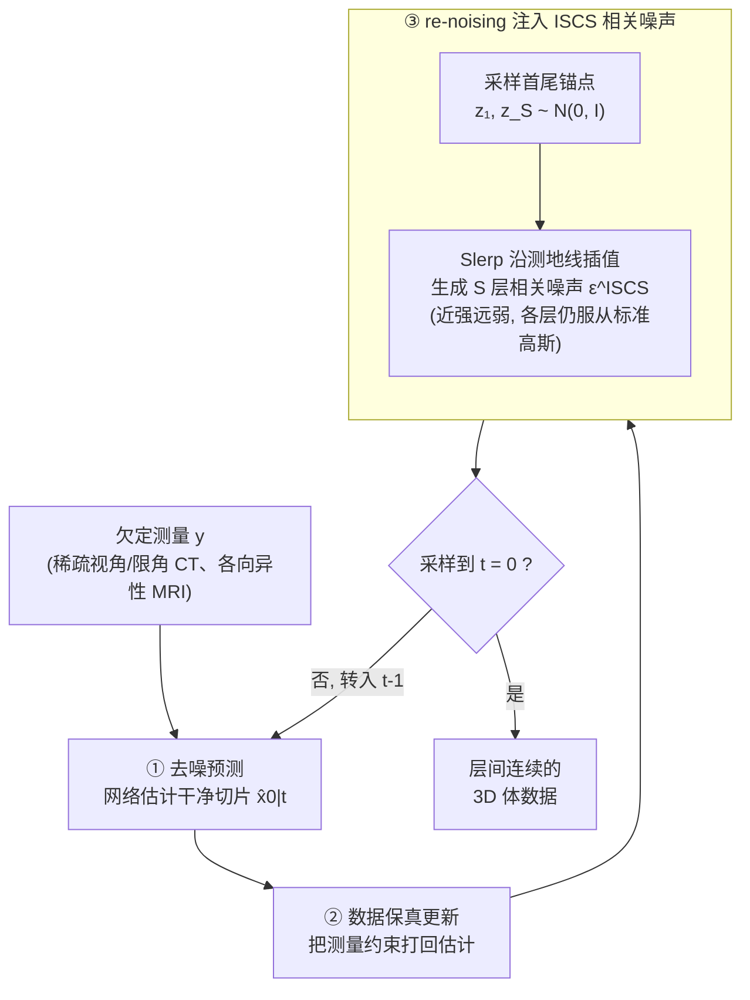

# Improving 2D Diffusion Models for 3D Medical Imaging with Inter-Slice Consistent Stochasticity

**会议**: ICLR 2026  
**arXiv**: [2602.04162](https://arxiv.org/abs/2602.04162)  
**代码**: [GitHub](https://github.com/duchenhe/ISCS)  
**领域**: 医学图像/扩散模型  
**关键词**: 3D医学重建, 2D扩散模型, 层间一致性, 球面线性插值, 即插即用

## 一句话总结

提出 Inter-Slice Consistent Stochasticity (ISCS)，通过球面线性插值(Slerp)在扩散采样的 re-noising 步骤中生成层间相关噪声，从根源消除 2D 扩散先验做 3D 医学重建时的层间不连续伪影——零额外计算/超参数/训练开销，即插即用到任何 2D 扩散逆问题求解器，在稀疏视角 CT、限角 CT 和 MRI 超分辨率上均持续提升。

## 研究背景与动机

**3D 医学成像的临床需求**：临床诊断（如肿瘤体积评估、手术规划、疾病进展追踪）依赖完整准确的 3D 体数据重建，而非单独的 2D 切片。

**3D 扩散模型的不可行性**：直接在高维体数据上训练扩散模型面临"维度灾难"——内存、计算和数据需求远超大多数实验室和工业界所能承受（Pinaya et al., 2022; Guo et al., 2025; Wang et al., 2025）。

**2D 先验的实用妥协**：主流做法是在 2D 切片上训练扩散模型，然后逐层重建 3D 体——计算上可行，但引入了新问题。

**层间不连续的根源**：每个 2D 切片在反向扩散过程中独立采样，固有的随机噪声注入导致相邻切片的采样轨迹完全不相关，堆叠后沿 z 轴产生严重的结构不连续和伪影。

**现有方法的局限**：(a) TV 正则化——引入敏感超参数，过度平滑抹去细节；(b) 3D patch 训练 / 双平面先验——增加训练/推理复杂度，对数据有额外约束（如要求立方体）；(c) 这些方法本质上是"后处理修补"，未触及根因。

**来自视频领域的启发**：Kwon & Ye (2025) 指出视频恢复中的时间闪烁同样源于不协调的扩散采样随机性，提出 Batch-Consistent Sampling (BCS) 缓解——本文将此洞察系统性地迁移到 3D 医学重建场景，并提出更优的解决方案。

## 方法详解

### 整体框架

基于 2D 扩散模型逐层求解 3D 医学逆问题的过程是一个三步迭代：先用扩散网络去噪预测干净切片 $\hat{x}_{0|t}$，再做数据保真更新把测量约束打回去，最后 re-noising 到时间步 $t-1$ 继续下一轮。ISCS 的全部改动只落在最后这一步——把每层各自独立采样的随机噪声，换成一整个层间平滑相关的噪声体，去噪、保真、网络结构和训练流程都原封不动。

### 关键设计

**1. 根因分析：把层间不连续定位到 re-noising 的随机分量**

要从源头治病，先得找准病灶在哪。把 DDIM 采样器的 re-noising 步拆开看：

$$x_{t-1} = \sqrt{\bar{\alpha}_{t-1}}\hat{x}_{0|t} + \underbrace{\sqrt{1-\bar{\alpha}_{t-1}-\eta^2\tilde{\beta}_t^2}\epsilon_{\theta^*}^{(t)}(x_t)}_{\text{确定性噪声}} + \underbrace{\eta\tilde{\beta}_t\epsilon}_{\text{随机噪声}}$$

确定性那一项由网络预测决定，对相似的相邻切片本就给出相似输出，不是问题所在；真正的麻烦是随机项里的 $\epsilon \sim \mathcal{N}(0, \mathbf{I})$，它对每一层独立抽取，让相邻切片的采样轨迹彻底解耦。当逆问题严重欠约束时（比如稀疏视角 CT，数据保真项几乎管不住解空间），这股独立随机性获得过度自由度，把相邻层推向完全不同的解，堆叠起来就是沿 z 轴的结构断裂与伪影。这一拆解把根因锁定在"不协调的随机性"上，也直接指明：只要让这股随机性在层间相关起来，就能从源头消除不连续，而不必事后做平滑修补。

**2. Slerp 生成层间相关噪声：在保持分布不变的前提下让相邻层"共享随机性"**

找到病灶后，关键是怎样让噪声层间相关却又不破坏每层服从标准高斯的前提。ISCS 对 $S$ 层的体数据先采样首尾两个锚点 $\mathbf{z}_1, \mathbf{z}_S \sim \mathcal{N}(0, \mathbf{I})$，再用球面线性插值（Slerp）沿高维超球面的测地线生成中间各层的噪声：

$$\epsilon_i^{\text{ISCS}} = \text{slerp}(\mathbf{z}_1, \mathbf{z}_S; \alpha_i) = \frac{\sin((1-\alpha_i)\Omega)}{\sin(\Omega)}\mathbf{z}_1 + \frac{\sin(\alpha_i\Omega)}{\sin(\Omega)}\mathbf{z}_S$$

其中 $\alpha_i = (i-1)/(S-1)$ 是该层的归一化位置，$\Omega = \arccos(\langle \mathbf{z}_1, \mathbf{z}_S \rangle / (\|\mathbf{z}_1\| \cdot \|\mathbf{z}_S\|))$ 是两锚点间的夹角。这里为什么必须走测地线而非直接做线性插值，背后是高维几何的硬约束：高维各向同性高斯的概率质量几乎全部集中在半径 $\sqrt{d}$ 的薄球壳上（Gaussian Annulus Theorem），线性插值走的是弦，内插点范数 $\|z\| < \sqrt{d}$ 会掉出这个典型集，使中间层噪声不再是合法的标准高斯样本；Slerp 走测地线则保持向量范数和分布统计量不变，确保每层噪声依旧服从 $\mathcal{N}(0, \mathbf{I})$，从而既注入了层间相关，又不动摇扩散采样的理论前提。

**3. 渐变相关结构：用"近强远弱"取代 BCS 的全同噪声**

视频领域的 BCS 也想消除帧间随机性，做法是给所有帧/层注入完全相同的噪声——在短视频（<16 帧、帧间变化小）里够用，但搬到医学体数据（>300 层、层间解剖结构显著变化）就太刚性了：全同噪声会强行抑制解剖变化，把某些特征不当地从一层复制到解剖完全不同的另一层，产生条纹状"复制伪影"。Slerp 噪声天然回避了这一点——相邻层因测地线距离近而高度相关，保证局部连续；层间距离拉大时相关性自然衰减，又留出空间容纳全局解剖变化。这种"近处强关联、远处弱关联"的结构，恰好对上医学体数据"局部连续、全局变化"的本质，比全同或全独立的一刀切都更贴合。

**4. 即插即用集成：只替换 re-noising 噪声，零额外开销**

ISCS 的落地方式是把生成好的相关噪声体直接顶替采样器 re-noising 步里的独立噪声：

$$x_{t-1} = \sqrt{\bar{\alpha}_{t-1}}\hat{x}_{0|t} + \sqrt{1-\bar{\alpha}_{t-1}-\sigma_t^2}\cdot\epsilon_\theta(x_t) + \sigma_t \cdot \epsilon^{\text{ISCS}}$$

网络架构、损失函数、训练流程、推理时的优化步骤一律不变，也不引入任何新超参数。正因为改动面如此之小，它能挂到现成的任意 2D 扩散逆问题求解器上（DDNM、DDS 等），对算力和数据本就紧张的医学影像场景格外友好。

## 实验关键数据

### 实验设置

- **CT 数据集**：AAPM 2016 低剂量CT（10名患者，5936切片，256×256），评估体积 256×256×300
- **MRI 数据集**：IXI T1 脑部扫描，评估体积 256×256×150，z 轴 5× 降采样模拟各向异性
- **基线方法**：FDK、ADMM-TV（传统）；DDNM、DDS（2D 扩散求解器）；DDS+TV 正则化
- **评估指标**：PSNR、SSIM、LPIPS；三视图（轴向/冠状/矢状）独立评估

### 表 1：稀疏视角 CT (30 views) 主要结果

| 方法 | Axial PSNR | Coronal PSNR | Sagittal PSNR | Coronal SSIM | Sagittal LPIPS |
|------|-----------|-------------|-------------|-------------|---------------|
| FDK | 23.91 | 23.92 | 23.79 | 0.414 | 0.310 |
| ADMM-TV | 32.94 | 33.67 | 33.72 | 0.895 | 0.107 |
| DDS | 34.76 | 35.12 | 35.33 | 0.906 | 0.141 |
| DDS+TV | 36.26 | 37.08 | 37.50 | 0.938 | 0.088 |
| **DDS+ISCS** | **36.97** | **37.75** | **38.16** | **0.944** | **0.065** |

### 表 2：限角 CT ([0°, 100°]) 主要结果

| 方法 | Axial PSNR | Coronal PSNR | Sagittal PSNR | Coronal SSIM | |Δ| |
|------|-----------|-------------|-------------|-------------|-----|
| DDNM | 28.40 | 28.75 | 28.22 | 0.774 | 0.016443 |
| DDNM+ISCS | 30.89 | 31.88 | 31.59 | 0.906 | 0.001899 |
| DDS+TV | 31.40 | 33.33 | 32.83 | 0.906 | 0.002566 |
| **DDS+ISCS** | **31.65** | **32.90** | **32.49** | **0.917** | **0.001966** |

### 表 3：BCS vs ISCS 消融 (SVCT)

| 噪声类型 | Coronal PSNR | Coronal SSIM | Sagittal PSNR | Sagittal LPIPS |
|---------|-------------|-------------|-------------|---------------|
| BCS (全同噪声) | 38.00 | 0.937 | 38.24 | 0.081 |
| **ISCS (Slerp噪声)** | **38.16** | **0.941** | **38.78** | **0.073** |

## 关键发现

1. **ISCS 在所有任务和基线上一致提升**：无论 DDNM 还是 DDS，无论 CT 还是 MRI，加入 ISCS 均有提升，且在多数指标上超越需要额外优化的 TV 正则化方案。
2. **冠状面和矢状面提升尤为显著**：这两个面直接反映 z 轴方向的层间一致性——ISCS 的 Sagittal LPIPS 在 SVCT 上从 DDS 的 0.141 降至 0.065（降幅54%），在 LACT 上从 0.193 降至 0.077。
3. **Slerp 优于 BCS**：全同噪声在医学体数据中产生明显的条纹"复制伪影"，Slerp 的渐变相关结构更适合层间解剖变化。
4. **层间差异指标 |Δ| 早期收敛**：ISCS 使层间差异在采样过程早期即接近 GT 参考值，而基线到后期仍维持较大间隙——ISCS 缩小有效搜索空间，帮助采样器更可靠地收敛。
5. **DDNM 受益更大**：在 LACT 任务中，DDNM+ISCS 相对 DDNM 提升 +2.49/+3.13/+3.37 dB（三视图），说明约束越弱的逆问题越受益于噪声协调。
6. **TV 正则化的代价**：虽然 TV 也能提升量化指标，但视觉上产生过平滑/"卡通化"伪影，擦除精细解剖细节——ISCS 无此副作用。

## 亮点与洞察

- **根因治疗 vs 症状治疗**：TV 正则化是"对不连续的结果做后处理平滑"，ISCS 是"在源头控制产生不连续的原因"——前者掩盖症状，后者消除根因，更优雅且彻底。
- **高维几何的原理性利用**：Slerp 的选择不是ad hoc的，而是基于 Gaussian Annulus Theorem 的严格数学推导——高维高斯噪声集中在超球壳上，因此插值必须沿测地线走才能保持分布不变性。
- **零代价的改善**：不增加任何计算开销、不引入超参数、不需要重新训练——对计算资源有限的医学影像场景极具实用价值。
- **从视频到医学的跨域迁移**：帧间不连续(视频)与层间不连续(3D医学)的根源相同（不协调的采样随机性），但直接搬用 BCS 效果不佳，需要针对医学体数据特性（长序列+大解剖变化）设计更精细的相关结构——体现了"借鉴思想但因地制宜"的研究范式。

## 局限性

1. **仅验证了两类逆问题求解器**：实验仅在 DDNM 和 DDS 上验证，未覆盖更多近年的 DIS 方法（如 MCG、DiffPIR 等），泛化性有待进一步确认。
2. **噪声相关结构固定**：两端锚点+线性分配的 Slerp 结构是固定的，未学习也未适应数据——对于解剖结构变化剧烈的区域（如颈胸交界），可能需要空间自适应的相关场。
3. **仅使用 VE 扩散模型**：所有实验基于 VE-SDE 框架，未验证 VP-SDE 或基于 Flow Matching 的更新框架下的效果。
4. **评估数据规模有限**：CT 仅用一名患者的体数据评估，MRI 也仅一个体积——统计显著性有限。
5. **未探索多锚点或分段 Slerp**：对于超长序列（>300层），两端锚点可能不足以精细控制中间区域的相关性，分段插值或多锚点策略值得探索。

## 与相关工作对比

### vs DDS+TV (Chung et al., 2024)
DDS+TV 在 re-noising 后额外执行 TV 正则化优化步来平滑 z 轴——需要调敏感的正则化权重 $\lambda$，且过平滑会擦除细节。ISCS 从 re-noising 噪声本身入手，不需要额外优化步和超参数，在 SVCT 上 Sagittal LPIPS 0.065 vs TV 的 0.088（↓26%），同时避免了卡通化伪影。

### vs BCS (Kwon & Ye, 2025)
BCS 为视频修复设计，对所有帧/层施加完全相同的噪声——在短视频(<16帧)中可行，但在医学体数据(>300层)中产生"复制伪影"。ISCS 的 Slerp 噪声允许层间相关性随距离衰减，更好地适应医学数据的局部连续+全局变化特性。消融实验（Table 2）显示 ISCS 在 Sagittal 上优于 BCS 0.54 dB PSNR、0.008 LPIPS。

### vs DiffusionBlend (Song et al., 2024)
DiffusionBlend 通过 3D patch 训练混合 diffusion score 来增强 3D 一致性——需要额外的 3D 训练成本和特殊的数据处理。ISCS 完全不需要任何训练，仅在推理时修改噪声采样方式，更简洁且通用。

## 评分

- **新颖性**: ⭐⭐⭐⭐ 从根因出发的简洁分析 + 利用高维几何的原理性解法，Slerp 在扩散采样中的应用新颖
- **实验充分度**: ⭐⭐⭐⭐ 三任务(SVCT+LACT+MRI SR) × 两求解器(DDNM+DDS)交叉验证，含消融和轨迹分析
- **写作质量**: ⭐⭐⭐⭐⭐ 从问题定义→根因分析→方案推导→实验验证的逻辑链清晰流畅
- **实用价值**: ⭐⭐⭐⭐⭐ 零额外计算+即插即用+开源代码，对3D医学成像社区有直接实用价值

<!-- RELATED:START -->

## 相关论文

- [\[CVPR 2026\] Revisiting 2D Foundation Models for Scalable 3D Medical Image Classification](../../CVPR2026/medical_imaging/revisiting_2d_foundation_models_for_scalable_3d_medical_image_classification.md)
- [\[ICLR 2026\] DM4CT: Benchmarking Diffusion Models for Computed Tomography Reconstruction](dm4ct_benchmarking_diffusion_models_for_computed_tomography_reconstruction.md)
- [\[ICLR 2026\] Adaptive Domain Shift in Diffusion Models for Cross-Modality Image Translation](adaptive_domain_shift_in_diffusion_models_for_cross-modality_image_translation.md)
- [\[CVPR 2026\] Any2Any 3D Diffusion Models with Knowledge Transfer: A Radiotherapy Planning Study](../../CVPR2026/medical_imaging/any2any_3d_diffusion_models_with_knowledge_transfer_a_radiotherapy_planning_stud.md)
- [\[CVPR 2026\] Attention Consistent Longitudinal Medical Visual Question Answering Guided by Vision Foundation Models](../../CVPR2026/medical_imaging/attention_consistent_longitudinal_medical_visual_question_answering_guided_by_vi.md)

<!-- RELATED:END -->
